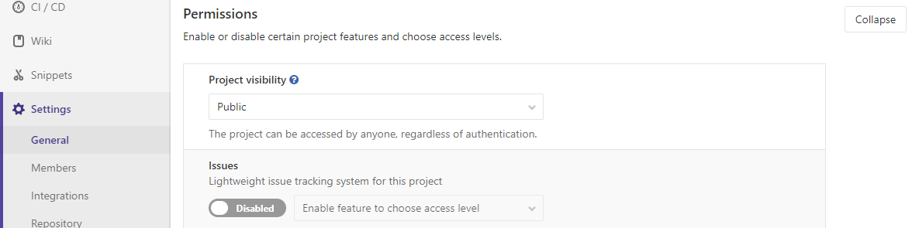

# YouTrack Service

1. To enable the YouTrack integration in a project, navigate to the
[Integrations page](project_services.md#accessing-the-project-services), click
the **YouTrack** service, and fill in the required details on the page as described
in the table below.

    | Field | Description |
    | ----- | ----------- |
    | `description`   | A name for the issue tracker (to differentiate between instances, for example) |
    | `project_url`   | The URL to the project in YouTrack which is being linked to this GitLab project |
    | `issues_url`    | The URL to the issue in YouTrack project that is linked to this GitLab project. Note that the `issues_url` requires `:id` in the URL. This ID is used by GitLab as a placeholder to replace the issue number. |

    Once you have configured and enabled YouTrack you'll see the YouTrack link on the GitLab project pages that takes you to the appropriate YouTrack project.

1. To disable the internal issue tracking system in a project, navigate to the General page, expand [Permissions](../settings/index.md#sharing-and-permissions), and slide the Issues switch invalid.

    

## Referencing issues in YouTrack

Issues in YouTrack can be referenced as `<PROJECT>-<ID>` where `<PROJECT>`
starts with a capital letter which is then followed by capital letters, numbers
or underscores, and `<ID>` is a number (example `API_32-143`).

`<PROJECT>` part is included into issue_id and links can point any YouTrack
project (`issues_url` + issue_id)
