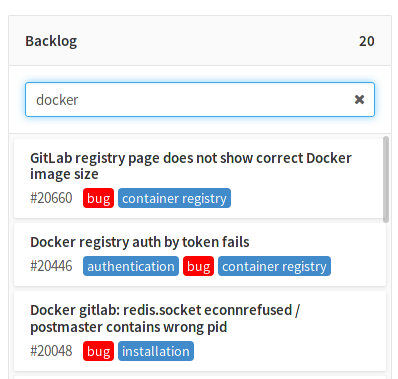

# Issue board

> [Introduced][ce-5554] in GitLab 8.11.

The GitLab Issue Board is a software project management tool used to plan,
organize, and visualize a workflow for a feature or product release.
It can be seen like a light version of a [Kanban] or a [Scrum] board.

Other interesting links:

- [GitLab Issue Board landing page on about.gitlab.com][landing]
- [YouTube video introduction to Issue Boards][youtube]

## Overview

The Issue Board builds on GitLab's existing issue tracking functionality and
leverages the power of [labels] by utilizing them as lists of the scrum board.

With the Issue Board you can have a different view of your issues while also
maintaining the same filtering and sorting abilities you see across the
issue tracker.

Below is a table of the definitions used for GitLab's Issue Board.

| What we call it  | What it means |
| --------------  | ------------- |
| **Issue Board** | It represents a different view for your issues. It can have multiple lists with each list consisting of issues represented by cards. |
| **List**        | Each label that exists in the issue tracker can have its own dedicated list. Every list is named after the label it is based on and is represented by a column which contains all the issues associated with that label. You can think of a list like the results you get when you filter the issues by a label in your issue tracker. |
| **Card**        | Every card represents an issue and it is shown under the list for which it has a label. The information you can see on a card consists of the issue number, the issue title, the assignee and the labels associated with it. You can drag cards around from one list to another. Issues inside lists are [ordered by priority](labels.md#prioritize-labels). |

There are three types of lists, the ones you create based on your labels, and
two default:

- **Backlog** (default): shows all opened issues that do not fall in one of the other lists. Always appears on the very left.
- **Done** (default): shows all closed issues that do not fall in one of the other lists. Always appears on the very right.
- Label list: a list based on a label. It shows all opened or closed issues with that label.

---

In short, here's a list of actions you can take in an Issue Board:

- [Create a new list](#creating-a-new-list).
- [Delete an existing list](#deleting-a-list).
- Drag issues between lists.
- Drag and reorder the lists themselves.
- Change issue labels on-the-fly while dragging issues between lists.
- Close an issue if you drag it to the **Done** list.
- Create a new list from a non-existing label by [creating the label on-the-fly](#creating-a-new-list)
  within the Issue Board.
- [Filter issues](#filtering-issues) that appear across your Issue Board.

If you are not able to perform one or more of the things above, make sure you
have the right [permissions](#permissions).

## First time using the Issue Board

The first time you navigate to your Issue Board, you will be presented with the
two default lists (**Backlog** and **Done**) and a welcoming message that gives
you two options. You can either create a predefined set of labels and create
their corresponding lists to the Issue Board or opt-out and use your own lists.

If you choose to use and create the predefined lists, they will appear as empty
because the labels associated to them will not exist up until that moment,
which means the system has no way of populating them automatically. That's of
course if the predefined labels don't already exist. If any of them does exist,
the list will be created and filled with the issues that have that label.

## Creating a new list

Create a new list by clicking on the **Create new list** button at the upper
right corner of the Issue Board.

Simply choose the label to create the list from. The new list will be inserted
at the end of the lists, before **Done**. Moving and reordering lists is as
easy as dragging them around.

To create a list for a label that doesn't yet exist, simply create the label by
choosing **Create new label**. The label will be created on-the-fly and it will
be immediately added to the dropdown. You can now choose it to create a list.

## Deleting a list

To delete a list from the Issue Board use the small trash icon that is present
in the list's heading. A confirmation dialog will appear for you to confirm.

Deleting a list doesn't have any effect in issues and labels, it's just the
list view that is removed. You can always add it back later if you need.

## Searching issues in the Backlog list

The very first time you start using the Issue Board, it is very likely your
issue tracker is already populated with labels and issues. In that case,
**Backlog** will have all the issues that don't belong to another list, and
**Done** will have all the closed ones.

For performance and visibility reasons, each list shows the first 20 issues
by default. If you have more than 20, you have to start scrolling down for the
next 20 issues to appear. This can be cumbersome if your issue tracker hosts
hundreds of issues, and for that reason it is easier to search for issues to
move from **Backlog** to another list.

Start typing in the search bar under the **Backlog** list and the relevant
issues will appear.

## Filtering issues

You should be able to use the filters on top of your Issue Board to show only
the results you want. This is similar to the filtering used in the issue tracker
since the metadata from the issues and labels are re-used in the Issue Board.

You can filter by author, assignee, milestone and label.

## Creating workflows

By reordering your lists, you can create workflows. As lists in Issue Boards are
based on labels, it works out of the box with your existing issues. So if you've
already labeled things with 'Backend' and 'Frontend', the issue will appear in
the lists as you create them. In addition, this means you can easily move
something between lists by changing a label.

A typical workflow of using the Issue Board would be:

1. You have [created][create-labels] and [prioritized][label-priority] labels
   so that you can easily categorize your issues.
1. You have a bunch of issues (ideally labeled).
1. You visit the Issue Board and start [creating lists](#creating-a-new-list) to
   create a workflow.
1. You move issues around in lists so that your team knows who should be working
   on what issue.
1. When the work by one team is done, the issue can be dragged to the next list
   so someone else can pick up.
1. When the issue is finally resolved, the issue is moved to the **Done** list
   and gets automatically closed.

For instance you can create a list based on the label of 'Frontend' and one for
'Backend'. A designer can start working on an issue by dragging it from
**Backlog** to 'Frontend'. That way, everyone knows that this issue is now being
worked on by the designers. Then, once they're done, all they have to do is
drag it over to the next list, 'Backend', where a backend developer can
eventually pick it up. Once they’re done, they move it to **Done**, to close the
issue.

This process can be seen clearly when visiting an issue since with every move
to another list the label changes and a system not is recorded.

## Permissions

[Developers and up](../permissions.md) can use all the functionality of the
Issue Board, that is create/delete lists and drag issues around.

## Tips

A few things to remember:

- The label that corresponds to a list is hidden for issues under that list.
- Moving an issue between lists removes the label from the list it came from
  and adds the label from the list it goes to.
- When moving a card to **Done**, the label of the list it came from is removed
  and the issue gets closed.
- An issue can exist in multiple lists if it has more than one label.
- Lists are populated with issues automatically if the issues are labeled.
- Clicking on the issue title inside a card will take you to that issue.
- Clicking on a label inside a card will quickly filter the entire Issue Board
  and show only the issues from all lists that have that label.
- Issues inside lists are [ordered by priority][label-priority].
- For performance and visibility reasons, each list shows the first 20 issues
  by default. If you have more than 20 issues start scrolling down and the next
  20 will appear.

[ce-5554]: https://gitlab.com/gitlab-org/gitlab-ce/merge_requests/5554
[labels]: ./labels.md
[scrum]: https://en.wikipedia.org/wiki/Scrum_(software_development)
[kanban]: https://en.wikipedia.org/wiki/Kanban_(development)
[create-labels]: ./labels.md#create-new-labels
[label-priority]: ./labels.md#prioritize-labels
[landing]: https://about.gitlab.com/solutions/issueboard
[youtube]: https://www.youtube.com/watch?v=UWsJ8tkHAa8
