# Issue Boards

> [Introduced](https://gitlab.com/gitlab-org/gitlab-foss/-/merge_requests/5554) in [GitLab 8.11](https://about.gitlab.com/releases/2016/08/22/gitlab-8-11-released/#issue-board).

The GitLab Issue Board is a software project management tool used to plan,
organize, and visualize a workflow for a feature or product release.
It can be used as a [Kanban](https://en.wikipedia.org/wiki/Kanban_(development)) or a
[Scrum](https://en.wikipedia.org/wiki/Scrum_(software_development)) board.

It pairs issue tracking and project management, keeping everything together,
so that you don't need to jump between different platforms to organize your workflow.

Issue boards build on the existing [issue tracking functionality](issues/index.md#issues-list) and
[labels](labels.md). Your issues appear as cards in vertical lists, organized by their assigned
labels, [milestones](#milestone-lists), or [assignees](#assignee-lists).

Issue boards help you to visualize and manage your entire process in GitLab.
You add your labels, and then create the corresponding list for your existing issues.
When you're ready, you can drag your issue cards from one step to another one.

An issue board can show you the issues your team is working on, who is assigned to each,
and where the issues are in the workflow.

To let your team members organize their own workflows, use
[multiple issue boards](#use-cases-for-multiple-issue-boards). This allows creating multiple issue
boards in the same project.

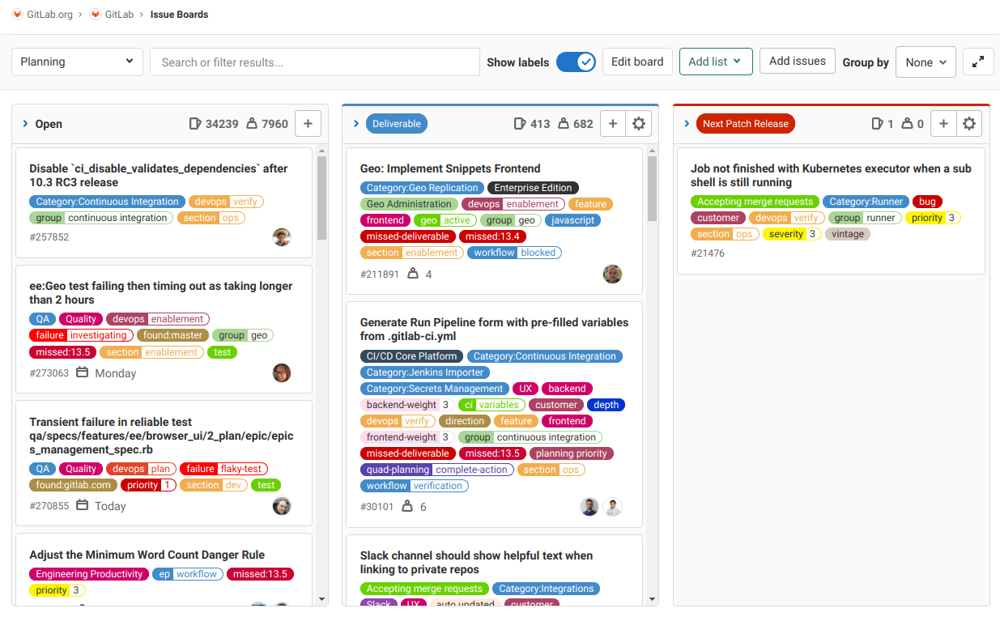

Different issue board features are available in different [GitLab tiers](https://about.gitlab.com/pricing/),
as shown in the following table:

| Tier             | Number of project issue boards | Number of [group issue boards](#group-issue-boards) | [Configurable issue boards](#configurable-issue-boards) | [Assignee lists](#assignee-lists) |
|------------------|--------------------------------|------------------------------|---------------------------|----------------|
| Core / Free      | Multiple                       | 1                            | No                        | No             |
| Starter / Bronze | Multiple                       | 1                            | Yes                       | No             |
| Premium / Silver | Multiple                       | Multiple                     | Yes                       | Yes            |
| Ultimate / Gold  | Multiple                       | Multiple                     | Yes                       | Yes            |

To learn more, visit [GitLab Enterprise features for issue boards](#gitlab-enterprise-features-for-issue-boards) below.

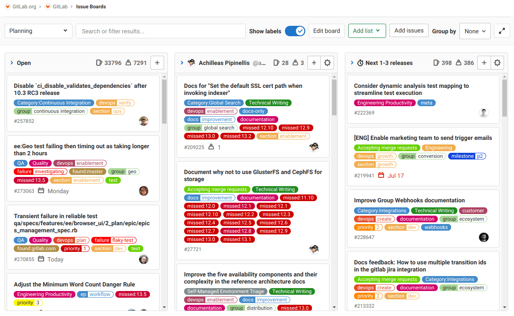

<i class="fa fa-youtube-play youtube" aria-hidden="true"></i>
Watch a [video presentation](https://youtu.be/vjccjHI7aGI) of
the Issue Board feature.

## Multiple issue boards

> - [Introduced](https://about.gitlab.com/releases/2016/10/22/gitlab-8-13-released/) in GitLab 8.13.
> - Multiple issue boards per project [moved](https://gitlab.com/gitlab-org/gitlab-foss/-/issues/53811) to [GitLab Core](https://about.gitlab.com/pricing/) in GitLab 12.1.
> - Multiple issue boards per group are available in [GitLab Premium](https://about.gitlab.com/pricing/).

Multiple issue boards allow for more than one issue board for a given project **(CORE)** or group **(PREMIUM)**.
This is great for large projects with more than one team or when a repository hosts the code of multiple products.

Using the search box at the top of the menu, you can filter the listed boards.

When you have ten or more boards available, a **Recent** section is also shown in the menu, with
shortcuts to your last four visited boards.

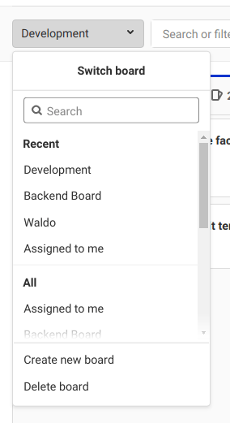

When you're revisiting an issue board in a project or group with multiple boards,
GitLab automatically loads the last board you visited.

### Create an issue board

To create a new issue board:

1. Click the dropdown with the current board name in the upper left corner of the Issue Boards page.
1. Click **Create new board**.
1. Enter the new board's name and select its scope: milestone, labels, assignee, or weight.

### Delete an issue board

To delete the currently active issue board:

1. Click the dropdown with the current board name in the upper left corner of the Issue Boards page.
1. Click **Delete board**.
1. Click **Delete** to confirm.

## Issue boards use cases

You can tailor GitLab issue boards to your own preferred workflow.
Here are some common use cases for issue boards.

For examples of using issue boards along with [epics](../group/epics/index.md) **(PREMIUM)**,
[issue health status](issues/index.md#health-status) **(ULTIMATE)**, and
[scoped labels](labels.md#scoped-labels) **(PREMIUM)** for various Agile frameworks, check:

- The [How to use GitLab for Agile portfolio planning and project management](https://about.gitlab.com/blog/2020/11/11/gitlab-for-agile-portfolio-planning-project-management/) blog post (November 2020)
- <i class="fa fa-youtube-play youtube" aria-hidden="true"></i>
[Cross-project Agile work management with GitLab](https://www.youtube.com/watch?v=5J0bonGoECs) (15 min, July 2020)

### Use cases for a single issue board

With the GitLab Workflow you can discuss proposals in issues, label
them, and organize and prioritize them with issue boards.

For example, let's consider this simplified development workflow:

1. You have a repository that hosts your application's codebase, and your team actively contributes code.
1. Your **backend** team starts working on a new implementation, gathers feedback and approval, and
   passes it over to the **frontend** team.
1. When frontend is complete, the new feature is deployed to a **staging** environment to be tested.
1. When successful, it's deployed to **production**.

If you have the labels **Backend**, **Frontend**, **Staging**, and
**Production**, and an issue board with a list for each, you can:

- Visualize the entire flow of implementations since the beginning of the development life cycle
  until deployed to production.
- Prioritize the issues in a list by moving them vertically.
- Move issues between lists to organize them according to the labels you've set.
- Add multiple issues to lists in the board by selecting one or more existing issues.

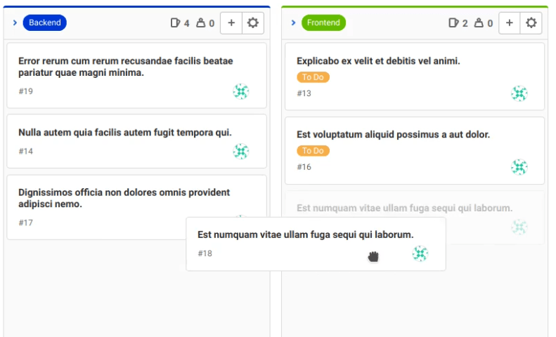

### Use cases for multiple issue boards

With [multiple issue boards](#multiple-issue-boards),
each team can have their own board to organize their workflow individually.

#### Scrum team

With multiple issue boards, each team has one board. Now you can move issues through each
part of the process. For instance: **To Do**, **Doing**, and **Done**.

#### Organization of topics

Create lists to order issues by topic and quickly change them between topics or groups,
such as between **UX**, **Frontend**, and **Backend**. The changes are reflected across boards,
as changing lists updates the labels on each issue accordingly.

#### Advanced team handover

For example, suppose we have a UX team with an issue board that contains:

- **To Do**
- **Doing**
- **Frontend**

When finished with something, they move the card to **Frontend**. The Frontend team's board looks like:

- **Frontend**
- **Doing**
- **Done**

Cards finished by the UX team automatically appear in the **Frontend** column when they are ready
for them.

NOTE: **Note:**
For a broader use case, please see the blog post
[GitLab Workflow, an Overview](https://about.gitlab.com/blog/2016/10/25/gitlab-workflow-an-overview/#gitlab-workflow-use-case-scenario).
For a real use case example, you can read why
[Codepen decided to adopt issue boards](https://about.gitlab.com/blog/2017/01/27/codepen-welcome-to-gitlab/#project-management-everything-in-one-place)
to improve their workflow with multiple boards.

#### Quick assignments

To quickly assign issues to your team members:

1. Create [assignee lists](#assignee-lists) for each team member.
1. Drag an issue onto the team member's list.

## Issue board terminology

An **issue board** represents a unique view of your issues. It can have multiple lists with each
list consisting of issues represented by cards.

A **list** is a column on the issue board that displays issues matching certain attributes.
In addition to the default "Open" and "Closed" lists, each additional list shows issues matching
your chosen label, assignee, or milestone. On the top of each list you can see the number of issues
that belong to it. Types of lists include:

- **Open** (default): all open issues that do not belong to one of the other lists.
  Always appears as the leftmost list.
- **Closed** (default): all closed issues. Always appears as the rightmost list.
- **Label list**: all open issues for a label.
- [**Assignee list**](#assignee-lists): all open issues assigned to a user.
- [**Milestone list**](#milestone-lists): all open issues for a milestone.

A **Card** is a box on a list, and it represents an issue. You can drag cards from one list to
another to change their label, assignee, or milestone. The information you can see on a
card includes:

- Issue title
- Associated labels
- Issue number
- Assignee

## Permissions

Users with the [Reporter and higher roles](../permissions.md) can use all the functionality of the
Issue Board feature to create or delete lists. They can also drag issues from one list to another.

## How GitLab orders issues in a list

When visiting a board, issues appear ordered in any list. You're able to change
that order by dragging the issues. The changed order is saved, so that anybody who visits the same
board later sees the reordering, with some exceptions.

The first time a given issue appears in any board (that is, the first time a user
loads a board containing that issue), it is ordered in relation to other issues in that list.
The order is done according to [label priority](labels.md#label-priority).

At this point, that issue is assigned a relative order value by the system,
with respect to the other issues in the list. Any time
you drag and reorder the issue, its relative order value changes accordingly.

Also, any time that issue appears in any board, the ordering is done according to
the updated relative order value. It's only the first
time an issue appears that it takes from the priority order mentioned above. If a user in your GitLab instance
drags issue `A` above issue `B`, the ordering is maintained when these two issues are subsequently
loaded in any board in the same instance. This could be a different project board or a different group
board, for example.

This ordering also affects [issue lists](issues/sorting_issue_lists.md).
Changing the order in an issue board changes the ordering in an issue list,
and vice versa.

## GitLab Enterprise features for issue boards

GitLab issue boards are available on GitLab Core and GitLab.com Free tiers, but some
advanced functionality is present in [higher tiers only](https://about.gitlab.com/pricing/).

### Configurable issue boards **(STARTER)**

> [Introduced](https://about.gitlab.com/releases/2017/11/22/gitlab-10-2-released/#issue-boards-configuration) in [GitLab Starter](https://about.gitlab.com/pricing/) 10.2.

An issue board can be associated with a GitLab [Milestone](milestones/index.md#milestones),
[Labels](labels.md), Assignee and Weight
which automatically filter the board issues accordingly.
This allows you to create unique boards according to your team's need.

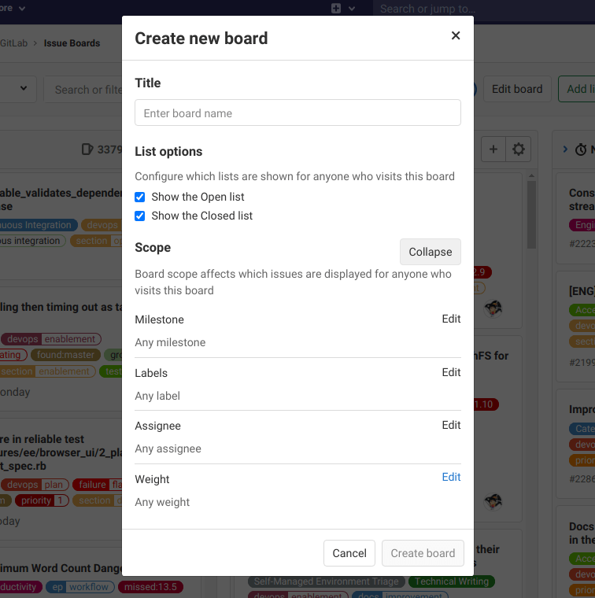

You can define the scope of your board when creating it or by clicking the **Edit board** button.
After a milestone, assignee or weight is assigned to an issue board, you can no longer
filter through these in the search bar. In order to do that, you need to remove the desired scope
(for example, milestone, assignee, or weight) from the issue board.

If you don't have editing permission in a board, you're still able to see the configuration by
clicking **View scope**.

<i class="fa fa-youtube-play youtube" aria-hidden="true"></i>
Watch a [video presentation](https://youtu.be/m5UTNCSqaDk) of
the Configurable Issue Board feature.

### Focus mode

> - [Introduced]((https://about.gitlab.com/releases/2017/04/22/gitlab-9-1-released/#issue-boards-focus-mode-ees-eep)) in [GitLab Starter](https://about.gitlab.com/pricing/) 9.1.
> - [Moved](https://gitlab.com/gitlab-org/gitlab/-/merge_requests/28597) to the Free tier of GitLab.com in 12.10.
> - [Moved](https://gitlab.com/gitlab-org/gitlab/-/issues/212331) to GitLab Core in 13.0.

To enable or disable focus mode, select the **Toggle focus mode** button (**{maximize}**) at the top
right. In focus mode, the navigation UI is hidden, allowing you to focus on issues in the board.

### Sum of issue weights **(STARTER)**

The top of each list indicates the sum of issue weights for the issues that
belong to that list. This is useful when using boards for capacity allocation,
especially in combination with [assignee lists](#assignee-lists).

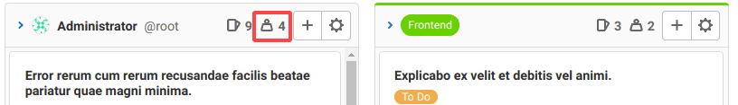

### Group issue boards **(PREMIUM)**

> - One group issue board per group introduced in GitLab 10.6.
> - Multiple group issue boards [introduced](https://about.gitlab.com/releases/2017/09/22/gitlab-10-0-released/#group-issue-boards) in [GitLab Premium](https://about.gitlab.com/pricing/) 10.0.

Accessible at the group navigation level, a group issue board offers the same features as a project-level board.
It can display issues from all projects in that
group and its descendant subgroups. Similarly, you can only filter by group labels for these
boards. When updating milestones and labels for an issue through the sidebar update mechanism, again only
group-level objects are available.

### Assignee lists **(PREMIUM)**

> [Introduced](https://gitlab.com/gitlab-org/gitlab/-/issues/5784) in [GitLab Premium](https://about.gitlab.com/pricing/) 11.0.

As in a regular list showing all issues with a chosen label, you can add
an assignee list that shows all issues assigned to a user.
You can have a board with both label lists and assignee lists. To add an
assignee list:

1. Select the **Add list** dropdown button.
1. Select the **Assignee list** tab.
1. Search and select the user you want to add as an assignee.

Now that the assignee list is added, you can assign or unassign issues to that user
by [dragging issues](#drag-issues-between-lists) to and from an assignee list.
To remove an assignee list, just as with a label list, click the trash icon.

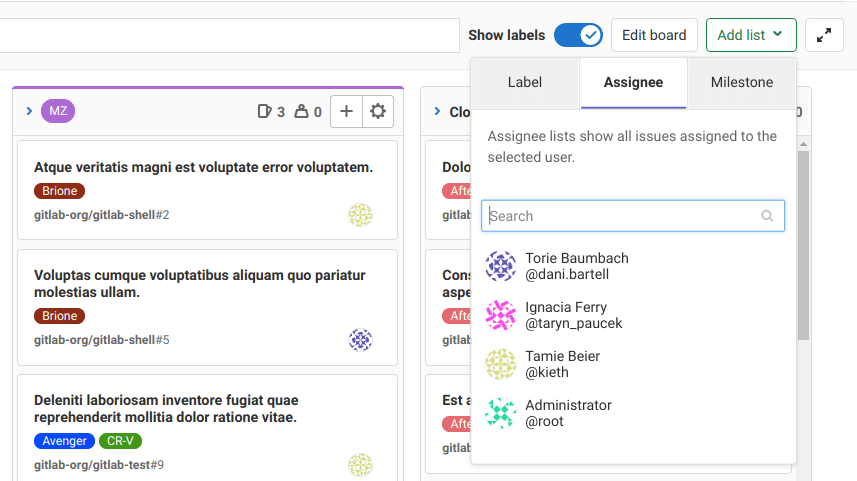

### Milestone lists **(PREMIUM)**

> [Introduced](https://gitlab.com/gitlab-org/gitlab/-/issues/6469) in [GitLab Premium](https://about.gitlab.com/pricing/) 11.2.

You're also able to create lists of a milestone. These are lists that filter issues by the assigned
milestone, giving you more freedom and visibility on the issue board. To add a milestone list:

1. Select the **Add list** dropdown button.
1. Select the **Milestone** tab.
1. Search and click the milestone.

Like the assignee lists, you're able to [drag issues](#drag-issues-between-lists)
to and from a milestone list to manipulate the milestone of the dragged issues.
As in other list types, click the trash icon to remove a list.

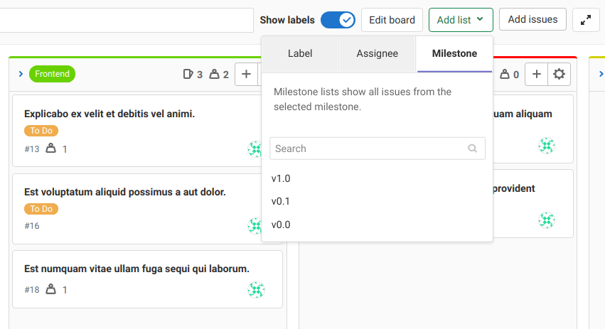

### Group issues in swimlanes **(PREMIUM)**

> Grouping by epic [introduced](https://gitlab.com/groups/gitlab-org/-/epics/3352) in [GitLab Premium](https://about.gitlab.com/pricing/) 13.6.

With swimlanes you can visualize issues grouped by epic.
Your issue board keeps all the other features, but with a different visual organization of issues.
This feature is available both at the project and group level.

<i class="fa fa-youtube-play youtube" aria-hidden="true"></i>
For a video overview, see [Epics Swimlanes Walkthrough - 13.6](https://www.youtube.com/watch?v=nHC7-kz5P2g) (November 2020).

To group issues by epic in an issue board:

1. Select the **Group by** dropdown button.
1. Select **Epic**.

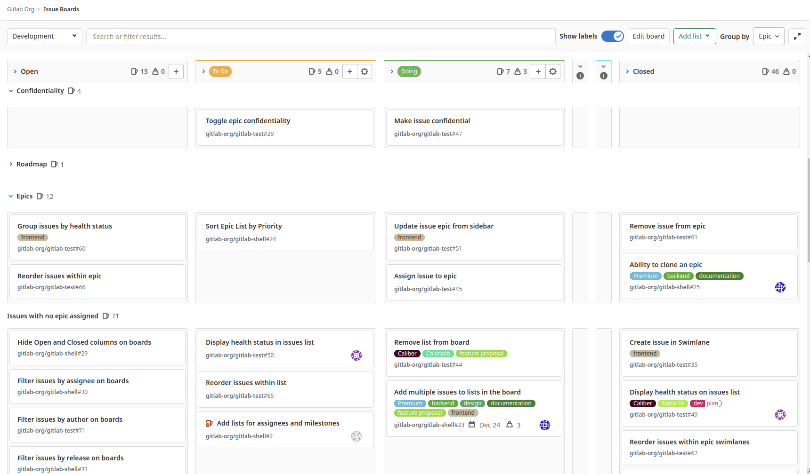

You can also [drag issues](#drag-issues-between-lists) to change their position and epic assignment:

- To reorder an issue, drag it to the new position within a list.
- To assign an issue to another epic, drag it to the epic's horizontal lane.
- To unassign an issue from an epic, drag it to the **Issues with no epic assigned** lane.
- To move an issue to another epic _and_ another list, at the same time, drag the issue diagonally.


## Work In Progress limits **(STARTER)**

> [Introduced](https://gitlab.com/gitlab-org/gitlab/-/issues/11403) in GitLab 12.7

You can set a Work In Progress (WIP) limit for each issue list on an issue board. When a limit is
set, the list's header shows the number of issues in the list and the soft limit of issues.
You cannot set a WIP limit on the default lists (**Open** and **Closed**).

Examples:

- When you have a list with four issues and a limit of five, the header shows **4/5**.
  If you exceed the limit, the current number of issues is shown in red.
- You have a list with five issues with a limit of five. When you move another issue to that list,
  the list's header displays **6/5**, with the six shown in red.

To set a WIP limit for a list:

1. Navigate to a Project or Group board of which you're a member.
1. Click the settings icon in a list's header.
1. Next to **Work In Progress Limit**, click **Edit**.
1. Enter the maximum number of issues.
1. Press <kbd>Enter</kbd> to save.

## Blocked issues

> [Introduced](https://gitlab.com/gitlab-org/gitlab/-/issues/34723) in GitLab 12.8.

If an issue is blocked by another issue, an icon appears next to its title to indicate its blocked
status.

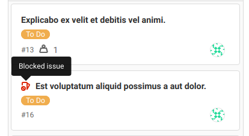

## Actions you can take on an issue board

- [Create a new list](#create-a-new-list).
- [Remove an existing list](#remove-a-list).
- [Add issues to a list](#add-issues-to-a-list).
- [Remove an issue from a list](#remove-an-issue-from-a-list).
- [Filter issues](#filter-issues) that appear across your issue board.
- [Create workflows](#create-workflows).
- [Drag issues between lists](#drag-issues-between-lists).
- [Multi-select issue cards](#multi-select-issue-cards).
- Drag and reorder the lists.
- Change issue labels (by dragging an issue between lists).
- Close an issue (by dragging it to the **Done** list).

If you're not able to do some of the things above, make sure you have the right
[permissions](#permissions).

### First time using an issue board

> The automatic creation of the **To Do** and **Doing** lists was [introduced](https://gitlab.com/gitlab-org/gitlab/-/issues/202144) in GitLab 13.5.

The first time you open an issue board, you are presented with the default lists
(**Open**, **To Do**, **Doing**, and **Closed**).

If the **To Do** and **Doing** labels don't exist in the project or group, they are created, and
their lists appear as empty. If any of them already exists, the list is filled with the issues that
have that label.

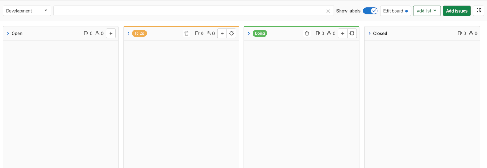

### Create a new list

Create a new list by clicking the **Add list** dropdown button in the upper right corner of the issue board.

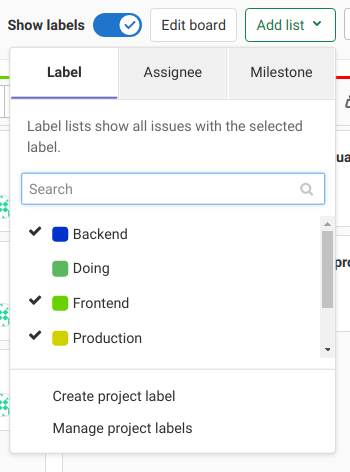

Then, choose the label or user to base the new list on. The new list is inserted
at the end of the lists, before **Done**. To move and reorder lists, drag them around.

To create a list for a label that doesn't yet exist, create the label by
choosing **Create project label** or **Create group label**.
This creates the label immediately and adds it to the dropdown.
You can now choose it to create a list.

### Remove a list

Removing a list doesn't have any effect on issues and labels, as it's just the
list view that's removed. You can always restore it later if you need.

To remove a list from an issue board:

1. Select the **List settings** icon (**{settings}**) on the top of the list you want to remove. The
   list settings sidebar opens on the right.
1. Select **Remove list**. A confirmation dialog appears.
1. Select **OK**.

### Add issues to a list **(CORE ONLY)**

> - Feature flag [introduced](https://gitlab.com/gitlab-org/gitlab/-/merge_requests/47898) in GitLab 13.7.
> - It's [deployed behind a feature flag](../feature_flags.md), disabled by default.
> - It's disabled on GitLab.com.
> - It's recommended for production use.
> - To use it in GitLab self-managed instances, ask a GitLab administrator to [enable it](#enable-or-disable-adding-issues-to-the-list). **(CORE ONLY)**

You can add issues to a list in a project issue board by clicking the **Add issues** button
in the top right corner of the issue board. This opens up a modal
window where you can see all the issues that do not belong to any list.

Select one or more issues by clicking the cards and then click **Add issues**
to add them to the selected list. You can limit the issues you want to add to
the list by filtering by the following:

- Assignee
- Author
- Epic
- Iteration ([introduced](https://gitlab.com/gitlab-org/gitlab/-/issues/118742) in GitLab 13.6)
- Label
- Milestone
- My Reaction
- Release
- Weight

#### Enable or disable adding issues to the list **(CORE ONLY)**

Adding issues to the list is deployed behind a feature flag that is **disabled by default**.
[GitLab administrators with access to the GitLab Rails console](../../administration/feature_flags.md)
can enable it.

To enable it:

```ruby
Feature.enable(:add_issues_button)
```

To disable it:

```ruby
Feature.disable(:add_issues_button)
```

### Remove an issue from a list

Removing an issue from a list can be done by clicking the issue card and then
clicking the **Remove from board** button in the sidebar. The
respective label is removed.

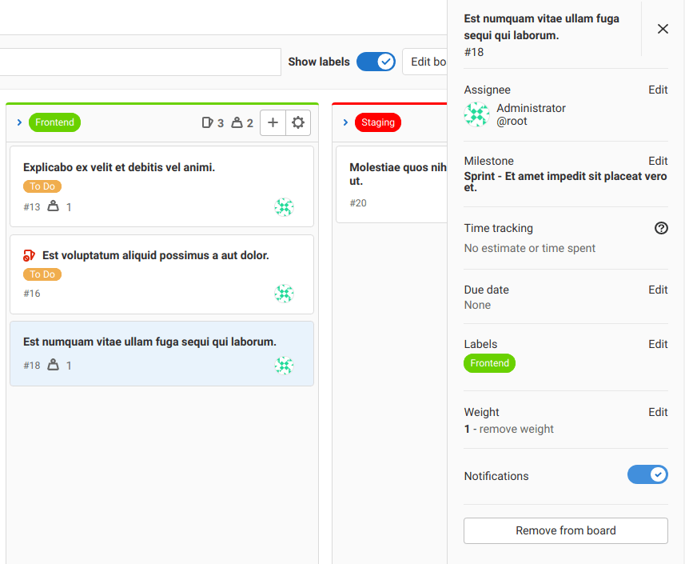

### Filter issues

You should be able to use the filters on top of your issue board to show only
the results you want. It's similar to the filtering used in the issue tracker,
as the metadata from the issues and labels is re-used in the issue board.

You can filter by the following:

- Assignee
- Author
- Epic
- Iteration ([introduced](https://gitlab.com/gitlab-org/gitlab/-/issues/118742) in GitLab 13.6)
- Label
- Milestone
- My Reaction
- Release
- Weight

### Create workflows

By reordering your lists, you can create workflows. As lists in issue boards are
based on labels, it works out of the box with your existing issues.

So if you've already labeled things with **Backend** and **Frontend**, the issue appears in
the lists as you create them. In addition, this means you can move something between lists by
changing a label.

A typical workflow of using an issue board would be:

1. You have [created](labels.md#label-management) and [prioritized](labels.md#label-priority)
   labels to categorize your issues.
1. You have a bunch of issues (ideally labeled).
1. You visit the issue board and start [creating lists](#create-a-new-list) to
   create a workflow.
1. You move issues around in lists so that your team knows who should be working
   on what issue.
1. When the work by one team is done, the issue can be dragged to the next list
   so someone else can pick it up.
1. When the issue is finally resolved, the issue is moved to the **Done** list
   and gets automatically closed.

For example, you can create a list based on the label of **Frontend** and one for
**Backend**. A designer can start working on an issue by adding it to the
**Frontend** list. That way, everyone knows that this issue is now being
worked on by the designers.

Then, when they're done, all they have to do is
drag it to the next list, **Backend**. Then, a backend developer can
eventually pick it up. When they’re done, they move it to **Done**, to close the
issue.

This process can be seen clearly when visiting an issue. With every move
to another list, the label changes and a system note is recorded.

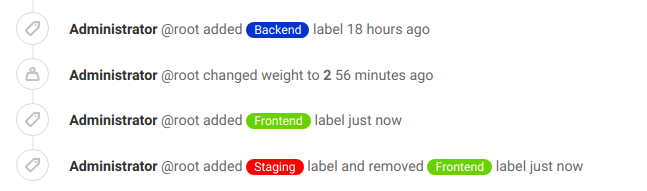

### Drag issues between lists

When dragging issues between lists, different behavior occurs depending on the source list and the target list.

|                            | To Open            | To Closed    | To label `B` list            | To assignee `Bob` list                |
|----------------------------|--------------------|--------------|------------------------------|---------------------------------------|
| **From Open**                  | -                  | Issue closed | `B` added                    | `Bob` assigned                        |
| **From Closed**                | Issue reopened     | -            | Issue reopened<br/>`B` added | Issue reopened<br/>`Bob` assigned     |
| **From label `A` list**        | `A` removed        | Issue closed | `A` removed<br/>`B` added    | `Bob` assigned                        |
| **From assignee `Alice` list** | `Alice` unassigned | Issue closed | `B` added                    | `Alice` unassigned<br/>`Bob` assigned |

### Multi-select issue cards

> [Introduced](https://gitlab.com/gitlab-org/gitlab/-/issues/18954) in GitLab 12.4.

You can select multiple issue cards, then drag the group to another position within the list, or to
another list. This makes it faster to reorder many issues at once.

To select and move multiple cards:

1. Select each card with <kbd>Ctrl</kbd>+`Click` on Windows or Linux, or <kbd>Cmd</kbd>+`Click` on MacOS.
1. Drag one of the selected cards to another position or list and all selected cards are moved.


## Tips

A few things to remember:

- Moving an issue between lists removes the label from the list it came from
  and adds the label from the list it goes to.
- An issue can exist in multiple lists if it has more than one label.
- Lists are populated with issues automatically if the issues are labeled.
- Clicking the issue title inside a card takes you to that issue.
- Clicking a label inside a card quickly filters the entire issue board
  and show only the issues from all lists that have that label.
- For performance and visibility reasons, each list shows the first 20 issues
  by default. If you have more than 20 issues, start scrolling down and the next
  20 appear.
