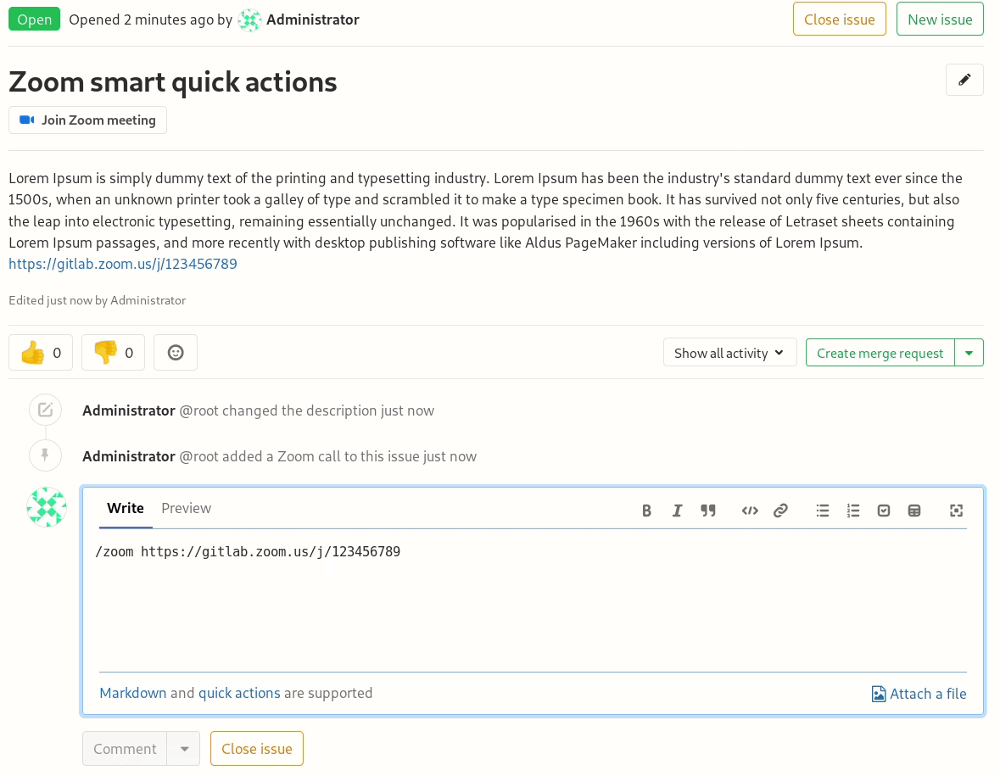

# Associate a Zoom meeting with an issue

> [Introduced](https://gitlab.com/gitlab-org/gitlab/merge_requests/16609) in GitLab 12.4.

In order to communicate synchronously for incidents management,
GitLab allows to associate a Zoom meeting with an issue.
Once you start a Zoom call for a fire-fight, you need a way to
associate the conference call with an issue, so that your team
members can join swiftly without requesting a link.

## Adding a zoom meeting to an issue

To associate a zoom meeting with an issue, you can use GitLab's
[quick actions](../quick_actions.md#quick-actions-for-issues-merge-requests-and-epics).

In an issue, leave a comment using the `/zoom` quick action followed by a valid Zoom link:

```sh
/zoom https://zoom.us/j/123456789
```

If the Zoom meeting URL is valid and you have at least [Reporter permissions](../../permissions.md),
a system alert will notify you that the addition of the meeting URL was successful.
The issue's description will be automatically edited to include the Zoom link, and a button will
appear right under the issue's title.



You are only allowed to attach a single Zoom meeting to an issue. If you attempt
to add a second Zoom meeting using the `/zoom` quick action, it won't work, you
need to [remove it](#removing-an-existing-zoom-meeting-from-an-issue) first.

## Removing an existing Zoom meeting from an issue

Similarly to adding a zoom meeting, you can remove it with a quick action:

```sh
/remove_zoom
```

If you have at least [Reporter permissions](../../permissions.md),
a system alert will notify you that the meeting URL was successfully removed.
