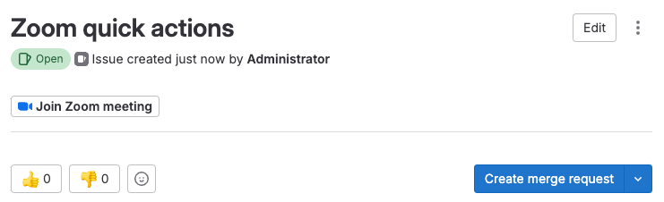

DETAILS:
**Tier:** Free, Premium, Ultimate
**Offering:** GitLab.com, GitLab Self-Managed, GitLab Dedicated

To communicate synchronously for incidents management,
you can associate a Zoom meeting with an issue.
After you start a Zoom call for a fire-fight, you need a way to
associate the conference call with an issue. This is so that your
team members can join swiftly without requesting a link.

## Adding a Zoom meeting to an issue

To associate a Zoom meeting with an issue, you can use GitLab
[quick actions](../quick_actions.md#issues-merge-requests-and-epics).

In an issue, leave a comment using the `/zoom` quick action followed by a valid Zoom link:

```shell
/zoom https://zoom.us/j/123456789
```

If the Zoom meeting URL is valid and you have at least the Reporter role,
a system alert notifies you of its successful addition.
The issue's description is automatically edited to include the Zoom link, and a button
appears right under the issue's title.



You are only allowed to attach a single Zoom meeting to an issue. If you attempt
to add a second Zoom meeting using the `/zoom` quick action, it doesn't work. You
need to [remove it](#removing-an-existing-zoom-meeting-from-an-issue) first.

Users on GitLab Premium and Ultimate can also
[add multiple Zoom links to incidents](../../../operations/incident_management/linked_resources.md#link-zoom-meetings-from-an-incident).

## Removing an existing Zoom meeting from an issue

Similarly to adding a Zoom meeting, you can remove it with a quick action:

```shell
/remove_zoom
```

If you have at least the Reporter role,
a system alert notifies you that the meeting URL was successfully removed.
