# Confidential issues **(FREE)**

Confidential issues are [issues](index.md) visible only to members of a project with
[sufficient permissions](#permissions-and-access-to-confidential-issues).
Confidential issues can be used by open source projects and companies alike to
keep security vulnerabilities private or prevent surprises from leaking out.

## Making an issue confidential

You can make an issue confidential during issue creation or by editing
an existing one.

When you create a new issue, a checkbox right below the text area is available
to mark the issue as confidential. Check that box and hit the **Create issue**
button to create the issue. For existing issues, edit them, check the
confidential checkbox and hit **Save changes**.

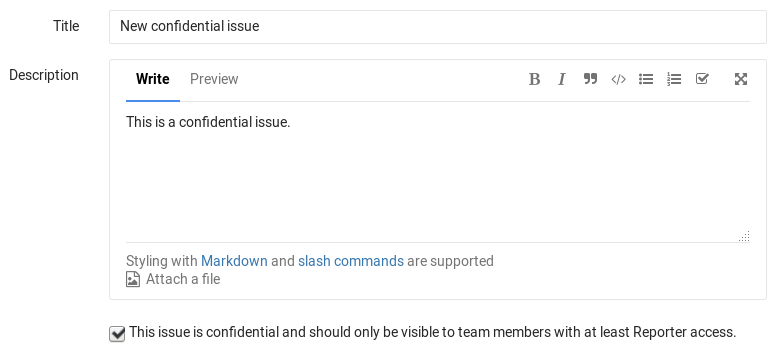

## Modifying issue confidentiality

There are two ways to change an issue's confidentiality.

The first way is to edit the issue and toggle the confidentiality checkbox.
After you save the issue, the confidentiality of the issue is updated.

The second way is to locate the Confidentiality section in the sidebar and click
**Edit**. A popup should appear and give you the option to turn on or turn off confidentiality.

| Turn off confidentiality | Turn on confidentiality |
| :-----------: | :----------: |
| 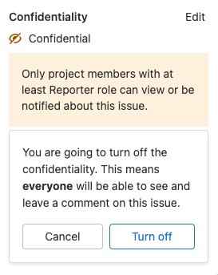 | 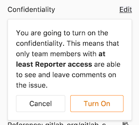 |

Every change from regular to confidential and vice versa, is indicated by a
system note in the issue's comments.

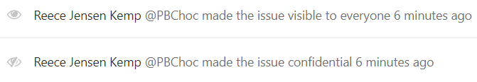

## Indications of a confidential issue

There are a few things that visually separate a confidential issue from a
regular one. In the issues index page view, you can see the eye-slash icon
next to the issues that are marked as confidential.

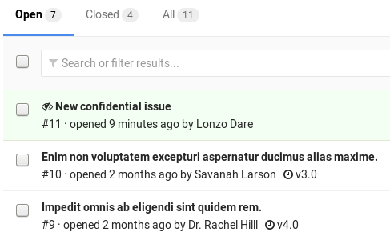

If you don't have [enough permissions](#permissions-and-access-to-confidential-issues),
you cannot see confidential issues at all.

---

Likewise, while inside the issue, you can see the eye-slash icon right next to
the issue number. There is also an indicator in the comment area that the
issue you are commenting on is confidential.

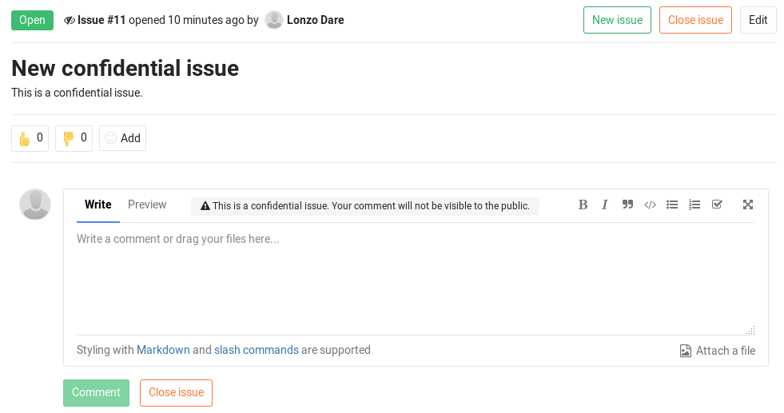

There is also an indicator on the sidebar denoting confidentiality.

| Confidential issue | Not confidential issue |
| :-----------: | :----------: |
| 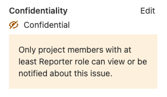 | 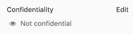 |

## Permissions and access to confidential issues

There are two kinds of level access for confidential issues. The general rule
is that confidential issues are visible only to members of a project with at
least [Reporter access](../../permissions.md#project-members-permissions). However, a guest user can also create
confidential issues, but can only view the ones that they created themselves.

Confidential issues are also hidden in search results for unprivileged users.
For example, here's what a user with the [Maintainer role](../../permissions.md) and Guest access
sees in the project's search results respectively.

| Maintainer role                                                                        | Guest access                                                                     |
|:---------------------------------------------------------------------------------------|:---------------------------------------------------------------------------------|
| 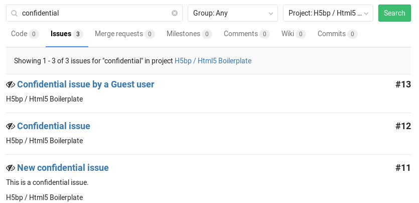 | 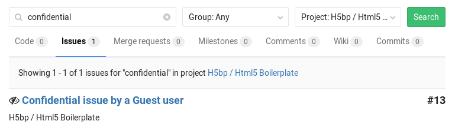 |

## Merge Requests for Confidential Issues

> [Introduced](https://gitlab.com/gitlab-org/gitlab-foss/-/issues/58583) in GitLab 12.1.

To help prevent confidential information being leaked from a public project
in the process of resolving a confidential issue, confidential issues can be
resolved by creating a merge request from a private fork.

The created merge request targets the default branch of the private fork,
not the default branch of the public upstream project. This prevents the merge
request, branch, and commits entering the public repository, and revealing
confidential information prematurely. To make a confidential commit public,
open a merge request from the private fork to the public upstream project.

Permissions are inherited from parent groups. Developers have the same permissions
for private forks created in the same group or in a subgroup of the original
Permissions are inherited from parent groups. When private forks are created
in the same group or subgroup as the original upstream repository, users
receive the same permissions in both projects. This inheritance ensures
Developer users have the needed permissions to both view confidential issues and
resolve them.

### How it works

On a confidential issue, a **Create confidential merge request** button is
available. Clicking on it opens a dropdown where you can choose to
**Create confidential merge request and branch** or **Create branch**:

| Create confidential merge request | Create branch |
| :-------------------------------: | :-----------: |
| 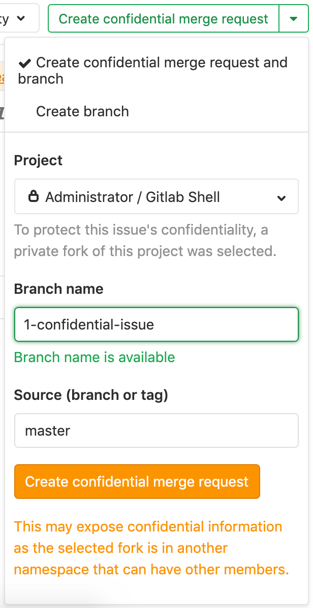 | 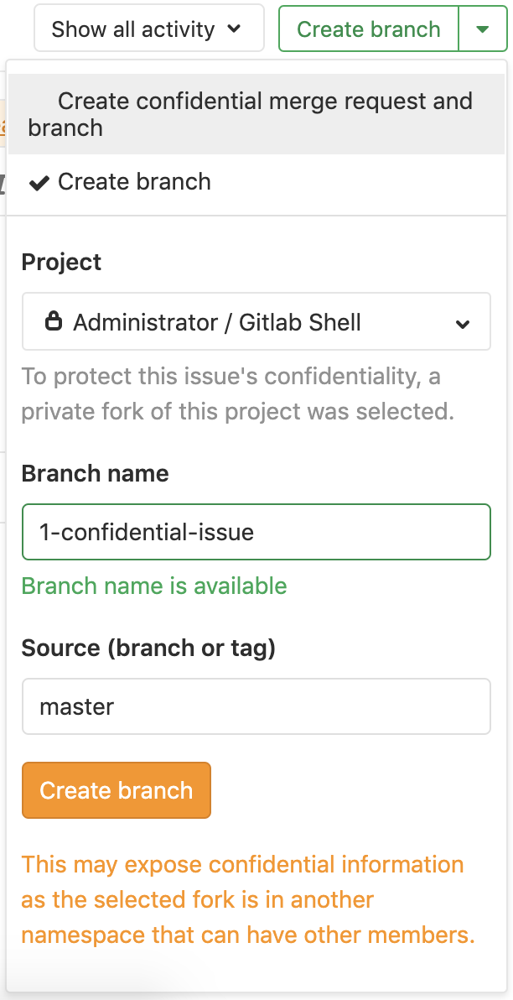 |

The **Project** dropdown includes the list of private forks the user is a member
of as at least a Developer and merge requests are enabled.

Whenever the **Branch name** and **Source (branch or tag)** fields change, the
availability of the target and source branch are checked. Both branches should
be available in the selected private fork.

By clicking the **Create confidential merge request** button, GitLab creates
the branch and merge request in the private fork. When you choose
**Create branch**, GitLab creates only the branch.

After the branch is created in the private fork, developers can push code to
that branch to fix the confidential issue.
