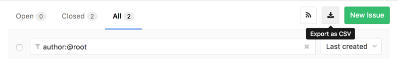
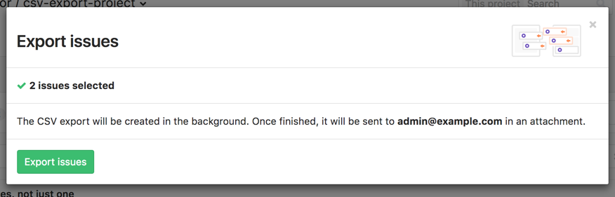

# Export Issues to CSV

> [Introduced](https://gitlab.com/gitlab-org/gitlab-ee/merge_requests/1126) in [GitLab Starter 9.0](https://about.gitlab.com/2017/03/22/gitlab-9-0-released/#export-issues-ees-eep).

Issues can be exported as CSV from GitLab and are sent to your default notification email as an attachment.

## Overview

**Export Issues to CSV** enables you and your team to export all the data collected from issues into
a **[comma-separated values](https://en.wikipedia.org/wiki/Comma-separated_values)** (CSV) file,
which stores tabular data in plain text.

> _CSVs are a handy way of getting data from one program to another where one program cannot read the other ones normal output._ [Ref](https://www.quora.com/What-is-a-CSV-file-and-its-uses)

CSV files can be used with any plotter or spreadsheet-based program, such as Microsoft Excel,
Open Office Calc, or Google Spreadsheets.

## Use cases

Among numerous use cases for exporting issues for CSV, we can name a few:

- Make a snapshot of issues for offline analysis or to communicate with other teams who may not be in GitLab
- Create diagrams, graphs, and charts from the CSV data
- Present the data in any other format for auditing or sharing reasons
- Import the issues elsewhere to a system outside of GitLab
- Long-term issues' data analysis with multiple snapshots created along the time
- Use the long-term data to gather relevant feedback given in the issues, and improve your product based on real metrics

## Choosing which issues to include

From the issues page you can narrow down which issues to export using the search bar, along with the All/Open/Closed tabs. All issues returned will be exported, including those not shown on the first page.

You will be asked to confirm the number of issues and email address for the export, after which the email will begin being prepared.

## Format

> **Time Estimate** and **Time Spent** columns were [introduced](https://gitlab.com/gitlab-org/gitlab-ee/merge_requests/2627) in GitLab Starter 10.0.
>
> The **Weight** column was [introduced](https://gitlab.com/gitlab-org/gitlab-ee/merge_requests/5300) in GitLab Starter 10.8.

Data will be encoded with a comma as the column delimiter, with `"` used to quote fields if needed, and newlines to separate rows. The first row will be the headers, which are listed in the following table along with a description of the values:

| Column  | Description |
|---------|-------------|
| Issue ID | Issue `iid` |
| URL | A link to the issue on GitLab |
| Title | Issue `title` |
| State | `Open` or `Closed` |
| Description | Issue `description` |
| Author | Full name of the issue author |
| Author Username | Username of the author, with the `@` symbol omitted |
| Assignee | Full name of the issue assignee |
| Assignee Username | Username of the author, with the `@` symbol omitted |
| Confidential | `Yes` or `No` |
| Due Date | Formated as `YYYY-MM-DD` |
| Created At (UTC) | Formated as `YYYY-MM-DD HH:MM:SS` |
| Updated At (UTC) | Formated as `YYYY-MM-DD HH:MM:SS` |
| Milestone | Title of the issue milestone |
| Weight | Issue weight |
| Labels | Title of any labels joined with a `,` |
| Time Estimate | [Time estimate](../../../workflow/time_tracking.md#estimates) in seconds |
| Time Spent | [Time spent](../../../workflow/time_tracking.md#time-spent) in seconds |

## Limitations

As the issues will be sent as an email attachment, there is a limit on how much data can be exported. Currently this limit is 20MB to ensure successful delivery across a range of email providers. If this limit is reached we suggest narrowing the search before export, perhaps by exporting open and closed issues separately.
