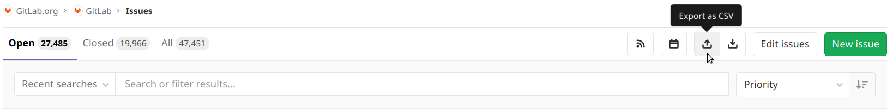

# Export issues to CSV **(FREE)**

> Moved to GitLab Free in 12.10.

You can export issues as CSV files from GitLab, which are sent to your default
notification email address as an attachment.

**Export Issues to CSV** enables you and your team to export all the data
collected from issues into a **[comma-separated values](https://en.wikipedia.org/wiki/Comma-separated_values)** (CSV)
file, which stores tabular data in plain text.

> _CSVs are a handy way of getting data from one program to another where one
program cannot read the other ones normal output._ [Ref](https://www.quora.com/What-is-a-CSV-file-and-its-uses)

CSV files can be used with any plotter or spreadsheet-based program, such as
Microsoft Excel, Open Office <!-- vale gitlab.Spelling = NO --> Calc, <!-- vale gitlab.Spelling = NO -->,
or Google Sheets.

Here are some of the uses of exporting issues as CSV files:

- Make a snapshot of issues for offline analysis or to communicate with other
  teams who may not be in GitLab.
- Create diagrams, graphs, and charts from the CSV data.
- Present the data in any other format for auditing or sharing reasons.
- Import the issues elsewhere to a system outside of GitLab.
- Long-term issues' data analysis with multiple snapshots created along the
  time.
- Use the long-term data to gather relevant feedback given in the issues, and
  improve your product based on real metrics.

## Choosing which issues to include

After selecting a project, from the issues page you can narrow down which
issues to export using the search bar, along with the All/Open/Closed tabs. All
issues returned are exported, including those not shown on the first page.

GitLab asks you to confirm the number of issues and email address for the
export, after which the email is prepared.

## Sorting

Exported issues are always sorted by `Issue ID`.

## Format

Data is encoded with a comma as the column delimiter, with `"` used to quote
fields if needed, and newlines to separate rows. The first row contains the
headers, which are listed in the following table along with a description of
the values:

| Column            | Description |
|-------------------|-------------|
| Issue ID          | Issue `iid` |
| URL               | A link to the issue on GitLab |
| Title             | Issue `title` |
| State             | `Open` or `Closed` |
| Description       | Issue `description` |
| Author            | Full name of the issue author |
| Author Username   | Username of the author, with the `@` symbol omitted |
| Assignee          | Full name of the issue assignee |
| Assignee Username | Username of the author, with the `@` symbol omitted |
| Confidential      | `Yes` or `No` |
| Locked            | `Yes` or `No` |
| Due Date          | Formatted as `YYYY-MM-DD` |
| Created At (UTC)  | Formatted as `YYYY-MM-DD HH:MM:SS` |
| Updated At (UTC)  | Formatted as `YYYY-MM-DD HH:MM:SS` |
| Milestone         | Title of the issue milestone |
| Weight            | Issue weight |
| Labels            | Title of any labels joined with a `,` |
| Time Estimate     | [Time estimate](../time_tracking.md#estimates) in seconds |
| Time Spent        | [Time spent](../time_tracking.md#time-spent) in seconds |
| Epic ID           | ID of the parent epic **(ULTIMATE)**, introduced in 12.7 |
| Epic Title        | Title of the parent epic **(ULTIMATE)**, introduced in 12.7 |

## Limitations

- Export Issues to CSV is not available at the Group's Issues List.
- Issues are sent as an email attachment, with a 15 MB export limit to ensure
  successful delivery across a range of email providers. If you reach the limit,
  we suggest narrowing the search before export, perhaps by exporting open and
  closed issues separately.
- CSV files are plain text files. This means that the exported CSV file doesn't
  contain any issue attachments.
