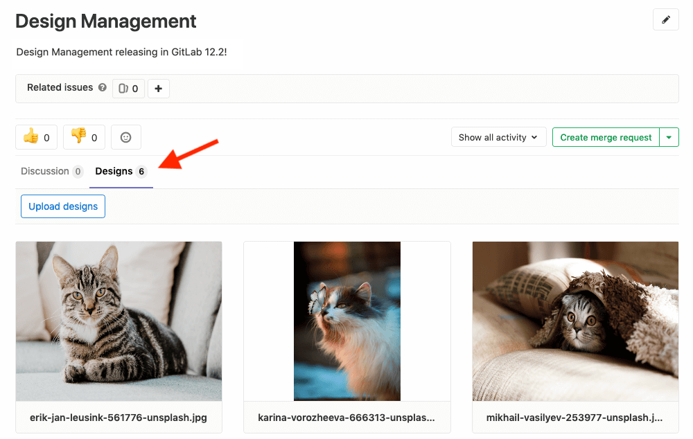

# Design Management **(PREMIUM)**

> [Introduced](https://gitlab.com/groups/gitlab-org/-/epics/660) in [GitLab Premium](https://about.gitlab.com/pricing/) 12.2.

CAUTION: **Warning:**
This an __alpha__ feature and is subject to change at any time without
prior notice.

## Overview

Design Management allows you to upload design assets (wireframes, mockups, etc.)
to GitLab issues and keep them stored in one single place, accessed by the Design
Management's page within an issue, giving product designers, product managers, and engineers a
way to collaborate on designs over one single source of truth.

You can easily share mock-ups of designs with your team, or visual regressions can be easily
viewed and addressed.

<i class="fa fa-youtube-play youtube" aria-hidden="true"></i>
For an overview, see the video [Design Management (GitLab 12.2)](https://www.youtube.com/watch?v=CCMtCqdK_aM).

## Requirements

Design Management requires
[Large File Storage (LFS)](../../../workflow/lfs/manage_large_binaries_with_git_lfs.md)
to be enabled:

- For GitLab.com, LFS is already enabled.
- For self-managed instances, a GitLab administrator must have
  [enabled LFS globally](../../../workflow/lfs/lfs_administration.md).
- For both GitLab.com and self-managed instances: LFS must be enabled for the project itself.
  If enabled globally, LFS will be enabled by default to all projects. To enable LFS on the
  project level, navigate to your project's **Settings > General**, expand **Visibility, project features, permissions**
  and enable **Git Large File Storage**.

## Limitations

- Files uploaded must have a file extension of either `png`, `jpg`, `jpeg`, `gif`, `bmp`, `tiff` or `ico`. The [`svg` extension is not yet supported](https://gitlab.com/gitlab-org/gitlab-ee/issues/12771).
- [Designs cannot yet be deleted](https://gitlab.com/gitlab-org/gitlab-ee/issues/11089).
- Design Management is [not yet supported in the project export](https://gitlab.com/gitlab-org/gitlab-ee/issues/11090).

## The Design Management page

Navigate to the **Design Management** page from any issue by clicking the **Designs** tab:

## Adding designs

To upload design images, click the **Upload Designs** button and select images to upload.

Designs with the same filename as an existing uploaded design will create a new version
of the design, and will replace the previous version.

## Viewing designs

Images on the Design Management page can be enlarged by clicking on them.

