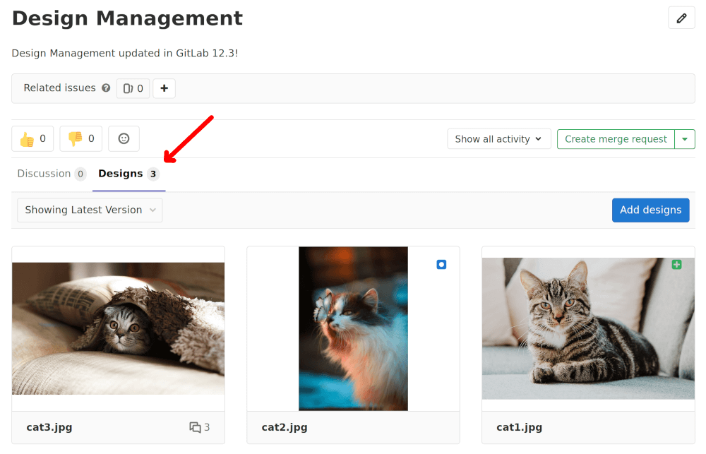
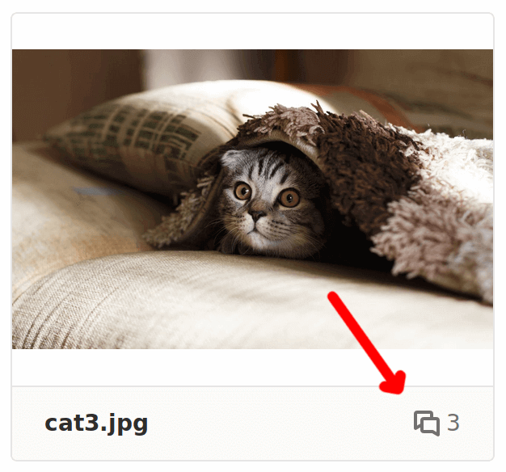
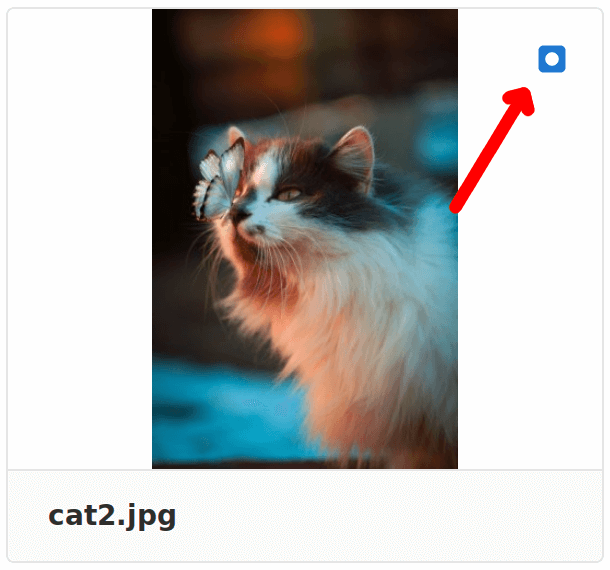
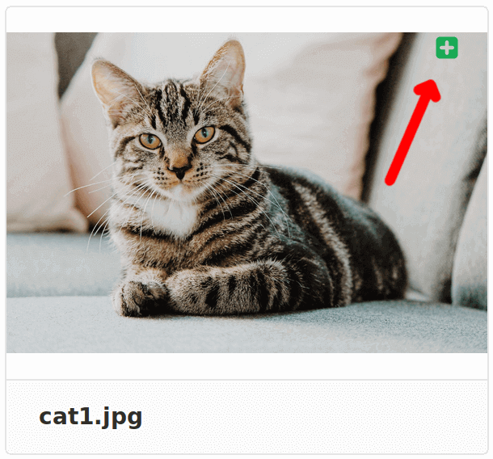
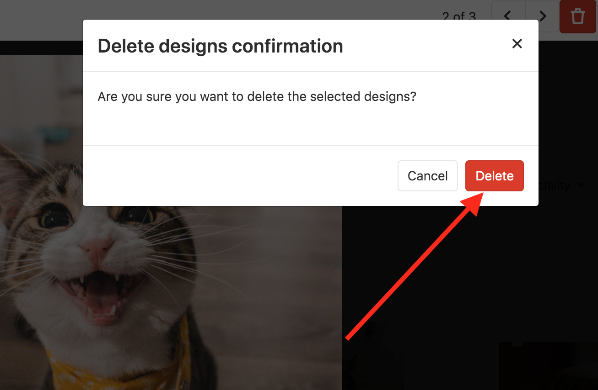
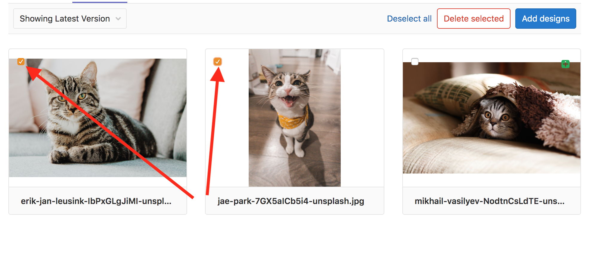
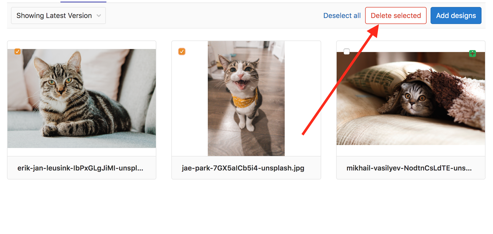
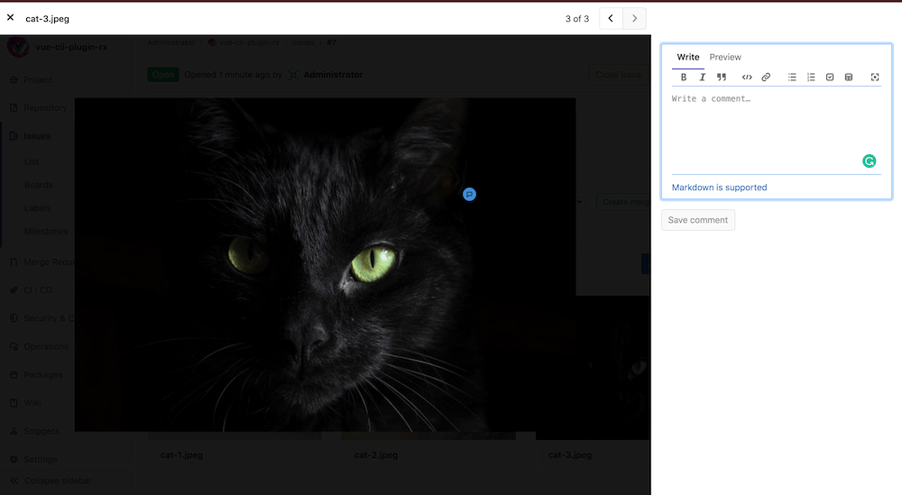
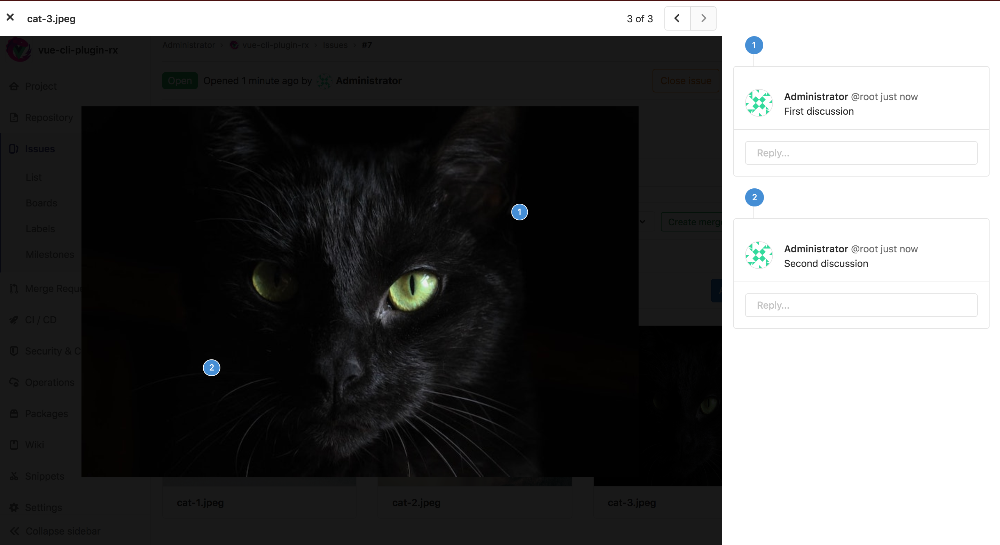

# Design Management **(PREMIUM)**

> [Introduced](https://gitlab.com/groups/gitlab-org/-/epics/660) in [GitLab Premium](https://about.gitlab.com/pricing/) 12.2.

CAUTION: **Warning:**
This an **alpha** feature and is subject to change at any time without
prior notice.

## Overview

Design Management allows you to upload design assets (wireframes, mockups, etc.)
to GitLab issues and keep them stored in one single place, accessed by the Design
Management's page within an issue, giving product designers, product managers, and engineers a
way to collaborate on designs over one single source of truth.

You can easily share mock-ups of designs with your team, or visual regressions can be easily
viewed and addressed.

<i class="fa fa-youtube-play youtube" aria-hidden="true"></i>
For an overview, see the video [Design Management (GitLab 12.2)](https://www.youtube.com/watch?v=CCMtCqdK_aM).

## Requirements

Design Management requires
[Large File Storage (LFS)](../../../administration/lfs/manage_large_binaries_with_git_lfs.md)
to be enabled:

- For GitLab.com, LFS is already enabled.
- For self-managed instances, a GitLab administrator must have
  [enabled LFS globally](../../../administration/lfs/lfs_administration.md).
- For both GitLab.com and self-managed instances: LFS must be enabled for the project itself.
  If enabled globally, LFS will be enabled by default to all projects. To enable LFS on the
  project level, navigate to your project's **Settings > General**, expand **Visibility, project features, permissions**
  and enable **Git Large File Storage**.

Design Management requires that projects are using
[hashed storage](../../../administration/repository_storage_types.html#hashed-storage)
(the default storage type since v10.0).

## Limitations

- Files uploaded must have a file extension of either `png`, `jpg`, `jpeg`, `gif`, `bmp`, `tiff` or `ico`.
  The [`svg` extension is not yet supported](https://gitlab.com/gitlab-org/gitlab/issues/12771).
- Design uploads are limited to 10 files at a time.
- Design Management data
  [isn't deleted when a project is destroyed](https://gitlab.com/gitlab-org/gitlab/issues/13429) yet.
- Design Management data [won't be moved](https://gitlab.com/gitlab-org/gitlab/issues/13426)
  when an issue is moved, nor [deleted](https://gitlab.com/gitlab-org/gitlab/issues/13427)
  when an issue is deleted.
- Design Management
  [isn't supported by Geo](https://gitlab.com/groups/gitlab-org/-/epics/1633) yet.
- Only the latest version of the designs can be deleted.
- Deleted designs cannot be recovered but you can see them on previous designs versions.

## The Design Management page

Navigate to the **Design Management** page from any issue by clicking the **Designs** tab:

## Adding designs

To upload design images, click the **Upload Designs** button and select images to upload.

Designs with the same filename as an existing uploaded design will create a new version
of the design, and will replace the previous version.

Designs cannot be added if the issue has been moved, or its
[discussion is locked](../../discussions/#lock-discussions).

## Viewing designs

Images on the Design Management page can be enlarged by clicking on them.

The number of comments on a design — if any — is listed to the right
of the design filename. Clicking on this number enlarges the design
just like clicking anywhere else on the design.
When a design is added or modified, an icon is displayed on the item
to help summarize changes between versions.

| Indicator | Example |
| --------- | ------- |
| Comments |  |
| Modified (in the selected version) |  |
| Added (in the selected version) |  |

## Deleting designs

> [Introduced](https://gitlab.com/gitlab-org/gitlab/issues/11089) in [GitLab Premium](https://about.gitlab.com/pricing/) 12.4.

There are two ways to delete designs: manually delete them
individually, or select a few of them to delete at once,
as shown below.

To delete a single design, click it to view it enlarged,
then click the trash icon on the top right corner and confirm
the deletion by clicking the **Delete** button on the modal window:

To delete multiple designs at once, on the design's list view,
first select the designs you want to delete:

Once selected, click the **Delete selected** button to confirm the deletion:

NOTE: **Note:**
Only the latest version of the designs can be deleted.
Deleted designs are not permanently lost; they can be
viewed by browsing previous versions.

## Adding annotations to designs

When a design is uploaded, you can add annotations by clicking on
the image on the exact location you'd like to add the note to.
A badge is added to the image identifying the annotation, from
which you can start a new discussion:

Different discussions have different badge numbers:

From GitLab 12.5 on, new annotations will be outputted to the issue activity,
so that everyone involved can participate in the discussion.
