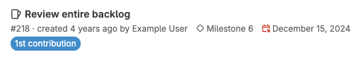

DETAILS:
**Tier:** Free, Premium, Ultimate
**Offering:** GitLab.com, GitLab Self-Managed, GitLab Dedicated

> - Minimum role to set due dates [changed](https://gitlab.com/gitlab-org/gitlab/-/merge_requests/169256) from Reporter to Planner in GitLab 17.7.

Use due dates in work items to track deadlines, and make sure features are
shipped on time.

Due dates are supported in:

- [Issues](_index.md)
- [Epics](../../group/epics/_index.md)
- [Tasks](../../tasks.md)
- [Objectives and key results](../../okrs.md)
- [Incidents](../../../operations/incident_management/incidents.md)

The day before an open item is due, an email is sent to all participants.
Like the due date, the "day before the due date" is determined by the
server's time zone.

Due dates also appear in your [to-do items](../../todos.md).

## View issues with due dates

You can see issues with their due dates on the **Issues** page.
If an issue contains a due date,
it is shown below the issue title:

Issue dates in the past are shown with a red icon (**{calendar-overdue}**).

To view and sort issues containing due dates in your project:

1. On the left sidebar, select **Search or go to** and find your project.
1. Select **Plan > Issues**.
1. To sort by due date, select the current sort method, then select **Due date**.
1. Optional. To reverse the sort order, select **Sort direction** (**{sort-lowest}**).

## Set a due date for an issue

All users with permission to view the issue can view its due date.

### When creating an issue

If you have at least the Planner role, when creating an issue, select **Due date** to show a calendar.
This date uses the server's time zone, not the current user's time zone.

To remove the date, select the date text, then delete the text.

### In an existing issue

Prerequisites:

- You must have at least the Planner role.

To do this:

1. On the left sidebar, select **Search or go to** and find your project.
1. Select **Plan > Issues**, then select the title of your issue to view it.
1. On the right sidebar, next to **Due date**, select **Edit** to display a calendar.
1. Select your desired date, then select again, outside the calendar, to save your changes.

### With a quick action

To set a due date from a [quick action](../quick_actions.md) in an issue's description or comment:

- `/due <date>`: Set the due date. Examples of valid `<date>` include `in 2 days`, `this Friday`, and `December 31st`.
- `/remove_due_date`: Remove an existing due date.

## Export issue due dates to a calendar

Issues with due dates can also be exported as an iCalendar feed. The URL of the
feed can be added to calendar applications.

- The **Project Issues** page
- The **Group Issues** page

1. Go to the page that contains the list of issues you want to subscribe to.
   For example:

   - [Issues assigned to you](managing_issues.md#view-all-issues-assigned-to-you)
   - [Issues in a specific project](managing_issues.md#issue-list)
   - Issues for all projects [in a group](../../group/_index.md)

1. On the right, from the **Actions** (**{ellipsis_v}**) dropdown list, select **Subscribe to calendar** to display the `.ics` file.
1. Copy the full link to the page (including the full query string) and use it in your
   preferred calendar application.
