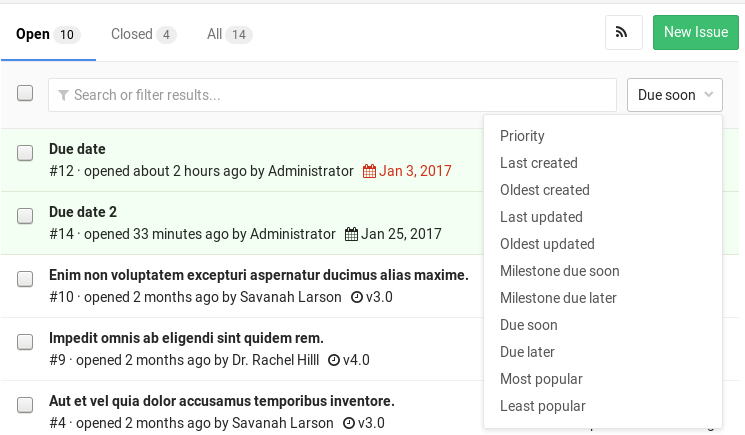

# Due dates

> [Introduced](https://gitlab.com/gitlab-org/gitlab-foss/-/merge_requests/3614) in GitLab 8.7.

Please read through the [GitLab Issue Documentation](index.md) for an overview on GitLab Issues.

Due dates can be used in issues to keep track of deadlines and make sure features are
shipped on time. Users must have at least [Reporter permissions](../../permissions.md)
to be able to edit them, but they can be seen by everybody with permission to view
the issue.

## Setting a due date

When creating or editing an issue, you can click in the **due date** field and a calendar
will appear to help you choose the date you want. To remove the date, select the date
text and delete it. The date is related to the server's timezone, not the timezone of
the user setting the due date.

You can also set a due date via the issue sidebar. Expand the
sidebar and click **Edit** to pick a due date or remove the existing one.
Changes are saved immediately.

The last way to set a due date is by using [quick actions](../quick_actions.md), directly in an issue's description or comment:

- `/due <date>`: set due date. Examples of valid `<date>` include `in 2 days`, `this Friday`, and `December 31st`.
- `/remove_due_date`: remove due date.

## Making use of due dates

Issues that have a due date can be easily seen in the issue tracker,
displaying a date next to them. Issues where the date is overdue will have
the icon and the date colored red. You can sort issues by those that are
`Due soon` or `Due later` from the dropdown menu on the right.

Due dates also appear in your [todos list](../../todos.md).

The day before an open issue is due, an email will be sent to all participants
of the issue. Like the due date, the "day before the due date" is determined by the
server's timezone.

Issues with due dates can also be exported as an iCalendar feed. The URL of the
feed can be added to calendar applications. The feed is accessible by clicking
on the **Subscribe to calendar** button on the following pages:

- on the **Assigned Issues** page that is linked on the right-hand side of the GitLab header
- on the **Project Issues** page
- on the **Group Issues** page
