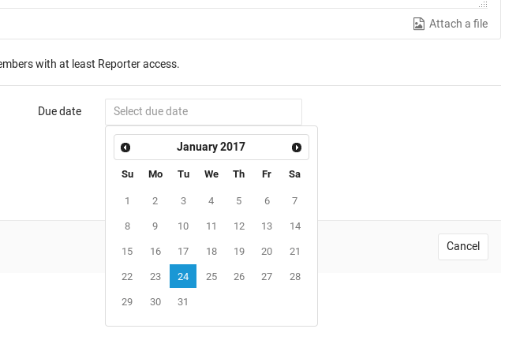
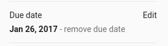
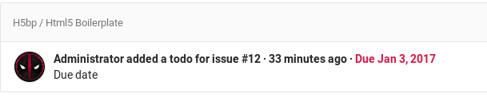

# Due dates **(FREE)**

Due dates can be used in [issues](index.md) to keep track of deadlines and make sure features are
shipped on time. Users need at least [Reporter permissions](../../permissions.md)
to be able to edit the due date. All users with permission to view
the issue can view the due date.

## Setting a due date

When creating an issue, select the **Due date** field to make a calendar
appear for choosing the date. To remove the date, select the date
text and delete it. The date is related to the server's timezone, not the timezone of
the user setting the due date.

You can also set a due date by using the issue sidebar. Expand the
sidebar and select **Edit** to pick a due date or remove the existing one.
Changes are saved immediately.

The last way to set a due date is by using [quick actions](../quick_actions.md), directly in an issue's description or comment:

- `/due <date>`: set due date. Examples of valid `<date>` include `in 2 days`, `this Friday`, and `December 31st`.
- `/remove_due_date`: remove due date.

## Making use of due dates

You can see issues with their due dates in the issues list.
Overdue issues have their icon and date colored red.
To sort issues by their due dates, select **Due date** from the dropdown menu on the right.
Issues are then sorted from the earliest due date to the latest.
To display issues with the latest due dates at the top, select **Sort direction** (**{sort-lowest}**).

Due dates also appear in your [to-do list](../../todos.md).

The day before an open issue is due, an email is sent to all participants
of the issue. Like the due date, the "day before the due date" is determined by the
server's timezone.

Issues with due dates can also be exported as an iCalendar feed. The URL of the
feed can be added to calendar applications. The feed is accessible by selecting
the **Subscribe to calendar** button on the following pages:

- The **Assigned Issues** page linked on the right side of the GitLab header
- The **Project Issues** page
- The **Group Issues** page
