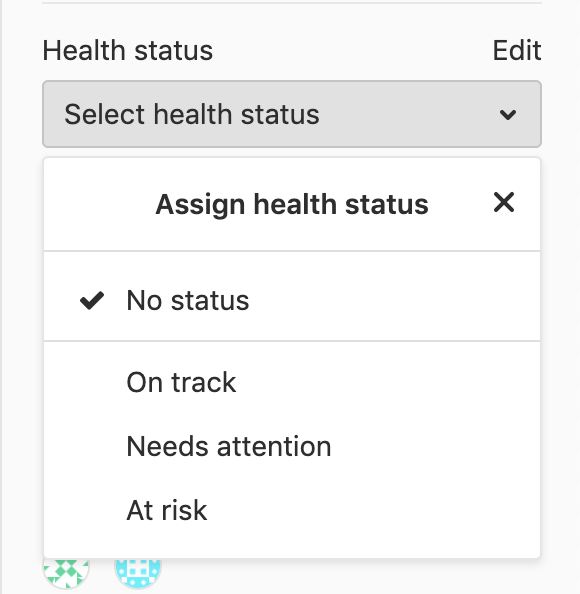

# Issues **(CORE)**

Issues are the fundamental medium for collaborating on ideas and planning work in GitLab.

## Overview

The GitLab issue tracker is an advanced tool for collaboratively developing ideas, solving problems,
and planning work.

Issues can allow sharing and discussion of proposals before, and during,
their implementation between:

- You and your team.
- Outside collaborators.

They can also be used for a variety of other purposes, customized to your
needs and workflow.

Issues are always associated with a specific project. If you have multiple projects in a group,
you can view all of the issues collectively at the group level.

**Common use cases include:**

- Discussing the implementation of a new idea
- Tracking tasks and work status
- Accepting feature proposals, questions, support requests, or bug reports
- Elaborating on new code implementations

See also [Always start a discussion with an issue](https://about.gitlab.com/blog/2016/03/03/start-with-an-issue/).

<i class="fa fa-youtube-play youtube" aria-hidden="true"></i>
To learn how our Strategic Marketing department uses GitLab issues with [labels](../labels.md) and
[issue boards](../issue_board.md), see the video on
[Managing Commitments with Issues](https://www.youtube.com/watch?v=cuIHNintg1o&t=3).

## Parts of an issue

Issues contain a variety of content and metadata, enabling a large range of flexibility
in how they are used. Each issue can contain the following attributes, though not all items
must be set.

<table class="borderless-table fixed-table">
<tr>
    <td>
        <ul>
            <li>Content</li>
            <ul>
                <li>Title</li>
                <li>Description and tasks</li>
                <li>Comments and other activity</li>
            </ul>
            <li>People</li>
            <ul>
                <li>Author</li>
                <li>Assignee(s)</li>
            </ul>
            <li>State</li>
            <ul>
                <li>State (open or closed)</li>
                <li>Health status (on track, needs attention, or at risk)</li>
                <li>Confidentiality</li>
                <li>Tasks (completed vs. outstanding)</li>
            </ul>
        </ul>
    </td>
    <td>
        <ul>
            <li>Planning and tracking</li>
            <ul>
                <li>Milestone</li>
                <li>Due date</li>
                <li>Weight</li>
                <li>Time tracking</li>
                <li>Labels</li>
                <li>Votes</li>
                <li>Reaction emoji</li>
                <li>Linked issues</li>
                <li>Assigned epic</li>
                <li>Unique issue number and URL</li>
            </ul>
       </ul>
    </td>
</tr>
</table>

## Viewing and managing issues

While you can view and manage details of an issue on the [issue page](#issue-page),
you can also work with multiple issues at a time using:

- [Issues List](#issues-list).
- [Issue Boards](#issue-boards).
- Issue references.
- [Epics](#epics) **(PREMIUM)**.

Key actions for issues include:

- [Creating issues](managing_issues.md#create-a-new-issue)
- [Moving issues](managing_issues.md#moving-issues)
- [Closing issues](managing_issues.md#closing-issues)
- [Deleting issues](managing_issues.md#deleting-issues)
- [Promoting issues](managing_issues.md#promote-an-issue-to-an-epic) **(PREMIUM)**

### Issue page


On an issue's page, you can view [all aspects of the issue](issue_data_and_actions.md),
and modify them if you have the necessary [permissions](../../permissions.md).

#### Real-time sidebar **(CORE ONLY)**

> - [Introduced](https://gitlab.com/gitlab-org/gitlab/-/issues/17589) in GitLab 13.3.

Assignees in the sidebar are updated in real time. This feature is **disabled by default**.
To enable it, you need to enable [ActionCable in-app mode](https://docs.gitlab.com/omnibus/settings/actioncable.html).

### Issues List


On the Issues List, you can:

- View all issues in a project when opening the Issues List from a project context.
- View all issues in a groups's projects when opening the Issues List from a group context.

You can filter the Issues List with a [search query](../../search/index.md#filtering-issue-and-merge-request-lists),
including specific metadata, such as labels, assignees, status, and more. From this
view, you can also make certain changes [in bulk](../bulk_editing.md) to the displayed issues.

For more information, see the [Issue Data and Actions](issue_data_and_actions.md) page
for a rundown of all the fields and information in an issue.

You can sort a list of issues in several ways, for example by issue creation date, milestone due date.
For more information, see the [Sorting and ordering issue lists](sorting_issue_lists.md) page.

#### Cached issue count

> - [Introduced]([link-to-issue](https://gitlab.com/gitlab-org/gitlab/-/issues/243753)) in GitLab 13.9.
> - It's [deployed behind a feature flag](../../feature_flags.md), disabled by default.
> - It's disabled on GitLab.com.
> - It's not recommended for production use.
> - To use this feature in GitLab self-managed instances, ask a GitLab administrator to [enable it](#enable-or-disable-cached-issue-count) **(CORE ONLY)**

WARNING:
This feature might not be available to you. Check the **version history** note above for details.

In a group, the sidebar displays the total count of open issues and this value is cached if higher
than 1000. The cached value is rounded to thousands (or millions) and updated every 24 hours.

### Issue boards


[Issue boards](../issue_board.md) are Kanban boards with columns that display issues based on their
labels or their assignees**(PREMIUM)**. They offer the flexibility to manage issues using
highly customizable workflows.

You can reorder issues in the column. If you drag an issue card to another column, its
associated label or assignee is changed to match that of the new column. The entire
board can also be filtered to only include issues from a certain milestone or an overarching
label.

### Design Management

With [Design Management](design_management.md), you can upload design
assets to issues and view them all together for sharing and
collaboration with your team.

### Epics **(PREMIUM)**

[Epics](../../group/epics/index.md) let you manage your portfolio of projects more
efficiently and with less effort. Epics track groups of issues that share a theme, across
projects and milestones.

### Related issues

You can mark two issues as related, so that when viewing one, the other is always
listed in its [Related Issues](related_issues.md) section. This can help display important
context, such as past work, dependencies, or duplicates.

Users on [GitLab Starter, GitLab Bronze, and higher tiers](https://about.gitlab.com/pricing/), can
also mark issues as blocking or blocked by another issue.

### Crosslinking issues

You can [cross-link issues](crosslinking_issues.md) by referencing an issue from another
issue or merge request by including its URL or ID. The referenced issue displays a
message in the Activity stream about the reference, with a link to the other issue or MR.

### Similar issues

> [Introduced](https://gitlab.com/gitlab-org/gitlab-foss/-/merge_requests/22866) in GitLab 11.6.

To prevent duplication of issues for the same topic, GitLab searches for similar issues
when new issues are being created.

As you type in the title field of the **New Issue** page, GitLab searches titles and descriptions
across all issues to in the current project. Only issues you have access to are returned.
Up to five similar issues, sorted by most recently updated, are displayed below the title box.
[GraphQL](../../../api/graphql/index.md) must be enabled to use this feature.


### Health status **(ULTIMATE)**

> - [Introduced](https://gitlab.com/gitlab-org/gitlab/-/issues/36427) in [GitLab Ultimate](https://about.gitlab.com/pricing/) 12.10.
> - Health status of closed issues [can't be edited](https://gitlab.com/gitlab-org/gitlab/-/issues/220867) in [GitLab Ultimate](https://about.gitlab.com/pricing/) 13.4 and later.
> - Issue health status visible in issue lists [introduced](https://gitlab.com/gitlab-org/gitlab/-/merge_requests/45141) in [GitLab Ultimate](https://about.gitlab.com/pricing/) 13.6.
> - [Feature flag removed](https://gitlab.com/gitlab-org/gitlab/-/issues/213567) in GitLab 13.7.

To help you track issue statuses, you can assign a status to each issue.
This marks issues as progressing as planned or needs attention to keep on schedule:

- **On track** (green)
- **Needs attention** (amber)
- **At risk** (red)



After an issue is closed, its health status can't be edited and the "Edit" button becomes disabled
until the issue is reopened.

You can then see issue statuses in the [issue list](#issues-list) and the
[Epic tree](../../group/epics/index.md#issue-health-status-in-epic-tree).

## Other Issue actions

- [Create an issue from a template](../../project/description_templates.md#using-the-templates)
- [Set a due date](due_dates.md)
- [Bulk edit issues](../bulk_editing.md) - From the Issues List, select multiple issues
  in order to change their status, assignee, milestone, or labels in bulk.
- [Import issues](csv_import.md)
- [Export issues](csv_export.md)
- [Issues API](../../../api/issues.md)
- Configure an [external issue tracker](../../../integration/external-issue-tracker.md)
  such as Jira, Redmine, Bugzilla, or EWM.

## Enable or disable cached issue count **(CORE ONLY)**

Cached issue count in the left sidebar is under development and not ready for production use. It is
deployed behind a feature flag that is **disabled by default**.
[GitLab administrators with access to the GitLab Rails console](../../../administration/feature_flags.md)
can enable it.

To enable it:

```ruby
Feature.enable(:cached_sidebar_open_issues_count)
```

To disable it:

```ruby
Feature.disable(:cached_sidebar_open_issues_count)
```
