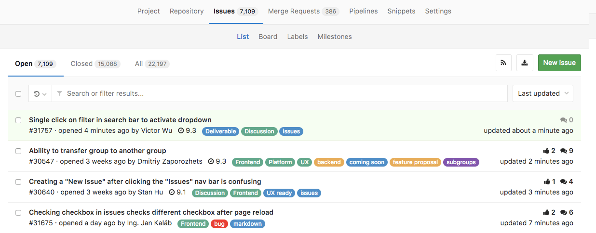
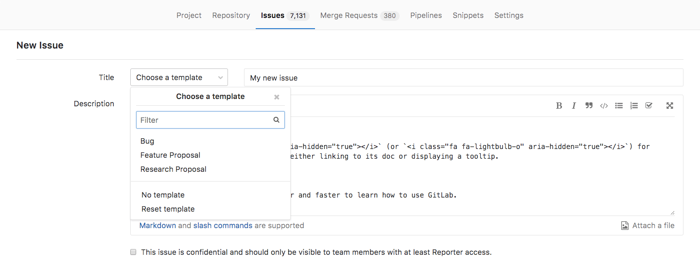

# Issues

The GitLab Issue Tracker is an advanced and complete tool
for tracking the evolution of a new idea or the process
of solving a problem.

It allows you, your team, and your collaborators to share
and discuss proposals before and while implementing them.

Issues and the GitLab Issue Tracker are available in all
[GitLab Products](https://about.gitlab.com/products/) as
part of the [GitLab Workflow](https://about.gitlab.com/2016/10/25/gitlab-workflow-an-overview/).

## Use cases

Issues can have endless applications. Just to exemplify, these are
some cases for which creating issues are most used:

- Discussing the implementation of a new idea
- Submitting feature proposals
- Asking questions
- Reporting bugs and malfunction
- Obtaining support
- Elaborating new code implementations

See also the blog post "[Always start a discussion with an issue](https://about.gitlab.com/2016/03/03/start-with-an-issue/)".

### Keep private things private

For instance, let's assume you have a public project but want to start a discussion on something
you don't want to be public. With [Confidential Issues](#confidential-issues),
you can discuss private matters among the project members, and still keep
your project public, open to collaboration.

### Streamline collaboration

With [Multiple Assignees for Issues](multiple_assignees_for_issues.md),
available in [GitLab Enterprise Edition Starter](https://about.gitlab.com/gitlab-ee/)
you can streamline collaboration and allow shared responsibilities to be clearly displayed.
All assignees are shown across your workflows and receive notifications (as they
would as single assignees), simplifying communication and ownership.

### Consistent collaboration

Create [issue templates](#issue-templates) to make collaboration consistent and
containing all information you need. For example, you can create a template
for feature proposals and another one for bug reports.

## Issue Tracker

The issue tracker is the collection of opened and closed issues created in a project.

Find the issue tracker by navigating to your **Project's Dashboard** > **Issues**.

## GitLab Issues Functionalities

The image bellow illustrates how an issue looks like:

Learn more about it on the [GitLab Issues Functionalities documentation](issues_functionalities.md).

## New issue

Read through the [documentation on creating issues](create_new_issue.md).

## Closing issues

Learn distinct ways to [close issues](closing_issues.md) in GitLab.

## Create a merge request from an issue

Learn more about it on the [GitLab Issues Functionalities documentation](issues_functionalities.md#18-new-merge-request).

## Search for an issue

Learn how to [find an issue](../../search/index.md) by searching for and filtering them.

## Advanced features

### Confidential Issues

Whenever you want to keep the discussion presented in a
issue within your team only, you can make that
[issue confidential](confidential_issues.md). Even if your project
is public, that issue will be preserved. The browser will
respond with a 404 error whenever someone who is not a project
member with at least [Reporter level](../../permissions.md#project) tries to
access that issue's URL.

Learn more about them on the [confidential issues documentation](confidential_issues.md).

### Issue templates

Create templates for every new issue. They will be available from
the dropdown menu **Choose a template** when you create a new issue:

Learn more about them on the [issue templates documentation](../../project/description_templates.md#creating-issue-templates).

### Crosslinking issues

Learn more about [crosslinking](crosslinking_issues.md) issues and merge requests.

### Issue Board

The [GitLab Issue Board](https://about.gitlab.com/features/issueboard/) is a way to
enhance your workflow by organizing and prioritizing issues in GitLab.

Find GitLab Issue Boards by navigating to your **Project's Dashboard** > **Issues** > **Board**.

Read through the documentation for [Issue Boards](../issue_board.md)
to find out more about this feature.

#### Multiple Issue Boards (EES/EEP)

Multiple Issue Boards enables you to create more than one Issue Board per project.
It's great for large projects with more than one team or in situations where a
repository is used to host the code of multiple products.

_[Multiple Issue Boards](../issue_board.md#multiple-issue-boards)
are available only in [GitLab Enterprise Edition](https://about.gitlab.com/gitlab-ee/)._

### Export Issues to CSV (EES/EEP)

Issues can be [exported as CSV](csv_export.md) from GitLab and are sent to your email as an attachment.

_Exporting issues to CSV is available only in [GitLab Enterprise Edition](https://about.gitlab.com/gitlab-ee/)._

## Related Issues (EES/SSP)

Related Issues are a bi-directional relationship between any two issues
and appear in a block below the issue description. Issues can be across groups
and projects.

Read more about [Related Issues](related_issues.md).

### Issue's API

Read through the [API documentation](../../../api/issues.md).
