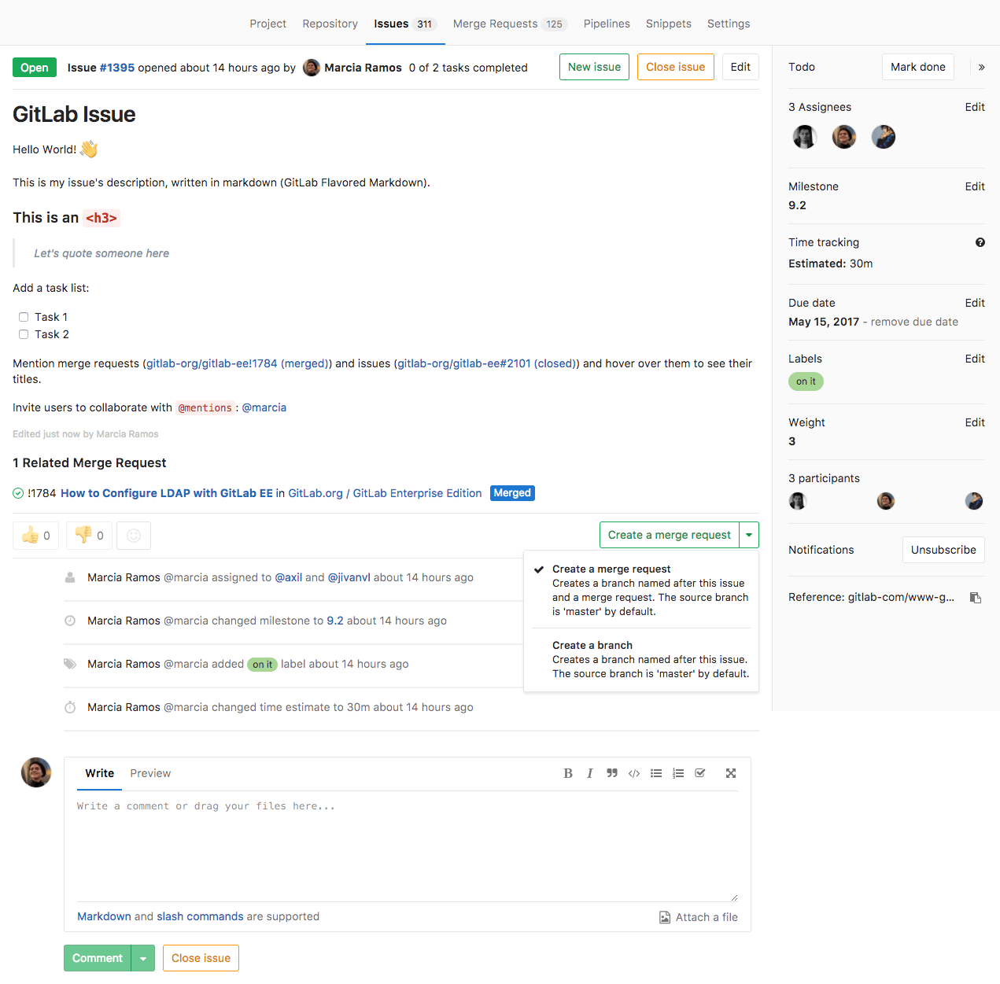
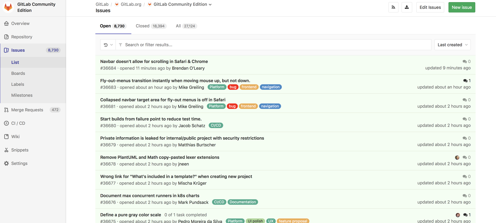
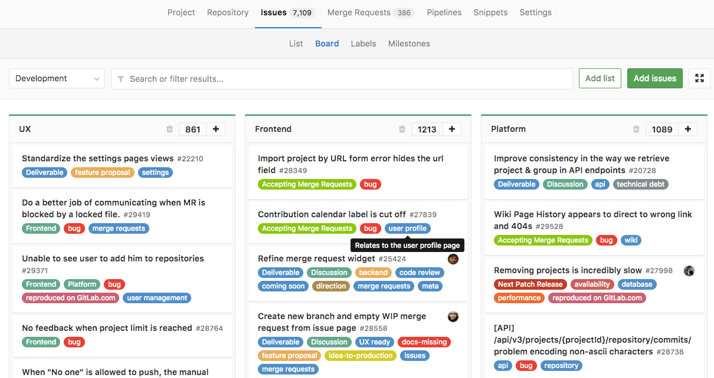

# Issues

Issues are the fundamental medium for collaborating on ideas and planning work in GitLab.

## Overview

The GitLab issue tracker is an advanced tool for collaboratively developing ideas, solving problems, and planning work.

Issues can allow you, your team, and your collaborators to share and discuss proposals before and during their implementation.
However, they can be used for a variety of other purposes, customized to your needs and workflow.

Issues are always associated with a specific project, but if you have multiple projects in a group,
you can also view all the issues collectively at the group level.

**Common use cases include:**

- Discussing the implementation of a new idea
- Tracking tasks and work status
- Accepting feature proposals, questions, support requests, or bug reports
- Elaborating new code implementations

See also the blog post "[Always start a discussion with an issue](https://about.gitlab.com/2016/03/03/start-with-an-issue/)".

## Parts of an issue

Issues contain a variety of content and metadata, enabling a large range of flexibility in how they are used. Each issue can contain the following attributes, though some items may remain unset.

<table class="borderless-table fixed-table">
<tr>
    <td>
        <ul>
            <li>Content</li>
            <ul>
                <li>Title</li>
                <li>Description and tasks</li>
                <li>Comments and other activity</li>
            </ul>
            <li>People</li>
            <ul>
                <li>Author</li>
                <li>Assignee(s)</li>
            </ul>
            <li>State</li>
            <ul>
                <li>Status (open/closed)</li>
                <li>Confidentiality</li>
                <li>Tasks (completed vs. outstanding)</li>
            </ul>
        </ul>
    </td>
    <td>
        <ul>
            <li>Planning and tracking</li>
            <ul>
                <li>Milestone</li>
                <li>Due date</li>
                <li>Weight</li>
                <li>Time tracking</li>
                <li>Labels</li>
                <li>Votes</li>
                <li>Reaction emoji</li>
                <li>Linked issues</li>
                <li>Assigned epic</li>
                <li>Unique issue number and URL</li>
            </ul>
       </ul>
    </td>
</tr>
</table>

## Viewing and managing issues

While you can view and manage the full detail of an issue at its URL, you can also work with multiple issues at a time using the Issues List, Issue Boards, Epics **[ULTIMATE]**, and issue references.

### Issue page

On an issue’s page, you can view all aspects of the issue, and you can also modify them if you you have the necessary [permissions](../../permissions.md).

For more information, see the [Issue Data and Actions](issue_data_and_actions.md) page.

### Issues list

On the Issues List, you can view all issues in the current project, or from multiple projects when opening the Issues List from the higher-level group context. Filter the issue list by [any search query](../../search/index.md#issues-and-merge-requests-per-project) and/or specific metadata, such as label(s), assignees(s), status, and more. From this view, you can also make certain changes [in bulk](../bulk_editing.md) to the displayed issues.

For more information on interacting with Issues, see the [Issue Data and Actions](issue_data_and_actions.md) page.

For sorting by issue priority, see [Label Priority](../labels.md#label-priority).

### Issue boards

Issue boards are Kanban boards with columns that display issues based on their labels or their assignees**[PREMIUM]**. They offer the flexibility to manage issues using highly customizable workflows.

You can reorder issues within a column, or drag an issue card to another column; its associated label or assignee will change to match that of the new column. The entire board can also be filtered to only include issues from a certain milestone or an overarching label.

For more information, see the [Issue Boards](../issue_board.md) page.

### Epics **[ULTIMATE]**

Epics let you manage your portfolio of projects more efficiently and with less effort by tracking groups of issues that share a theme, across projects and milestones.

For more information, see the [Epics](../../group/epics/index.md) page.

### Related issues **[STARTER]**

You can mark two issues as related, so that when viewing each one, the other is always listed in its Related Issues section. This can help display important context, such as past work, dependencies, or duplicates.

For more information, see [Related Issues](related_issues.md).

### Crosslinking issues

When you reference an issue from another issue or merge request by including its URL or ID, the referenced issue displays a message in the Activity stream about the reference, with a link to the other issue or MR.

For more information, see [Crosslinking issues](crosslinking_issues.md).

## Issue actions

- [Create an issue](create_new_issue.md)
- [Create an issue from a template](../../project/description_templates.md#using-the-templates)
- [Close an issue](closing_issues.md)
- [Move an issue](moving_issues.md)
- [Delete an issue](deleting_issues.md)
- [Create a merge request from an issue](issue_data_and_actions.md#22-create-merge-request)

## Advanced issue management

- [Bulk edit issues](../bulk_editing.md) - From the Issues List, select multiple issues in order to change their status, assignee, milestone, or labels in bulk.
- [Import issues](csv_import.md)
- [Export issues](csv_export.md) **[STARTER]**
- [Issues API](../../../api/issues.md)
- Configure an [external issue tracker](../../../integration/external-issue-tracker.md) such as Jira, Redmine,
or Bugzilla.
