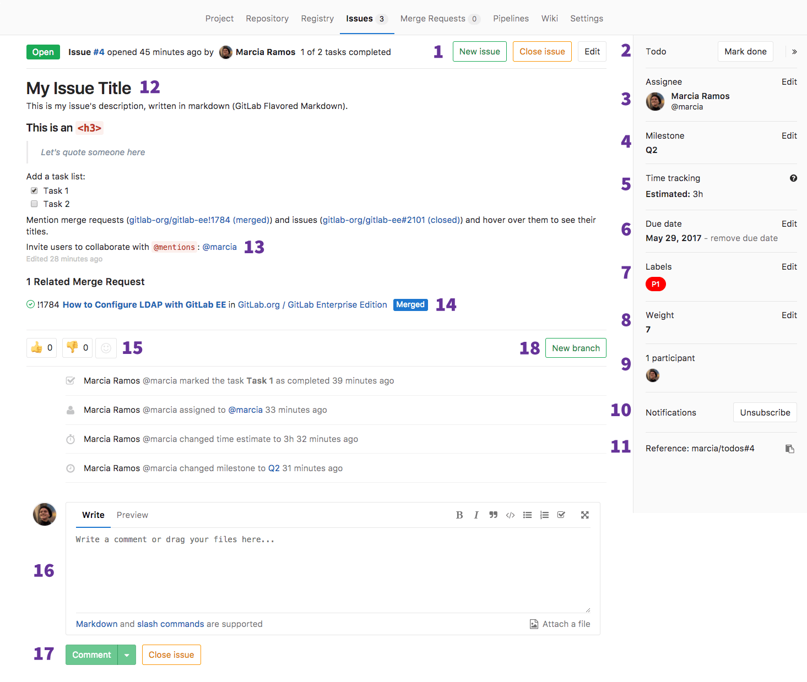
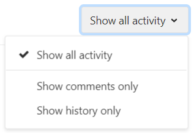
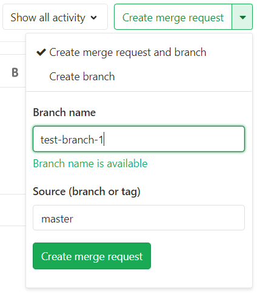
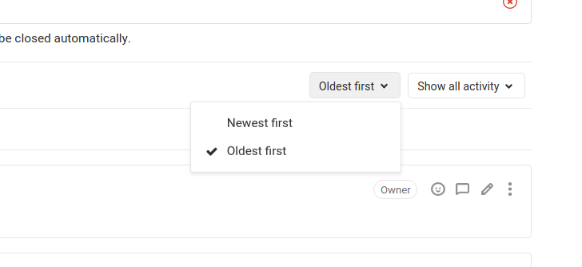
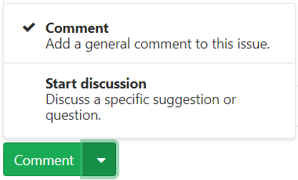

# Issue Data and Actions **(FREE)**

Please read through the [GitLab Issue Documentation](index.md) for an overview on GitLab Issues.

## Parts of an Issue

The image below illustrates what an issue may look like. Certain parts
look slightly different or are absent, depending on the GitLab version
and the user's permissions.

You can find all of an issue's information on one page.

The numbers in the image correspond to the following features:

- **1.** [Issue actions](#issue-actions)
- **2.** [To Do](#to-do)
- **3.** [Assignee](#assignee)
  - **3.1.** [Multiple Assignees](#multiple-assignees)
- **4.** [Epic](#epic)
- **5.** [Milestone](#milestone)
- **6.** [Time tracking](#time-tracking)
- **7.** [Due date](#due-date)
- **8.** [Labels](#labels)
- **9.** [Weight](#weight)
- **10.** [Confidentiality](#confidentiality)
- **11.** [Lock issue](#lock-issue)
- **12.** [Participants](#participants)
- **13.** [Notifications](#notifications)
- **14.** [Reference](#reference)
- [Issue email](#email)
- **15.** [Edit](#edit)
- **16.** [Description](#description)
- **17.** [Mentions](#mentions)
- **18.** [Linked Issues](#linked-issues)
- **19.** [Related Merge Requests](#related-merge-requests)
- **20.** [Award emoji](#award-emoji)
- **21.** [Show all activity](#show-all-activity)
- **22.** [Create Merge Request](#create-merge-request)
- **23.** [Issue history](#issue-history)
  - [Activity sort order](#activity-sort-order)
- **24.** [Comments](#comments)
- **25.** [Submit comment, start a thread, or comment and close](#submit-comment-start-a-thread-or-comment-and-close)
- **26.** [Zoom meetings](#zoom-meetings)

Many of the elements of the issue screen refresh automatically, such as the title and
description, when they are changed by another user. Comments and system notes also
update automatically in response to various actions and content updates.

### Issue actions

In an open issue, you can close it by selecting the **Close issue** button.
The issue is marked as closed but is not deleted.

To reopen a closed issue, select the **Reopen issue** button.
A reopened issue is no different from any other open issue.

To access additional actions, select the vertical ellipsis
(**{ellipsis_v}**) button:

- To create a new issue in the same project, select **New issue** in the dropdown menu.

- If you are not the issue author, you can [submit an abuse report](../../report_abuse.md).
  Select **Report abuse** in the dropdown menu.

### To Do

You can add issues to and remove issues from your [GitLab To-Do List](../../todos.md).

The button to do this has a different label depending on whether the issue is already on your To-Do
List or not. If the issue is:

- Already on your To-Do List: The button is labeled **Mark as done**. Click the button to remove the issue from your To-Do List.
- Not on your To-Do List: The button is labeled **Add a to do**. Click the button to add the issue to your To-Do List.

### Assignee

An issue can be assigned to:

- Yourself.
- Another person.
- [Many people](#multiple-assignees). **(PREMIUM)**

The assignees can be changed as often as needed. The idea is that the assignees are
responsible for that issue until it's reassigned to someone else to take it from there.
When assigned to someone, it appears in their assigned issues list.

NOTE:
If a user is not member of that project, it can only be
assigned to them if they created the issue themselves.

#### Multiple Assignees **(PREMIUM)**

Often, multiple people work on the same issue together. This can be difficult
to track in large teams where there is shared ownership of an issue.

To help with this, you can use GitLab to
[assign multiple people](multiple_assignees_for_issues.md) to an issue.

### Epic **(PREMIUM)**

You can assign issues to an [Epic](../../group/epics/index.md), which allows better
management of groups of related issues.

### Milestone

Select a [milestone](../milestones/index.md) to attribute that issue to.

### Time tracking

Use [GitLab Quick Actions](../quick_actions.md) to [track estimates and time
spent on issues](../time_tracking.md). You can add a [time estimate](../time_tracking.md#estimates)
for resolving the issue, and also add [the time spent](../time_tracking.md#time-spent)
to resolve the issue.

### Due date

When you work on a tight schedule, it's important to have a way to set a deadline for
implementations and for solving problems. This can be done in the [due date](due_dates.md)
element. Due dates can be changed as many times as needed.

### Labels

Categorize issues by giving them [labels](../labels.md). They help to organize workflows,
and they enable you to work with the [GitLab Issue Board](../issue_board.md).

Group Labels, which allow you to use the same labels for all projects in the same
group, can also be given to issues. They work exactly the same, but are immediately
available to all projects in the group.

If a label doesn't exist yet, you can create one by clicking **Edit**
followed by **Create new label** in the dropdown menu.

### Weight **(PREMIUM)**

[Assign a weight](issue_weight.md) to an issue.
Larger values are used to indicate more effort is required to complete the issue. Only
positive values or zero are allowed.

### Confidentiality

You can [set an issue to be confidential](confidential_issues.md). Unauthorized users
cannot access the issue, and it is not listed in the project's issue boards nor list for them.

### Lock issue

You can [lock the threads](../../discussions/index.md#lock-discussions) in the issue,
to prevent further comments from being added.

### Participants

All the users involved in that issue. Either they participated in the [thread](../../discussions/index.md),
or were mentioned in the description or threads.

### Notifications

Select the toggle to enable or disable [notifications](../../profile/notifications.md#notifications-on-issues-merge-requests-and-epics)
for the issue. Notifications are automatically enabled after you participate in the issue in any way.

### Reference

- A quick "copy" button for that issue's reference, which looks like
  `foo/bar#xxx`, where `foo` is the `username` or `groupname`, `bar` is the
  `project-name`, and `xxx` is the issue number.

### Email

> [Introduced](https://gitlab.com/gitlab-org/gitlab/-/issues/18816) in GitLab 13.8.

Guest users can see a button in the right sidebar to copy the email address for the issue.
Sending an email to this address creates a comment containing the email body.

### Edit

Clicking this icon opens the issue for editing. All the fields which
were shown when the issue was created are displayed for editing.
This icon is only displayed if the user has permission to edit the issue.

### Description

The plain text title and description of the issue fill the top center of the issue page.
The description fully supports [GitLab Flavored Markdown](../../markdown.md#gitlab-flavored-markdown),
allowing many formatting options.

[In GitLab 12.6](https://gitlab.com/gitlab-org/gitlab/-/issues/10103) and later, changes to an
issue's description are listed in the [issue history](#issue-history). **(PREMIUM)**

### Mentions

You can mention a user or a group present in your GitLab instance with `@username` or
`@groupname`. All mentioned users are notified via to-do items and emails,
unless they have disabled all [notifications](#notifications) in their user settings.
This is controlled in the [notification settings](../../profile/notifications.md).

Mentions for yourself (the current logged in user) are highlighted
in a different color, which allows you to quickly see which comments involve you.

Avoid mentioning `@all` in issues and merge requests, as it sends an email notification
to all the members of that project's group. This might be interpreted as spam.

### Linked Issues

Issues that were mentioned as [linked issues](related_issues.md) are listed here.
You can also click the `+` to add more linked issues.

### Related Merge Requests

Merge requests that were mentioned in that issue's description or in the issue thread
are listed as [related merge requests](crosslinking_issues.md#from-merge-requests) here.
Also, if the current issue was mentioned as related in another merge request, that
merge request is also listed here.

### Award emoji

You can award emojis to issues. You can select the "thumbs up" and "thumbs down",
or the gray "smiley-face" to choose from the list of available
[GitLab Flavored Markdown Emoji](../../markdown.md#emojis).

NOTE:
Posting "+1" as a comment in a thread spams all subscribed participants of that issue,
clutters the threads, and is not recommended. Awarding an emoji is a way
to let them know your reaction without notifying them.

### Show all activity

You can filter what is displayed in the issue history by clicking on **Show all activity**
and selecting either:

- **Show comments only**, which only shows threads and hides updates to the issue.
- **Show history only**, which hides threads and only shows updates.

Also:

- You can mention a user or a group present in your GitLab instance with
  `@username` or `@groupname` and they are notified via to-do items
  and emails, unless they have disabled all [notifications](#notifications)
  in their user settings.
- Mentions for yourself (the current logged-in user) are highlighted
  in a different color, which allows you to quickly see which comments involve you.

### Create Merge Request

Create a new branch and [**Draft** merge request](../merge_requests/drafts.md)
in one action. The branch is named `issuenumber-title` by default, but you can
choose any name, and GitLab verifies that it is not already in use. The merge request
inherits the milestone and labels of the issue, and is set to automatically
close the issue when it is merged.

Optionally, you can choose to create a [new branch](../repository/web_editor.md#create-a-new-branch-from-an-issue)
only, named after that issue.

### Issue history

All comments and updates to the issue are tracked and listed here, but this can be
filtered, as shown above.

#### Activity sort order

> [Introduced](https://gitlab.com/gitlab-org/gitlab/-/issues/14588) in GitLab 12.10.

You can reverse the default order and interact with the activity feed sorted by most recent items
at the top. Your preference is saved via local storage and automatically applied to every issue
you view.

To change the activity sort order, click the **Oldest first** dropdown menu and select either oldest
or newest items to be shown first.

### Comments

Collaborate in the issue by posting comments in its thread. This text field also fully
supports [GitLab Flavored Markdown](../../markdown.md#gitlab-flavored-markdown).

### Submit comment, start a thread, or comment and close

After you write a comment, you can:

- Click **Comment** to publish your comment.
- Choose **Start thread** from the dropdown list and start a new [thread](../../discussions/index.md#create-a-thread-without-replying-to-a-comment)
  in that issue's main thread to discuss specific points. This invites other participants
  to reply directly to your thread, keeping related comments grouped together.

You can also close the issue from here, so you don't need to scroll to the top of the issue page.

### Zoom meetings

> [Introduced](https://gitlab.com/gitlab-org/gitlab/-/issues/31103) in GitLab 12.3.

You can attach and remove Zoom meetings to issues using the `/zoom` and `/remove_zoom` [quick actions](../quick_actions.md) as part of
[GitLab Flavored Markdown](../../markdown.md#gitlab-flavored-markdown).

Attaching a [Zoom](https://zoom.us) call an issue
results in a **Join Zoom meeting** button at the top of the issue, just under the header.

Read more how to [add or remove a zoom meeting](associate_zoom_meeting.md).

### Publish an issue **(ULTIMATE)**

> [Introduced](https://gitlab.com/gitlab-org/gitlab/-/merge_requests/30906) in [GitLab Ultimate](https://about.gitlab.com/pricing/) 13.1.

If a status page application is associated with the project, you can use the `/publish` [quick action](../quick_actions.md) to publish the issue. Refer to [GitLab Status Page](../../../operations/incident_management/status_page.md) for more information.
