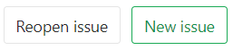
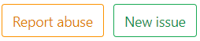

# Issue Data and Actions

Please read through the [GitLab Issue Documentation](index.md) for an overview on GitLab Issues.

## Parts of an Issue

The image below illustrates what an issue may look like. Note that certain parts will
look slightly different or will be absent, depending on the version of GitLab being used
and the permissions of the user viewing the issue.

You can find all the information for that issue on one screen.

### Issue screen

An issue starts with its status (open or closed), followed by its author,
and includes many other functionalities, numbered in the image above to
explain what they mean, one by one.

Many of the elements of the issue screen refresh automatically, such as the title and
description, when they are changed by another user. Comments and system notes also
update automatically in response to various actions and content updates.

#### 1. New Issue, close issue (reopen issue, report issue)

Clicking on **New issue** will open a new window to create a new issue in the same project.
Clicking on **Close issue** will close this issue, but it will not be deleted. If the
issue is already closed, you can still access it and the button will show **Reopen issue**, as shown below,
which you can click to reopen the issue. A reopened issue is no different from any
other issue.

If you do not have rights to modify the issue, the **close issue** button will be
replaced with **report issue**, which you can click to [submit an abuse report](../../abuse_reports.md)
about the issue. It will also appear if you have rights to modify the issue, but only
after it is closed.

#### 2. To Do

You can add issues to and remove issues from your [GitLab To-Do List](../../todos.md).

The button to do this has a different label depending on whether the issue is already on your To-Do List or not. If the issue is:

- Already on your To-Do List: The button is labeled **Mark as done**. Click the button to remove the issue from your To-Do List.
- Not on your To-Do List: The button is labelled **Add a To Do**. Click the button to add the issue to your To-Do List.

#### 3. Assignee

An issue can be assigned to:

- Yourself.
- Another person.
- [Many people](#31-multiple-assignees-STARTER). **(STARTER)**

The assignee(s) can be changed as often as needed. The idea is that the assignees are
responsible for that issue until it's reassigned to someone else to take it from there.
When assigned to someone, it will appear in their assigned issues list.

TIP: **Tip:**
If a user is not member of that project, it can only be
assigned to them if they created the issue themselves.

##### 3.1. Multiple Assignees **(STARTER)**

Often multiple people work on the same issue together, which can be especially difficult
to track in large teams where there is shared ownership of an issue.

In [GitLab Starter](https://about.gitlab.com/pricing/), you can
[assign multiple people](multiple_assignees_for_issues.md) to an issue.

#### 4. Epic **(ULTIMATE)**

You can assign issues to an [Epic](../../group/epics/index.md), which allows better
management of groups of related issues.

#### 5. Milestone

Select a [milestone](../milestones/index.md) to attribute that issue to.

#### 6. Time Tracking

Use [GitLab Quick Actions](../quick_actions.md) to [track estimates and time spent on issues](../time_tracking.md).
You can add an [estimate of the time it will take](../time_tracking.md#estimates)
to resolve the issue, and also add [the time spent](../time_tracking.md#time-spent)
on the resolution of the issue.

#### 7. Due date

When you work on a tight schedule, it's important to have a way to set a deadline for
implementations and for solving problems. This can be done in the [due date](due_dates.md)
element. Due dates can be changed as many times as needed.

#### 8. Labels

Categorize issues by giving them [labels](../labels.md). They help to organize workflows,
and they enable you to work with the [GitLab Issue Board](index.md#issue-boards).

Group Labels, which allow you to use the same labels for all projects within the same
group, can be also given to issues. They work exactly the same, but they are immediately
available to all projects in the group.

TIP: **Tip:**
If a label doesn't exist yet, you can click **Edit**, and it opens a dropdown menu
from which you can select **Create new label**.

#### 9. Weight **(STARTER)**

[Assign a weight](issue_weight.md) to an issue.
Larger values are used to indicate more effort is required to complete the issue. Only
positive values or zero are allowed.

#### 10. Confidentiality

You can [set an issue to be confidential](confidential_issues.md). When set, unauthorized
users will not be able to access the issue, and will not see it listed in project
issue boards or the issue list.

#### 11. Lock issue

You can [lock the threads](../../discussions/index.md#lock-discussions) in the issue,
to prevent further comments from being added.

#### 12. Participants

All the users involved in that issue. Either they participated in the [thread](../../discussions/index.md),
or were mentioned in the description or threads.

#### 13. Notifications

Click on the icon to enable/disable [notifications](../../profile/notifications.md#issue--epics--merge-request-events)
for the issue. This will automatically enable if you participate in the issue in any way.

- **Enable**: If you are not a participant in the discussion on that issue, but
  want to receive notifications on each update, subscribe to it.
- **Disable**: If you are receiving notifications for updates to that issue but no
  longer want to receive them, unsubscribe from it.

#### 14. Reference

- A quick "copy" button for that issue's reference, which looks like
  `foo/bar#xxx`, where `foo` is the `username` or `groupname`, `bar` is the
  `project-name`, and `xxx` is the issue number.

#### 15. Edit

Clicking this icon opens the issue for editing, and you will have access to all the
same fields as when the issue was created. This icon will not display if the user
does not have permission to edit the issue.

#### 16. Description

The plain text title and description of the issue fill the top center of the issue page.
The description fully supports [GitLab Flavored Markdown](../../markdown.md#gitlab-flavored-markdown-gfm),
allowing many formatting options.

> [Since GitLab 12.5](https://gitlab.com/gitlab-org/gitlab/issues/10103), changes to an issue's description are listed in the [issue history](#23-issue-history).**(STARTER)**

#### 17. Mentions

You can mention a user or a group present in your GitLab instance with `@username` or
`@groupname` and they will be notified via todos and email, unless they have disabled
all notifications in their profile settings. This is controlled in the
[notification settings](../../profile/notifications.md).

Mentions for yourself (the current logged in user), will be highlighted in a different
color, allowing you to easily see which comments involve you, helping you focus on
them quickly.

TIP: **Tip:**
Avoid mentioning `@all` in issues and merge requests, as it sends an email notification
to all the members of that project's group, which can be interpreted as spam.

#### 18. Related Issues **(STARTER)**

Issues that were mentioned as [related issues](related_issues.md) are listed here.
You can also click the `+` to add more related issues.

#### 19. Related Merge Requests

Merge requests that were mentioned in that issue's description or in the issue thread
are listed as [related merge requests](crosslinking_issues.md#from-merge-requests) here.
Also, if the current issue was mentioned as related in another merge request, that
merge request will be listed here.

#### 20. Award emoji

You can award an emoji to that issue. There are shortcuts to "thumbs_up" and "thumbs_down",
or you can click on the light gray "face" to choose a different reaction from the
dropdown list of available [GitLab Flavored Markdown Emoji](../../markdown.md#emoji).

TIP: **Tip:**
Posting "+1" as a comment in a thread spams all subscribed participants of that issue,
clutters the threads, and is not recommended. Awarding an emoji is a way
to let them know your reaction without spamming them.

#### 21. Show all activity

You can filter what is displayed in the issue history by clicking on **Show all activity**
and selecting either **Show comments only**, which only shows threads and hides
updates to the issue, or **Show history only**, which hides threads and only shows updates.

- You can mention a user or a group present in your GitLab instance with
  `@username` or `@groupname` and they will be notified via To-Do items
  and email, unless they have [disabled all notifications](#13-notifications)
  in their profile settings.
- Mentions for yourself (the current logged in user), will be highlighted
  in a different color, allowing you to easily see which comments involve you,
  helping you focus on them quickly.

#### 22. Create Merge Request

Create a new branch and [WIP merge request](../merge_requests/work_in_progress_merge_requests.md)
in one action. The branch will be named `issuenumber-title` by default, but you can
choose any name, and GitLab will verify that it is not already in use. The merge request
will automatically inherit the milestone and labels of the issue, and will be set to
close the issue when it is merged.

Optionally, you can choose to create a [new branch](../repository/web_editor.md#create-a-new-branch-from-an-issue)
only, named after that issue.

#### 23. Issue history

All comments and updates to the issue are tracked and listed here, but this can be
filtered, as shown above.

#### 24. Comments

Collaborate in the issue by posting comments in its thread. This text field also fully
supports [GitLab Flavored Markdown](../../markdown.md#gitlab-flavored-markdown-gfm).

#### 25. Submit Comment, start a thread, or comment and close

Once you write a comment, you can:

- Click **Comment** and your comment will be published.
- Choose **Start thread** from the dropdown list and start a new [thread](../../discussions/index.md#threaded-discussions)
  within that issue's main thread to discuss specific points. This invites other participants
  to reply directly to your thread, keeping related comments grouped together.

You can also close the issue from here, so you don't need to scroll to the top of the issue page.

#### 26. Zoom Meetings

> [Introduced](https://gitlab.com/gitlab-org/gitlab/issues/31103) in GitLab 12.3.

You can attach and remove Zoom meetings to issues using the `/zoom` and `/remove_zoom` [quick actions](../quick_actions.md) as part of
[GitLab Flavored Markdown](../../markdown.md#gitlab-flavored-markdown-gfm).

Attaching a [Zoom](https://zoom.us) call an issue
results in a **Join Zoom meeting** button at the top of the issue, just under the header.

Read more how to [add or remove a zoom meeting](associate_zoom_meeting.md).
