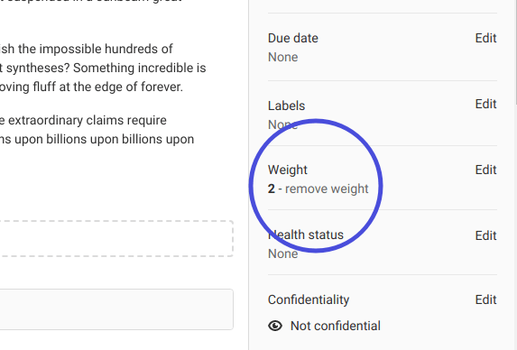

# Issue weight **(PREMIUM)**

> Moved to GitLab Premium in 13.9.

When you have a lot of issues, it can be hard to get an overview.
With weighted issues, you can get a better idea of how much time,
value, or complexity a given issue has or costs.

You can set the weight of an issue during its creation, by changing the
value in the dropdown menu. You can set it to a non-negative integer
value from 0, 1, 2, and so on. (The database stores a 4-byte value, so the
upper bound is essentially limitless.)
You can remove weight from an issue
as well.

This value appears on the right sidebar of an individual issue, as well as
in the issues page next to a weight icon (**{weight}**).

As an added bonus, you can see the total sum of all issues on the milestone page.

