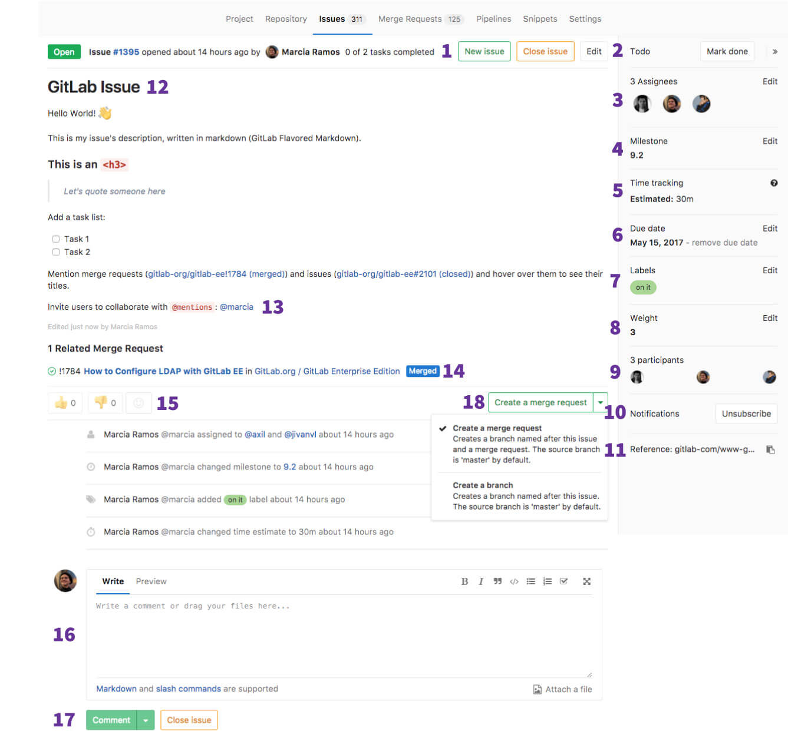

# GitLab Issues Functionalities

Please read through the [GitLab Issue Documentation](index.md) for an overview on GitLab Issues.

## Issues Functionalities

The image below illustrates how an issue looks like:

You can find all the information on that issue on one screen.

### Issue screen

An issue starts with its status (open or closed), followed by its author,
and includes many other functionalities, numbered on the image above to
explain what they mean, one by one.

Many of the elements of the issue screen refresh automatically, such as the title and description, when they are changed by another user.
Comments and system notes also appear automatically in response to various actions and content updates.

#### 1. New Issue, close issue, edit

- New issue: create a new issue in the same project
- Close issue: close this issue
- Edit: edit the same fields available when you create an issue.

#### 2. Todos

- Add todo: add that issue to your [GitLab Todo](../../../workflow/todos.html) list
- Mark done: mark that issue as done (reflects on the Todo list)

#### 3. Assignee

Whenever someone starts to work on an issue, it can be assigned
to that person. The assignee can be changed as much as needed.
The idea is that the assignee is responsible for that issue until
it's reassigned to someone else to take it from there.

> **Tip:**
if a user is not member of that project, it can only be
assigned to them if they created the issue themselves.

##### 3.1. Multiple Assignees **[STARTER]**

Often multiple people likely work on the same issue together,
which can especially be difficult to track in large teams
where there is shared ownership of an issue.

In [GitLab Starter](https://about.gitlab.com/products/), you can also
select multiple assignees to an issue.

Learn more on the [Multiple Assignees documentation](multiple_assignees_for_issues.md).

#### 4. Milestone

- Select a [milestone](../milestones/index.md) to attribute that issue to.

#### 5. Time Tracking

- Estimate time: add an estimate time in which the issue will be implemented
- Spend: add the time spent on the implementation of that issue

> **Note:**
Both estimate and spend times are set via [GitLab Quick Actions](../quick_actions.md).

Learn more on the [Time Tracking documentation](../../../workflow/time_tracking.md).

#### 6. Due date

When you work on a tight schedule, and it's important to
have a way to setup a deadline for implementations and for solving
problems. This can be facilitated by the [due date](due_dates.md)). Due dates
can be changed as many times as needed.

#### 7. Labels

Categorize issues by giving them [labels](../labels.md). They help to
organize team's workflows, once they enable you to work with the
[GitLab Issue Board](index.md#gitlab-issue-board).

Group Labels, which allow you to use the same labels per
group of projects, can be also given to issues. They work exactly the same,
but they are immediately available to all projects in the group.

> **Tip:**
if the label doesn't exist yet, when you click **Edit**, it opens a dropdown menu from which you can select **Create new label**.

#### 8. Weight **[STARTER]**

- Attribute a weight (in a 0 to 9 range) to that issue. Easy to complete
should weight 1 and very hard to complete should weight 9.

Learn more on the [Issue Weight documentation](../../../workflow/issue_weight.md).

#### 9. Participants

- People involved in that issue (mentioned in the description or in the [discussion](../../discussions/index.md)).

#### 10. Notifications

- Subscribe: if you are not a participant of the discussion on that issue, but
want to receive notifications on each new input, subscribe to it.
- Unsubscribe: if you are receiving notifications on that issue but no
longer want to receive them, unsubscribe to it.

Read more on the [notifications documentation](../../../workflow/notifications.md#issue-merge-request-events).

#### 11. Reference

- A quick "copy to clipboard" button to that issue's reference, `foo/bar#xxx`, where `foo` is the `username` or `groupname`, `bar`
is the `project-name`, and `xxx` is the issue number.

#### 12. Title and description

- Title: a plain text title describing the issue's subject.
- Description: a text field which fully supports [GitLab Flavored Markdown](../../markdown.md#gitlab-flavored-markdown-gfm).

#### 13. @mentions

- Mentions: you can either `@mention` a user or a group present in your
GitLab instance and they will be notified via todos and email, unless that
person has disabled all notifications in their profile settings.

To change your [notification settings](../../../workflow/notifications.md) navigate to
**Profile Settings** > **Notifications** > **Global notification level**
and choose your preferences from the dropdown menu.

> **Tip:**
Avoid mentioning `@all` in issues and merge requests,
as it sends an email notification
to all the members of that project's group, which can be
interpreted as spam.

#### 14. Related Merge Requests

- Any merge requests mentioned in that issue's description
or in the issue thread.

#### 15. Award emoji

- Award an emoji to that issue.

> **Tip:**
Posting "+1" as comments in threads spam all
participants of that issue. Awarding an emoji is a way to let them
know you like it without spamming them.

#### 16. Thread

- Comments: collaborate to that issue by posting comments in its thread.
These text fields also fully support
[GitLab Flavored Markdown](../../markdown.md#gitlab-flavored-markdown-gfm).

#### 17. Comment, start a discusion, or comment and close

Once you wrote your comment, you can either:

- Click "Comment" and your comment will be published.
- Click "Start discussion": start a thread within that issue's thread to discuss specific points.
- Click "Comment and close issue": post your comment and close that issue in one click.

#### 18. New Merge Request

- Create a new merge request (with a new source branch named after the issue) in one action.
The merge request will automatically inherit the milestone and labels of the issue. The merge
request will automatically close that issue as soon as merged.
- Optionally, you can just create a [new branch](../repository/web_editor.md#create-a-new-branch-from-an-issue)
named after that issue.
