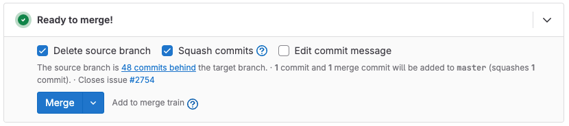
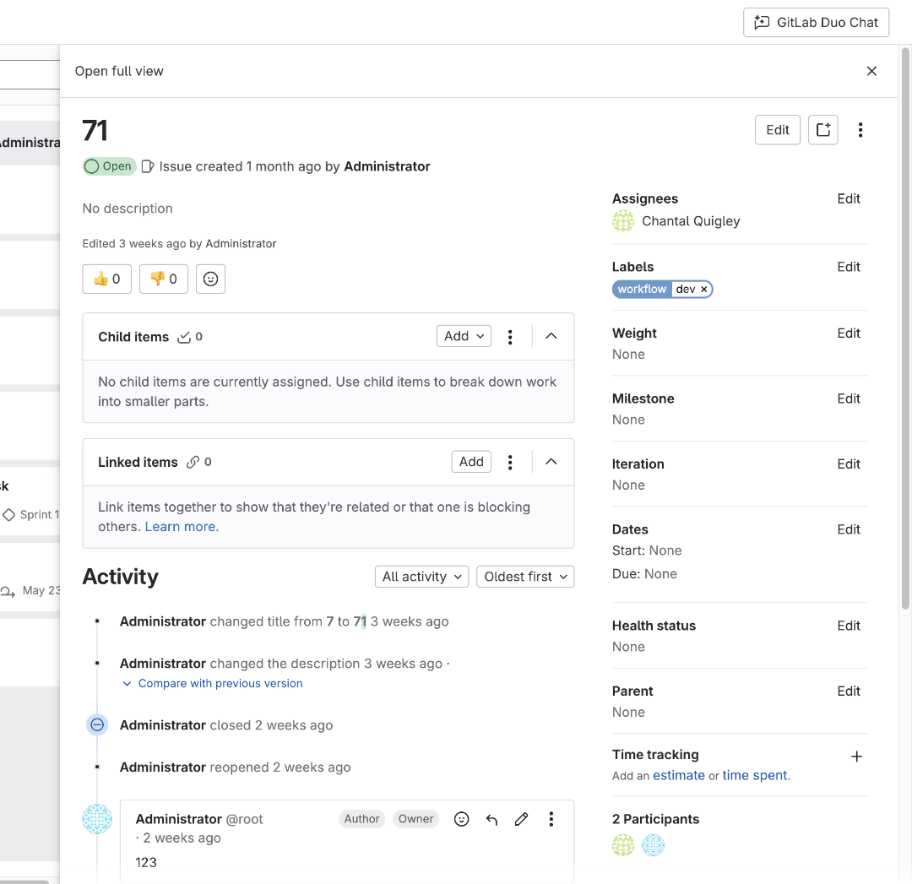

DETAILS:
**Tier:** Free, Premium, Ultimate
**Offering:** GitLab.com, GitLab Self-Managed, GitLab Dedicated

After you create an issue, you can start working with it.

## Edit an issue

> - Minimum role to edit an issue [changed](https://gitlab.com/gitlab-org/gitlab/-/merge_requests/169256) from Reporter to Planner in GitLab 17.7.

You can edit an issue's title and description.

Prerequisites:

- You must have at least the Planner role for the project, be the author of the issue, or be assigned to the issue.

To edit an issue:

1. On the left sidebar, select **Search or go to** and find your project.
1. Select **Plan > Issues**, then select the title of your issue to view it.
1. To the right of the title, select **Edit title and description** (**{pencil}**).
1. Edit the available fields.
1. Select **Save changes**.

### Populate an issue with Issue Description Generation

DETAILS:
**Tier:** Ultimate with GitLab Duo Enterprise - [Start a trial](https://about.gitlab.com/solutions/gitlab-duo-pro/sales/?type=free-trial)
**Offering:** GitLab.com
**Status:** Experiment
**LLM:** Anthropic [Claude 3 Haiku](https://docs.anthropic.com/en/docs/about-claude/models#claude-3-a-new-generation-of-ai)

> - [Introduced](https://gitlab.com/groups/gitlab-org/-/epics/10762) in GitLab 16.3 as an [experiment](../../../policy/development_stages_support.md#experiment).
> - Changed to require GitLab Duo add-on in GitLab 17.6 and later.

Generate a detailed description for an issue based on a short summary you provide.

Prerequisites:

- You must belong to at least one group with the [experiment and beta features setting](../../gitlab_duo/turn_on_off.md#turn-on-beta-and-experimental-features) enabled.
- You must have permission to create an issue.
- Only available for the plain text editor.
- Only available when creating a new issue.
  For a proposal to add support for generating descriptions when editing existing issues, see
  [issue 474141](https://gitlab.com/gitlab-org/gitlab/-/issues/474141).

To generate an issue description:

1. Create a new issue.
1. Above the **Description** field, select **GitLab Duo** (**{tanuki-ai}**) **> Generate issue description**.
1. Write a short description and select **Submit**.

The issue description is replaced with AI-generated text.

Provide feedback on this experimental feature in [issue 409844](https://gitlab.com/gitlab-org/gitlab/-/issues/409844).

**Data usage**: When you use this feature, the text you enter is sent to
the large language model.

## Bulk edit issues from a project

> - Minimum role to bulk edit issues from a project [changed](https://gitlab.com/gitlab-org/gitlab/-/merge_requests/169256) from Reporter to Planner in GitLab 17.7.

You can edit multiple issues at a time when you're in a project.

Prerequisites:

- You must have at least the Planner role for the project.

To edit multiple issues at the same time:

1. On the left sidebar, select **Search or go to** and find your project.
1. Select **Plan > Issues**.
1. Select **Bulk edit**. A sidebar on the right of your screen appears.
1. Select the checkboxes next to each issue you want to edit.
1. From the sidebar, edit the available fields.
1. Select **Update selected**.

When bulk editing issues in a project, you can edit the following attributes:

- Status (open or closed)
- [Assignees](managing_issues.md#assignees)
- [Epic](../../group/epics/_index.md)
- [Milestone](../milestones/_index.md)
- [Labels](../labels.md)
- [Health status](#health-status)
- [Notification](../../profile/notifications.md) subscription
- [Iteration](../../group/iterations/_index.md)
- [Confidentiality](confidential_issues.md)

### Bulk edit issues from a group

DETAILS:
**Tier:** Premium, Ultimate
**Offering:** GitLab.com, GitLab Self-Managed, GitLab Dedicated

> - Minimum role to bulk edit issues from a group [changed](https://gitlab.com/gitlab-org/gitlab/-/merge_requests/169256) from Reporter to Planner in GitLab 17.7.

You can edit multiple issues across multiple projects when you're in a group.

Prerequisites:

- You must have at least the Planner role for a group.

To edit multiple issues at the same time:

1. On the left sidebar, select **Search or go to** and find your group.
1. Select **Plan > Issues**.
1. Select **Bulk edit**. A sidebar on the right of your screen appears.
1. Select the checkboxes next to each issue you want to edit.
1. From the sidebar, edit the available fields.
1. Select **Update selected**.

When bulk editing issues in a group, you can edit the following attributes:

- [Epic](../../group/epics/_index.md)
- [Milestone](../milestones/_index.md)
- [Iteration](../../group/iterations/_index.md)
- [Labels](../labels.md)
- [Health status](#health-status)

## Move an issue

> - Minimum role to move an issue [changed](https://gitlab.com/gitlab-org/gitlab/-/merge_requests/169256) from Reporter to Planner in GitLab 17.7.

When you move an issue, it's closed and copied to the target project.
The original issue is not deleted. A [system note](../system_notes.md), which indicates
where it came from and went to, is added to both issues.

Be careful when moving an issue to a project with different access rules. Before moving the issue, make sure it does not contain sensitive data.

Prerequisites:

- You must have at least the Planner role for the project.

To move an issue:

1. On the left sidebar, select **Search or go to** and find your project.
1. Select **Plan > Issues**, then select your issue to view it.
1. On the right sidebar, select **Move issue**.
1. Search for a project to move the issue to.
1. Select **Move**.

You can also use the `/move` [quick action](../quick_actions.md) in a comment or description.

### Moving tasks when the parent issue is moved

> - [Introduced](https://gitlab.com/gitlab-org/gitlab/-/issues/371252) in GitLab 16.9 [with a flag](../../../administration/feature_flags.md) named `move_issue_children`. Disabled by default.
> - [Enabled on GitLab.com and GitLab Self-Managed](https://gitlab.com/gitlab-org/gitlab/-/issues/371252) in GitLab 16.11.
> - [Generally available](https://gitlab.com/gitlab-org/gitlab/-/issues/371252) in GitLab 17.3. Feature flag `move_issue_children` removed.

When you move an issue to another project, all its child tasks are also moved to the target project
and remain as child tasks of the moved issue.
Each task is moved the same way as the parent, that is, it's closed in the original project and
copied to the target project.

### Bulk move issues

DETAILS:
**Tier:** Free, Premium, Ultimate
**Offering:** GitLab Self-Managed, GitLab Dedicated

> - Minimum role to bulk move issues [changed](https://gitlab.com/gitlab-org/gitlab/-/merge_requests/169256) from Reporter to Planner in GitLab 17.7.

#### From the Issues page

> - [Introduced](https://gitlab.com/gitlab-org/gitlab/-/issues/15991) in GitLab 15.6.

You can move multiple issues at the same time when you're in a project.
You can't move tasks or test cases.

Prerequisites:

- You must have at least the Planner role for the project.

To move multiple issues at the same time:

1. On the left sidebar, select **Search or go to** and find your project.
1. Select **Plan > Issues**.
1. Select **Bulk edit**. A sidebar on the right of your screen appears.
1. Select the checkboxes next to each issue you want to move.
1. From the right sidebar, select **Move selected**.
1. From the dropdown list, select the destination project.
1. Select **Move**.

#### From the Rails console

You can move all open issues from one project to another.

Prerequisites:

- You must have access to the Rails console of the GitLab instance.

To do it:

1. Optional (but recommended). [Create a backup](../../../administration/backup_restore/_index.md) before
   attempting any changes in the console.
1. Open the [Rails console](../../../administration/operations/rails_console.md).
1. Run the following script. Make sure to change `project`, `admin_user`, and `target_project` to
   your values.

   ```ruby
   project = Project.find_by_full_path('full path of the project where issues are moved from')
   issues = project.issues
   admin_user = User.find_by_username('username of admin user') # make sure user has permissions to move the issues
   target_project = Project.find_by_full_path('full path of target project where issues moved to')

   issues.each do |issue|
      if issue.state != "closed" && issue.moved_to.nil?
         Issues::MoveService.new(container: project, current_user: admin_user).execute(issue, target_project)
      else
         puts "issue with id: #{issue.id} and title: #{issue.title} was not moved"
      end
   end; nil
   ```

1. To exit the Rails console, enter `quit`.

## Description lists and task lists

When you use ordered lists, unordered lists, or task lists in issue descriptions, you can:

- Reorder list items with drag and drop
- Delete list items
- [Convert task list items to GitLab Tasks](../../tasks.md#from-a-task-list-item)

### Delete a task list item

> - [Introduced](https://gitlab.com/gitlab-org/gitlab/-/issues/377307) in GitLab 15.9.

Prerequisites:

- You must have at least the Reporter role for the project, or be the author or assignee of the issue.

In an issue description with task list items:

1. Hover over a task list item and select the options menu (**{ellipsis_v}**).
1. Select **Delete**.

The task list item is removed from the issue description.
Any nested task list items are moved up a nested level.

### Reorder list items in the issue description

> - [Introduced](https://gitlab.com/gitlab-org/gitlab/-/issues/15260) in GitLab 15.0.
> - Minimum role to reorder list items in the issue description [changed](https://gitlab.com/gitlab-org/gitlab/-/merge_requests/169256) from Reporter to Planner in GitLab 17.7.

When you view an issue that has a list in the description, you can also reorder the list items.

Prerequisites:

- You must have at least the Planner role for the project, be the author of the issue, or be
  assigned to the issue.
- The issue's description must have an [ordered, unordered](../../markdown.md#lists), or
  [task](../../markdown.md#task-lists) list.

To reorder list items, when viewing an issue:

1. Hover over the list item row to make the grip icon (**{grip}**) visible.
1. Select and hold the grip icon.
1. Drag the row to the new position in the list.
1. Release the grip icon.

## Close an issue

> - Minimum role to close an issue [changed](https://gitlab.com/gitlab-org/gitlab/-/merge_requests/169256) from Reporter to Planner in GitLab 17.7.

When you decide that an issue is resolved or no longer needed, you can close it.
The issue is marked as closed but is not deleted.

Prerequisites:

- You must have at least the Planner role for the project, be the author of the issue, or be assigned to the issue.

To close an issue, you can either:

- In an [issue board](../issue_board.md), drag an issue card from its list into the **Closed** list.
- From any other page in the GitLab UI:
  1. On the left sidebar, select **Search or go to** and find your project.
  1. Select **Plan > Issues**, then select your issue to view it.
  1. In the upper-right corner, select **Issue actions** (**{ellipsis_v}**) and then **Close issue**.

You can also use the `/close` [quick action](../quick_actions.md) in a comment or description.

### Reopen a closed issue

> - Minimum role to reopen a closed issue [changed](https://gitlab.com/gitlab-org/gitlab/-/merge_requests/169256) from Reporter to Planner in GitLab 17.7.

Prerequisites:

- You must have at least the Planner role for the project, be the author of the issue, or be assigned to the issue.

To reopen a closed issue, in the upper-right corner, select **Issue actions** (**{ellipsis_v}**) and then **Reopen issue**.
A reopened issue is no different from any other open issue.

You can also use the `/reopen` [quick action](../quick_actions.md) in a comment or description.

### Closing issues automatically

You can close issues automatically by using certain words, called a _closing pattern_,
in a commit message or merge request description. GitLab Self-Managed administrators
can [change the default closing pattern](../../../administration/issue_closing_pattern.md).

If a commit message or merge request description contains text matching the [closing pattern](#default-closing-pattern),
all issues referenced in the matched text are closed when either:

- The commit is pushed to a project's [**default** branch](../repository/branches/default.md).
- The commit or merge request is merged into the default branch.

For example, if you include `Closes #4, #6, Related to #5` in a merge request
description:

- Issues `#4` and `#6` are closed automatically when the MR is merged.
- Issue `#5` is marked as a [related issue](related_issues.md), but it's not closed automatically.

Alternatively, when you [create a merge request from an issue](../merge_requests/creating_merge_requests.md#from-an-issue),
it inherits the issue's milestone and labels.

For performance reasons, automatic issue closing is disabled for the very first
push from an existing repository.

#### User responsibility when merging

When you merge a merge request, it's your responsibility to check that it's appropriate for any targeted issues
to close. Users can include issue closing patterns in the merge request description, and also in the body
of a commit message. Closing messages in commit messages are easy to miss. In both cases, the merge request widget
shows information about the issue to close on merge:



When you merge a merge request, GitLab checks that you have permission to close the targeted issues.
In public repositories, this check is important, because external users can create both merge requests
and commits that contain closing patterns. When you are the user who merges, it's important
that you are aware of the effects the merge has on both the code and issues in your project.

When [auto-merge](../merge_requests/auto_merge.md) is enabled for a merge request, no further changes can be made to
the list of issues that will be automatically closed.

#### Default closing pattern

> - [Introduced](https://gitlab.com/gitlab-org/gitlab/-/issues/465391) work item (task, objective, or key result) references in GitLab 17.3.

To automatically close an issue, use the following keywords followed by the issue reference.

Available keywords:

- Close, Closes, Closed, Closing, close, closes, closed, closing
- Fix, Fixes, Fixed, Fixing, fix, fixes, fixed, fixing
- Resolve, Resolves, Resolved, Resolving, resolve, resolves, resolved, resolving
- Implement, Implements, Implemented, Implementing, implement, implements, implemented, implementing

Available issue reference formats:

- A local issue (`#123`).
- A cross-project issue (`group/project#123`).
- The full URL of an issue (`https://gitlab.example.com/<project_full_path>/-/issues/123`).
- The full URL of a work item (for example, task, objective, or key result):
  - In a project (`https://gitlab.example.com/<project_full_path>/-/work_items/123`).
  - In a group (`https://gitlab.example.com/groups/<group_full_path>/-/work_items/123`).

For example:

```plaintext
Awesome commit message

Fix #20, Fixes #21 and Closes group/otherproject#22.
This commit is also related to #17 and fixes #18, #19
and https://gitlab.example.com/group/otherproject/-/issues/23.
```

The previous commit message closes `#18`, `#19`, `#20`, and `#21` in the project this commit is pushed to,
as well as `#22` and `#23` in `group/otherproject`. `#17` is not closed as it does
not match the pattern.

You can use the closing patterns in multi-line commit messages or one-liners
done from the command line with `git commit -m`.

The default issue closing pattern regex:

```shell
\b((?:[Cc]los(?:e[sd]?|ing)|\b[Ff]ix(?:e[sd]|ing)?|\b[Rr]esolv(?:e[sd]?|ing)|\b[Ii]mplement(?:s|ed|ing)?)(:?) +(?:(?:issues? +)?%{issue_ref}(?:(?: *,? +and +| *,? *)?)|([A-Z][A-Z0-9_]+-\d+))+)
```

#### Disable automatic issue closing

> - [Changed](https://gitlab.com/gitlab-org/gitlab/-/issues/240922) in GitLab 15.4: The referenced issue's project setting is checked instead of the project of the commit or merge request.

You can disable the automatic issue closing feature on a per-project basis
in the [project's settings](#disable-automatic-issue-closing).

Prerequisites:

- You must have at least the Maintainer role for the project.

To disable automatic issue closing:

1. On the left sidebar, select **Search or go to** and find your project.
1. Select **Settings > Repository**.
1. Expand **Branch defaults**.
1. Clear the **Auto-close referenced issues on default branch** checkbox.
1. Select **Save changes**.

Referenced issues are still displayed, but are not closed automatically.

Changing this setting applies only to new merge requests or commits. Already
closed issues remain as they are.
Disabling automatic issue closing only applies to issues in the project where the setting was disabled.
Merge requests and commits in this project can still close another project's issues.

#### Customize the issue closing pattern

DETAILS:
**Tier:** Free, Premium, Ultimate
**Offering:** GitLab Self-Managed, GitLab Dedicated

Prerequisites:

- You must have [administrator access](../../../administration/_index.md) to your GitLab instance.

Learn how to change the default [issue closing pattern](../../../administration/issue_closing_pattern.md)
of your installation.

## Change the issue type

> - Minimum role to change the issue type [changed](https://gitlab.com/gitlab-org/gitlab/-/merge_requests/169256) from Reporter to Planner in GitLab 17.7.

Prerequisites:

- You must be the issue author or have at least the Planner role for the project, be the author of the issue, or be assigned to the issue.

To change issue type:

1. On the left sidebar, select **Search or go to** and find your project.
1. Select **Plan > Issues**, then select your issue to view it.
1. To the right of the title, select **Edit title and description** (**{pencil}**).
1. Edit the issue and select an issue type from the **Issue type** dropdown list:

   - Issue
   - [Incident](../../../operations/incident_management/_index.md)

1. Select **Save changes**.

## Delete an issue

> - Required role to delete an issue [changed](https://gitlab.com/gitlab-org/gitlab/-/merge_requests/169256) from Owner to Owner or Planner in GitLab 17.7.

Prerequisites:

- You must have the Planner or Owner role for a project.

To delete an issue:

1. On the left sidebar, select **Search or go to** and find your project.
1. Select **Plan > Issues**, then select your issue to view it.
1. In the upper-right corner, select **Issue actions** (**{ellipsis_v}**).
1. Select **Delete issue**.

Alternatively:

1. On the left sidebar, select **Search or go to** and find your project.
1. Select **Plan > Issues**, then select the title of your issue to view it.
1. Select **Edit title and description** (**{pencil}**).
1. Select **Delete issue**.

## Promote an issue to an epic

DETAILS:
**Tier:** Premium, Ultimate
**Offering:** GitLab.com, GitLab Self-Managed, GitLab Dedicated

> - Minimum role to promote an issue to an epic [changed](https://gitlab.com/gitlab-org/gitlab/-/merge_requests/169256) from Reporter to Planner in GitLab 17.7.

You can promote an issue to an [epic](../../group/epics/_index.md) in the immediate parent group.

Promoting a confidential issue to an epic creates a
[confidential epic](../../group/epics/manage_epics.md#make-an-epic-confidential), retaining
confidentiality.

When an issue is promoted to an epic:

- An epic is created in the same group as the project of the issue.
- Subscribers of the issue are notified that the epic was created.

The following issue metadata is copied to the epic:

- Title, description, activity, and comment threads.
- Upvotes and downvotes.
- Participants.
- Group labels that the issue had.
- Parent epic.

Prerequisites:

- The project to which the issue belongs must be in a group.
- You must have at least the Planner role the project's immediate parent group.
- You must either:
  - Have at least the Planner role for the project.
  - Be the author of the issue.
  - Be assigned to the issue.

To promote an issue to an epic:

1. On the left sidebar, select **Search or go to** and find your project.
1. Select **Plan > Issues**, then select your issue to view it.
1. In the upper-right corner, select **Issue actions** (**{ellipsis_v}**).
1. Select **Promote to epic**.

Alternatively, you can use the `/promote` [quick action](../quick_actions.md#issues-merge-requests-and-epics).

## Promote an issue to an incident

> - Quick actions to set issue type as incident upon creation [introduced](https://gitlab.com/gitlab-org/gitlab/-/issues/376760) in GitLab 15.8.

You can use the `/promote_to_incident` [quick action](../quick_actions.md) to promote the issue to an [incident](../../../operations/incident_management/incidents.md).

## Add an issue to an iteration

DETAILS:
**Tier:** Premium, Ultimate
**Offering:** GitLab.com, GitLab Self-Managed, GitLab Dedicated

To add an issue to an [iteration](../../group/iterations/_index.md):

1. On the left sidebar, select **Search or go to** and find your project.
1. Select **Plan > Issues**, then select your issue to view it.
1. On the right sidebar, in the **Iteration** section, select **Edit**.
1. From the dropdown list, select the iteration to add this issue to.
1. Select any area outside the dropdown list.

To add an issue to an iteration, you can also:

- Use the `/iteration` [quick action](../quick_actions.md#issues-merge-requests-and-epics)
- Drag an issue into an iteration list in a board
- Bulk edit issues from the issues list

## View all issues assigned to you

To view all issues assigned to you:

1. On the left sidebar, select **Search or go to**.
1. From the dropdown list, select **Issues assigned to me**.

Or:

- To use a [keyboard shortcut](../../shortcuts.md), press <kbd>Shift</kbd> + <kbd>i</kbd>.
- On the left sidebar, at the top, select **Assigned issues** (**{issues}**).

## Issue list

The issue list shows all issues in your project or group.
You can use it to view, sort, and manage issues.

To view the issue list:

1. On the left sidebar, select **Search or go to** and find your project.
1. Select **Plan > Issues**.

From the issue list, you can:

- View issue details like title, assignees, labels, and milestone.
- [Sort issues](sorting_issue_lists.md) by various criteria.
- Filter issues to find specific ones.
- Edit issues individually or in bulk.
- Create new issues.

The following sections describe how to work with the issue list.

### Filter the list of issues

> - Filtering by type was [introduced](https://gitlab.com/gitlab-org/gitlab/-/issues/322755) in GitLab 13.10 [with a flag](../../../administration/feature_flags.md) named `vue_issues_list`. Disabled by default.
> - Filtering by type was [enabled on GitLab Self-Managed](https://gitlab.com/gitlab-org/gitlab/-/issues/322755) in GitLab 14.10.
> - Filtering by type is generally available in GitLab 15.1. [Feature flag `vue_issues_list`](https://gitlab.com/gitlab-org/gitlab/-/issues/359966) removed.
> - Filtering by health status [introduced](https://gitlab.com/gitlab-org/gitlab/-/issues/218711) in GitLab 15.5.

To filter the list of issues:

1. On the left sidebar, select **Search or go to** and find your project.
1. Select **Plan > Issues**.
1. Above the list of issues, select **Search or filter results**.
1. In the dropdown list that appears, select the attribute you want to filter by.
1. Select or type the operator to use for filtering the attribute. The following operators are
   available:
   - `=`: Is
   - `!=`: Is not one of
1. Enter the text to filter the attribute by.
   You can filter some attributes by **None** or **Any**.
1. Repeat this process to filter by multiple attributes. Multiple attributes are joined by a logical
   `AND`.

#### Filter by title or description

To filter the list issues for text in a title or description:

1. On the left sidebar, select **Search or go to** and find your project.
1. Select **Plan > Issues**.
1. Above the list of issues, in the **Search or filter results** text box, enter the searched phrase.
1. In the dropdown list that appears, select **Search within**, and then either **Titles** or **Descriptions**.
1. Press <kbd>Enter</kbd> or select the search icon (**{search}**).

Filtering issues uses [PostgreSQL full text search](https://www.postgresql.org/docs/current/textsearch-intro.html)
to match meaningful and significant words to answer a query.

For example, if you search for `I am securing information for M&A`,
GitLab can return results with `securing`, `secured`,
or `information` in the title or description.
However, GitLab doesn't match the sentence or the words `I`, `am` or `M&A` exactly,
as they aren't deemed lexically meaningful or significant.
It's a limitation of PostgreSQL full text search.

#### Filter with the OR operator

> - OR filtering for author and assignee was [introduced](https://gitlab.com/gitlab-org/gitlab/-/issues/23532) in GitLab 15.6 [with a flag](../../../administration/feature_flags.md) named `or_issuable_queries`. Disabled by default.
> - OR filtering for label was [introduced](https://gitlab.com/gitlab-org/gitlab/-/issues/23532) in GitLab 15.8 [with a flag](../../../administration/feature_flags.md) named `or_issuable_queries`. Disabled by default.
> - [Enabled on GitLab.com and GitLab Self-Managed](https://gitlab.com/gitlab-org/gitlab/-/merge_requests/104292) in GitLab 15.9.
> - [Generally available](https://gitlab.com/gitlab-org/gitlab/-/issues/296031) in GitLab 17.0. Feature flag `or_issuable_queries` removed.

You can use the OR operator (**is one of: `||`**) when you [filter the list of issues](#filter-the-list-of-issues) by:

- Assignees
- Author
- Labels

`is one of` represents an inclusive OR. For example, if you filter by `Assignee is one of Sidney Jones` and
`Assignee is one of Zhang Wei`, GitLab shows issues where either `Sidney`, `Zhang`, or both of them are assignees.

#### Filter issues by ID

1. On the left sidebar, select **Search or go to** and find your project.
1. Select **Plan > Issues**.
1. In the **Search** box, type `#` followed by the issue ID. For example, enter filter `#10` to return only issue 10.


### Open issues in a drawer

DETAILS:
**Offering:** GitLab Self-Managed

> - [Introduced](https://gitlab.com/gitlab-org/gitlab/-/issues/464063) in GitLab 17.4 [with a flag](../../../administration/feature_flags.md) named `issues_list_drawer`. Disabled by default.

FLAG:
The availability of this feature is controlled by a feature flag.
For more information, see the history.
This feature is available for testing, but not ready for production use.

When this feature is enabled, when you select an issue from the list or issue board, it opens in a drawer.
You can then edit the issue or create comments.

To open the issue in full view:

- Open the issue in a new tab. From the list of issues, either:
  - Right-click the issue and open it in a new browser tab.
  - Hold <kbd>Cmd</kbd> or <kbd>Ctrl</kbd> and click the issue.
- From the drawer, in the top-left corner, select **Open in full view**.



## Copy issue reference

To refer to an issue elsewhere in GitLab, you can use its full URL or a short reference, which looks like
`namespace/project-name#123`, where `namespace` is either a group or a username.

To copy the issue reference to your clipboard:

1. On the left sidebar, select **Search or go to** and find your project.
1. Select **Plan > Issues**, then select your issue to view it.
1. On the right sidebar, next to **Reference**, select **Copy Reference** (**{copy-to-clipboard}**).

You can now paste the reference into another description or comment.

Read more about issue references in [GitLab-Flavored Markdown](../../markdown.md#gitlab-specific-references).

## Copy issue email address

You can create a comment in an issue by sending an email.
Sending an email to this address creates a comment that contains the email body.

For more information about creating comments by sending an email and the necessary configuration, see
[Reply to a comment by sending email](../../discussions/_index.md#reply-to-a-comment-by-sending-email).

To copy the issue's email address:

1. On the left sidebar, select **Search or go to** and find your project.
1. Select **Plan > Issues**, then select your issue to view it.
1. On the right sidebar, next to **Issue email**, select **Copy Reference** (**{copy-to-clipboard}**).

## Assignees

An issue can be assigned to one or [more users](multiple_assignees_for_issues.md).

The assignees can be changed as often as needed. The idea is that the assignees are
people responsible for the issue.
When an issue is assigned to someone, it appears in their **Assigned issues** page.

If a user is not a member of a project, an issue can only be assigned to them if they create it
themselves or another project member assigns them.

### Change assignee on an issue

> - Minimum role to change assignee [changed](https://gitlab.com/gitlab-org/gitlab/-/merge_requests/169256) from Reporter to Planner in GitLab 17.7.

Prerequisites:

- You must have at least the Planner role for the project.

To change the assignee on an issue:

1. On the left sidebar, select **Search or go to** and find your project.
1. Select **Plan > Issues**, then select your issue to view it.
1. On the right sidebar, in the **Assignee** section, select **Edit**.
1. From the dropdown list, select the user to add as an assignee.
1. Select any area outside the dropdown list.

The assignee is changed without having to refresh the page.

## Similar issues

To prevent duplication of issues on the same topic, GitLab searches for similar issues
when you create a new issue.

As you type in the title text box of the **New issue** page, GitLab searches titles and descriptions
across all issues in the current project. Only issues you have access to are returned.
Up to five similar issues, sorted by most recently updated, are displayed below the title text box.

## Health status

DETAILS:
**Tier:** Ultimate
**Offering:** GitLab.com, GitLab Self-Managed, GitLab Dedicated

> - [Introduced](https://gitlab.com/gitlab-org/gitlab/-/issues/218618) in GitLab 15.4: health status is visible on issue cards in issue boards.

To better track the risk in meeting your plans, you can assign a health status to each issue.
You can use health status to signal to others in your organization whether issues are progressing
as planned or need attention to stay on schedule.

Incorporate a review of issue health status into your daily stand-up, project status reports, or weekly meetings to address risks to timely delivery of your planned work.

### Change health status of an issue

> - Minimum role to change health status [changed](https://gitlab.com/gitlab-org/gitlab/-/merge_requests/169256) from Reporter to Planner in GitLab 17.7.

Prerequisites:

- You must have at least the Planner role for the project.

To edit health status of an issue:

1. On the left sidebar, select **Search or go to** and find your project.
1. Select **Plan > Issues**, then select your issue to view it.
1. On the right sidebar, in the **Health status** section, select **Edit**.
1. From the dropdown list, select the status to add to this issue:

   - On track (green)
   - Needs attention (amber)
   - At risk (red)

You can see the issue's health status in:

- The **Issues** page
- Epic tree
- Issue cards in issue boards

After an issue is closed, its health status can't be edited and the **Edit** button becomes disabled
until the issue is reopened.

You can also set and clear health statuses using the `/health_status` and `/clear_health_status`
[quick actions](../quick_actions.md#issues-merge-requests-and-epics).

## Publish an issue

DETAILS:
**Tier:** Ultimate
**Offering:** GitLab.com, GitLab Self-Managed, GitLab Dedicated

If a status page application is associated with the project, you can use the `/publish`
[quick action](../quick_actions.md) to publish the issue.

For more information, see [GitLab Status Page](../../../operations/incident_management/status_page.md).

## Issue-related quick actions

You can also use [quick actions](../quick_actions.md#issues-merge-requests-and-epics) to manage issues.

Some actions don't have corresponding UI buttons yet.
You can do the following **only by using quick actions**:

- [Add or remove a Zoom meeting](associate_zoom_meeting.md) (`/zoom` and `/remove_zoom`).
- [Publish an issue](#publish-an-issue) (`/publish`).
- Clone an issue to the same or another project (`/clone`).
- Close an issue and mark as a duplicate of another issue (`/duplicate`).
- Copy labels and milestone from another merge request or issue in the project (`/copy_metadata`).
