# Managing issues **(FREE)**

[GitLab Issues](index.md) are the fundamental medium for collaborating on ideas and
planning work in GitLab.

Key actions for issues include:

- [Creating issues](#create-a-new-issue)
- [Moving issues](#moving-issues)
- [Closing issues](#closing-issues)
- [Deleting issues](#deleting-issues)
- [Promoting issues](#promote-an-issue-to-an-epic) **(PREMIUM)**

## Create a new issue

When you create a new issue, you are prompted to fill in the [data and fields of the issue](issue_data_and_actions.md),
as illustrated below. If you know the values you want to assign to an issue, you can use the
[Quick actions](../quick_actions.md) feature to input values.

While creating an issue, you can associate it to an existing epic from current group by
selecting it using **Epic** dropdown.

### Accessing the New Issue form

There are many ways to get to the New Issue form from a project's page:

- Navigate to your **Project's Dashboard** > **Issues** > **New Issue**:

  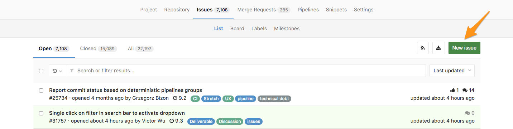

- From an **open issue** in your project, click the vertical ellipsis (**{ellipsis_v}**) button
  to open a dropdown menu, and then click **New Issue** to create a new issue in the same project:

  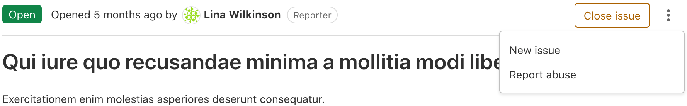

- From your **Project's Dashboard**, click the plus sign (**+**) to open a dropdown
  menu with a few options. Select **New Issue** to create an issue in that project:

  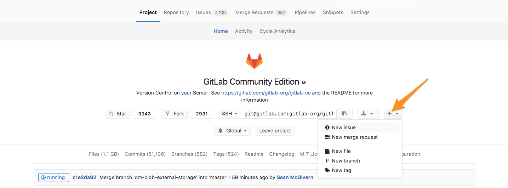

- From an **Issue Board**, create a new issue by clicking on the plus sign (**+**) at the top of a list.
  It opens a new issue for that project, pre-labeled with its respective list.

  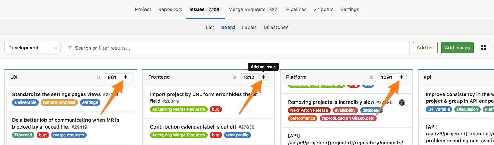

### Elements of the New Issue form

> Ability to add the new issue to an epic [was introduced](https://gitlab.com/gitlab-org/gitlab/-/issues/13847) in [GitLab Premium](https://about.gitlab.com/pricing/) 13.1.

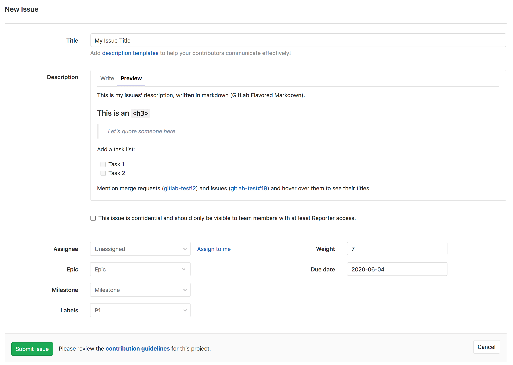

When you're creating a new issue, these are the fields you can fill in:

- Title
- Description
- Checkbox to make the issue confidential
- Assignee
- Weight
- [Epic](../../group/epics/index.md)
- Due date
- Milestone
- Labels

### New issue from the group-level issue tracker

To visit the issue tracker for all projects in your group:

1. Go to the group dashboard.
1. In the left sidebar, select **Issues**.
1. In the top-right, select the **Select project to create issue** button.
1. Select the project you'd like to create an issue for. The button now reflects the selected
   project.
1. Select the button to create an issue in the selected project.

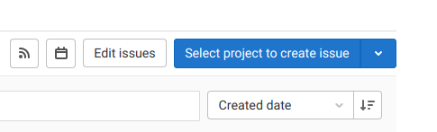

The project you selected most recently becomes the default for your next visit.
This should save you a lot of time and clicks, if you mostly create issues for the same project.

### New issue via Service Desk

Enable [Service Desk](../service_desk.md) for your project and offer email support.
Now, when your customer sends a new email, a new issue can be created in
the appropriate project and followed up from there.

### New issue via email

A link to **Email a new issue to this project** is displayed at the bottom of a project's
**Issues List** page. The link is shown only if your GitLab instance has [incoming email](../../../administration/incoming_email.md)
configured and there is at least one issue in the issue list.

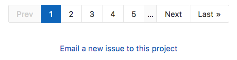

When you click this link, an email address is generated and displayed, which should be used
by **you only**, to create issues in this project. You can save this address as a
contact in your email client for quick access.

WARNING:
This is a private email address, generated just for you. **Keep it to yourself**,
as anyone who knows it can create issues or merge requests as if they
were you. If the address is compromised, or you want to regenerate it,
click **Email a new issue to this project**, followed by **reset it**.

Sending an email to this address creates a new issue associated with your account for
this project, where:

- The email subject becomes the issue title.
- The email body becomes the issue description.
- [Markdown](../../markdown.md) and [quick actions](../quick_actions.md) are supported.

NOTE:
In GitLab 11.7, we updated the format of the generated email address. However the
older format is still supported, allowing existing aliases or contacts to continue working.

### New issue via URL with prefilled fields

To link directly to the new issue page with prefilled fields, use query
string parameters in a URL. You can embed a URL in an external
HTML page to create issues with certain
fields prefilled.

| Field                | URL Parameter Name    | Notes                                                 |
|----------------------|-----------------------|-------------------------------------------------------|
| title                | `issue[title]`        |                                                       |
| description          | `issue[description]`  | Cannot be used at the same time as `issuable_template`. |
| description template | `issuable_template`   | Cannot be used at the same time as `issue[description]`.  |
| issue type           | `issue[issue_type]`   | Either `incident` or `issue`.                         |
| confidential         | `issue[confidential]` | Parameter value must be `true` to set to confidential. |

Follow these examples to form your new issue URL with prefilled fields.

- For a new issue in the GitLab Community Edition project with a pre-filled title
  and a pre-filled description, the URL would be `https://gitlab.com/gitlab-org/gitlab-foss/-/issues/new?issue[title]=Validate%20new%20concept&issue[description]=Research%20idea`
- For a new issue in the GitLab Community Edition project with a pre-filled title
  and a pre-filled description template, the URL would be `https://gitlab.com/gitlab-org/gitlab-foss/-/issues/new?issue[title]=Validate%20new%20concept&issuable_template=Research%20proposal`
- For a new issue in the GitLab Community Edition project with a pre-filled title,
  a pre-filled description, and the confidential flag set, the URL would be `https://gitlab.com/gitlab-org/gitlab-foss/-/issues/new?issue[title]=Validate%20new%20concept&issue[description]=Research%20idea&issue[confidential]=true`

## Bulk edit issues at the project level

> - Assigning epic ([introduced](https://gitlab.com/gitlab-org/gitlab/-/issues/210470) in GitLab 13.2.
> - Editing health status [introduced](https://gitlab.com/gitlab-org/gitlab/-/issues/218395) in GitLab 13.2.
> - Editing iteration [introduced](https://gitlab.com/gitlab-org/gitlab/-/issues/196806) in GitLab 13.9.

Users with permission level of [Reporter or higher](../../permissions.md) can manage issues.

When bulk editing issues in a project, you can edit the following attributes:

- Status (open/closed)
- Assignee
- [Epic](../../group/epics/index.md)
- [Milestone](../milestones/index.md)
- [Labels](../labels.md)
- [Health status](#health-status)
- Notification subscription
- [Iteration](../../group/iterations/index.md)

To update multiple project issues at the same time:

1. In a project, go to **Issues > List**.
1. Click **Edit issues**. A sidebar on the right-hand side of your screen appears with editable fields.
1. Select the checkboxes next to each issue you want to edit.
1. Select the appropriate fields and their values from the sidebar.
1. Click **Update all**.

## Bulk edit issues at the group level

> - [Introduced](https://gitlab.com/gitlab-org/gitlab/-/issues/7249) in GitLab 12.1.
> - Assigning epic ([introduced](https://gitlab.com/gitlab-org/gitlab/-/issues/210470) in GitLab 13.2.
> - Editing health status [introduced](https://gitlab.com/gitlab-org/gitlab/-/issues/218395) in GitLab 13.2.
> - Editing iteration [introduced](https://gitlab.com/gitlab-org/gitlab/-/issues/196806) in GitLab 13.9.

Users with permission level of [Reporter or higher](../../permissions.md) can manage issues.

When bulk editing issues in a group, you can edit the following attributes:

- [Epic](../../group/epics/index.md)
- [Milestone](../milestones/index.md)
- [Labels](../labels.md)
- [Health status](#health-status)
- [Iteration](../../group/iterations/index.md)

To update multiple project issues at the same time:

1. In a group, go to **Issues > List**.
1. Click **Edit issues**. A sidebar on the right-hand side of your screen appears with editable fields.
1. Select the checkboxes next to each issue you want to edit.
1. Select the appropriate fields and their values from the sidebar.
1. Click **Update all**.

## Moving issues

Moving an issue copies it to the target project, and closes it in the originating project.
The original issue is not deleted. A system note, which indicates
where it came from and went to, is added to both issues.

The "Move issue" button is at the bottom of the right-sidebar when viewing the issue.

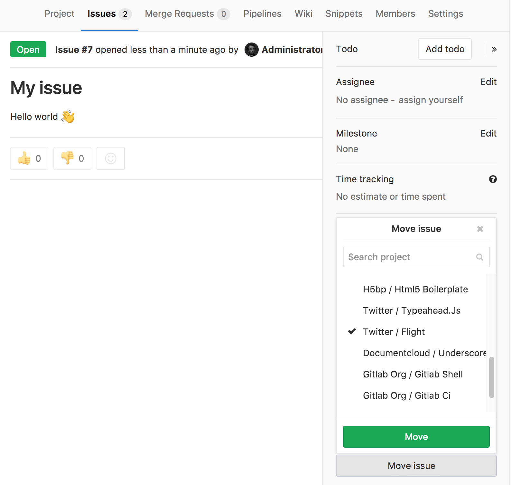

### Moving issues in bulk **(FREE SELF)**

If you have advanced technical skills you can also bulk move all the issues from
one project to another in the rails console. The below script moves all issues
that are not in status **closed** from one project to another.

To access rails console run `sudo gitlab-rails console` on the GitLab server and run the below
script. Please be sure to change `project`, `admin_user`, and `target_project` to your values.
We do also recommend [creating a backup](../../../raketasks/backup_restore.md#back-up-gitlab) before
attempting any changes in the console.

```ruby
project = Project.find_by_full_path('full path of the project where issues are moved from')
issues = project.issues
admin_user = User.find_by_username('username of admin user') # make sure user has permissions to move the issues
target_project = Project.find_by_full_path('full path of target project where issues moved to')

issues.each do |issue|
   if issue.state != "closed" && issue.moved_to.nil?
      Issues::MoveService.new(project, admin_user).execute(issue, target_project)
   else
      puts "issue with id: #{issue.id} and title: #{issue.title} was not moved"
   end
end; nil
```

## Closing issues

When you decide that an issue is resolved, or no longer needed, you can close the issue
using the close button:

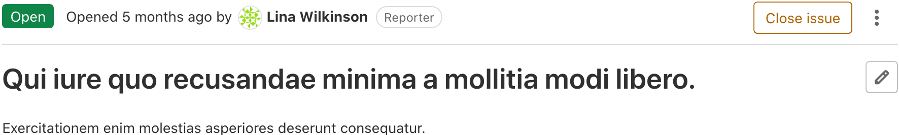

You can also close an issue from the [Issue Boards](../issue_board.md) by dragging an issue card
from its list and dropping it into the **Closed** list.

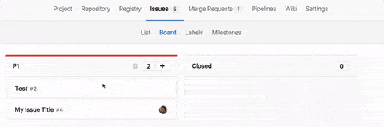

### Closing issues automatically

When a commit or merge request resolves issues, the issues
can be closed automatically when the commit reaches the project's default branch.

If a commit message or merge request description contains text matching a [defined pattern](#default-closing-pattern),
all issues referenced in the matched text are closed. This happens when the commit
is pushed to a project's [**default** branch](../repository/branches/default.md),
or when a commit or merge request is merged into it.

For example, if `Closes #4, #6, Related to #5` is included in a Merge Request
description, issues `#4` and `#6` are closed automatically when the MR is merged, but not `#5`.
Using `Related to` flags `#5` as a [related issue](related_issues.md),
but is not closed automatically.

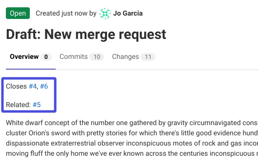

If the issue is in a different repository than the MR, add the full URL for the issue(s):

```markdown
Closes #4, #6, and https://gitlab.com/<username>/<projectname>/issues/<xxx>
```

For performance reasons, automatic issue closing is disabled for the very first
push from an existing repository.

#### Default closing pattern

When not specified, this default issue closing pattern is used:

```shell
\b((?:[Cc]los(?:e[sd]?|ing)|\b[Ff]ix(?:e[sd]|ing)?|\b[Rr]esolv(?:e[sd]?|ing)|\b[Ii]mplement(?:s|ed|ing)?)(:?) +(?:(?:issues? +)?%{issue_ref}(?:(?: *,? +and +| *,? *)?)|([A-Z][A-Z0-9_]+-\d+))+)
```

This translates to the following keywords:

- Close, Closes, Closed, Closing, close, closes, closed, closing
- Fix, Fixes, Fixed, Fixing, fix, fixes, fixed, fixing
- Resolve, Resolves, Resolved, Resolving, resolve, resolves, resolved, resolving
- Implement, Implements, Implemented, Implementing, implement, implements, implemented, implementing

Note that `%{issue_ref}` is a complex regular expression defined inside the GitLab
source code that can match references to:

- A local issue (`#123`).
- A cross-project issue (`group/project#123`).
- A link to an issue (`https://gitlab.example.com/group/project/issues/123`).

For example the following commit message:

```plaintext
Awesome commit message

Fix #20, Fixes #21 and Closes group/otherproject#22.
This commit is also related to #17 and fixes #18, #19
and https://gitlab.example.com/group/otherproject/issues/23.
```

closes `#18`, `#19`, `#20`, and `#21` in the project this commit is pushed to,
as well as `#22` and `#23` in `group/otherproject`. `#17` is not closed as it does
not match the pattern. It works with multi-line commit messages as well as one-liners
when used from the command line with `git commit -m`.

#### Disabling automatic issue closing

> [Introduced](https://gitlab.com/gitlab-org/gitlab/-/issues/19754) in GitLab 12.7.

The automatic issue closing feature can be disabled on a per-project basis
in the [project's repository settings](../settings/index.md). Referenced
issues are still displayed, but are not closed automatically.

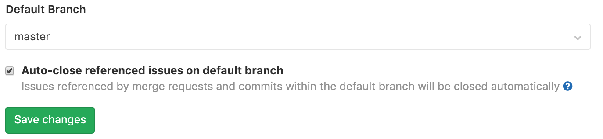

The automatic issue closing is also disabled in a project if the project has the issue tracker
disabled. If you want to enable automatic issue closing, make sure to
[enable GitLab Issues](../settings/index.md#sharing-and-permissions).

This only applies to issues affected by new merge requests or commits. Already
closed issues remain as-is.
If issue tracking is enabled, disabling automatic issue closing only applies to merge requests
attempting to automatically close issues within the same project.
Merge requests in other projects can still close another project's issues.

#### Customizing the issue closing pattern **(FREE SELF)**

In order to change the default issue closing pattern, GitLab administrators must edit the
[`gitlab.rb` or `gitlab.yml` file](../../../administration/issue_closing_pattern.md)
of your installation.

## Change the issue type

Users with the [Developer role](../../permissions.md)
can change an issue's type. To do this, edit the issue and select an issue type from the
**Issue type** selector menu:

- [Issue](index.md)
- [Incident](../../../operations/incident_management/index.md)

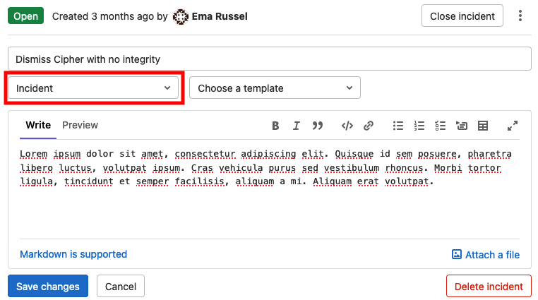

## Deleting issues

Users with the [Owner role](../../permissions.md) can delete an issue by
editing it and selecting **Delete issue**.

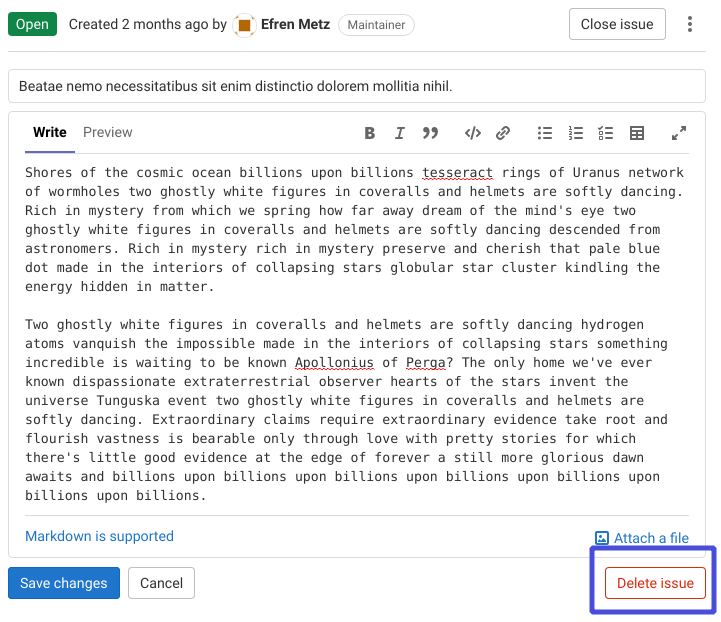

## Promote an issue to an epic **(PREMIUM)**

> - [Introduced](https://gitlab.com/gitlab-org/gitlab/-/issues/3777) in GitLab Ultimate 11.6.
> - Moved to GitLab Premium in 12.8.
> - Promoting issues to epics via the UI [introduced](https://gitlab.com/gitlab-org/gitlab/-/issues/233974) in GitLab Premium 13.6.

You can promote an issue to an epic in the immediate parent group.

To promote an issue to an epic:

1. In an issue, select the vertical ellipsis (**{ellipsis_v}**) button.
1. Select **Promote to epic**.

Alternatively, you can use the `/promote` [quick action](../quick_actions.md#issues-merge-requests-and-epics).

Read more about promoting an issue to an epic on the [Manage epics page](../../group/epics/manage_epics.md#promote-an-issue-to-an-epic).

## Add an issue to an iteration **(PREMIUM)**

> - [Introduced](https://gitlab.com/gitlab-org/gitlab/-/issues/216158) in GitLab 13.2.
> - Moved to GitLab Premium in 13.9.

To add an issue to an [iteration](../../group/iterations/index.md):

1. In an issue sidebar, click **Edit** next to **Iteration**. A dropdown appears.
1. Click an iteration you'd like to associate this issue with.

You can also use the `/iteration`
[quick action](../quick_actions.md#issues-merge-requests-and-epics)
in a comment or description field.

## Real-time sidebar **(FREE SELF)**

> [Introduced](https://gitlab.com/gitlab-org/gitlab/-/issues/17589) in GitLab 13.3.

Assignees in the sidebar are updated in real time. This feature is **disabled by default**.
To enable it, you need to enable [Action Cable in-app mode](https://docs.gitlab.com/omnibus/settings/actioncable.html).

## Similar issues

> [Introduced](https://gitlab.com/gitlab-org/gitlab-foss/-/merge_requests/22866) in GitLab 11.6.

To prevent duplication of issues for the same topic, GitLab searches for similar issues
when new issues are being created.

As you type in the title field of the **New Issue** page, GitLab searches titles and descriptions
across all issues to in the current project. Only issues you have access to are returned.
Up to five similar issues, sorted by most recently updated, are displayed below the title box.
[GraphQL](../../../api/graphql/index.md) must be enabled to use this feature.

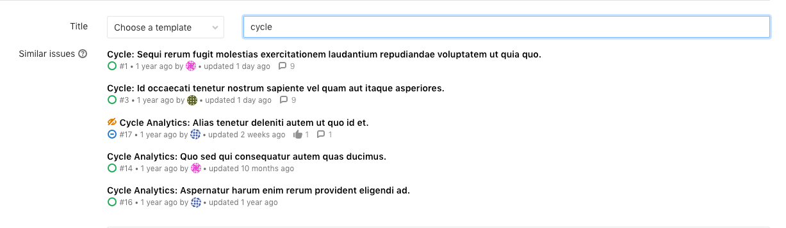

## Health status **(ULTIMATE)**

> - [Introduced](https://gitlab.com/gitlab-org/gitlab/-/issues/36427) in GitLab Ultimate 12.10.
> - Health status of closed issues [can't be edited](https://gitlab.com/gitlab-org/gitlab/-/issues/220867) in GitLab Ultimate 13.4 and later.
> - Issue health status visible in issue lists [introduced](https://gitlab.com/gitlab-org/gitlab/-/merge_requests/45141) in GitLab Ultimate 13.6.
> - [Feature flag removed](https://gitlab.com/gitlab-org/gitlab/-/issues/213567) in GitLab 13.7.

To help you track issue statuses, you can assign a status to each issue.
This marks issues as progressing as planned or needs attention to keep on schedule:

- On track (green)
- Needs attention (amber)
- At risk (red)

After an issue is closed, its health status can't be edited and the **Edit** button becomes disabled
until the issue is reopened.

You can then see issue statuses in the issues list and the epic tree.
