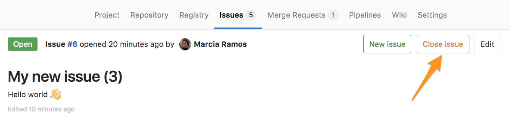
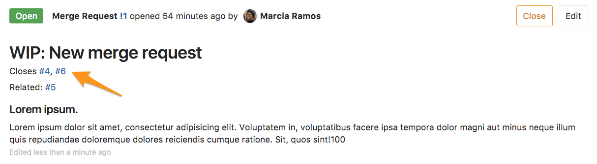
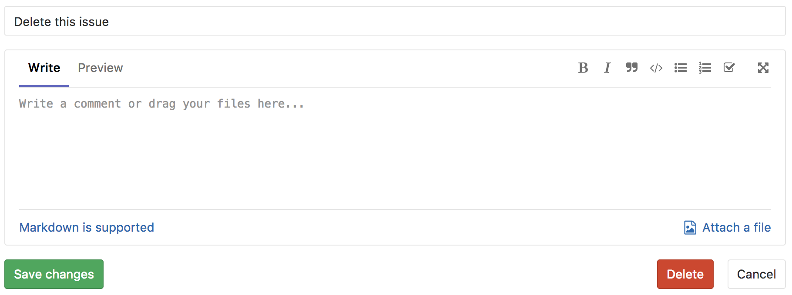

# Managing Issues

[GitLab Issues](index.md) are the fundamental medium for collaborating on ideas and
planning work in GitLab. [Creating](#create-a-new-issue), [moving](#moving-issues),
[closing](#closing-issues), and [deleting](#deleting-issues) are key actions that
you can do with issues.

## Create a new Issue

When you create a new issue, you'll be prompted to fill in the [data and fields of the issue](issue_data_and_actions.md#parts-of-an-issue), as illustrated below. If you know
the values you want to assign to an issue, you can use the [Quick actions](../quick_actions.md)
feature to input values, instead of selecting them from lists.


### Accessing the new Issue form

There are many ways to get to the new Issue form from within a project:

- Navigate to your **Project's Dashboard** > **Issues** > **New Issue**:

  

- From an **opened issue** in your project, click **New Issue** to create a new
  issue in the same project:

  

- From your **Project's Dashboard**, click the plus sign (**+**) to open a dropdown
  menu with a few options. Select **New Issue** to create an issue in that project:

  

- From an **Issue Board**, create a new issue by clicking on the plus sign (**+**) at the top of a list.
  It opens a new issue for that project, pre-labeled with its respective list.

  

### New issue from the group-level Issue Tracker

Go to the Group dashboard and click "Issues" in the sidebar to visit the Issue Tracker
for all projects in your Group. Select the project you'd like to add an issue for
using the dropdown button at the top-right of the page.


We'll keep track of the project you selected most recently, and use it as the default
for your next visit. This should save you a lot of time and clicks, if you mostly
create issues for the same project.


### New issue via Service Desk **(PREMIUM)**

Enable [Service Desk](../service_desk.md) for your project and offer email support.
By doing so, when your customer sends a new email, a new issue can be created in
the appropriate project and followed up from there.

### New issue via email

A link to **Email a new issue to this project** is displayed at the bottom of a project's
**Issues List** page, if your GitLab instance has [incoming email](../../../administration/incoming_email.md)
configured.


When you click this link, an email address is generated and displayed, which should be used
by **you only**, to create issues in this project. You can save this address as a
contact in your email client for easy access.

CAUTION: **Caution:**
This is a private email address, generated just for you. **Keep it to yourself**,
as anyone who knows it can create issues or merge requests as if they
were you. If the address is compromised, or you'd like it to be regenerated for
any reason, click **Email a new issue to this project** again and click the reset link.

Sending an email to this address will create a new issue in your name for
this project, where:

- The email subject becomes the issue title.
- The email body becomes the issue description.
- [Markdown](../../markdown.md) and [quick actions](../quick_actions.md) are supported.

NOTE: **Note:**
In GitLab 11.7, we updated the format of the generated email address. However the
older format is still supported, allowing existing aliases or contacts to continue working.

### New issue via URL with prefilled fields

You can link directly to the new issue page for a given project, with prefilled
field values using query string parameters in a URL. This is useful for embedding
a URL in an external HTML page, and also certain scenarios where you want the user to
create an issue with certain fields prefilled.

The title, description, and description template fields can be prefilled using
this method. You cannot pre-fill both the description and description template fields
in the same URL (since a description template also populates the description field).

Follow these examples to form your new issue URL with prefilled fields.

- For a new issue in the GitLab Community Edition project with a pre-filled title
  and a pre-filled description, the URL would be `https://gitlab.com/gitlab-org/gitlab-foss/issues/new?issue[title]=Validate%20new%20concept&issue[description]=Research%20idea`
- For a new issue in the GitLab Community Edition project with a pre-filled title
  and a pre-filled description template, the URL would be `https://gitlab.com/gitlab-org/gitlab-foss/issues/new?issue[title]=Validate%20new%20concept&issuable_template=Research%20proposal`

## Moving Issues

Moving an issue will copy it to a new location (project), and close it in the old project,
but it will not be deleted. There will also be a system note added to both issues
indicating where it came from and went to.

The "Move issue" button is at the bottom of the right-sidebar when viewing the issue.


### Moving Issues in Bulk

If you have advanced technical skills you can also bulk move all the issues from one project to another in the rails console. The below script will move all the issues from one project to another that are not in status **closed**.

To access rails console run `sudo gitlab-rails console` on the GitLab server and run the below script. Please be sure to change **project**, **admin_user** and **target_project** to your values. We do also recommend [creating a backup](../../../raketasks/backup_restore.md#creating-a-backup-of-the-gitlab-system) before attempting any changes in the console.

```ruby
project = Project.find_by_full_path('full path of the project where issues are moved from')
issues = project.issues
admin_user = User.find_by_username('username of admin user') # make sure user has permissions to move the issues
target_project = Project.find_by_full_path('full path of target project where issues moved to')

issues.each do |issue|
   if issue.state != "closed" && issue.moved_to.nil?
      Issues::MoveService.new(project, admin_user).execute(issue, target_project)
   else
      puts "issue with id: #{issue.id} and title: #{issue.title} was not moved"
   end
end; nil
```

## Closing Issues

When you decide that an issue is resolved, or no longer needed, you can close the issue
using the close button:



You can also close an issue from the [Issue Boards](../issue_board.md) by dragging an issue card
from its list and dropping it into the **Closed** list.


### Closing issues automatically

NOTE: **Note:**
For performance reasons, automatic issue closing is disabled for the very first
push from an existing repository.

When a commit or merge request resolves one or more issues, it is possible to have
these issues closed automatically when the commit or merge request reaches the project's
default branch.

If a commit message or merge request description contains text matching a [defined pattern](#default-closing-pattern),
all issues referenced in the matched text will be closed. This happens when the commit
is pushed to a project's [**default** branch](../repository/branches/index.md#default-branch),
or when a commit or merge request is merged into it.

For example, if `Closes #4, #6, Related to #5` is included in a Merge Request
description, issues `#4` and `#6` will close automatically when the MR is merged, but not `#5`.
Using `Related to` flags `#5` as a [related issue](related_issues.md),
but it will not close automatically.



If the issue is in a different repository than the MR, add the full URL for the issue(s):

```md
Closes #4, #6, and https://gitlab.com/<username>/<projectname>/issues/<xxx>
```

#### Default closing pattern

When not specified, the default issue closing pattern as shown below will be used:

```bash
((?:[Cc]los(?:e[sd]?|ing)|[Ff]ix(?:e[sd]|ing)?|[Rr]esolv(?:e[sd]?|ing)|[Ii]mplement(?:s|ed|ing)?)(:?) +(?:(?:issues? +)?%{issue_ref}(?:(?:, *| +and +)?)|([A-Z][A-Z0-9_]+-\d+))+)
```

This translates to the following keywords:

- Close, Closes, Closed, Closing, close, closes, closed, closing
- Fix, Fixes, Fixed, Fixing, fix, fixes, fixed, fixing
- Resolve, Resolves, Resolved, Resolving, resolve, resolves, resolved, resolving
- Implement, Implements, Implemented, Implementing, implement, implements, implemented, implementing

Note that `%{issue_ref}` is a complex regular expression defined inside GitLab's
source code that can match references to:

- A local issue (`#123`).
- A cross-project issue (`group/project#123`).
- A link to an issue (`https://gitlab.example.com/group/project/issues/123`).

For example the following commit message:

```
Awesome commit message

Fix #20, Fixes #21 and Closes group/otherproject#22.
This commit is also related to #17 and fixes #18, #19
and https://gitlab.example.com/group/otherproject/issues/23.
```

will close `#18`, `#19`, `#20`, and `#21` in the project this commit is pushed to,
as well as `#22` and `#23` in `group/otherproject`. `#17` won't be closed as it does
not match the pattern. It works with multi-line commit messages as well as one-liners
when used from the command line with `git commit -m`.

#### Disabling automatic issue closing

The automatic issue closing feature can be disabled on a per-project basis
within the [project's repository settings](../settings/index.md). Referenced
issues will still be displayed as such but won't be closed automatically.


This only applies to issues affected by new merge requests or commits. Already
closed issues remain as-is. Disabling automatic issue closing only affects merge
requests *within* the project and won't prevent other projects from closing it
via cross-project issues.

#### Customizing the issue closing pattern **(CORE ONLY)**

In order to change the default issue closing pattern, GitLab administrators must edit the
[`gitlab.rb` or `gitlab.yml` file](../../../administration/issue_closing_pattern.md)
of your installation.

## Deleting Issues

> [Introduced](https://gitlab.com/gitlab-org/gitlab-foss/merge_requests/2982) in GitLab 8.6

Users with [project owner permission](../../permissions.md) can delete an issue by
editing it and clicking on the delete button.


