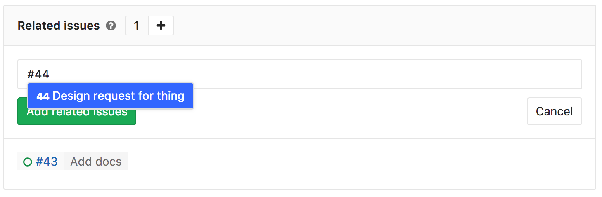
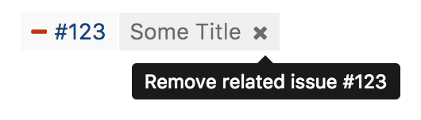

# Related issues **[STARTER]**

> [Introduced][ee-1797] in [GitLab Starter][ee] 9.4.

Related issues are a bi-directional relationship between any two issues
and appear in a block below the issue description. Issues can be across groups
and projects.

The relationship only shows up in the UI if the user can see both issues.

## Adding a related issue

You can relate one issue to another by clicking the related issues "+" button
in the header of the related issue block. Then input the issue reference number
or paste in a link to the issue.

Valid references will be added to a temporary list that you can review.
When ready, click the green "Add related issues" button to submit.

## Removing a related issue

In the related issues block, click the "x" icon on the right-side of each issue
token that you wish to remove. Due to the bi-directional relationship, it
will no longer appear in either issue.

Please access our [permissions] page for more information.

Additionally, you are also able to manage related issues through [our API].

[ee]: https://about.gitlab.com/products/
[ee-1797]: https://gitlab.com/gitlab-org/gitlab-ee/merge_requests/1797
[permissions]: ../../permissions.md
[Our API]: ../../../api/issue_links.md
