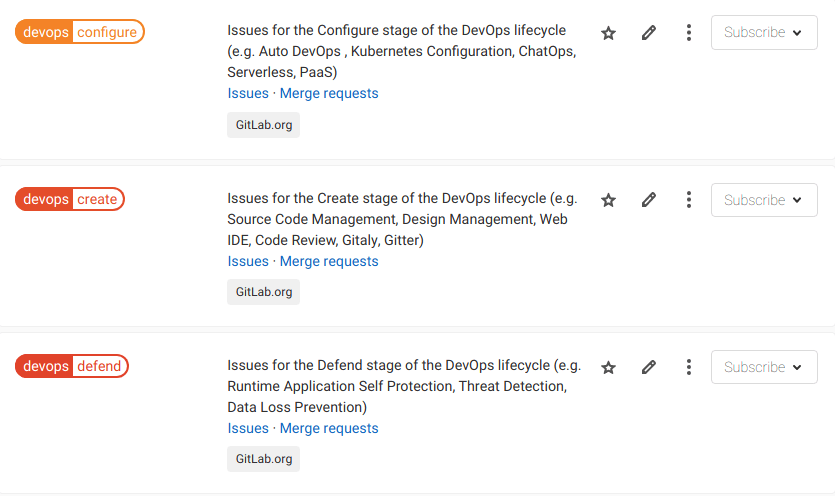
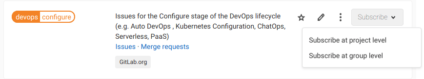
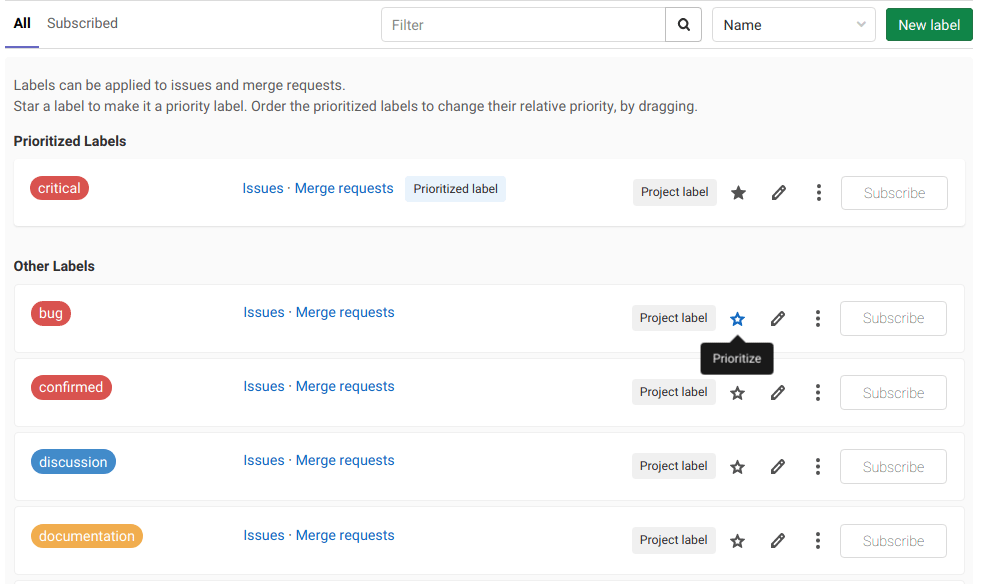
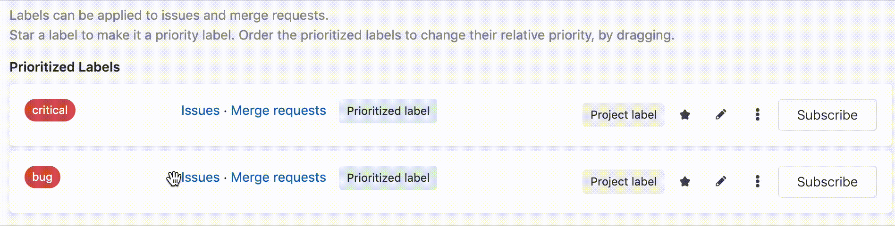
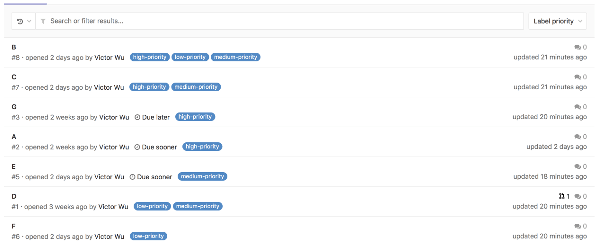
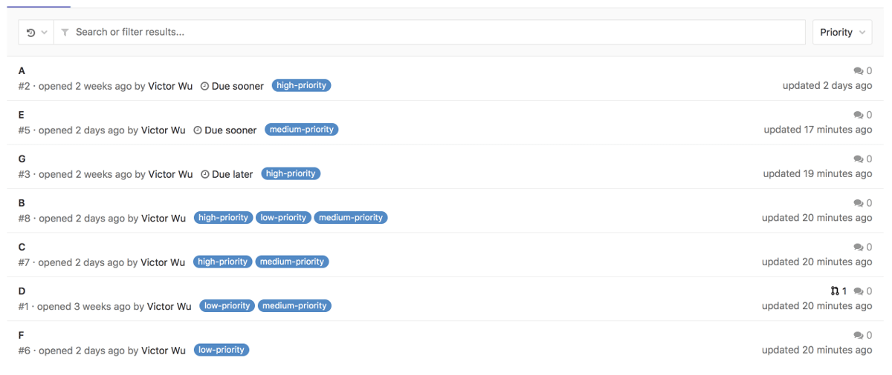

# Labels **(FREE)**

As your count of issues, merge requests, and epics grows in GitLab, it's more and more challenging
to keep track of those items. Especially as your organization grows from just a few people to
hundreds or thousands. This is where labels come in. They help you organize and tag your work
so you can track and find the work items you're interested in.

Labels are a key part of [issue boards](issue_board.md). With labels you can:

- Categorize epics, issues, and merge requests using colors and descriptive titles like
`bug`, `feature request`, or `docs`.
- Dynamically filter and manage epics, issues, and merge requests.
- [Search lists of issues, merge requests, and epics](../search/index.md#issues-and-merge-requests),
  as well as [issue boards](../search/index.md#issue-boards).

## Project labels and group labels

There are two types of labels in GitLab:

- **Project labels** can be assigned to issues and merge requests in that project only.
- **Group labels** can be assigned to issues and merge requests in any project in
  the selected group or its subgroups.
  - They can also be assigned to epics in the selected group or its subgroups.**(ULTIMATE)**

## Assign and unassign labels

> Unassigning labels with the **X** button [introduced](https://gitlab.com/gitlab-org/gitlab/-/issues/216881) in GitLab 13.5.

Every issue, merge request, and epic can be assigned any number of labels. The labels are
managed in the right sidebar, where you can assign or unassign labels as needed.

To assign or unassign a label:

1. In the **Labels** section of the sidebar, click **Edit**.
1. In the **Assign labels** list, search for labels by typing their names.
   You can search repeatedly to add more labels.
   The selected labels are marked with a checkmark.
1. Click the labels you want to assign or unassign.
1. To apply your changes to labels, click **X** next to **Assign labels** or anywhere outside the
   label section.

Alternatively, to unassign a label, click the **X** on the label you want to unassign.

You can also assign a label with the `/label` [quick action](quick_actions.md),
remove labels with `/unlabel`, and reassign labels (remove all and assign new ones) with `/relabel`.

## Label management

Users with a [permission level](../permissions.md) of Reporter or higher are able to create
and edit labels.

### Project labels

> Showing all inherited labels [introduced](https://gitlab.com/gitlab-org/gitlab/-/issues/241990) in GitLab 13.5.

To view a project's available labels, in the project, go to **Project information > Labels**.
Its list of labels includes both the labels defined at the project level, and
all labels defined by its ancestor groups. For each label, you can see the
project or group path from where it was created. You can filter the list by
entering a search query in the **Filter** field, and then clicking its search
icon (**{search}**).

To create a new project label:

1. In your project, go to **Project information > Labels**.
1. Select the **New label** button.
1. In the **Title** field, enter a short, descriptive name for the label. You
   can also use this field to create [scoped, mutually exclusive labels](#scoped-labels).
1. (Optional) In the **Description** field, you can enter additional
   information about how and when to use this label.
1. (Optional) Select a background color for the label by selecting one of the
   available colors, or by entering a hex color value in the **Background color**
   field.
1. Select **Create label**.

You can also create a new project label from within an issue or merge request. In the
label section of the right sidebar of an issue or a merge request:

1. Click **Edit**.
1. Click **Create project label**.
   - Fill in the name field. Note that you can't specify a description if creating a label
     this way. You can add a description later by editing the label (see below).
   - (Optional) Select a color by clicking on the available colors, or input a hex
     color value for a specific color.
1. Click **Create**.

Once created, you can edit a label by clicking the pencil (**{pencil}**), or delete
a label by clicking the three dots (**{ellipsis_v}**) next to the **Subscribe** button
and selecting **Delete**.

WARNING:
If you delete a label, it is permanently deleted. All references to the label are removed from the system and you cannot undo the deletion.

#### Promote a project label to a group label

> [Introduced](https://gitlab.com/gitlab-org/gitlab/-/issues/231472) in GitLab 13.6: promoting a project label keeps that label's ID and changes it into a group label. Previously, promoting a project label created a new group label with a new ID and deleted the old label.

If you previously created a project label and now want to make it available for other
projects within the same group, you can promote it to a group label.

If other projects in the same group have a label with the same title, they are all
merged with the new group label. If a group label with the same title exists, it is
also merged.

All issues, merge requests, issue board lists, issue board filters, and label subscriptions
with the old labels are assigned to the new group label.

The new group label has the same ID as the previous project label.

WARNING:
Promoting a label is a permanent action, and cannot be reversed.

To promote a project label to a group label:

1. Navigate to **Project information > Labels** in the project.
1. Click on the three dots (**{ellipsis_v}**) next to the **Subscribe** button and
   select **Promote to group label**.

### Group labels

To view the group labels list, navigate to the group and click **Group information > Labels**.
The list includes all labels that are defined at the group level only. It does not
list any labels that are defined in projects. You can filter the list by entering
a search query at the top and clicking search (**{search}**).

To create a **group label**, navigate to **Group information > Labels** in the group and
follow the same process as [creating a project label](#project-labels).

#### Create group labels from epics **(ULTIMATE)**

You can create group labels from the epic sidebar. The labels you create
belong to the immediate group to which the epic belongs. The process is the same as
creating a [project label from an issue or merge request](#project-labels).

### Generate default labels

If a project or group has no labels, you can generate a default set of project or group
labels from the label list page. The page shows a **Generate a default set of labels**
button if the list is empty. Select the button to add the following default labels
to the project:

- `bug`
- `confirmed`
- `critical`
- `discussion`
- `documentation`
- `enhancement`
- `suggestion`
- `support`

## Scoped labels **(PREMIUM)**

> [Introduced](https://gitlab.com/gitlab-org/gitlab/-/issues/9175) in [GitLab Premium](https://about.gitlab.com/pricing/) 11.10.

Scoped labels allow teams to use the label feature to annotate issues, merge requests
and epics with mutually exclusive labels. This can enable more complicated workflows
by preventing certain labels from being used together.

A label is scoped when it uses a special double-colon (`::`) syntax in the label's
title, for example:

An issue, merge request or epic cannot have two scoped labels, of the form `key::value`,
with the same `key`. Adding a new label with the same `key`, but a different `value`
causes the previous `key` label to be replaced with the new label.

For example:

1. An issue is identified as being low priority, and a `priority::low` project
   label is added to it.
1. After more review the issue priority is increased, and a `priority::high` label is
   added.
1. GitLab automatically removes the `priority::low` label, as an issue should not
   have two priority labels at the same time.

### Workflows with scoped labels

Suppose you wanted a custom field in issues to track the operating system platform
that your features target, where each issue should only target one platform. You
would then create three labels `platform::iOS`, `platform::Android`, `platform::Linux`.
Applying any one of these labels on a given issue would automatically remove any other
existing label that starts with `platform::`.

The same pattern could be applied to represent the workflow states of your teams.
Suppose you have the labels `workflow::development`, `workflow::review`, and
`workflow::deployed`. If an issue already has the label `workflow::development`
applied, and a developer wanted to advance the issue to `workflow::review`, they
would simply apply that label, and the `workflow::development` label would
automatically be removed. This behavior already exists when you move issues
across label lists in an [issue board](issue_board.md#create-workflows), but
now, team members who may not be working in an issue board directly would still
be able to advance workflow states consistently in issues themselves.

This functionality is demonstrated in a video regarding
[using scoped labels for custom fields and workflows](https://www.youtube.com/watch?v=4BCBby6du3c).

### Scoped labels with nested scopes

You can create a label with a nested scope by using multiple double colons `::` when creating
it. In this case, everything before the last `::` is the scope.

For example, `workflow::backend::review` and `workflow::backend::development` are valid
scoped labels, but they **can't** exist on the same issue at the same time, as they
both share the same scope, `workflow::backend`.

Additionally, `workflow::backend::review` and `workflow::frontend::review` are valid
scoped labels, and they **can** exist on the same issue at the same time, as they
both have different scopes, `workflow::frontend` and `workflow::backend`.

## Subscribing to labels

From the project label list page and the group label list page, you can click **Subscribe**
to the right of any label to enable [notifications](../profile/notifications.md) for that
label. You are notified whenever the label is assigned to an epic,
issue, or merge request.

If you are subscribing to a group label from within a project, you can select to subscribe
to label notifications for the project only, or the whole group.

## Label priority

> - [Introduced](https://gitlab.com/gitlab-org/gitlab-foss/-/issues/14189) in GitLab 8.9.
> - Priority sorting is based on the highest priority label only. [This discussion](https://gitlab.com/gitlab-org/gitlab/-/issues/14523) considers changing this.

Labels can have relative priorities, which are used in the **Label priority** and
**Priority** sort orders of issues and merge request list pages. Prioritization
for both group and project labels happens at the project level, and cannot be done
from the group label list.

From the project label list page, star a label to indicate that it has a priority.

Drag starred labels up and down the list to change their priority, where higher in the list
means higher priority.

On the merge request and issue list pages (for both groups and projects) you
can sort by `Label priority` or `Priority`.

If you sort by `Label priority`, GitLab uses this sort comparison order:

1. Items with a higher priority label.
1. Items without a prioritized label.

Ties are broken arbitrarily. Note that only the highest prioritized label is checked,
and labels with a lower priority are ignored. See this [related issue](https://gitlab.com/gitlab-org/gitlab/-/issues/14523)
for more information.

If you sort by `Priority`, GitLab uses this sort comparison order:

1. Items with milestones that have due dates, where the soonest assigned [milestone](milestones/index.md)
   is listed first.
1. Items with milestones with no due dates.
1. Items with a higher priority label.
1. Items without a prioritized label.

Ties are broken arbitrarily.

## Troubleshooting

### Some label titles end with `_duplicate<number>`

In specific circumstances it was possible to create labels with duplicate titles in the same
namespace.

To resolve the duplication, [in GitLab 13.2](https://gitlab.com/gitlab-org/gitlab/-/merge_requests/21384)
and later, some duplicate labels have `_duplicate<number>` appended to their titles.

You can safely change these labels' titles if you prefer.
For details of the original problem, see [issue 30390](https://gitlab.com/gitlab-org/gitlab/-/issues/30390).
