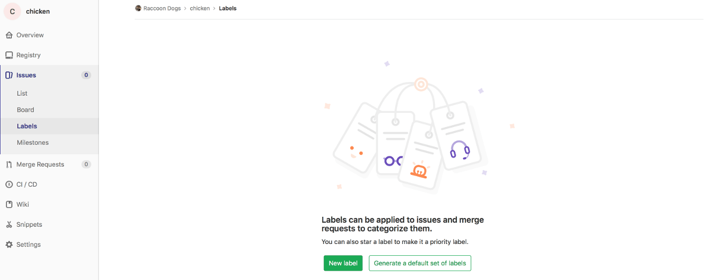
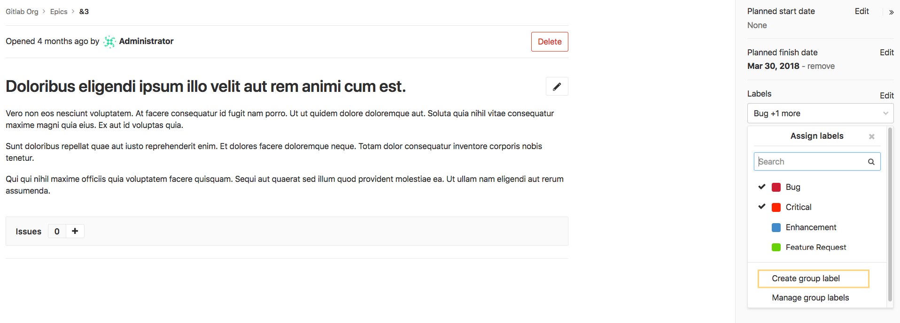
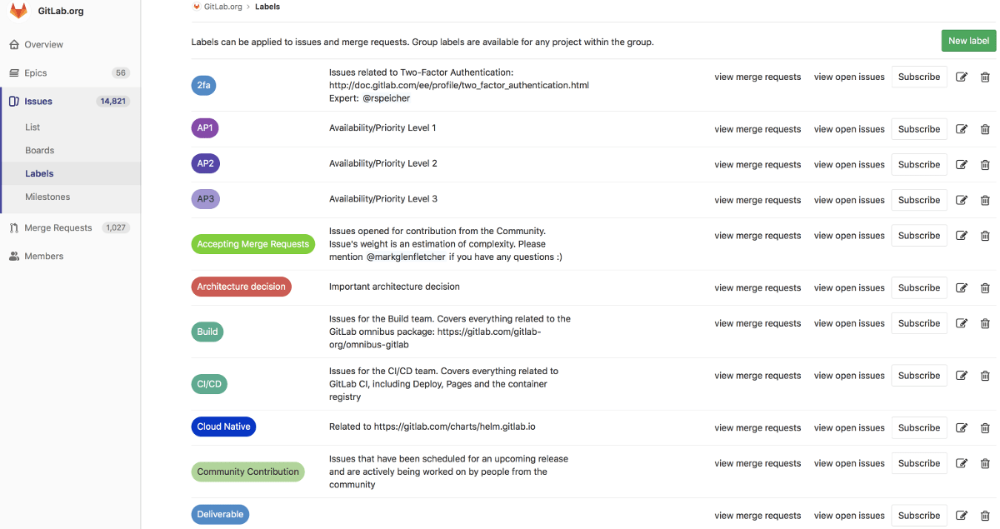
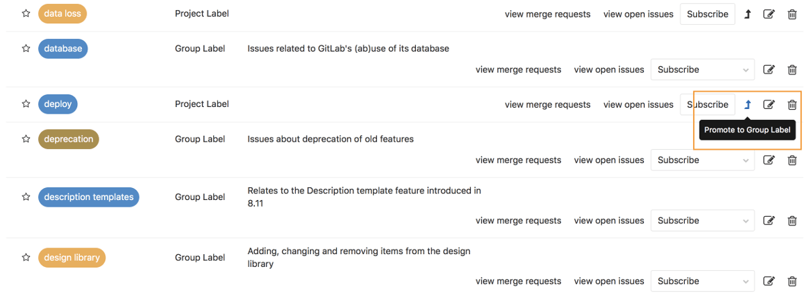
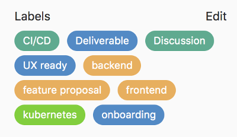
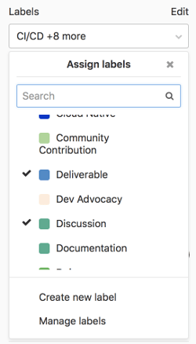
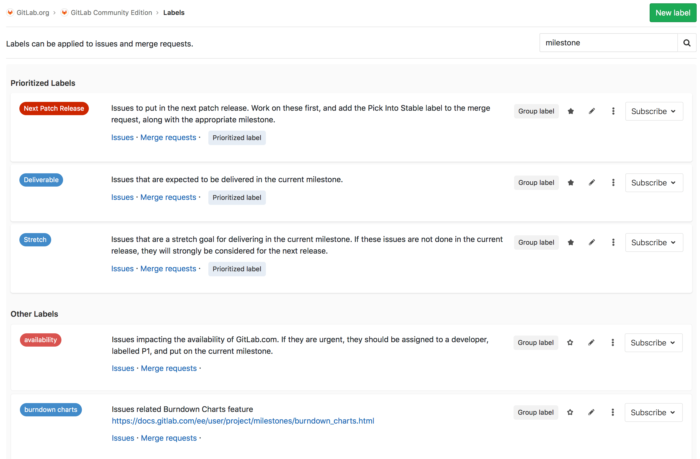
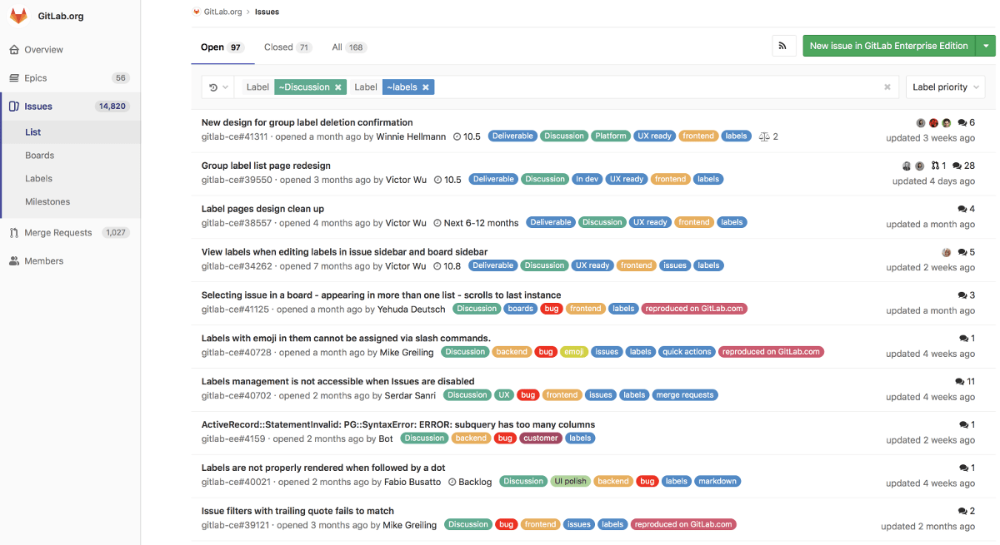
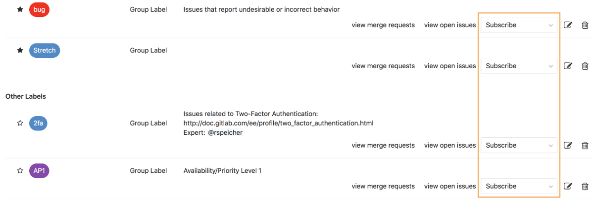
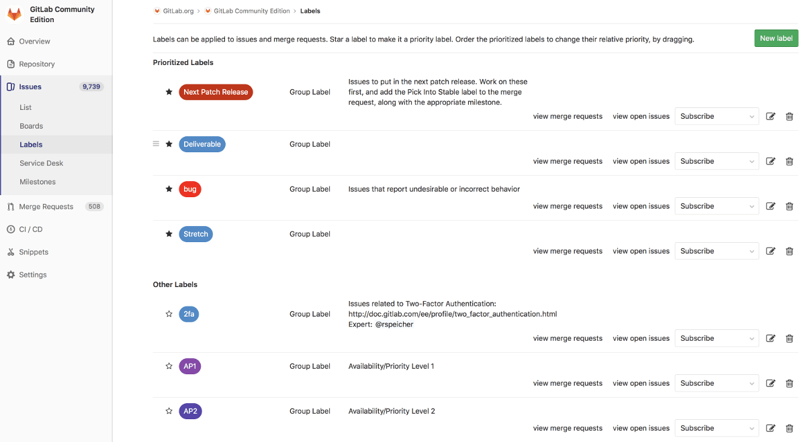

# Labels

## Overview

Labels allow you to categorize issues or merge requests using descriptive titles like `bug`, `feature request`, or `docs`. Each label also has a customizable color. They allow you to quickly and dynamically filter and manage issues or merge requests you care about, and are visible throughout GitLab in most places where issues and merge requests are located.

## Project labels and group labels

In GitLab, you can create project and group labels:

- **Project labels** can be assigned to issues or merge requests in that project only.
- **Group labels** can be assigned to any issue or merge request of any project in that group or any subgroups of the group.

## Scoped labels **[PREMIUM]**

> [Introduced](https://gitlab.com/gitlab-org/gitlab-ee/issues/9175) in [GitLab Premium](https://about.gitlab.com/pricing/) 11.10.

Scoped labels allow teams to use the simple and familiar feature of labels to
annotate their issues, merge requests, and epics to achieve custom fields and
custom workflow states by leveraging a special label title syntax.

A scoped label is a kind of label defined only by a special double-colon syntax
in the label’s title, using the format `key::value`. For example:

Two scoped labels with the same key but a different value cannot simultaneously
apply to an issue, epic, or merge request. For example, if an issue already has `priority::3`
and you apply `priority::2` to it, `priority::3` is automatically removed from the issue.

An issue, epic, or merge request cannot have two scoped labels with the same key.
For example, if an issue is already labeled `priority::3` and you apply the label `priority::2` to it,
`priority::3` is automatically removed.

### Labels with multiple colon pairs

If labels have multiple instances of `::`, the longest path from left to right, until the last `::`, is considered the "key" or the "scope".

For example, `nested::key1::value1` and `nested::key1::value2` cannot both exist on the same issue. Adding the latter label will automatically remove the former due to the shared scope of `nested::key1`.

`nested::key1::value1` and `nested::key2::value1` can both exist on the same issue, as these are considered to use two different label scopes, `nested::key1` and `nested::key2`.

### Workflows with scoped labels **[PREMIUM]**

Suppose you wanted a custom field in issues to track the platform operating system
that your features target, where each issue should only target one platform. You
would then create labels `platform::iOS`, `platform::Android`, `platform::Linux`,
etc., as necessary. Applying any one of these labels on a given issue would
automatically remove any other existing label that starts with `platform::`.

The same pattern could be applied to represent the workflow states of your teams.
Suppose you have the labels `workflow::development`, `workflow::review`, and
`workflow::deployed`. If an issue already has the label `workflow::development`
applied, and a developer wanted to advance the issue to `workflow::review`, they
would simply apply that label, and the `workflow::development` label would
automatically be removed. This behavior already exists when you move issues
across label lists in an [issue board](issue_board.md#creating-workflows), but
now, team members who may not be working in an issue board directly would still
be able to advance workflow states consistently in issues themselves.

## Creating labels

>**Note:**
A permission level of Reporter or higher is required to create labels.

### New project label

To create a **project label**, navigate to **Issues > Labels** in the project.
This page only shows project labels in this project and group labels of this project's parent group.

Click the **New label** button. Enter the title, an optional description, and the background color. Click **Create label** to create the label.

If a project has no labels, you can generate a default set of project labels from its empty label list page:

GitLab will add the following default labels to the project:

### New group label

To create a **group label**, follow similar steps from above to project labels. Navigate to **Issues > Labels** in the group and create it from there.
This page only shows group labels in this group.
Alternatively, you can create group labels also from Epic sidebar. Please note that the created label will belong to the immediate group to which epic belongs.

Group labels appear in every label list page of the group's child projects.

### New project label from sidebar

From the sidebar of an issue or a merge request, you can create a new **project label** inline immediately, instead of navigating to the project label list page.

## Editing labels

NOTE: **Note:**
A permission level of Reporter or higher is required to edit labels.

You can update a label by navigating to **Issues > Labels** in the project or group and clicking the pencil icon.

You can delete a label by clicking the trash icon.

### Promoting project labels to group labels

If you are expanding from a few projects to a larger number of projects within the same group, you may want to share the same label among multiple projects in the same group. If you previously created a project label and now want to make it available for other projects, you can promote it to a group label.

From the project label list page, you can promote a project label to a group label. This will merge all project labels across all projects in this group with the same name into a single group label. All issues and merge requests that previously were assigned one of these project labels will now be assigned the new group label. This action cannot be reversed and the changes are permanent.

## Assigning labels from the sidebar

Every issue and merge request can be assigned any number of labels. The labels are visible on every issue and merge request page, in the sidebar. They are also visible in the issue board. From the sidebar, you can assign or unassign a label to the object (i.e. label or unlabel it). You can also perform this as a [quick action](quick_actions.md) in a comment.

| View labels in sidebar | Assign labels from sidebar |
|:---:|:---:|
|  |  |

## Searching for project labels

You can search for project labels by navigating from the left sidebar to your
project's **Issues > Labels** and entering your query to the search bar on the
top-right:

GitLab will consider the label title and description for the search.

## Filtering issues, merge requests and epics by label

### Filtering in list pages

From the project issue list page and the project merge request list page, you can [filter](../search/index.md#issues-and-merge-requests) by both group (including subgroup ancestors) labels and project labels.

From the group issue list page and the group merge request list page, you can [filter](../search/index.md#issues-and-merge-requests) by both group labels (including subgroup ancestors and subgroup descendants) and project labels.

From the group epic list page, you can [filter](../search/index.md#issues-and-merge-requests) by both current group labels as well as descendant group labels.

### Filtering in issue boards

- From [project boards](issue_board.md), you can filter by both group labels and project labels in the [search and filter bar](../search/index.md#issue-boards).
- From [group issue boards](issue_board.md#group-issue-boards-premium), you can filter by only group labels in the [search and filter bar](../search/index.md#issue-boards). **[PREMIUM]**
- From [project boards](issue_board.md), you can filter by both group labels and project labels in the [issue board configuration](issue_board.md#configurable-issue-boards-starter). **[STARTER]**
- From [group issue boards](issue_board.md#group-issue-boards-premium), you can filter by only group labels in the [issue board configuration](issue_board.md#configurable-issue-boards-starter). **[STARTER]**

## Subscribing to labels

From the project label list page and the group label list page, you can subscribe to [notifications](../../workflow/notifications.md) of a given label, to alert you that the label has been assigned to an issue or merge request.

## Label priority

>**Notes:**
>
> - Introduced in GitLab 8.9.
> - Priority sorting is based on the highest priority label only. [This discussion](https://gitlab.com/gitlab-org/gitlab-ce/issues/18554) considers changing this.

Labels can have relative priorities, which are used in the "Label priority" and "Priority" sort orders of the issue and merge request list pages.

From the project label list page, star a label to indicate that it has a priority. Drag starred labels up and down to change their priority. Higher means higher priority. Prioritization happens at the project level, only on the project label list page, and not on the group label list page. However, both project and group labels can be prioritized on the project label list page since both types are displayed on the project label list page.

On the project and group issue and merge request list pages, you can sort by `Label priority` and `Priority`, which account for objects (issues and merge requests) that have prioritized labels assigned to them.

If you sort by `Label priority`, GitLab considers this sort comparison order:

- Object with a higher priority prioritized label.
- Object without a prioritized label.

Ties are broken arbitrarily. (Note that we _only_ consider the highest prioritized label in an object, and not any of the lower prioritized labels. [This discussion](https://gitlab.com/gitlab-org/gitlab-ce/issues/18554) considers changing this.)

If you sort by `Priority`, GitLab considers this sort comparison order:

- Object's assigned [milestone](milestones/index.md)'s due date is sooner, provided the object has a milestone and the milestone has a due date. If this isn't the case, consider the object having a due date in the infinite future.
- Object with a higher priority prioritized label.
- Object without a prioritized label.

Ties are broken arbitrarily.

