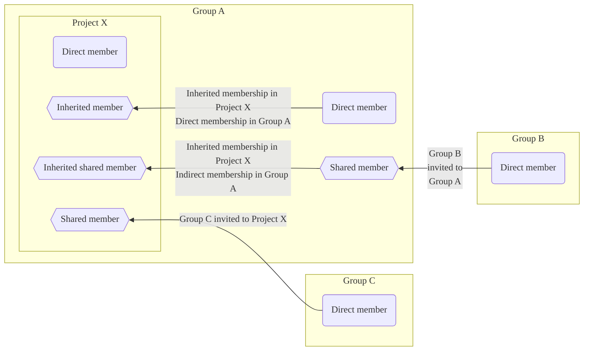
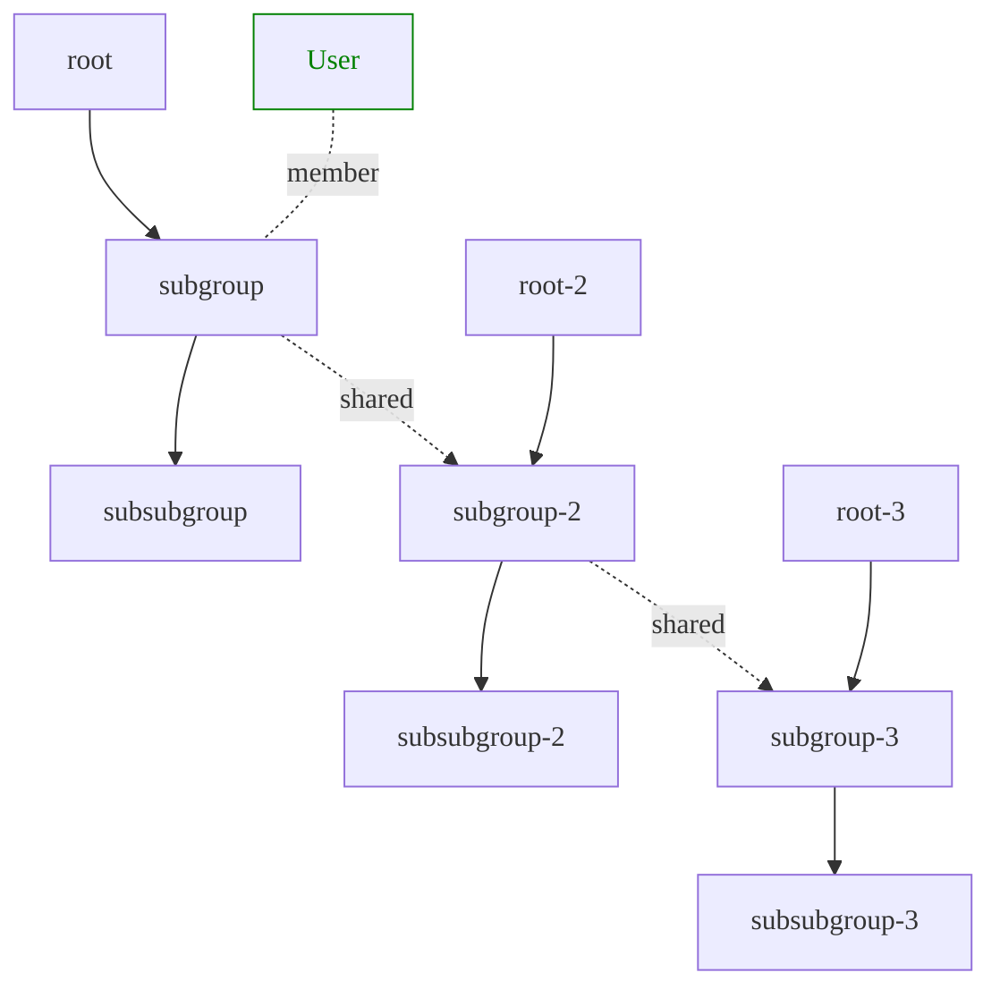

DETAILS:
**Tier:** Free, Premium, Ultimate
**Offering:** GitLab.com, GitLab Self-Managed, GitLab Dedicated

Members are the users and groups who have access to your project.

Each member gets a role, which determines what they can do in the project.

## Membership types

> - [Changed](https://gitlab.com/gitlab-org/gitlab/-/issues/219230) to display invited group members on the Members tab of the Members page in GitLab 16.10 [with a flag](../../../administration/feature_flags.md) named `webui_members_inherited_users`. Disabled by default.
> - Feature flag `webui_members_inherited_users` was [enabled on GitLab.com and GitLab Self-Managed](https://gitlab.com/gitlab-org/gitlab/-/issues/219230) in GitLab 17.0.
> - Feature flag `webui_members_inherited_users` [removed](https://gitlab.com/gitlab-org/gitlab/-/merge_requests/163627) in GitLab 17.4. Members of invited groups displayed by default.

Users can become members of a group or project directly or indirectly.
Indirect membership can be inherited, shared, or inherited shared.

| Membership type                               | Membership process |
| --------------------------------------------- | ------------------ |
| Direct | The user is added directly to the current group or project. |
| Inherited | The user is a member of a parent group that contains the current group or project. |
| [Shared](sharing_projects_groups.md) | The user is a member of a group invited to the current group or project. |
| [Inherited shared](../members/sharing_projects_groups.md#invite-a-group-to-a-group) | The user is a member of a group invited to an ancestor of the current group or project. |
| Indirect | An umbrella term for inherited, shared, or inherited shared members. |

In the above example:

- **Administrator** is an inherited member from the **demo** group.
- **User 0** is an inherited member from the **demo** group.
- **User 1** is a shared member from the **Acme** group that is invited to this project.
- **User 2** is an inherited shared member from the **Toolbox** group that is invited to the **demo** group.
- **User 3** is a direct member added to this project.

## Add users to a project

> - Expiring access email notification [introduced](https://gitlab.com/gitlab-org/gitlab/-/issues/12704) in GitLab 16.2.
> - Access expiration date for direct members of subgroups and projects [removed](https://gitlab.com/gitlab-org/gitlab/-/issues/471051) in GitLab 17.4.

Add users to a project so they become direct members and have permission
to perform actions.

Prerequisites:

- You must have the Owner or Maintainer role.
- [Group membership lock](../../group/access_and_permissions.md#prevent-members-from-being-added-to-projects-in-a-group) must be disabled.
- If [sign-up is disabled](../../../administration/settings/sign_up_restrictions.md#disable-new-sign-ups), an administrator must add the user by email first.
- If [approval for role promotion](../../../administration/settings/sign_up_restrictions.md#turn-on-administrator-approval-for-role-promotions) is enabled, an administrator must approve the invite.

To add a user to a project:

1. On the left sidebar, select **Search or go to** and find your project.
1. Select **Manage > Members**.
1. Select **Invite members**.
1. If the user:

   - Has a GitLab account, enter their username.
   - Doesn't have a GitLab account, enter their email address.

1. Select a [default role](../../permissions.md) or [custom role](../../custom_roles.md).
1. Optional. Select an **Access expiration date**.
   From that date onward, the user can no longer access the project.

   If you selected an access expiration date, the project member gets an email notification
   seven days before their access expires.

   WARNING:
   Maintainers have full permissions until their role expires, including the ability to
   extend their own access expiration date.

1. Select **Invite**.
   If you invited the user using their:

   - GitLab username, they are added to the members list.
   - Email address, an invitation is sent to their email address, and they are prompted to create an account.
     If the invitation is not accepted, GitLab sends reminder emails two, five, and ten days later.
     Unaccepted invites are automatically deleted after 90 days.

### Which roles you can assign

The maximum role you can assign depends on whether you have the Owner or Maintainer
role for the group. For example, the maximum role you can set is:

- Owner (`50`), if you have the Owner role for the project.
- Maintainer (`40`), if you have the Maintainer role on the project.

The Owner [role](../../permissions.md#project-members-permissions) can be added for the group only.

### View users pending promotion

If [administrator approval for role promotions](../../../administration/settings/sign_up_restrictions.md#turn-on-administrator-approval-for-role-promotions) is turned on, membership requests that promote existing users into a billable role require administrator approval.

To view users pending promotion:

1. On the left sidebar, select **Search or go to** and find your project.
1. Select **Manage > Members**.
1. Select **Role promotions** tab.

If the **Role promotions** tab is not displayed, the project has no pending promotions.

## Updating expiration and role

If a user is:

- A direct member of a project, the **Expiration** and **Role** fields can be updated directly on the project.
- An inherited, shared, or inherited shared member, the **Expiration** and **Role** fields must be updated on the group that the member originates from.

## Share a project with a group

Instead of adding users one by one, you can [share a project with an entire group](sharing_projects_groups.md).

## Import members from another project

You can import another project's direct members to your own project.
Imported project members retain the same permissions as the project you import them from.

NOTE:
Only direct members of a project are imported. Inherited or shared members of a project are not imported.

Prerequisites:

- You must have the Maintainer or Owner role.

If the importing member's role for the target project is:

- Maintainer, then members with the Owner role for the source project are imported with the Maintainer role.
- Owner, then members with the Owner role for the source project are imported with the Owner role.

To import a project's members:

1. On the left sidebar, select **Search or go to** and find your project.
1. Select **Manage > Members**.
1. Select **Import from a project**.
1. Select the project. You can view only the projects for which you're a maintainer.
1. Select **Import project members**.

If the import is successful, a success message is displayed.
To view the imported members on the **Members** tab, refresh the page.

## Remove a member from a project

If a user is:

- A direct member of a project, you can remove them directly from the project.
- An inherited member from a parent group, you can only remove them from the parent group itself.

Prerequisites:

- To remove direct members that have the:
  - Maintainer, Developer, Reporter, Planner, or Guest role, you must have the Maintainer role.
  - Owner role, you must have the Owner role.
- Optional. Unassign the member from all issues and merge requests that
  are assigned to them.

To remove a member from a project:

1. On the left sidebar, select **Search or go to** and find your project.
1. Select **Manage > Members**.
1. Next to the project member you want to remove, select **Remove member**.
1. Optional. On the confirmation dialog, select the
   **Also unassign this user from related issues and merge requests** checkbox.
1. To prevent leaks of sensitive information from private projects, verify the
   member has not forked the private repository or created webhooks. Existing forks continue to receive
   changes from the upstream project, and webhooks continue to receive updates. You may also want to configure your project
   to prevent projects in a group
   [from being forked outside their group](../../group/access_and_permissions.md#prevent-project-forking-outside-group).
1. Select **Remove member**.

## Ensure removed users cannot invite themselves back

Users with the Maintainer or Owner role could exploit a race condition that allows
them to rejoin groups or projects after an administrator removes them.

To avoid this problem, GitLab administrators can:

- Remove the malicious user session from the [GitLab Rails console](../../../administration/operations/rails_console.md).
- Impersonate the malicious user to:
  - Remove the user from the project.
  - Log the user out of GitLab.
- Block the malicious user account.
- Remove the malicious user account.
- Change the password for the malicious user account.

## Filter and sort project members

You can filter and sort members in a project.

### Display direct members

1. On the left sidebar, select **Search or go to** and find your project.
1. Select **Manage > Members**.
1. In the **Filter members** box, select `Membership` `=` `Direct`.
1. Press <kbd>Enter</kbd>.

### Display indirect members

1. On the left sidebar, select **Search or go to** and find your project.
1. Select **Manage > Members**.
1. In the **Filter members** box, select `Membership` `=` `Indirect`.
1. Press <kbd>Enter</kbd>.

### Search for members in a project

To search for a project member:

1. On the left sidebar, select **Search or go to** and find your project.
1. Select **Manage > Members**.
1. In the search box, enter the member's name, username, or email.
1. Press <kbd>Enter</kbd>.

### Sort members in a project

You can sort members in ascending or descending order by:

- **Account** name
- **Access granted** date
- **Role** the members have in the project
- **User created** date
- **Last activity** date
- **Last sign-in** date

To sort members:

1. On the left sidebar, select **Search or go to** and find your project.
1. Select **Manage > Members**.
1. At the top of the member list, from the dropdown list, select the item you want to sort by.

## Request access to a project

GitLab users can request to become a member of a project.

1. On the left sidebar, select **Search or go to** and find the project you want to be a member of.
1. In the top right, select the vertical ellipsis (**{ellipsis_v}**) and select **Request Access**.

An email is sent to the most recently active project Maintainers or Owners.
Up to ten project Maintainers or Owners are notified.
Any project Owner or Maintainer can approve or decline the request.
Project Maintainers cannot approve Owner role access requests.

If a project does not have any direct Owners or Maintainers, the most recently active Owners of the project's parent group receive the notification.

### Withdraw an access request to a project

You can withdraw an access request to a project before the request is approved.
To withdraw the access request:

1. On the left sidebar, select **Search or go to** and find the project you requested access to.
1. Next to the project name, select **Withdraw Access Request**.

## Prevent users from requesting access to a project

You can prevent users from requesting access to a project.

Prerequisites:

- You must have the Owner role for the project.
- The project must be public.

1. On the left sidebar, select **Search or go to** and find your project.
1. Select **Settings > General**.
1. Expand **Visibility, project features, permissions**.
1. Under **Project visibility**, ensure the **Users can request access** checkbox is not selected.
1. Select **Save changes**.

## Membership and visibility rights

Depending on their membership type, members of groups or projects are granted different [visibility levels](../../public_access.md)
and rights into the group or project.

The following table lists the membership and visibility rights of project members.

| Action | Direct project member | Inherited project member | Direct shared project member | Inherited shared project member |
| --- | ------------------- | ---------------------- | -------------------------- | ----------------------------- |
| Generate boards | **{check-circle}** Yes | **{check-circle}** Yes | **{check-circle}** Yes | **{check-circle}** Yes |
| View issues of parent groups 1 | **{check-circle}** Yes | **{check-circle}** Yes | **{check-circle}** Yes | **{check-circle}** Yes |
| View labels of parent groups | **{check-circle}** Yes | **{check-circle}** Yes | **{check-circle}** Yes | **{check-circle}** Yes |
| View milestones of parent groups | **{check-circle}** Yes | **{check-circle}** Yes | **{check-circle}** Yes | **{check-circle}** Yes |
| Be shared into other groups | **{check-circle}** Yes | **{dotted-circle}** No | **{dotted-circle}** No |  **{dotted-circle}** No |
| Be imported into other projects | **{check-circle}** Yes | **{dotted-circle}** No | **{dotted-circle}** No | **{dotted-circle}** No |
| Share the project with other members | **{check-circle}** Yes | **{check-circle}** Yes | **{check-circle}** Yes | **{check-circle}** Yes |

**Footnotes:**

1. Users can view only issues of projects they have access to.

The following table lists the membership and visibility rights of group members.

| Action | Direct group member | Inherited group member | Direct shared group member | Inherited shared group member |
| --- | ------------------- | ---------------------- | -------------------------- | ----------------------------- |
| Generate boards | **{check-circle}** Yes | **{check-circle}** Yes | **{check-circle}** Yes | **{check-circle}** Yes |
| View issues of parent groups | **{check-circle}** Yes | **{check-circle}** Yes | **{check-circle}** Yes | **{check-circle}** Yes |
| View labels of parent groups | **{check-circle}** Yes | **{check-circle}** Yes | **{check-circle}** Yes | **{check-circle}** Yes |
| View milestones of parent groups | **{check-circle}** Yes | **{check-circle}** Yes | **{check-circle}** Yes | **{check-circle}** Yes |

In the following example, `User` is a:

- Direct member of `subgroup`.
- Inherited member of `subsubgroup`.
- Indirect member of `subgroup-2` and `subgroup-3`.
- Indirect inherited member of `subsubgroup-2` and `subsubgroup-3`.

