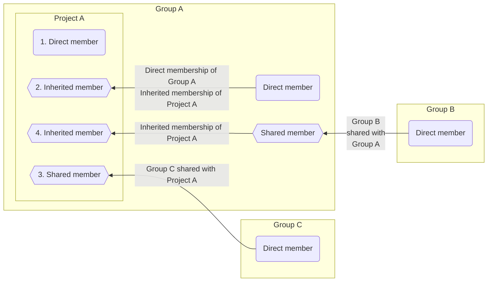
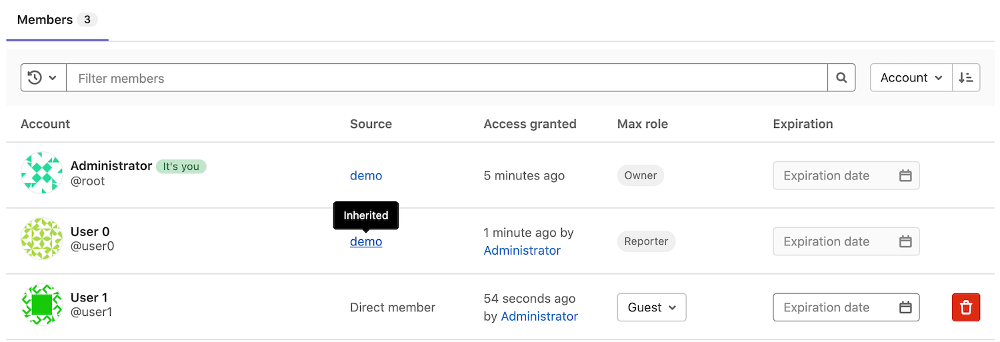
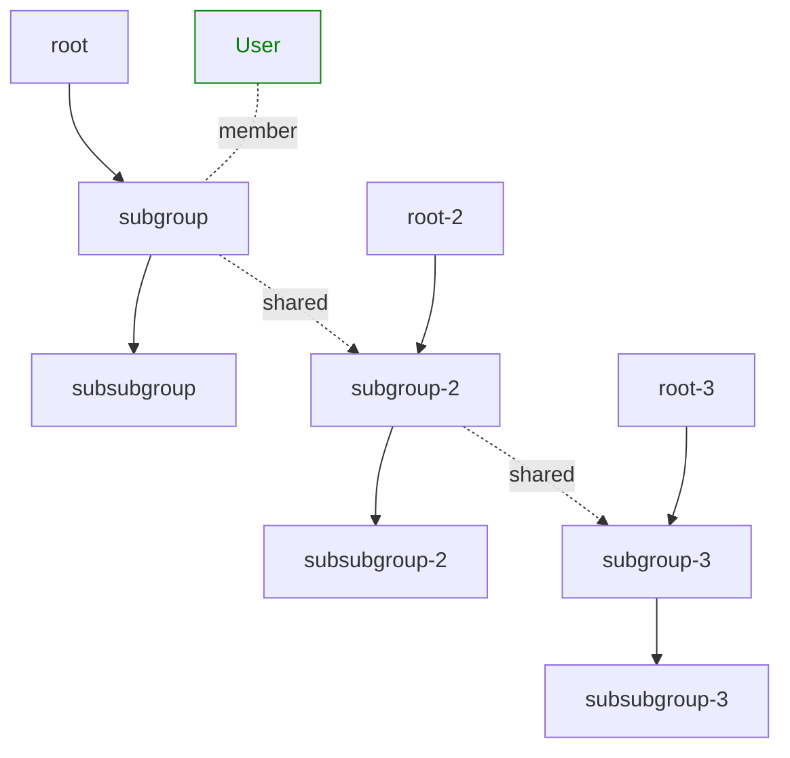
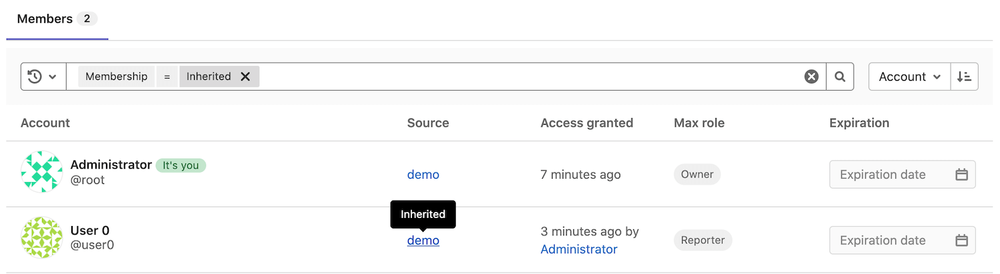
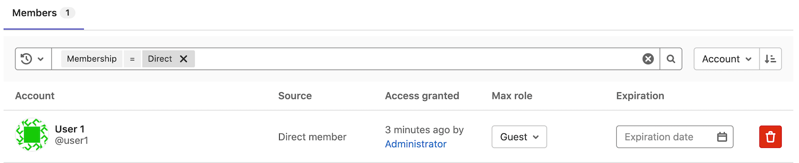
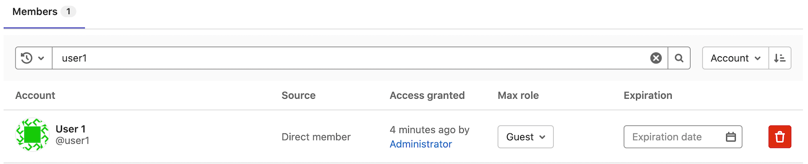
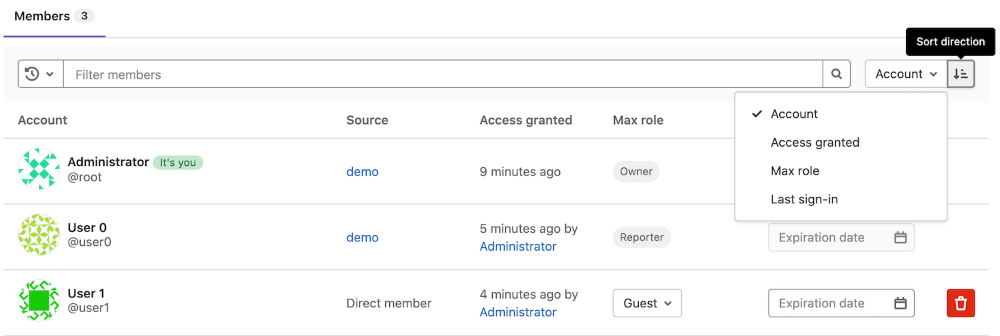

# Members of a project **(FREE)**

Members are the users and groups who have access to your project.

Each member gets a role, which determines what they can do in the project.

## Membership types

Users can become members of a group or project in different ways, which define their membership type.

| Membership type                               | Membership process |
| --------------------------------------------- | ------------------ |
| [Direct](#add-users-to-a-project)             | The user is added directly to the current group or project. |
| [Inherited](#inherited-membership)            | The user is a member of an ancestor group or project that is added to the current group or project. |
| [Direct shared](share_project_with_groups.md) | The user is a member of a group or project that is shared into the current group or project. |
| [Inherited shared](../../group/manage.md#share-a-group-with-another-group) | The user is a member of an ancestor of a group or project that is shared into the current group or project. |

### Inherited membership

When your project belongs to a group, project members inherit their role
from the group.

In this example:

- Three members have access to the project.
- **User 0** is a Reporter and has inherited their role in the project from the **demo** group,
  which contains the project.
- **User 1** belongs directly to the project. In the **Source** column, they are listed
  as a **Direct member**.
- **Administrator** is the [Owner](../../permissions.md) and member of all groups.
  They have inherited their role in the project from the **demo** group.

If a user is:

- A direct member of a project, the **Expiration** and **Max role** fields can be updated directly on the project.
- An inherited member from a parent group, the **Expiration** and **Max role** fields must be updated on the parent group.

### Membership and visibility rights

Depending on their membership type, members of groups or projects are granted different visibility levels
and rights into the group or project.

| Action | Direct group member | Inherited group member | Direct shared group member | Inherited shared group member |
| --- | ------------------- | ---------------------- | -------------------------- | ----------------------------- |
| Generate boards | ✓ | ✓ | ✓ | ✓ |
| View issues of groups higher in the hierarchy | ✓ | ✓ | ✓ | ✓ |
| View labels of groups higher in the hierarchy | ✓ | ✓ | ✓ | ✓ |
| View milestones of groups higher in the hierarchy | ✓ | ✓ | ✓ | ✓ |
| Be shared into other groups | ✓ |  |  |  |
| Be shared into other projects | ✓ | ✓ |  |  |
| Share the group with other members | ✓ |  |  |  |

In the following example, `User` is a:

- Direct member of `subgroup`.
- Inherited member of `subsubgroup`.
- Indirect member of `subgroup-2` and `subgroup-3`.
- Indirect inherited member of `subsubgroup-2` and `subsubgroup-3`.

## Add users to a project

> - [Changed](https://gitlab.com/gitlab-org/gitlab/-/issues/247208) in GitLab 13.11 from a form to a modal window [with a flag](../../feature_flags.md). Disabled by default.
> - Modal window [enabled on GitLab.com and self-managed](https://gitlab.com/gitlab-org/gitlab/-/issues/247208) in GitLab 14.8.
> - [Generally available](https://gitlab.com/gitlab-org/gitlab/-/issues/352526) in GitLab 14.9. [Feature flag `invite_members_group_modal`](https://gitlab.com/gitlab-org/gitlab/-/issues/352526) removed.

Add users to a project so they become direct members and have permission
to perform actions.

Prerequisite:

- You must have the Owner or Maintainer role.

To add a user to a project:

1. On the top bar, select **Main menu > Projects** and find your project.
1. On the left sidebar, select **Project information > Members**.
1. Select **Invite members**.
1. If the user:

   - Has a GitLab account, enter their username.
   - Doesn't have a GitLab account, enter their email address.

1. Select a [role](../../permissions.md).
1. Optional. Select an **Access expiration date**.
   From that date onward, the user can no longer access the project.

   WARNING:
   If you give a member the Maintainer role and select an expiration date, that member
   has full permissions for the time they are in the role. This includes the ability
   to extend their own time in the Maintainer role.

1. Select **Invite**.
   If you invited the user using their:

   - GitLab username, they are added to the members list.
   - Email address, an invitation is sent to their email address, and they are prompted to create an account.
   If the invitation is not accepted, GitLab sends reminder emails two, five, and ten days later.
   Unaccepted invites are automatically deleted after 90 days.

### Which roles you can assign

The maximum role you can assign depends on whether you have the Owner or Maintainer
role for the group. For example, the maximum role you can set is:

- Owner (`50`), if you have the Owner role for the project.
- Maintainer (`40`), if you have the Maintainer role on the project.

In GitLab 14.8 and earlier, direct members of a project have a maximum role of Maintainer.
The Owner [role](../../permissions.md#project-members-permissions) can be added for the group only.

## Add groups to a project

> - [Changed](https://gitlab.com/gitlab-org/gitlab/-/issues/247208) in GitLab 13.11 from a form to a modal window [with a flag](../../feature_flags.md). Disabled by default.
> - Modal window [enabled on GitLab.com and self-managed](https://gitlab.com/gitlab-org/gitlab/-/issues/247208) in GitLab 14.8.
> - [Generally available](https://gitlab.com/gitlab-org/gitlab/-/issues/352526) in GitLab 14.9. [Feature flag `invite_members_group_modal`](https://gitlab.com/gitlab-org/gitlab/-/issues/352526) removed.

When you add a group to a project, every group member (direct or inherited) gets access to the project.
Each member's access is based on the:

- Role they're assigned in the group.
- Maximum role you choose when you invite the group.

If a group member has a role in the group with fewer permissions than the maximum project role, the member keeps the permissions of their group role.
For example, if you add a member with the Guest role to a project with a maximum role of Maintainer, the member has only the permissions of the Guest role in the project.

Prerequisites:

- You must have the Maintainer or Owner role.
- Sharing the project with other groups must not be [prevented](../../group/access_and_permissions.md#prevent-a-project-from-being-shared-with-groups).

To add a group to a project:

1. On the top bar, select **Main menu > Projects** and find your project.
1. On the left sidebar, select **Project information > Members**.
1. Select **Invite a group**.
1. Select a group.
1. Select the highest [role](../../permissions.md) for users in the group.
1. Optional. Select an **Access expiration date**.
   From that date onward, the group can no longer access the project.
1. Select **Invite**.

The members of the group are not displayed on the **Members** tab.
The **Members** tab shows:

- Members who are directly assigned to the project.
- If the project was created in a group [namespace](../../namespace/index.md), members of that group.

## Import members from another project

You can import another project's members to your own project.
Imported project members retain the same permissions as the project you import them from.

Prerequisite:

- You must have the Maintainer or Owner role.

To import users:

1. On the top bar, select **Main menu > Projects** and find your project.
1. On the left sidebar, select **Project information > Members**.
1. Select **Import from a project**.
1. Select the project. You can view only the projects for which you're a maintainer.
1. Select **Import project members**.

After the success message displays, refresh the page to view the new members.

## Remove a member from a project

If a user is:

- A direct member of a project, you can remove them directly from the project.
- An inherited member from a parent group, you can only remove them from the parent group itself.

Prerequisites:

- To remove direct members that have the:
  - Maintainer, Developer, Reporter, or Guest role, you must have the Maintainer role.
  - Owner role, you must have the Owner role.
- Optional. Unassign the member from all issues and merge requests that
  are assigned to them.

To remove a member from a project:

1. On the top bar, select **Main menu > Projects** and find your project.
1. On the left sidebar, select **Project information > Members**.
1. Next to the project member you want to remove, select **Remove member**.
1. Optional. In the confirmation box, select the
   **Also unassign this user from related issues and merge requests** checkbox.
1. To prevent leaks of sensitive information from private projects, verify the
   member has not forked the private repository or created webhooks. Existing forks continue to receive
   changes from the upstream project, and webhooks continue to receive updates. You may also want to configure your project
   to prevent projects in a group
   [from being forked outside their group](../../group/access_and_permissions.md#prevent-project-forking-outside-group).
1. Select **Remove member**.

## Ensure removed users cannot invite themselves back

Malicious users with the Maintainer or Owner role could exploit a race condition that allows
them to invite themselves back to a group or project that a GitLab administrator has removed them from.

To avoid this problem, GitLab administrators can:

- Remove the malicious user session from the [GitLab Rails console](../../../administration/operations/rails_console.md).
- Impersonate the malicious user to:
  - Remove the user from the project.
  - Log the user out of GitLab.
- Block the malicious user account.
- Remove the malicious user account.
- Change the password for the malicious user account.

## Filter and sort members

> - [Introduced](https://gitlab.com/gitlab-org/gitlab/-/issues/21727) in GitLab 12.6.
> - [Improved](https://gitlab.com/groups/gitlab-org/-/epics/4901) in GitLab 13.9.
> - [Feature flag removed](https://gitlab.com/gitlab-org/gitlab/-/issues/299954) in GitLab 13.10.

You can filter and sort members in a project.

### Display inherited members

1. On the top bar, select **Main menu > Projects** and find your project.
1. On the left sidebar, select **Project information > Members**.
1. In the **Filter members** box, select `Membership` `=` `Inherited`.
1. Press <kbd>Enter</kbd>.

### Display direct members

1. On the top bar, select **Main menu > Projects** and find your project.
1. On the left sidebar, select **Project information > Members**.
1. In the **Filter members** box, select `Membership` `=` `Direct`.
1. Press <kbd>Enter</kbd>.

### Search

You can search for members by name, username, or email.

### Sort

You can sort members by **Account**, **Access granted**, **Max role**, or **Last sign-in** in ascending or descending order.

## Request access to a project

GitLab users can request to become a member of a project.

1. On the top bar, select **Main menu > Projects** and find the project you want to be a member of.
1. By the project name, select **Request Access**.

An email is sent to the most recently active project maintainers or owners.
Up to ten project maintainers or owners are notified.
Any project owner or maintainer can approve or decline the request.
Project maintainers cannot approve Owner role access requests.

If a project does not have any direct owners or maintainers, the notification is sent to the
most recently active owners of the project's group.

If you change your mind before your request is approved, select
**Withdraw Access Request**.

## Prevent users from requesting access to a project

You can prevent users from requesting access to a project.

Prerequisite:

- You must be the project owner.

1. On the top bar, select **Main menu > Projects** and find your project.
1. On the left sidebar, select **Settings > General**.
1. Expand **Visibility, project features, permissions**.
1. Under **Project visibility**, select **Users can request access**.
1. Select **Save changes**.

## Share a project with a group

Instead of adding users one by one, you can [share a project with an entire group](share_project_with_groups.md).
