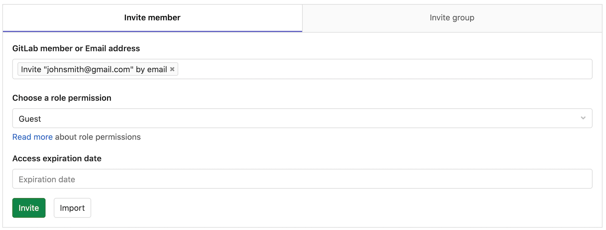
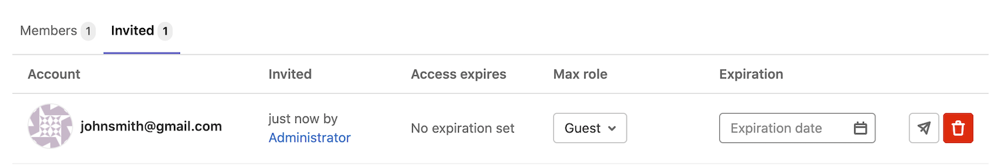
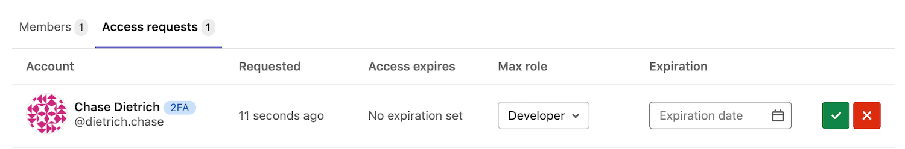

# Members of a project

Members are the users and groups who have access to your project.

Each member gets a role, which determines what they can do in the project.

## Add users to a project

Add users to a project so they become members and have permission
to perform actions.

Prerequisite:

- You must have maintainer or owner [permissions](../../permissions.md).

To add a user to a project:

1. Go to your project and select **Members**.
1. On the **Invite member** tab, under **GitLab member of Email address**, type the username or email address.
1. Select a [role](../../permissions.md). 
1. Optional. Choose an expiration date. On that date, the user can no longer access the project.
1. Select **Invite**.

If the user has a GitLab account, they are added to the members list.
If you used an email address, the user receives an email.

## Add groups to a project

When you assign a group to a project, each user in the group gets access to the project,
based on the role they're assigned in the group. However, the user's access is also
limited by the maximum role you choose when you invite the group.

Prerequisite:

- You must have maintainer or owner [permissions](../../permissions.md).

To add groups to a project:

1. Go to your project and select **Members**.
1. On the **Invite group** tab, under **Select a group to invite**, choose a group.
1. Select the highest max [role](../../permissions.md) for users in the group. 
1. Optional. Choose an expiration date. On that date, the user can no longer access the project.
1. Select **Invite**.

The members of the group are not displayed on the **Members** tab.
The **Members** tab shows:

- Members who are directly assigned to the project.
- If the project was created in a group [namespace](../../group/index.md#namespaces), members of that group.

## Import users from another project

You can import another project's users to your own project. Users
retain the same permissions as the project you import them from.

Prerequisite:

- You must have maintainer or owner [permissions](../../permissions.md).

To import users:

1. Go to your project and select **Members**.
1. On the **Invite member** tab, at the bottom of the panel, select **Import**.
1. Select the project. You can view only the projects for which you're a maintainer.
1. Select **Import project members**.

A success message is displayed and the new members are now displayed in the list.

## Inherited membership

When your project belongs to a group, group members inherit the membership and permission
level for the project from the group.


From the image above, we can deduce the following things:

- There are 3 members that have access to the project.
- User0 is a Reporter and has inherited their permissions from group `demo`
  which contains current project.
- User1 is shown as a **Direct member** in the **Source** column, therefore they belong directly
  to the project we're inspecting.
- Administrator is the Owner and member of **all** groups and for that reason,
  there is an indication of an ancestor group and inherited Owner permissions.

## Filter and sort members

> - [Introduced](https://gitlab.com/gitlab-org/gitlab/-/issues/21727) in GitLab 12.6.
> - [Improved](https://gitlab.com/groups/gitlab-org/-/epics/4901) in GitLab 13.9.
> - [Feature flag removed](https://gitlab.com/gitlab-org/gitlab/-/issues/299954) in GitLab 13.10.

The following sections illustrate how you can filter and sort members in a project. To view these options,
navigate to your desired project, go to **Members**, and include the noted search terms.

### Membership filter

By default, inherited and direct members are displayed. The membership filter can be used to display only inherited or only direct members.

#### Display inherited members

To display inherited members, include `Membership` `=` `Inherited` in the search text box.


#### Display direct members

To display direct members, include `Membership` `=` `Direct` in the search text box.


### Search

You can search for members by name, username, or email.


### Sort

You can sort members by **Account**, **Access granted**, **Max role**, or **Last sign-in** in ascending or descending order.


## Invite people using their e-mail address

NOTE:
In GitLab 13.11, you can [replace this form with a modal window](#add-a-member-modal-window).

If a user you want to give access to doesn't have an account on your GitLab
instance, you can invite them just by typing their e-mail address in the
user search field.


As you can imagine, you can mix inviting multiple people and adding existing
GitLab users to the project.



Once done, hit **Add users to project** and watch that there is a new member
with the e-mail address we used above. From there on, you can resend the
invitation, change their access level, or even delete them.



While unaccepted, the system automatically sends reminder emails on the second, fifth,
and tenth day after the invitation was initially sent.

After the user accepts the invitation, they are prompted to create a new
GitLab account using the same e-mail address the invitation was sent to.

NOTE:
Unaccepted invites are automatically deleted after 90 days.

### Add a member modal window

> - [Introduced](https://gitlab.com/gitlab-org/gitlab/-/issues/247208) in GitLab 13.11.
> - [Deployed behind a feature flag](../../feature_flags.md), disabled by default.
> - Enabled on GitLab.com.
> - Recommended for production use.
> - Replaces the existing form with buttons to open a modal window.
> - To use in GitLab self-managed instances, ask a GitLab administrator to [enable it](#enable-or-disable-modal-window). **(FREE SELF)**

WARNING:
This feature might not be available to you. Check the **version history** note above for details.

In GitLab 13.11, you can optionally replace the form to add a member with a modal window.
To add a member after enabling this feature:

1. Go to your project's page.
1. In the left sidebar, go to **Members**, and then select **Invite members**.
1. Enter an email address, and select a role permission for this user.
1. (Optional) Select an **Access expiration date**.
1. Select **Invite**.

### Enable or disable modal window **(FREE SELF)**

The modal window for adding a member is under development and is ready for production use. It is
deployed behind a feature flag that is **disabled by default**.
[GitLab administrators with access to the GitLab Rails console](../../../administration/feature_flags.md)
can enable it.

To enable it:

```ruby
Feature.enable(:invite_members_group_modal)
```

To disable it:

```ruby
Feature.disable(:invite_members_group_modal)
```

## Project membership and requesting access

Project owners can :

- Allow non-members to request access to the project.
- Prevent non-members from requesting access.

To configure this, go to the project settings and click on **Allow users to request access**.

GitLab users can request to become a member of a project. Go to the project you'd
like to be a member of and click the **Request Access** button on the right
side of your screen.


After access is requested:

- Up to ten project maintainers are notified of the request via email.
  Email is sent to the most recently active project maintainers.
- Any project maintainer can approve or decline the request on the members page.

NOTE:
If a project does not have any maintainers, the notification is sent to the
most recently active owners of the project's group.



If you change your mind before your request is approved, just click the
**Withdraw Access Request** button.


## Share project with group

Alternatively, you can [share a project with an entire group](share_project_with_groups.md) instead of adding users one by one.

## Remove a member from the project

Only users with permissions of [Owner](../../permissions.md#group-members-permissions) can manage
project members.

You can remove a user from the project if the given member has a direct membership in the project.
If membership is inherited from a parent group, then the member can be removed only from the parent
group itself.

When removing a member, you can decide whether to unassign the user from all issues and merge
requests they are currently assigned or leave the assignments as they are.

- **Unassigning the removed member** from all issues and merge requests might be helpful when a user
  is leaving a private project and you wish to revoke their access to any issues and merge requests
  they are assigned.
- **Keeping the issues and merge requests assigned** might be helpful for projects that accept public
  contributions where a user doesn't have to be a member to be able to contribute to issues and
  merge requests.

To remove a member from a project:

1. Go to your project and select **Members**.
1. Next to the project member you want to remove, select **Remove member** **{remove}**.
1. Optional. In the confirmation box, select the **Also unassign this user from related issues and merge requests** checkbox.
1. Select **Remove member**.
