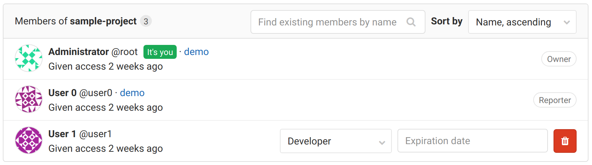
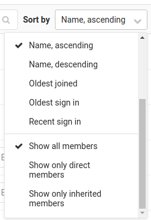
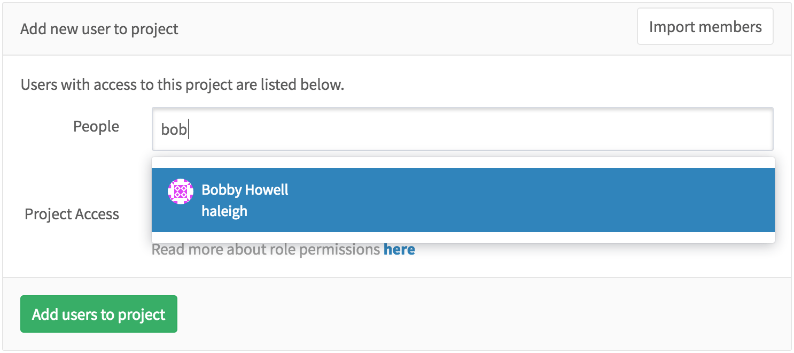
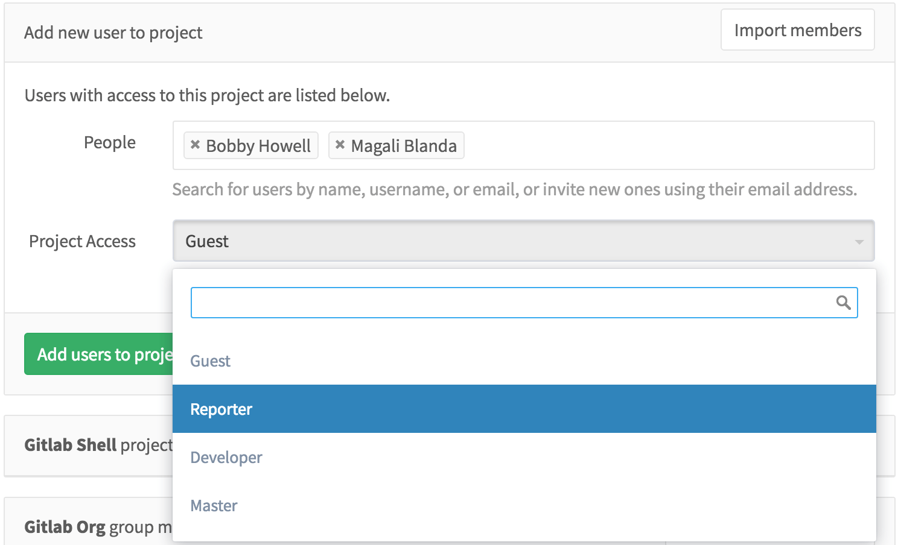
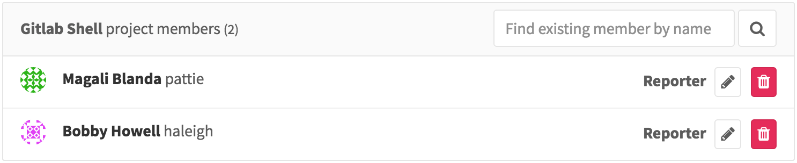
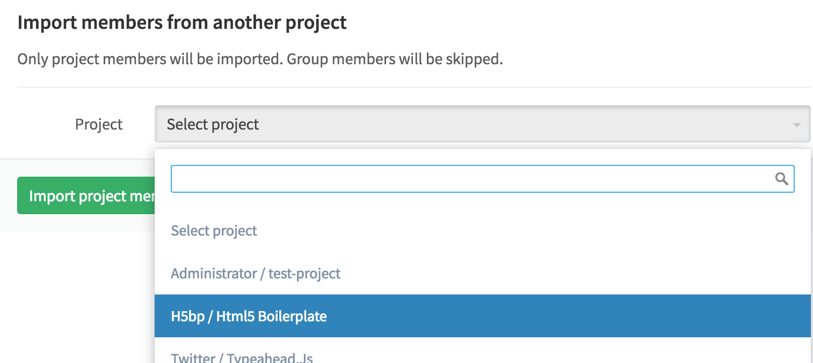
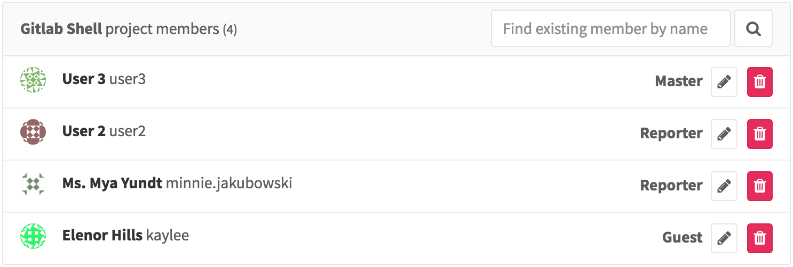
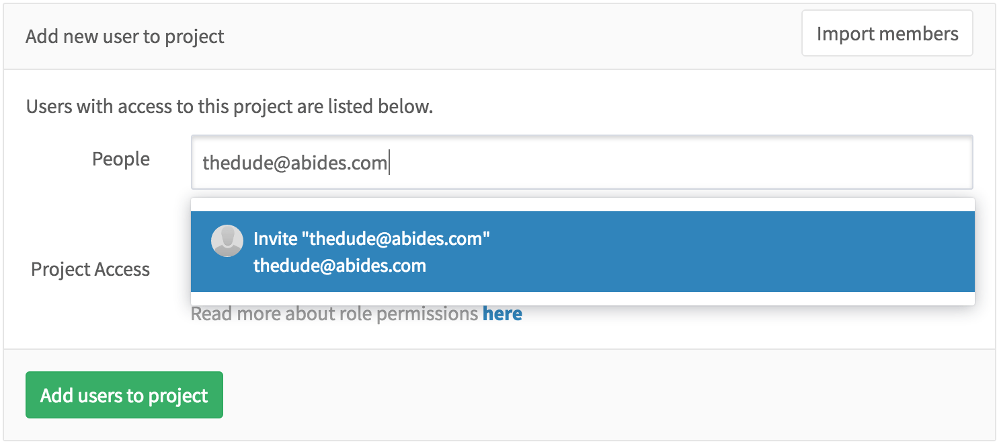
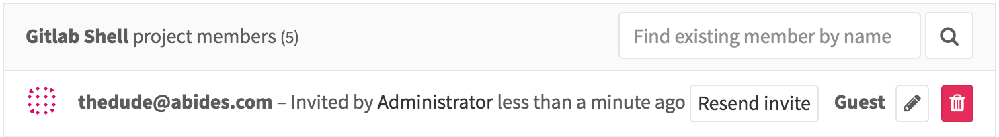
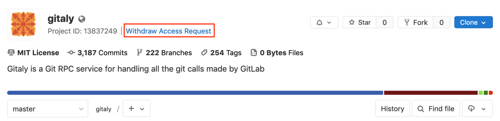

# Project's members

You can manage the groups and users and their access levels in all of your
projects. You can also personalize the access level you give each user,
per-project.

You should have Maintainer or Owner [permissions](../../permissions.md) to add
or import a new user to your project.

To view, edit, add, and remove project's members, go to your
project's **Settings > Members**.

## Inherited membership

When your project belongs to the group, group members inherit the membership and permission
level for the project from the group.

From the image above, we can deduce the following things:

- There are 3 members that have access to the project.
- User0 is a Reporter and has inherited their permissions from group `demo`
  which contains current project.
- For User1 there is no indication of a group, therefore they belong directly
  to the project we're inspecting.
- Administrator is the Owner and member of **all** groups and for that reason,
  there is an indication of an ancestor group and inherited Owner permissions.

[From](https://gitlab.com/gitlab-org/gitlab/issues/21727), you can filter this list
using dropdown on the right side:

- **Show only direct members** displays only User1.
- **Show only inherited members** displays User0 and Administrator.

## Add a user

Right next to **People**, start typing the name or username of the user you
want to add.

Select the user and the [permission level](../../permissions.md)
that you'd like to give the user. Note that you can select more than one user.

Once done, hit **Add users to project** and they will be immediately added to
your project with the permissions you gave them above.

From there on, you can either remove an existing user or change their access
level to the project.

## Import users from another project

You can import another project's users in your own project by hitting the
**Import members** button on the upper right corner of the **Members** menu.

In the dropdown menu, you can see only the projects you are Maintainer on.

Select the one you want and hit **Import project members**. A flash message
notifying you that the import was successful will appear, and the new members
are now in the project's members list. Notice that the permissions that they
had on the project you imported from are retained.

## Invite people using their e-mail address

If a user you want to give access to doesn't have an account on your GitLab
instance, you can invite them just by typing their e-mail address in the
user search field.

As you can imagine, you can mix inviting multiple people and adding existing
GitLab users to the project.

Once done, hit **Add users to project** and watch that there is a new member
with the e-mail address we used above. From there on, you can resend the
invitation, change their access level, or even delete them.

Once the user accepts the invitation, they will be prompted to create a new
GitLab account using the same e-mail address the invitation was sent to.

## Project membership and requesting access

Project owners can :

- Allow non-members to request access to the project.
- Prevent non-members from requesting access.

To configure this, go to the project settings and click on **Allow users to request access**.

GitLab users can request to become a member of a project. Go to the project you'd
like to be a member of and click the **Request Access** button on the right
side of your screen.

After access is requested:

- Up to ten project maintainers are notified of the request via email.
  Email is sent to the most recently active project maintainers.
- Any project maintainer can approve or decline the request on the members page.

NOTE: **Note:**
If a project does not have any maintainers, the notification is sent to the
most recently active owners of the project's group.

If you change your mind before your request is approved, just click the
**Withdraw Access Request** button.

## Share project with group

Alternatively, you can [share a project with an entire group](share_project_with_groups.md) instead of adding users one by one.
