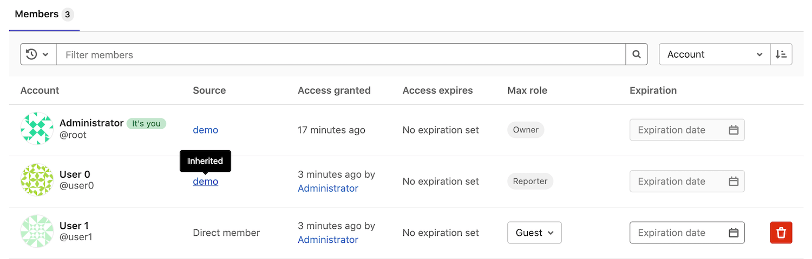
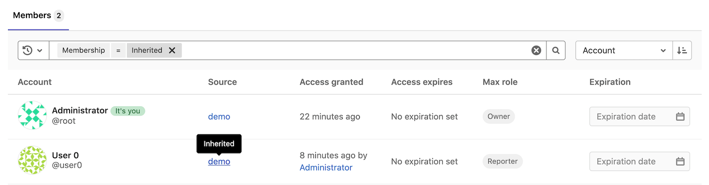
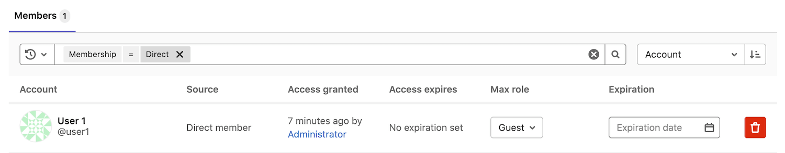
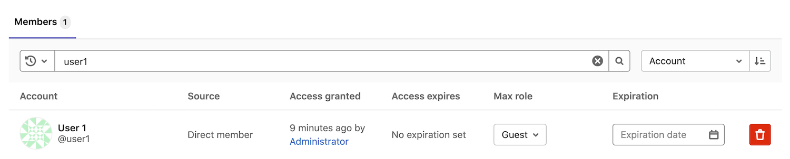
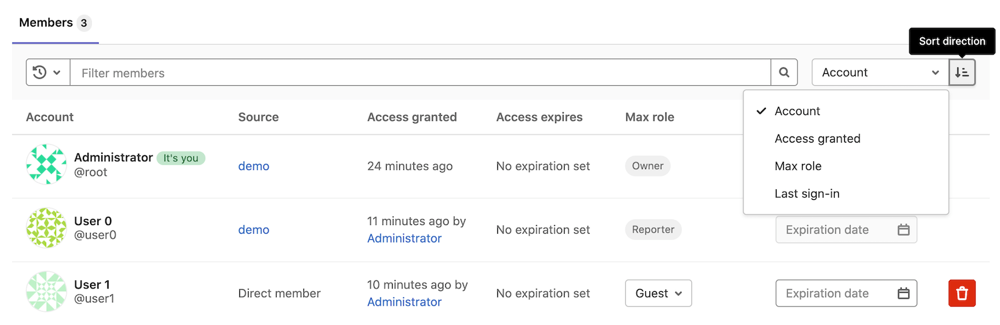
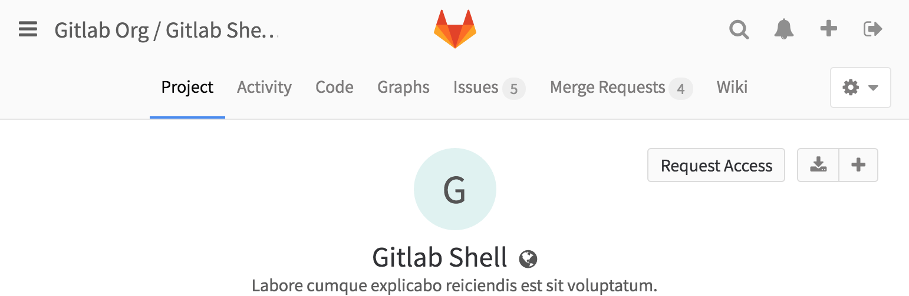

# Members of a project **(FREE)**

Members are the users and groups who have access to your project.

Each member gets a role, which determines what they can do in the project.

## Add users to a project

Add users to a project so they become members and have permission
to perform actions.

Prerequisite:

- You must have the [Maintainer or Owner role](../../permissions.md).

To add a user to a project:

1. Go to your project and select **Project information > Members**.
1. On the **Invite member** tab, under **GitLab member or Email address**, type the username or email address.
   In GitLab 13.11 and later, you can [replace this form with a modal window](#add-a-member-modal-window).
1. Select a [role](../../permissions.md).
1. Optional. Choose an expiration date. On that date, the user can no longer access the project.
1. Select **Invite**.

If the user has a GitLab account, they are added to the members list.
If you used an email address, the user receives an email.

If the invitation is not accepted, GitLab sends reminder emails two,
five, and ten days later. Unaccepted invites are automatically
deleted after 90 days.

If the user does not have a GitLab account, they are prompted to create an account
using the email address the invitation was sent to.

## Add groups to a project

When you add a group to a project, each user in the group gets access to the project.
Each user's access is based on:

- The role they're assigned in the group.
- The maximum role you choose when you invite the group.

Prerequisite:

- You must have the [Maintainer or Owner role](../../permissions.md).

To add groups to a project:

1. Go to your project and select **Project information > Members**.
1. On the **Invite group** tab, under **Select a group to invite**, choose a group.
1. Select the highest max [role](../../permissions.md) for users in the group.
1. Optional. Choose an expiration date. On that date, the user can no longer access the project.
1. Select **Invite**.

The members of the group are not displayed on the **Members** tab.
The **Members** tab shows:

- Members who are directly assigned to the project.
- If the project was created in a group [namespace](../../group/index.md#namespaces), members of that group.

## Import users from another project

You can import another project's users to your own project. Users
retain the same permissions as the project you import them from.

Prerequisite:

- You must have the [Maintainer or Owner role](../../permissions.md).

To import users:

1. Go to your project and select **Project information > Members**.
1. On the **Invite member** tab, at the bottom of the panel, select **Import**.
1. Select the project. You can view only the projects for which you're a maintainer.
1. Select **Import project members**.

A success message is displayed and the new members are now displayed in the list.

## Inherited membership

When your project belongs to a group, group members inherit their role
from the group.



In this example:

- Three members have access to the project.
- **User 0** is a Reporter and has inherited their role from the **demo** group,
  which contains the project.
- **User 1** belongs directly to the project. In the **Source** column, they are listed
  as a **Direct member**.
- **Administrator** is the [Owner](../../permissions.md) and member of all groups.
  They have inherited their role from the **demo** group.

If a user is a direct member of a project, the expiration date can be updated. If membership is inherited from a parent group, the expiration date can be updated only from the parent group itself. 

## Remove a member from a project

If a user is a direct member of a project, you can remove them.
If membership is inherited from a parent group, then the member can be removed only from the parent
group itself.

Prerequisite:

- You must have the [Owner role](../../permissions.md).
- Optional. Unassign the member from all issues and merge requests that
  are assigned to them.

To remove a member from a project:

1. Go to your project and select **Project information > Members**.
1. Next to the project member you want to remove, select **Remove member** **{remove}**.
1. Optional. In the confirmation box, select the **Also unassign this user from related issues and merge requests** checkbox.
1. Select **Remove member**.

## Filter and sort members

> - [Introduced](https://gitlab.com/gitlab-org/gitlab/-/issues/21727) in GitLab 12.6.
> - [Improved](https://gitlab.com/groups/gitlab-org/-/epics/4901) in GitLab 13.9.
> - [Feature flag removed](https://gitlab.com/gitlab-org/gitlab/-/issues/299954) in GitLab 13.10.

You can filter and sort members in a project.

### Display inherited members

1. Go to your project and select **Project information > Members**.
1. In the **Filter members** box, select `Membership` `=` `Inherited`.
1. Press Enter.



### Display direct members

1. Go to your project and select **Project information > Members**.
1. In the **Filter members** box, select `Membership` `=` `Direct`.
1. Press Enter.



### Search

You can search for members by name, username, or email.



### Sort

You can sort members by **Account**, **Access granted**, **Max role**, or **Last sign-in** in ascending or descending order.



## Request access to a project

GitLab users can request to become a member of a project.

1. Go to the project you'd like to be a member of.
1. By the project name, select **Request Access**.



An email is sent to the most recently active project maintainers.
Up to ten project maintainers are notified.
Any project maintainer can approve or decline the request.

If a project does not have any maintainers, the notification is sent to the
most recently active owners of the project's group.

If you change your mind before your request is approved, select
**Withdraw Access Request**.

## Prevent users from requesting access to a project

You can prevent users from requesting access to a project.

Prerequisite:

- You must be the project owner.

1. Go to the project and select **Settings > General**.
1. Expand the **Visibility, project features, permissions** section.
1. Under **Project visibility**, select **Users can request access**.
1. Select **Save changes**.

## Share a project with a group

Instead of adding users one by one, you can [share a project with an entire group](share_project_with_groups.md).

### Add a member modal window

> - [Introduced](https://gitlab.com/gitlab-org/gitlab/-/issues/247208) in GitLab 13.11.
> - [Deployed behind a feature flag](../../feature_flags.md), disabled by default.
> - Enabled on GitLab.com.
> - Recommended for production use.
> - Replaces the existing form with buttons to open a modal window.
> - To use in GitLab self-managed instances, ask a GitLab administrator to [enable it](#enable-or-disable-modal-window). **(FREE SELF)**

WARNING:
This feature might not be available to you. Check the **version history** note above for details.

In GitLab 13.11, you can optionally replace the form to add a member with a modal window.
To add a member after enabling this feature:

1. Go to your project and select **Project information > Members**.
1. Select **Invite members**.
1. Enter an email address and select a role.
1. Optional. Select an **Access expiration date**.
1. Select **Invite**.

### Enable or disable modal window **(FREE SELF)**

The modal window for adding a member is under development and is ready for production use. It is
deployed behind a feature flag that is **disabled by default**.
[GitLab administrators with access to the GitLab Rails console](../../../administration/feature_flags.md)
can enable it.

To enable it:

```ruby
Feature.enable(:invite_members_group_modal)
```

To disable it:

```ruby
Feature.disable(:invite_members_group_modal)
```
