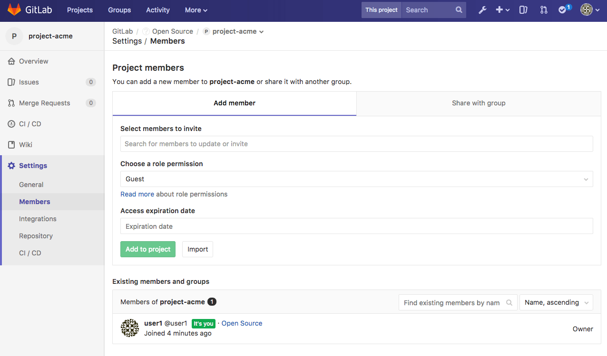
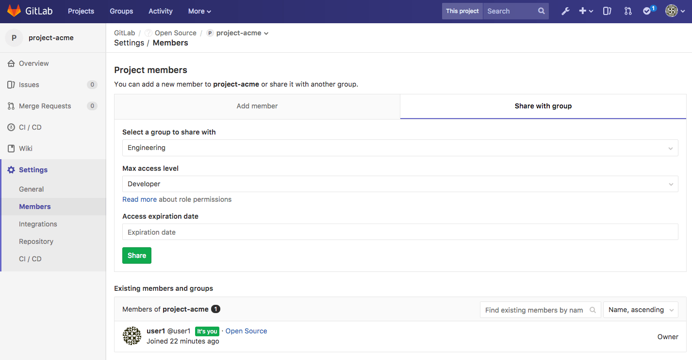
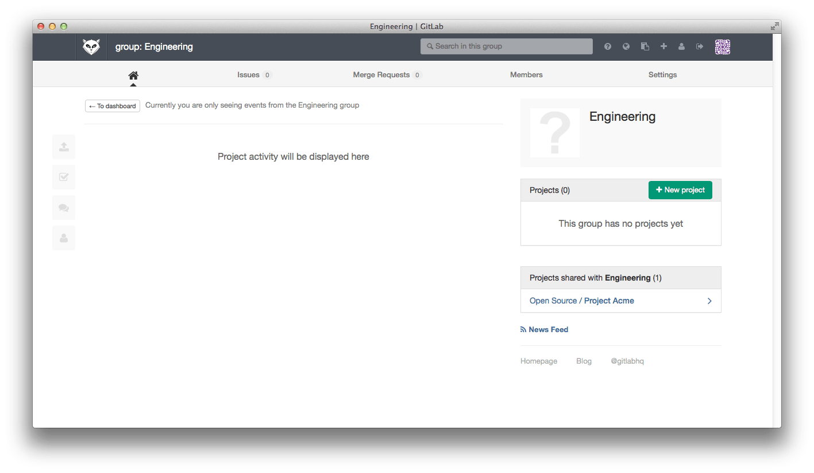

# Share Projects with other Groups

You can share projects with other [groups](../../group/index.md). This makes it
possible to add a group of users to a project with a single action.

## Groups as collections of users

Groups are used primarily to [create collections of projects](../../group/index.md), but you can also
take advantage of the fact that groups define collections of _users_, namely the group
members.

## Sharing a project with a group of users

The primary mechanism to give a group of users, say 'Engineering', access to a project,
say 'Project Acme', in GitLab is to make the 'Engineering' group the owner of 'Project
Acme'.  But what if 'Project Acme' already belongs to another group, say 'Open Source'?
This is where the group sharing feature can be of use.

To share 'Project Acme' with the 'Engineering' group:

1. For 'Project Acme' use the left navigation menu to go to **Settings > Members**

    

1. Select the 'Share with group' tab
1. Add the 'Engineering' group with the maximum access level of your choice
1. Click **Share** to share it

    

1. After sharing 'Project Acme' with 'Engineering', the project will be listed
   on the group dashboard

    

Note that you can only share a project with:

- groups for which you have an explicitly defined membership
- groups that contain a nested subgroup or project for which you have an explicitly defined role

Admins are able to share projects with any group in the system.

## Maximum access level

In the example above, the maximum access level of 'Developer' for members from 'Engineering' means that users with higher access levels in 'Engineering' ('Master' or 'Owner') will only have 'Developer' access to 'Project Acme'.

## Share project with group lock

It is possible to prevent projects in a group from [sharing
a project with another group](../members/share_project_with_groups.md).
This allows for tighter control over project access.

Learn more about [Share with group lock](../../group/index.html#share-with-group-lock).
