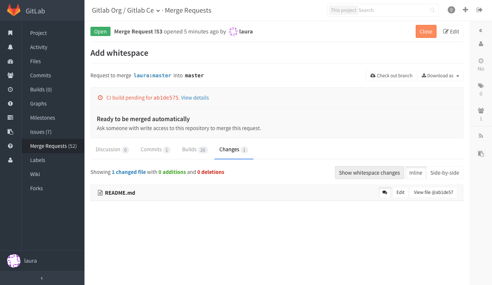
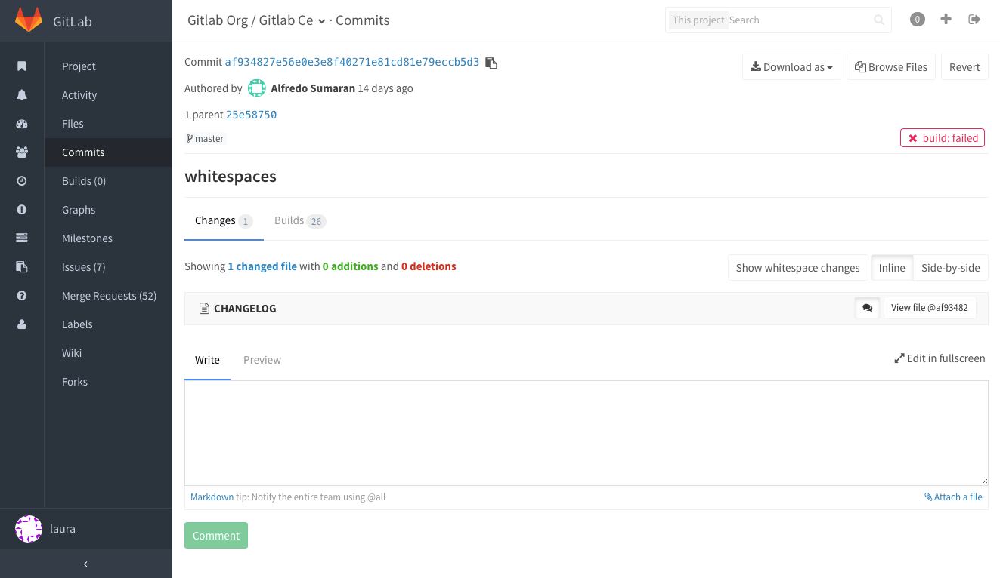

# Merge Requests

Merge requests allow you to exchange changes you made to source code

## Only allow merge requests to be merged if the build succeeds

You can prevent merge requests from being merged if their build did not succeed
in the project settings page.


Navigate to project settings page and select the `Only allow merge requests to be merged if the build succeeds` check box.

Please note that you need to have builds configured to enable this feature.

## Checkout merge requests locally

### By adding a git alias

Add the following alias to your `~/.gitconfig`:

```
[alias]
    mr = !sh -c 'git fetch $1 merge-requests/$2/head:mr-$1-$2 && git checkout mr-$1-$2' -
```

Now you can check out a particular merge request from any repository and any remote, e.g. to check out a merge request number 5 as shown in GitLab from the `upstream` remote, do:

```
$ git mr upstream 5
```

This will fetch the merge request into a local `mr-upstream-5` branch and check it out.

### By modifying `.git/config` for a given repository

Locate the section for your GitLab remote in the `.git/config` file. It looks like this:

```
[remote "origin"]
  url = https://gitlab.com/gitlab-org/gitlab-ce.git
  fetch = +refs/heads/*:refs/remotes/origin/*
```

Now add the line `fetch = +refs/merge-requests/*/head:refs/remotes/origin/merge-requests/*` to this section.

It should look like this:

```
[remote "origin"]
  url = https://gitlab.com/gitlab-org/gitlab-ce.git
  fetch = +refs/heads/*:refs/remotes/origin/*
  fetch = +refs/merge-requests/*/head:refs/remotes/origin/merge-requests/*
```

Now you can fetch all the merge requests:

```
$ git fetch origin
From https://gitlab.com/gitlab-org/gitlab-ce.git
 * [new ref]         refs/merge-requests/1/head -> origin/merge-requests/1
 * [new ref]         refs/merge-requests/2/head -> origin/merge-requests/2
...
```

To check out a particular merge request:

```
$ git checkout origin/merge-requests/1
```

## Ignore whitespace changes in Merge Request diff view


If you click the "Hide whitespace changes" button, you can see the diff without whitespace changes.



It is also working on commits compare view.



## Merge Requests versions

Every time you push to merge request branch, a new version of merge request diff
is created. When you visit the merge request page you see latest version of changes.
However you can select an older one from version dropdown


