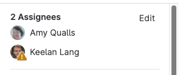

DETAILS:
**Tier:** Free, Premium, Ultimate
**Offering:** GitLab.com, GitLab Self-Managed, GitLab Dedicated

> - Sidebar actions menu [changed](https://gitlab.com/gitlab-org/gitlab/-/issues/373757) to also move actions on issues, incidents, and epics in GitLab 16.0.
> - [Generally available](https://gitlab.com/gitlab-org/gitlab/-/merge_requests/127001) in GitLab 16.9. Feature flag `moved_mr_sidebar` removed.

A merge request (MR) is a proposal to incorporate changes from a source branch to a target branch.

When you open a merge request, you can visualize and collaborate on the changes before merge.
Merge requests include:

- A description of the request.
- Code changes and inline code reviews.
- Information about CI/CD pipelines.
- A comment section for discussion threads.
- The list of commits.

## Create a merge request

Learn the various ways to [create a merge request](creating_merge_requests.md).

### Use merge request templates

When you create a merge request, GitLab checks for the existence of a
[description template](../description_templates.md) to add data to your merge request.
GitLab checks these locations in order from 1 to 5, and applies the first template
found to your merge request:

| Name | Project UI setting | Group `default.md` | Instance `default.md` | Project `default.md` | No template |
| :-- | :--: | :--: | :--: | :--: | :--: |
| Standard commit message | 1 | 2 | 3 | 4 | 5 |
| Commit message with an [issue closing pattern](../issues/managing_issues.md#closing-issues-automatically) like `Closes #1234` | 1 | 2 | 3 | 4 | 5 \* |
| Branch name [prefixed with an issue ID](../repository/branches/_index.md#prefix-branch-names-with-issue-numbers), like `1234-example` | 1 \* | 2 \* | 3 \* | 4 \* | 5 \* |

NOTE:
Items marked with an asterisk (\*) also append an [issue closing pattern](../issues/managing_issues.md#closing-issues-automatically).

## View merge requests

You can view merge requests for your project, group, or yourself.

::Tabs

:::TabTitle You're participating in

To view all merge requests on the homepage, use the <kbd>Shift</kbd> + <kbd>m</kbd>
[keyboard shortcut](../../shortcuts.md), or:

1. On the left sidebar, select the **Merge requests** icon.

or:

1. On the left sidebar, select **Search or go to**.
1. From the dropdown list, select **Merge requests**.

:::TabTitle For a project

To view all merge requests for a project:

1. On the left sidebar, select **Search or go to** and find your project.
1. Select **Code > Merge requests**.

Or, to use a [keyboard shortcut](../../shortcuts.md), press <kbd>g</kbd> + <kbd>m</kbd>.

:::TabTitle For all projects in a group

To view merge requests for all projects in a group:

1. On the left sidebar, select **Search or go to** and find your group.
1. Select **Code > Merge requests**.

If your group contains subgroups, this view also displays merge requests from the subgroup projects.

::EndTabs

## Filter the list of merge requests

> - Filtering by `source-branch` [introduced](https://gitlab.com/gitlab-org/gitlab/-/merge_requests/134555) in GitLab 16.6.
> - Filtering by `merged-by` [introduced](https://gitlab.com/gitlab-org/gitlab/-/merge_requests/140002) in GitLab 16.9. Available only when the feature flag `mr_merge_user_filter` is enabled.
> - Filtering by `merged-by` [generally available](https://gitlab.com/gitlab-org/gitlab/-/merge_requests/142666) in GitLab 17.0. Feature flag `mr_merge_user_filter` removed.

To filter the list of merge requests:

1. On the left sidebar, select **Search or go to** and find your project.
1. Select **Code > Merge requests**.
1. Above the list of merge requests, select **Search or filter results**.
1. From the dropdown list, select the attribute you wish to filter by. Some examples:
   - [**By environment or deployment date**](#by-environment-or-deployment-date).
   - **ID**: Enter filter `#30` to return only merge request 30.
   - User filters: Type (or select from the dropdown list) any of these filters to display a list of users:
     - **Approved-By**, for merge requests already approved by a user. Premium and Ultimate only.
     - **Approver**, for merge requests that this user is eligible to approve.
       (For more information, read about [Code owners](../codeowners/_index.md)). Premium and Ultimate only.
     - **Merged-By**, for merge requests merged by this user.
     - **Reviewer**, for merge requests reviewed by this user.
1. Select or type the operator to use for filtering the attribute. The following operators are
   available:
   - `=`: Is
   - `!=`: Is not
1. Enter the text to filter the attribute by.
   You can filter some attributes by **None** or **Any**.
1. Repeat this process to filter by more attributes, joined by a logical
   `AND`.
1. Select a **Sort direction**, either **{sort-lowest}** for descending order,
   or **{sort-highest}** for ascending order.

### By environment or deployment date

To filter merge requests by deployment data, such as the environment or a date,
you can type (or select from the dropdown list) the following:

- Environment
- Deployed-before
- Deployed-after

NOTE:
Projects using a [fast-forward merge method](methods/_index.md#fast-forward-merge)
do not return results, as this method does not create a merge commit.

When filtering by an environment, a dropdown list presents all environments that
you can choose from.

When filtering by `Deployed-before` or `Deployed-after`:

- The date refers to when the deployment to an environment (triggered by the
  merge commit) completed successfully.
- You must enter the deploy date manually.
- Deploy dates use the format `YYYY-MM-DD`. Wrap them in double quotes (`"`)
  if you want to specify both a date and time (`"YYYY-MM-DD HH:MM"`).

## Add changes to a merge request

If you have permission to add changes to a merge request, you can add your changes
to an existing merge request in several ways. These ways depend on the complexity of your
change, and whether you need access to a development environment:

- [Edit changes in the Web IDE](../web_ide/_index.md) in your browser with the
  <kbd>.</kbd> [keyboard shortcut](../../shortcuts.md). Use this
  browser-based method to edit multiple files, or if you are not comfortable with Git commands.
  You cannot run tests from the Web IDE.
- [Edit changes in Gitpod](../../../integration/gitpod.md#launch-gitpod-in-gitlab), if you
  need a fully-featured environment to both edit files, and run tests afterward. Gitpod
  supports running the [GitLab Development Kit (GDK)](https://gitlab.com/gitlab-org/gitlab-development-kit).
  To use Gitpod, you must [enable Gitpod in your user account](../../../integration/gitpod.md#enable-gitpod-in-your-user-preferences).
- [Push changes from the command line](../../../topics/git/commands.md), if you are
  familiar with Git and the command line.

## Assign a user to a merge request

To assign the merge request to a user, use the `/assign @user`
[quick action](../quick_actions.md#issues-merge-requests-and-epics) in a text area in
a merge request, or:

1. On the left sidebar, select **Search or go to** and find your project.
1. Select **Code > Merge requests** and find your merge request.
1. On the right sidebar, expand the right sidebar and locate the **Assignees** section.
1. Select **Edit**.
1. Search for the user you want to assign, and select the user. GitLab Free allows one
   assignee per merge request, but GitLab Premium and GitLab Ultimate allow multiple assignees:

   

GitLab adds the merge request to the user's **Assigned merge requests** page.

## Merge a merge request

During the [merge request review process](reviews/_index.md), reviewers provide
feedback on your changes. When a reviewer is satisfied with the changes,
they can enable [auto-merge](auto_merge.md), even if some merge checks are failing.
After all merge checks pass, the merge request is automatically merged, without further action from you.

Default merge permissions:

- The default branch, typically `main`, is protected.
- Only Maintainers and higher roles can merge into the default branch.
- Developers can merge any merge requests targeting non-protected branches.

To determine if you have permission to merge a specific merge request, GitLab checks:

- Your [role in the project](../../permissions.md#roles). For example, Developer, Maintainer, or Owner.
- The [branch protections](../repository/branches/protected.md) of the target branch.

## Close a merge request

If you decide to permanently stop work on a merge request, close it rather than
[deleting it](manage.md#delete-a-merge-request).

Prerequisites:

- You must be the author or assignees of the merge request, or
- You must have the Developer, Maintainer, or Owner [roles](../../permissions.md) in a project.

To close merge requests in the project:

1. On the left sidebar, select **Search or go to** and find your project.
1. Select **Code > Merge requests** and find your merge request.
1. Scroll to the comment box at the bottom of the page.
1. Following the comment box, select **Close merge request**.

GitLab closes the merge request, but preserves records of the merge request,
its comments, and any associated pipelines.

### Delete the source branch on merge

You can delete the source branch for a merge request:

- When you create a merge request, by selecting **Delete source branch when merge request accepted**.
- When you merge a merge request, if you have the Maintainer role, by selecting **Delete source branch**.

An administrator can make this option the default in the project's settings.

The delete-branch action is performed by the user who sets auto-merge, or merges the merge request.
If the user lacks the correct role, such as in a forked project, the source branch deletion fails.

### Update merge requests when target branch merges

DETAILS:
**Tier:** Free, Premium, Ultimate
**Offering:** GitLab.com, GitLab Self-Managed, GitLab Dedicated

Merge requests are often chained together, with one merge request depending on
the code added or changed in another merge request. To support keeping individual
merge requests small, GitLab can update up to four open merge requests when their
target branch merges into `main`. For example:

- **Merge request 1**: merge `feature-alpha` into `main`.
- **Merge request 2**: merge `feature-beta` into `feature-alpha`.

If these merge requests are open at the same time, and merge request 1 (`feature-alpha`)
merges into `main`, GitLab updates the destination of merge request 2 from `feature-alpha`
to `main`.

Merge requests with interconnected content updates are usually handled in one of these ways:

- Merge request 1 merges into `main` first. Merge request 2 is then
  retargeted to `main`.
- Merge request 2 merges into `feature-alpha`. The updated merge request 1, which
  now contains the contents of `feature-alpha` and `feature-beta`, merges into `main`.

This feature works only when a merge request is merged. Selecting **Remove source branch**
after merging does not retarget open merge requests. This improvement is
[proposed as a follow-up](https://gitlab.com/gitlab-org/gitlab/-/issues/321559).

## Merge request workflows

For a software developer working in a team:

1. You check out a new branch, and submit your changes through a merge request.
1. You gather feedback from your team.
1. You work on the implementation optimizing code with [Code Quality reports](../../../ci/testing/code_quality.md).
1. You verify your changes with [Unit test reports](../../../ci/testing/unit_test_reports.md) in GitLab CI/CD.
1. You avoid using dependencies whose license is not compatible with your project with [License approval policies](../../compliance/license_approval_policies.md).
1. You request the [approval](approvals/_index.md) from your manager.
1. Your manager:
   1. Pushes a commit with their final review.
   1. [Approves the merge request](approvals/_index.md).
   1. Sets it to [auto-merge](auto_merge.md) (formerly **Merge when pipeline succeeds**).
1. Your changes get deployed to production with [manual jobs](../../../ci/jobs/job_control.md#create-a-job-that-must-be-run-manually) for GitLab CI/CD.
1. Your implementations were successfully shipped to your customer.

For a web developer writing a webpage for your company's website:

1. You check out a new branch and submit a new page through a merge request.
1. You gather feedback from your reviewers.
1. You preview your changes with [review apps](../../../ci/review_apps/_index.md).
1. You request your web designers for their implementation.
1. You request the [approval](approvals/_index.md) from your manager.
1. After approval, GitLab:
   - [Squashes](squash_and_merge.md) the commits.
   - Merges the commit.
   - [Deployed the changes to staging with GitLab Pages](https://about.gitlab.com/blog/2021/02/05/ci-deployment-and-environments/).
1. Your production team [cherry-picks](cherry_pick_changes.md) the merge commit into production.

## Filter activity in a merge request

> - [Introduced](https://gitlab.com/gitlab-org/gitlab/-/merge_requests/115383) in GitLab 15.11 [with a flag](../../../administration/feature_flags.md) named `mr_activity_filters`. Disabled by default.
> - [Enabled on GitLab.com](https://gitlab.com/gitlab-org/gitlab/-/issues/387070) in GitLab 16.0.
> - [Enabled on GitLab Self-Managed](https://gitlab.com/gitlab-org/gitlab/-/merge_requests/126998) in GitLab 16.3 by default.
> - [Generally available](https://gitlab.com/gitlab-org/gitlab/-/merge_requests/132355) in GitLab 16.5. Feature flag `mr_activity_filters` removed.
> - Filtering bot comments [introduced](https://gitlab.com/gitlab-org/gitlab/-/merge_requests/128473) in GitLab 16.9.

To understand the history of a merge request, filter its activity feed to show you
only the items that are relevant to you.

1. On the left sidebar, select **Search or go to** and find your project.
1. Select **Code > Merge requests**.
1. Select a merge request.
1. Scroll to **Activity**.
1. On the right side of the page, select **Activity filter** to show the filter options.
   If you've already selected filter options, this field shows a summary of your
   choices, like **Activity + 5 more**.
1. Select the types of activity you want to see. Options include:

   - Assignees & Reviewers
   - Approvals
   - Comments (from bots)
   - Comments (from users)
   - Commits & branches
   - Edits
   - Labels
   - Lock status
   - Mentions
   - Merge request status
   - Tracking

1. Optional. Select **Sort** (**{sort-lowest}**) to reverse the sort order.

Your selection persists across all merge requests. You can also change the
sort order by clicking the sort button on the right.

## Resolve a thread

When you want to finish a conversation in a merge request,
[resolve a thread](../../discussions/_index.md#resolve-a-thread).

GitLab shows the number of unresolved threads in the top right corner of a
merge request, like this: **7 unresolved threads**.

### Move all unresolved threads in a merge request to an issue

If you have multiple unresolved threads in a merge request, you can
create an issue to resolve them separately:

1. On the left sidebar, select **Search or go to** and find your project.
1. Select **Code > Merge requests** and find your merge request.
1. In the merge request, in the top right, find the **Unresolved threads**
   dropdown list, and select **Thread options** (**{ellipsis_v}**).
1. Select **Resolve all with new issue**.
1. Fill out the fields in the new issue, and select **Create issue**.

GitLab marks all threads as resolved, and adds a link from the merge request to
the newly created issue.

### Move one unresolved thread in a merge request to an issue

If you have one specific unresolved thread in a merge request, you can
create an issue to resolve it separately:

1. On the left sidebar, select **Search or go to** and find your project.
1. Select **Code > Merge requests** and find your merge request.
1. In the merge request, find the thread you want to move.
1. Below the last reply to the thread, next to **Resolve thread**, select
   **Create issue to resolve thread** (**{issue-new}**).
1. Fill out the fields in the new issue, and select **Create issue**.

GitLab marks the thread as resolved, and adds a link from the merge request to
the newly created issue.

### Prevent merge unless all threads are resolved

You can prevent merge requests from merging while threads remain unresolved.
When you enable this setting, the **Unresolved threads** counter in a merge request
is shown in orange while at least one thread remains unresolved.

1. On the left sidebar, select **Search or go to** and find your project.
1. Select **Settings > Merge requests**.
1. In the **Merge checks** section, select the **All threads must be resolved** checkbox.
1. Select **Save changes**.

### Automatically resolve threads in a merge request when they become outdated

You can set merge requests to automatically resolve threads when a new push
changes the lines they describe.

1. On the left sidebar, select **Search or go to** and find your project.
1. Select **Settings > Merge requests**.
1. In the **Merge options** section, select
   **Automatically resolve merge request diff threads when they become outdated**.
1. Select **Save changes**.

Threads are now resolved if a push makes a diff section outdated.
Threads on lines that don't change and top-level resolvable threads are not resolved.

## Move notifications and to-dos

DETAILS:
**Tier:** Free, Premium, Ultimate
**Offering:** GitLab Self-Managed

> - [Introduced](https://gitlab.com/gitlab-org/gitlab/-/merge_requests/132678) in GitLab 16.5 [with a flag](../../../administration/feature_flags.md) named `notifications_todos_buttons`. Disabled by default.
> - [Issues, incidents](https://gitlab.com/gitlab-org/gitlab/-/merge_requests/133474), and [epics](https://gitlab.com/gitlab-org/gitlab/-/merge_requests/133881) also updated.

FLAG:
On GitLab Self-Managed, by default this feature is not available. To make it available, an administrator can [enable the feature flag](../../../administration/feature_flags.md) named `notifications_todos_buttons`.
On GitLab.com and GitLab Dedicated, this feature is not available.

Enabling this feature flag moves the notifications and to-do item buttons to the upper right corner of the page.

- On merge requests, these buttons are shown to the far right of the tabs.
- On issues, incidents, and epics, these buttons are shown at the top of the right sidebar.

## Related topics

- [Create a merge request](creating_merge_requests.md)
- [Review a merge request](reviews/_index.md)
- [Authorization for merge requests](authorization_for_merge_requests.md)
- [Testing and reports](../../../ci/testing/_index.md)
- [GitLab keyboard shortcuts](../../shortcuts.md)
- [Comments and threads](../../discussions/_index.md)
- [Suggest code changes](reviews/suggestions.md)
- [CI/CD pipelines](../../../ci/_index.md)
- [Push options](../../../topics/git/commit.md) for merge requests
