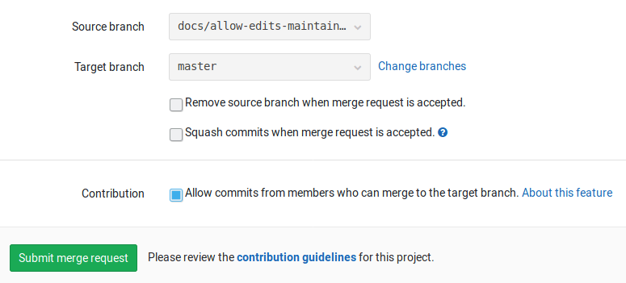
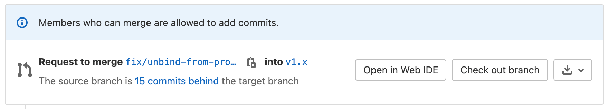

# Allow collaboration on merge requests across forks

> [Introduced](https://gitlab.com/gitlab-org/gitlab-ce/merge_requests/17395) in GitLab 10.6.

When a user opens a merge request from a fork, they are given the option to allow
upstream members to collaborate with them on the source branch. This allows
the members of the upstream project to make small fixes or rebase branches
before merging, reducing the back and forth of accepting external contributions.

This feature is available for merge requests across forked projects that are
publicly accessible.

When enabled for a merge request, members with merge access to the target
branch of the project will be granted write permissions to the source branch
of the merge request.

## Enabling commit edits from upstream members

The feature can only be enabled by users who already have push access to the
source project and only lasts while the merge request is open. Once enabled,
upstream members will also be able to retry the pipelines and jobs of the
merge request:

1. Enable the contribution while creating or editing a merge request.

   

1. Once the merge request is created, you'll see that commits from members who
   can merge to the target branch are allowed.

   

## Pushing to the fork as the upstream member

If the creator of the merge request has enabled contributions from upstream
members, you can push directly to the branch of the forked repository.

Assuming that:

- The forked project URL is `git@gitlab.com:thedude/awesome-project.git`.
- The branch of the merge request is `update-docs`.

Here's how the process would look like:

1. First, you need to get the changes that the merge request has introduced.
   Click the **Check out branch** button that has some pre-populated
   commands that you can run.

   

1. Use the copy to clipboard button to copy the first command and paste them
   in your terminal:

   ```sh
   git fetch git@gitlab.com:thedude/awesome-project.git update-docs
   git checkout -b thedude-awesome-project-update-docs FETCH_HEAD
   ```

   This will fetch the branch of the forked project and then create a local branch
   based off the fetched branch.

1. Make any changes you want and commit.
1. Push to the forked project:

   ```sh
   git push git@gitlab.com:thedude/awesome-project.git thedude-awesome-project-update-docs:update-docs
   ```

   Note the colon (`:`) between the two branches. The above command will push the
   local branch `thedude-awesome-project-update-docs` to the
   `update-docs` branch of the `git@gitlab.com:thedude/awesome-project.git` repository.

<!-- ## Troubleshooting

Include any troubleshooting steps that you can foresee. If you know beforehand what issues
one might have when setting this up, or when something is changed, or on upgrading, it's
important to describe those, too. Think of things that may go wrong and include them here.
This is important to minimize requests for support, and to avoid doc comments with
questions that you know someone might ask.

Each scenario can be a third-level heading, e.g. `### Getting error message X`.
If you have none to add when creating a doc, leave this section in place
but commented out to help encourage others to add to it in the future. -->
