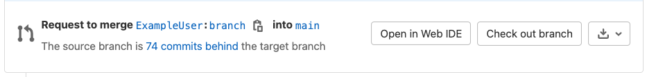

# Allow collaboration on merge requests across forks **(FREE)**

> [Introduced](https://gitlab.com/gitlab-org/gitlab-foss/-/merge_requests/17395) in GitLab 10.6.

When a user opens a merge request from a fork, they are given the option to allow
upstream members to collaborate with them on the source branch. This allows
the members of the upstream project to make small fixes or rebase branches
before merging, reducing the back and forth of accepting external contributions.

This feature is available for merge requests across forked projects that are
publicly accessible.

When enabled for a merge request, members with merge access to the target
branch of the project is granted write permissions to the source branch
of the merge request.

## Enabling commit edits from upstream members

In [GitLab 13.7 and later](https://gitlab.com/gitlab-org/gitlab/-/issues/23308),
this setting is enabled by default. It can be changed by users with the
Developer [role](../../permissions.md) for the source project. After it's enabled,
upstream members can retry the pipelines and jobs of the merge request:

1. While creating or editing a merge request, scroll to **Contribution** and
   then select the **Allow commits from members who can merge to the target branch**.
   checkbox.
1. Finish creating your merge request.

After you create the merge request, the merge request widget displays a message:
**Members who can merge are allowed to add commits.**

## Pushing to the fork as the upstream member

If the creator of the merge request has enabled contributions from upstream
members, you can push directly to the branch of the forked repository.

Assuming that:

- The forked project URL is `git@gitlab.com:thedude/awesome-project.git`.
- The branch of the merge request is `update-docs`.

To find and work with the changes from the fork:

1. Open the merge request page, and select the **Overview** tab.
1. Scroll to the merge request widget, and select **Check out branch**:
   
1. In the modal window, select **{copy-to-clipboard}** (**Copy**) for step 1
   to copy the `git fetch` and `git checkout` instructions to your clipboard.
   Paste the commands (which look like this example) into your terminal:

   ```shell
   git fetch git@gitlab.com:thedude/awesome-project.git update-docs
   git checkout -b thedude-awesome-project-update-docs FETCH_HEAD
   ```

   These commands fetch the branch from the forked project, and create a local branch
   based off the fetched branch.

1. Make your changes to the local copy of the branch, and then commit them.
1. In your terminal, push your local changes back up to the forked project. This
   command pushes the local branch `thedude-awesome-project-update-docs` to the
   `update-docs` branch of the `git@gitlab.com:thedude/awesome-project.git` repository:

   ```shell
   git push git@gitlab.com:thedude/awesome-project.git thedude-awesome-project-update-docs:update-docs
   ```

   Note the colon (`:`) between the two branches.

## Troubleshooting

### Pipeline status unavailable from MR page of forked project

When a user forks a project, the permissions of the forked copy are not copied
from the original project. The creator of the fork must grant permissions to the
forked copy before members in the upstream project can view or merge the changes
in the merge request.

To see the pipeline status from the merge request page of a forked project
going back to the original project:

1. Create a group containing all the upstream members.
1. Go to the **Project information > Members** page in the forked project and invite the newly-created
   group to the forked project.

<!-- ## Troubleshooting
Include any troubleshooting steps that you can foresee. If you know beforehand what issues
one might have when setting this up, or when something is changed, or on upgrading, it's
important to describe those, too. Think of things that may go wrong and include them here.
This is important to minimize requests for support, and to avoid doc comments with
questions that you know someone might ask.

Each scenario can be a third-level heading, e.g. `### Getting error message X`.
If you have none to add when creating a doc, leave this section in place
but commented out to help encourage others to add to it in the future. -->
