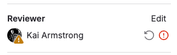

DETAILS:
**Tier:** Free, Premium, Ultimate
**Offering:** GitLab.com, GitLab Self-Managed, GitLab Dedicated

To set up a review process for changes in your project, configure merge request approvals.
They help to ensure that changes are reviewed before they're merged into your project.
You can configure approvals to be optional or required, depending on your project's needs and GitLab tier.

- [GitLab Free](https://about.gitlab.com/pricing/) allows
  all users with at least the Developer [role](../../../permissions.md) to
  approve merge requests. These approvals are optional and don't prevent merging without approval.
- [GitLab Premium](https://about.gitlab.com/pricing/) and
  [GitLab Ultimate](https://about.gitlab.com/pricing/) provide you with more
  flexibility to:

  - Create required [rules](rules.md) about the number and type of required approvals.
  - Create a list of [Code Owners](../../codeowners/_index.md) for specific files.
  - Configure approvals
    [for the entire instance](../../../../administration/merge_requests_approvals.md).
  - Configure  [group merge request approval settings](../../../group/manage.md#group-merge-request-approval-settings).

    NOTE:
    Support for group merge request approval settings is tracked in
    [epic 4367](https://gitlab.com/groups/gitlab-org/-/epics/4367).

## Configure approval rules

Prerequisites:

- You must have at least the Developer role for the project.

To configure approval rules:

1. Go to your project's **Settings > Merge requests**.
1. Go to the **Merge request approvals** section.
1. Set up your desired rules.

You can also configure:

- Additional [merge request approval settings](settings.md) for more control of the
  level of oversight and security your project needs.
- Merge request approval rules with the
  [Merge request approvals API](../../../../api/merge_request_approvals.md).

For more information on configuring rules, see [Approval rules](rules.md).

### Required approvals

DETAILS:
**Tier:** Premium, Ultimate
**Offering:** GitLab.com, GitLab Self-Managed, GitLab Dedicated

Required approvals enforce code reviews by specified users. Without these approvals, merging is not possible.

Use cases include:

- Enforce review of all code that gets merged into a repository.
- Specify reviewers and a minimum number of approvals.
- Specify categories of reviewers, such as backend, frontend, quality assurance, database, or documentation.
- Use the [Code Owners](../../codeowners/_index.md) files to determine reviewers.
- Require approval for [declining test coverage](../../../../ci/testing/code_coverage/_index.md#add-a-coverage-check-approval-rule).
- GitLab Ultimate: [Require security team approval](../../../application_security/_index.md#security-approvals-in-merge-requests) for potential vulnerabilities.

## View approval status

You can see the approval status of a merge request in two places. On the [merge request itself](#for-a-single-merge-request)
and in the [list of merge requests](#in-the-list-of-merge-requests) for your project or group.

### For a single merge request

[Eligible approvers](rules.md#eligible-approvers) can view the approval status on a single merge request.

To view the approval status:

1. On the left sidebar, select **Search or go to** and find your project.
1. Go to **Code > Merge requests** and find your merge request.
1. To view the merge request, select its title.
1. Go to the merge request widget to see the approval status. In this example, you can approve the merge request:

   

The widget displays one of these statuses:

- **Approve**: The merge request needs more approvals.
- **Approve additionally**: The merge request has the required approvals.
- **Revoke approval**: You have already approved the merge request.

To check if your approval satisfies Code Owner requirements, select **Expand eligible approvers** (**{chevron-lg-down}**).

### In the list of merge requests

The list of merge requests for [your project or group](../_index.md#view-merge-requests)
shows the approval status for each merge request:

| Example | Description |
| :-----: | :---------- |
|  | Required approvals are missing. (**{approval}**) |
|  | Approvals are satisfied. (**{check}**) |
|  | Approvals are satisfied, and you are one of the approvers. (**{approval-solid}**) |

### Individual reviewer status

To see the review and approval status for each reviewer:

1. Open the merge request.
1. Check the right sidebar.

Each reviewer's status is shown next to the their name.

- **{dash-circle}** Awaiting review
- **{status_running}** Review in progress
- **{check-circle}** Approved
- **{comment-lines}** Reviewer commented
- **{status_warning}** Reviewer requested changes

   

To [re-request a review](../reviews/_index.md#re-request-a-review), select the **Re-request a review** icon (**{redo}**) next to the user.

## Approve a merge request

Eligible approvers can approve merge requests in two ways:

1. Select **Approve** in the merge request widget.
1. Use the `/approve` [quick action](../../quick_actions.md) in a comment.

Approved merge requests display a green check mark (**{check-circle-filled}**) next to the user's name in the reviewer list.
After a merge request receives the required approvals, it is ready to merge, unless it's blocked due to:

- [Merge conflicts](../conflicts.md)
- [Unresolved threads](../_index.md#prevent-merge-unless-all-threads-are-resolved)
- [Failed CI/CD pipeline](../auto_merge.md)

### Prevent author approval

To prevent merge request authors from approving their own work, enable the [Prevent approval by author](settings.md#prevent-approval-by-author) setting.

### Approval rule changes

If you enable [approval rule overrides](settings.md#prevent-editing-approval-rules-in-merge-requests), changes to default approval rules
don't affect existing merge requests, except for [target branch](rules.md#approvals-for-protected-branches) changes.

## Invalid rules

> - [Introduced](https://gitlab.com/gitlab-org/gitlab/-/issues/334698) in GitLab 15.1.
> - [Changed](https://gitlab.com/gitlab-org/gitlab/-/issues/389905) in GitLab 15.11 [with a flag](../../../../administration/feature_flags.md) named `invalid_scan_result_policy_prevents_merge`. Disabled by default.
> - [Generally available](https://gitlab.com/gitlab-org/gitlab/-/issues/405023) in GitLab 16.2. Feature flag `invalid_scan_result_policy_prevents_merge` removed.

GitLab marks approval rules as **Auto approved** when they're impossible to satisfy, such as when:

- The only eligible approver is the merge request author.
- No eligible approvers are assigned to the rule.
- The required approvals exceed the number of eligible approvers.

These rules are automatically approved to unblock merge requests, unless you created rules through a
[merge request approval policy](../../../application_security/policies/merge_request_approval_policies.md).

Invalid policy-created rules:

- Display as **Action required**.
- Are not automatically approved.
- Block affected merge requests.

## Related topics

- [Merge request approvals API](../../../../api/merge_request_approvals.md)
- [Instance approval rules](../../../../administration/merge_requests_approvals.md) for GitLab Self-Managed instances
- [Enable approval permissions for users with the Reporter role](rules.md#enable-approval-permissions-for-users-with-the-reporter-role)
- [Edit or override merge request approval rules](rules.md#edit-or-override-merge-request-approval-rules)
