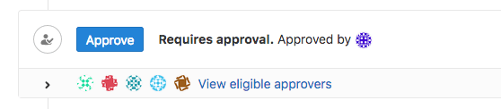
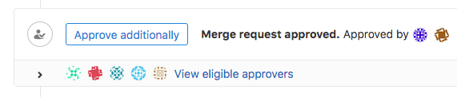

# Merge Request Approvals **(FREE)**

> - [Introduced](https://gitlab.com/gitlab-org/gitlab/-/issues/580) in GitLab Enterprise Edition 7.2. Available in GitLab Free and higher tiers.
> - Redesign [introduced](https://gitlab.com/gitlab-org/gitlab/-/issues/1979) in [GitLab Premium](https://about.gitlab.com/pricing/) 11.8 and [feature flag removed](https://gitlab.com/gitlab-org/gitlab/-/issues/10685) in 12.0.

Code review is an essential practice of every successful project. Approving a
merge request is an important part of the review
process, as it clearly communicates the ability to merge the change.
A [merge request approvals API](../../../../api/merge_request_approvals.md) is also available.

## Optional Approvals

> [Introduced](https://gitlab.com/gitlab-org/gitlab/-/issues/27426) in GitLab 13.2.

Any user with Developer or greater [permissions](../../../permissions.md) can approve a merge request in GitLab Free and higher tiers.
This provides a consistent mechanism for reviewers to approve merge requests, and ensures
maintainers know a change is ready to merge. Approvals in Free are optional, and do
not prevent a merge request from being merged when there is no approval.

## External approvals **(ULTIMATE)**

> - [Introduced](https://gitlab.com/groups/gitlab-org/-/epics/3869) in GitLab Ultimate 13.10.
> - It's [deployed behind a feature flag](../../../feature_flags.md), disabled by default.
> - It's disabled on GitLab.com.
> - It's not recommended for production use.
> - To use it in GitLab self-managed instances, ask a GitLab administrator to [enable it](../../../../api/merge_request_approvals.md#enable-or-disable-external-project-level-mr-approvals). **(ULTIMATE SELF)**

WARNING:
This feature might not be available to you. Check the **version history** note above for details.

When you create an external approval rule, the following merge request actions sends information
about a merge request to a third party service:

- Create
- Change
- Close

This action enables use-cases such as:

- Integration with 3rd party workflow tools, such as [ServiceNow](https://www.servicenow.co.uk/).
- Integration with custom tools designed to approve merge requests from outside of GitLab.

You can find more information about use-cases, development timelines and the feature discovery in
the [External API approval rules epic](https://gitlab.com/groups/gitlab-org/-/epics/3869).

The intention for this feature is to allow those 3rd party tools to approve a merge request similarly to how users current do.

NOTE:
The lack of an external approval does not block the merging of a merge request.

You can modify external approval rules through the [REST API](../../../../api/merge_request_approvals.md#external-project-level-mr-approvals).

## Required Approvals **(PREMIUM)**

> - [Introduced](https://about.gitlab.com/releases/2015/06/22/gitlab-7-12-released/#merge-request-approvers-ee-only) in GitLab Enterprise Edition 7.12.
> - Moved to GitLab Premium in 13.9.

Required approvals enable enforced code review by requiring specified people
to approve a merge request before it can be merged.

Required approvals enable multiple use cases:

- Enforcing review of all code that gets merged into a repository.
- Specifying reviewers for a given proposed code change, as well as a minimum number
  of reviewers, through [Approval rules](rules.md).
- Specifying categories of reviewers, such as backend, frontend, quality assurance,
  database, and so on, for all proposed code changes.
- Designating [Code Owners as eligible approvers](rules.md#code-owners-as-eligible-approvers),
  determined by the files changed in a merge request.
- [Requiring approval from a security team](../../../application_security/index.md#security-approvals-in-merge-requests)
  before merging code that could introduce a vulnerability.**(ULTIMATE)**

### Adding or removing an approval

When an [eligible approver](rules.md#eligible-approvers) visits an open merge request,
one of the following is possible:

- If the required number of approvals has _not_ been yet met, they can approve
  it by clicking the displayed **Approve** button.

  

- If the required number of approvals has already been met, they can still
  approve it by clicking the displayed **Approve additionally** button.

  

- **They have already approved this merge request**: They can remove their approval.

  

When [approval rule overrides](settings.md#prevent-overriding-default-approvals) are allowed,
changes to default approval rules will **not** be applied to existing
merge requests, except for changes to the [target branch](rules.md#scoped-to-protected-branch)
of the rule.

NOTE:
The merge request author is not allowed to approve their own merge request if
[**Prevent author approval**](settings.md#allowing-merge-request-authors-to-approve-their-own-merge-requests)
is enabled in the project settings.

After the approval rules have been met, the merge request can be merged if there is nothing
else blocking it. Note that the merge request could still be blocked by other conditions,
such as merge conflicts, [pending discussions](../../../discussions/index.md#only-allow-merge-requests-to-be-merged-if-all-threads-are-resolved),
or a [failed CI/CD pipeline](../merge_when_pipeline_succeeds.md).

<!-- ## Troubleshooting

Include any troubleshooting steps that you can foresee. If you know beforehand what issues
one might have when setting this up, or when something is changed, or on upgrading, it's
important to describe those, too. Think of things that may go wrong and include them here.
This is important to minimize requests for support, and to avoid doc comments with
questions that you know someone might ask.

Each scenario can be a third-level heading, e.g. `### Getting error message X`.
If you have none to add when creating a doc, leave this section in place
but commented out to help encourage others to add to it in the future. -->
