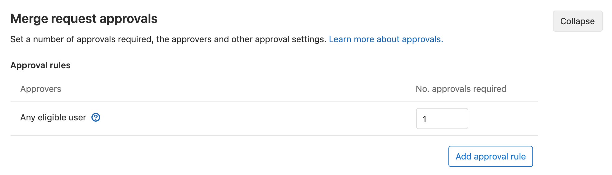

# Merge request approval rules **(PREMIUM)**

Approval rules define how many [approvals](index.md) a merge request must receive before it can
be merged, and which users should do the approving. You can define approval rules:

- [As project defaults](#add-an-approval-rule).
- [Per merge request](#edit-or-override-merge-request-approval-rules).
- [At the instance level](../../../admin_area/merge_requests_approvals.md)

If you don't define a [default approval rule](#add-an-approval-rule),
any user can approve a merge request. Even if you don't define a rule, you can still
enforce a [minimum number of required approvers](settings.md) in the project's settings.

You can define a single rule to approve merge requests from among the available
rules, or you can select [multiple approval rules](#add-multiple-approval-rules).

Merge requests that target a different project, such as from a fork to the upstream project,
use the default approval rules from the target (upstream) project, not the source (fork).

## Add an approval rule

To add a merge request approval rule:

1. Go to your project and select **Settings > General**.
1. Expand **Merge request (MR) approvals**, and then select **Add approval rule**.
1. Add a human-readable **Rule name**.
1. Set the number of required approvals in **Approvals required**. A value of `0` makes
   [the rule optional](#configure-optional-approval-rules), and any number greater than `0`
   creates a required rule.
1. To add users or groups as approvers, search for users or groups that are
   [eligible to approve](#eligible-approvers), and select **Add**. GitLab suggests approvers based on
   previous authors of the files changed by the merge request.

     NOTE:
     On GitLab.com, you can add a group as an approver if you're a member of that group or the
     group is public.

1. Select **Add approval rule**.

Users of GitLab Premium and higher tiers can create [additional approval rules](#add-multiple-approval-rules).

Your configuration for approval rule overrides determines if the new rule is applied
to existing merge requests:

- If [approval rule overrides](settings.md#prevent-overrides-of-default-approvals) are allowed,
  changes to these default rules are not applied to existing merge requests, except for
  changes to the [target branch](#approvals-for-protected-branches) of the rule.
- If approval rule overrides are not allowed, all changes to default rules
  are applied to existing merge requests. Any approval rules that were previously
  manually [overridden](#edit-or-override-merge-request-approval-rules) during the
  period when approval rule overrides where allowed, are not modified.

## Edit an approval rule

To edit a merge request approval rule:

1. Go to your project and select **Settings > General**.
1. Expand **Merge request (MR) approvals**, and then select **Edit**.
1. (Optional) Change the **Rule name**.
1. Set the number of required approvals in **Approvals required**. The minimum value is `0`.
1. Add or remove eligible approvers, as needed:
   - *To add users or groups as approvers,* search for users or groups that are
     [eligible to approve](#eligible-approvers), and select **Add**.

     NOTE:
     On GitLab.com, you can add a group as an approver if you're a member of that group or the
     group is public.

   - *To remove users or groups,* identify the group or user to remove, and
     select **{remove}** **Remove**.
1. Select **Update approval rule**.

## Add multiple approval rules **(PREMIUM)**

> [Introduced](https://gitlab.com/gitlab-org/gitlab/-/issues/1979) in GitLab Premium 11.10.

In GitLab Premium and higher tiers, you can enforce multiple approval rules on a
merge request, and multiple default approval rules for a project. If your tier
supports multiple default rules:

- When [adding](#add-an-approval-rule) or [editing](#edit-an-approval-rule) an approval rule
  for a project, GitLab displays the **Add approval rule** button even after a rule is defined.
- When editing or overriding multiple approval rules
  [on a merge request](#edit-or-override-merge-request-approval-rules), GitLab
  displays the **Add approval rule** button even after a rule is defined.

When an [eligible approver](#eligible-approvers) approves a merge request, it
reduces the number of approvals left (the **Approvals** column) for all rules that the approver belongs to:

## Eligible approvers

> [Introduced](https://gitlab.com/gitlab-org/gitlab/-/issues/10294) in GitLab 13.3, when an eligible approver comments on a merge request, it appears in the **Commented by** column of the Approvals widget.

To be eligible as an approver for a project, a user must be a member of one or
more of these:

- The project.
- The project's immediate parent [group](#group-approvers).
- A group that has access to the project via a [share](../../members/share_project_with_groups.md).
- A [group added as approvers](#group-approvers).

The following users can approve merge requests if they have Developer or
higher [permissions](../../../permissions.md):

- Users added as approvers at the project or merge request level.
- Users who are [Code owners](#code-owners-as-eligible-approvers) of the files
  changed in the merge request.

To show who has participated in the merge request review, the Approvals widget in
a merge request displays a **Commented by** column. This column lists eligible approvers
who commented on the merge request. It helps authors and reviewers identify who to
contact with questions about the merge request's content.

If the number of required approvals is greater than the number of assigned approvers,
approvals from other users with Developer [permissions](../../../permissions.md) or higher
in the project counts toward meeting the required number of approvals, even if the
users were not explicitly listed in the approval rules.

### Group approvers

You can add a group of users as approvers, but those users count as approvers only if
they have direct membership to the group. In the future, group approvers may be
restricted to only groups [with share access to the project](https://gitlab.com/gitlab-org/gitlab/-/issues/2048).

A user's membership in an approvers group affects their individual ability to
approve in these ways:

- A user already part of a group approver who is later added as an individual approver
  counts as one approver, and not two.
- Merge request authors do not count as eligible approvers on their own merge requests by default.
  To change this behavior, disable the
  [**Prevent author approval**](settings.md#prevent-authors-from-approving-their-own-work)
  project setting.
- Committers to merge requests can approve a merge request. To change this behavior, enable the
  [**Prevent committers approval**](settings.md#prevent-committers-from-approving-their-own-work)
  project setting.

### Code owners as eligible approvers **(PREMIUM)**

> - [Introduced](https://gitlab.com/gitlab-org/gitlab/-/merge_requests/7933) in GitLab 11.5.
> - Moved to GitLab Premium in 13.9.

If you add [code owners](../../code_owners.md) to your repository, the owners of files
become eligible approvers in the project. To enable this merge request approval rule:

1. Go to your project and select **Settings > General**.
1. Expand **Merge request (MR) approvals**.
1. Locate **Any eligible user** and select the number of approvals required:

   

You can also
[require code owner approval](../../protected_branches.md#require-code-owner-approval-on-a-protected-branch)
for protected branches. **(PREMIUM)**

## Merge request approval segregation of duties **(PREMIUM)**

> - [Introduced](https://gitlab.com/gitlab-org/gitlab/-/merge_requests/40491) in GitLab 13.4.
> - Moved to GitLab Premium in 13.9.

You may need to grant users with [Reporter permissions](../../../permissions.md#project-members-permissions),
permission to approve merge requests before they can merge to a protected branch.
Some users (like managers) may not need permission to push or merge code, but still need
oversight on proposed work. To enable approval permissions for these users without
granting them push access:

1. [Create a protected branch](../../protected_branches.md)
1. [Create a new group](../../../group/index.md#create-a-group).
1. [Add the user to the group](../../../group/index.md#add-users-to-a-group),
   and select the Reporter role for the user.
1. [Share the project with your group](../../members/share_project_with_groups.md#sharing-a-project-with-a-group-of-users),
   based on the Reporter role.
1. Go to your project and select **Settings > General**.
1. Expand **Merge request (MR) approvals**.
1. Select **Add approval rule** or **Update approval rule** and target the protected branch.
1. [Add the group](../../../group/index.md#create-a-group) to the permission list.

   

### Edit or override merge request approval rules

By default, the merge request author (or a user with sufficient [permissions](../../../permissions.md))
can edit the approval rule listed in a merge request. When editing an approval rule
on a merge request, you can either add or remove approvers:

1. In the merge request, find the **Approval rules section**.
1. When creating a new merge request, scroll to the **Approval Rules** section,
   and add or remove your desired approval rules before selecting **Create merge request**.
1. When viewing an existing merge request:
   1. Select **Edit**.
   1. Scroll to the **Approval Rules** section.
   1. Add or remove your desired approval rules.
   1. Select **Save changes**.

Administrators can change the [merge request approvals settings](settings.md#prevent-overrides-of-default-approvals)
to prevent users from overriding approval rules for merge requests.

## Configure optional approval rules **(PREMIUM)**

Merge request approvals can be optional for projects where approvals are
appreciated, but not required. To make an approval rule optional:

- When you [create or edit a rule](#edit-an-approval-rule), set **Approvals required** to `0`.
- Use the [Merge requests approvals API](../../../../api/merge_request_approvals.md#update-merge-request-level-rule)
  to set the `approvals_required` attribute to `0`.

## Approvals for protected branches **(PREMIUM)**

> [Introduced](https://gitlab.com/gitlab-org/gitlab/-/issues/460) in GitLab Premium 12.8.

Approval rules are often relevant only to specific branches, like your
[default branch](../../repository/branches/default.md). To configure an
approval rule for certain branches:

1. [Create an approval rule](#add-an-approval-rule).
1. Go to your project and select **Settings**.
1. Expand **Merge request (MR) approvals**.
1. Select a **Target branch**:
   - To protect all branches, select **Any branch**.
   - To select a specific branch, select it from the list:

     
1. To enable this configuration, read
   [Code Owner's approvals for protected branches](../../protected_branches.md#require-code-owner-approval-on-a-protected-branch).
