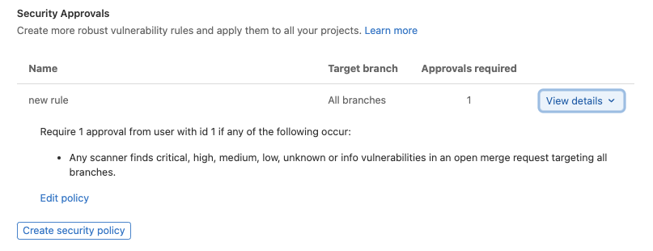
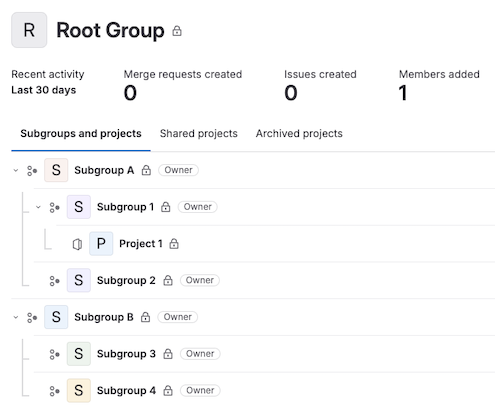
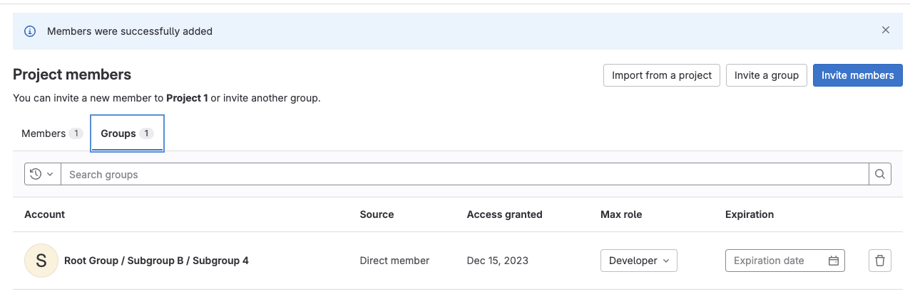

DETAILS:
**Tier:** Premium, Ultimate
**Offering:** GitLab.com, GitLab Self-Managed, GitLab Dedicated

Approval rules define how many [approvals](_index.md) a merge request must receive before it can
be merged, and which users should do the approving. They can be used in conjunction
with [code owners](#code-owners-as-eligible-approvers) to ensure that changes are
reviewed both by the group maintaining the feature, and any groups responsible
for specific areas of oversight.

You can define approval rules:

- [As project defaults](#add-an-approval-rule).
- [Per merge request](#edit-or-override-merge-request-approval-rules).

You can configure approval rules:

- [For the entire instance](../../../../administration/merge_requests_approvals.md).

If you don't define a [default approval rule](#add-an-approval-rule),
any user can approve a merge request. Even if you don't define a rule, you can still
enforce a [minimum number of required approvers](settings.md) in the project's settings.

Merge requests that target a different project, such as from a fork to the upstream project,
use the default approval rules from the target (upstream) project, not the source (fork).

Merge request approvals can be configured globally to apply across all (or a subset) projects with [policies](../../../application_security/policies/_index.md). [Merge request approval policies](../../../application_security/policies/merge_request_approval_policies.md) also provide additional flexibility with more granular configuration options.

## Add an approval rule

> - Approval rules for all protected branches introduced in GitLab 15.3.

Prerequisites:

- You must have at least the Maintainer role for the project.
- To add a group as an approver in GitLab.com, you must be a member of the group or the
  group must be public.

To add a merge request approval rule:

1. On the left sidebar, select **Search or go to** and find your project.
1. Select **Settings > Merge requests**.
1. In the **Merge request approvals** section, in the **Approval rules** section, select
   **Add approval rule**.
1. On the right sidebar, complete the fields:
   - In **Approvals required**, a value of `0` makes
     [the rule optional](#configure-optional-approval-rules), and any number greater than `0`
     creates a required rule.
     Maximum number of required approvals is `100`.
   - From **Add approvers**, select users or groups that are
     [eligible to approve](#eligible-approvers).
     GitLab suggests approvers based on previous authors of the files changed by the merge request.
1. Select **Save changes**. You can add [multiple approval rules](#multiple-approval-rules).

Your configuration for approval rule overrides determines if the new rule is applied
to existing merge requests:

- If [approval rule overrides](settings.md#prevent-editing-approval-rules-in-merge-requests) are allowed,
  changes to these default rules are not applied to existing merge requests, except for
  changes to the [target branch](#approvals-for-protected-branches) of the rule.
- If approval rule overrides are not allowed, all changes to default rules
  are applied to existing merge requests. Any approval rules that were previously
  manually [overridden](#edit-or-override-merge-request-approval-rules) during the
  period when approval rule overrides where allowed, are not modified.

## Edit an approval rule

Prerequisites:

- You must have at least the Maintainer role for the project.
- To add a group as an approver in GitLab.com, you must be a member of the group or the
  group must be public.

To edit a merge request approval rule:

1. On the left sidebar, select **Search or go to** and find your project.
1. Select **Settings > Merge requests**.
1. In the **Merge request approvals** section, in the **Approval rules** section, next to the rule you want to edit, select **Edit**.
1. On the right sidebar, edit the fields:
   - In **Approvals required**, a value of `0` makes
     [the rule optional](#configure-optional-approval-rules), and any number greater than `0`
     creates a required rule.
     Maximum number of required approvals is `100`.
   - To remove users or groups, identify the group or user to remove, and select **Remove**
     (**{remove}**).
1. Select **Save changes**.

## Delete an approval rule

Prerequisites:

- You must have at least the Maintainer role for the project.

To delete a merge request approval rule:

1. On the left sidebar, select **Search or go to** and find your project.
1. Select **Settings > Merge requests**.
1. In the **Merge request approvals** section, next to the rule you want to delete, select the trash can (**{remove}**).
1. Select **Remove approvers**.

## Multiple approval rules

To enforce multiple approval rules on a merge request, add multiple default approval rules for a project.

When an [eligible approver](#eligible-approvers) approves a merge request, it
reduces the number of approvals left (the **Approvals** column) for all rules that the approver belongs to:

<i class="fa fa-youtube-play youtube" aria-hidden="true"></i>
For an overview, see [Multiple Approvers](https://www.youtube.com/watch?v=8JQJ5821FrA).

## Eligible approvers

To be eligible as an approver for a project, a user must be a member of at least one of the following:

- The project.
- The project's immediate parent [group](#group-approvers).
- A group that has been [shared](../../members/sharing_projects_groups.md) with the project.
- A [group added as approvers](#group-approvers).

Users with the Developer role can approve merge requests if one of the following is true:

- Users added as approvers at the project or merge request level.
- Users who are [Code owners](#code-owners-as-eligible-approvers) of the files
  changed in the merge request.

Users with the Reporter role can approve only if both of the following are true:

- The users are part of a group that has been [shared](../../members/sharing_projects_groups.md) with the project.
  The group must have at least the Reporter role.
- The group has been added as merge request approvers.

For detailed instructions, see [Merge request approval segregation of duties](#enable-approval-permissions-for-users-with-the-reporter-role).

To show who has participated in the merge request review, the Approvals widget in
a merge request displays a **Commented by** column. This column lists eligible approvers
who commented on the merge request. It helps authors and reviewers identify who to
contact with questions about the merge request's content.

If the number of required approvals is greater than the number of assigned approvers,
approvals from other users with at least the Developer role
in the project count toward meeting the required number of approvals, even if the
users were not explicitly listed in the approval rules.

### Group approvers

You can add a group of users as approvers. All **direct members** of this group
can approve the rule. **Inherited members** cannot approve the rule.

Typically the group is a subgroup in your top-level namespace, unless you are
collaborating with an external group. If you are collaborating with another group,
you must [share access to the project](../../members/sharing_projects_groups.md)
before assigning the group as a group approver.

A user's membership in an approver group determines their individual approval permissions
in the following ways:

- Inherited members are not considered approvers. Only direct members can approve merge requests.
- A user from a group approver group who is later _also_ added as an individual approver
  counts as one approver, not two.
- Merge request authors do not count as eligible approvers on their own merge requests by default.
  To change this behavior, disable the
  [**Prevent author approval**](settings.md#prevent-approval-by-author)
  project setting.
- Committers to merge requests can approve a merge request. To change this behavior, enable the
  [**Prevent committers approval**](settings.md#prevent-approvals-by-users-who-add-commits)
  project setting.

### Code owners as eligible approvers

If you add [code owners](../../codeowners/_index.md) to your repository, the owners of files
become eligible approvers in the project. To enable this merge request approval rule:

1. On the left sidebar, select **Search or go to** and find your project.
1. Select **Settings > Merge requests**.
1. In the **Merge request approvals** section, in the **Approval rules** section, locate the **All eligible users** rule.
1. In the **Approvals required** column, enter the number of approvals required.

You can also
[require code owner approval](../../repository/branches/protected.md#require-code-owner-approval-on-a-protected-branch)
for protected branches.

## Enable approval permissions for users with the Reporter role

Before users with the Reporter role can merge to a protected branch, you might have to grant them
permission to approve merge requests.
Some users (like managers) might not need permission to push or merge code, but still need
oversight on proposed work.

Prerequisites:

- You must select a specific branch, as this method does **not** work with `All Branches` or `All protected branches` settings.
- The shared group must be added to an approval rule and not individual users, even when the added user is part of the group.

To enable approval permissions for these users without granting them push access:

1. [Create a protected branch](../../repository/branches/protected.md)
1. [Create a new group](../../../group/_index.md#create-a-group).
1. [Add the user to the group](../../../group/_index.md#add-users-to-a-group),
   and select the Reporter role for the user. Do not assign roles with higher permissions than
   Reporter due to a [known issue](https://gitlab.com/gitlab-org/gitlab/-/issues/492467).
   Assigning higher roles may result in unexpected behavior.
1. [Share the project with your group](../../members/sharing_projects_groups.md#invite-a-group-to-a-project),
   with at least the Reporter role.
1. On the left sidebar, select **Search or go to** and find your project.
1. Select **Settings > Merge requests**.
1. In the **Merge request approvals** section, in the **Approval rules** section:
   - For a new rule, select **Add approval rule** and target the protected branch.
   - For an existing rule, select **Edit** and target the protected branch.
1. On the right sidebar, in **Add approvers**, select the group you created.
1. Select **Save changes**.

## Edit or override merge request approval rules

You can override the merge request approval rules for a project by either:

- Editing an existing merge request.
- Creating a new merge request.

Prerequisites:

- You must have administrator access or all of the following must be true:
  - You must have at least the Developer role or the project must accept contributions from external members.
  - You must be the author of the merge request.
  - The project setting [Prevent editing approval rules](settings.md#prevent-editing-approval-rules-in-merge-requests) is disabled.

To override approvers of a merge request:

1. When [creating a new merge request](../creating_merge_requests.md), scroll to the **Approval Rules** section,
   and add or remove your desired approval rules before selecting **Create merge request**.
1. When viewing an existing merge request:
   1. On the left sidebar, select **Search or go to** and find your project.
   1. Select **Code > Merge requests** and find your merge request.
   1. Select **Edit**.
   1. Scroll to the **Approval Rules** section.
   1. Add or remove your desired approval rules.
   1. Select **Save changes**.

Administrators can change the [merge request approvals settings](settings.md#prevent-editing-approval-rules-in-merge-requests)
to prevent users from overriding approval rules for merge requests.

## Require multiple approvals for a rule

To create an approval rule which requires more than one approval:

- When you [create](#add-an-approval-rule) or [edit](#edit-an-approval-rule) a rule, set **Approvals required** to `2` or more.

To require multiple approvals for a rule, you can also [use the API](../../../../api/merge_request_approvals.md#update-merge-request-level-rule) to set the `approvals_required` attribute to `2` or more.

## Configure optional approval rules

Merge request approvals can be optional for projects where approvals are
appreciated, but not required. To make an approval rule optional:

- When you [create or edit a rule](#edit-an-approval-rule), set **Approvals required** to `0`.

To make an approval rule optional, you can also [use the API](../../../../api/merge_request_approvals.md#update-merge-request-level-rule) to set the `approvals_required` attribute to `0`.

## Approvals for protected branches

> - **All protected branches** target branch option [introduced](https://gitlab.com/gitlab-org/gitlab/-/issues/360930) in GitLab 15.3.

Approval rules are often relevant only to specific branches, like your
[default branch](../../repository/branches/default.md). To configure an
approval rule for certain branches:

1. [Create an approval rule](#add-an-approval-rule).
1. Go to your project and select **Settings > Merge requests**.
1. In the **Merge request approvals** section, scroll to **Approval rules**.
1. For **Target branch**:
   - To apply the rule to all protected branches, select **All protected branches**.
   - To apply the rule to a specific branch, select it from the list.
1. To enable this configuration, follow
   [Require Code Owner approval on a protected branch](../../repository/branches/protected.md#require-code-owner-approval-on-a-protected-branch).

## Security Approvals

DETAILS:
**Tier:** Ultimate
**Offering:** GitLab.com, GitLab Self-Managed, GitLab Dedicated

> - Security approvals moved to merge request approvals settings [introduced](https://gitlab.com/gitlab-org/gitlab/-/issues/357021) in GitLab 15.0.
> - Bot comment for approvals [introduced](https://gitlab.com/gitlab-org/gitlab/-/issues/411656) in GitLab 16.2 [with a flag](../../../../administration/feature_flags.md) named `security_policy_approval_notification`. Enabled by default.
> - Bot comment for approvals [generally available](https://gitlab.com/gitlab-org/gitlab/-/merge_requests/130827) in GitLab 16.3. Feature flag `security_policy_approval_notification` removed.

You can use [merge request approval policies](../../../application_security/policies/merge_request_approval_policies.md#merge-request-approval-policy-editor) to define security approvals based on the status of vulnerabilities in the merge request and the default branch.
Details for each security policy is shown in the Security Approvals section of your Merge Request configuration.

The security approval rules are applied to all merge requests until the pipeline is complete. The application of the
security approval rules prevents users from merging in code before the security scans run. After the pipeline is
complete, the security approval rules are checked to determine if the security approvals are still required.
In case the scanners in the pipeline identify an issue and security approvals are required, a bot comment is generated
on the merge request to indicate which steps are needed to proceed.

These policies are both created and edited in the [security policy editor](../../../application_security/policies/_index.md#policy-editor).

## Troubleshooting

### Approval rule name can't be blank

As a workaround for this validation error, you can delete the approval rule through
the API.

1. [GET a rule set for a project](../../../../api/merge_request_approvals.md#get-a-single-project-level-rule).
1. [DELETE the rule](../../../../api/merge_request_approvals.md#delete-project-level-rule).

For more information about this validation error, read
[issue 285129](https://gitlab.com/gitlab-org/gitlab/-/issues/285129).

### Groups need explicit or inherited Developer role on a project

A group created to handle approvals may be created in a different area of the
project hierarchy than the project requiring review. If this happens, members of the
group may not have permission to approve the merge request as they do not have access to it.

For example:

In the group structure below, project 1 belongs to subgroup 1 and subgroup 4 has users.

Project 1 has configured an approval rule for the project, which assigns subgroup 4 as approvers.
When a merge request is created, approvers from subgroup 4 appear in the eligible approvers list.
However, as users from subgroup 4 do not have permission to view the merge request, the `404` error is returned.
To grant membership, the group must be invited as a project member. It is now possible for users from subgroup 4 to approve.

