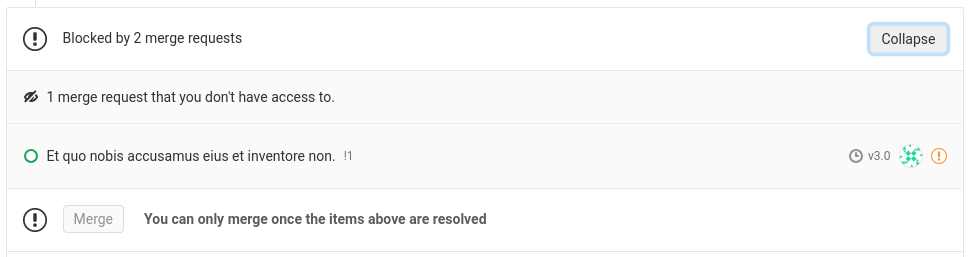
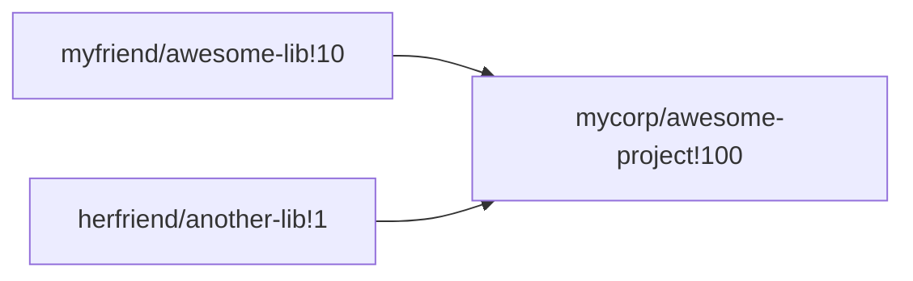
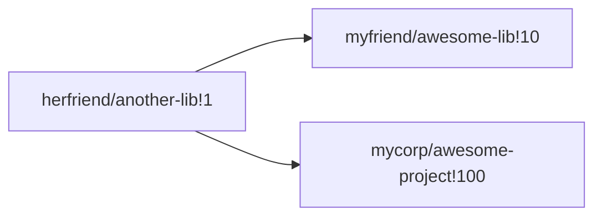

# Blocking merge requests **(PREMIUM)**

> Introduced in GitLab Premium 12.2

Blocking merge requests allow dependencies between MRs to be expressed. If a
merge request is blocked by another MR, it cannot be merged until that blocking
MR is itself merged.

NOTE: **Note:**
Blocking merge requests are a **PREMIUM** feature, but this restriction is only
enforced for the blocked merge request. A merge request in a **CORE** or
**STARTER** project can block a **PREMIUM** merge request, but not vice-versa.

## Use cases

* Ensure changes to a library are merged before changes to a project that
  imports the library
* Prevent a documentation-only merge request from being merged before the MR
  implementing the feature to be documented
* Require an MR updating a permissions matrix to be merged before merging an
  MR from someone who hasn't yet been granted permissions

It is common for a single logical change to span several merge requests. These
MRs may all be in a single project, or they may be spread out across multiple
projects, and the order in which they are merged can be significant.

For example, given a project `mycorp/awesome-project` that imports a library
at `myfriend/awesome-lib`, adding a feature in `awesome-project` may **also**
require changes to `awesome-lib`, and so necessitate two merge requests. Merging
the `awesome-project` MR before the `awesome-lib` one would break the `master`
branch.

The `awesome-project` MR could be [marked as WIP](work_in_progress_merge_requests.md),
and the reason for the WIP stated included in the comments. However, this
requires the state of the `awesome-lib` MR to be manually tracked, and doesn't
scale well if the `awesome-project` MR depends on changes to **several** other
projects.

By marking the `awesome-project` MR as blocked on the `awesome-lib` MR instead,
the status of the dependency is automatically tracked by GitLab, and the WIP
state can be used to communicate the readiness of the code in each individual
MR instead.

## Configuration

To continue the above example, you can configure a block when creating the
new MR in `awesome-project` (or by editing it, if it already exists). The block
needs to be configured on the MR that will be **blocked**, rather than on the
**blocking** MR. There is a "Blocking merge requests" section in the form:

Anyone who can edit a merge request can change the list of blocking merge
requests.

New blocks can be added by reference, by URL, or by using autcompletion. To
remove a block, press the "X" by its reference.

As blocks can be specified across projects, it's possible that someone else has
added a block for a merge request in a project you don't have access to. These
are shown as a simple count:

If necessary, you can remove all the blocks like this by pressing the "X", just
as you would for a single, visible block.

Once you're finished, press the "Save changes" button to submit the request, or
"Cancel" to return without making any changes.

The list of configured blocks, and the status of each one, is shown in the merge
request widget:

Until all blocking merge requests have, themselves, been merged, the "Merge"
button will be disabled. In particular, note that **closed** merge requests
still block their dependents - it is impossible to automatically determine if
merge requests that were blocked by that MR when it was open, are still blocked
when it is closed.

If a merge request has been closed **and** the block is no longer relevant, it
must be removed as a blocking MR, following the instructions above, before
merge.

## Limitations

* API support: [gitlab-ee#12551](https://gitlab.com/gitlab-org/gitlab-ee/issues/12551)
* Blocking relationships are not preserved across project export/import: [gitlab-ee#12549](https://gitlab.com/gitlab-org/gitlab-ee/issues/12549)
* Complex merge order dependencies are not supported: [gitlab-ee#11393](https://gitlab.com/gitlab-org/gitlab-ee/issues/11393)

The last item merits a little more explanation. Blocking merge requests can be
described as a graph of dependencies. The simplest possible graph has one
merge request blocking another:

A more complex (and still supported) graph might have several MRs blocking
another from being merged:

We also support one MR blocking several others from being merged:

What is **not** supported is a "deep", or "nested" graph of dependencies, e.g.:

In this example, `myfriend/awesome-lib!10` would be blocked from being merged by
`herfriend/another-lib!1`, and would also block `mycorp/awesome-project!100`
from being merged. This is **not** yet supported.

