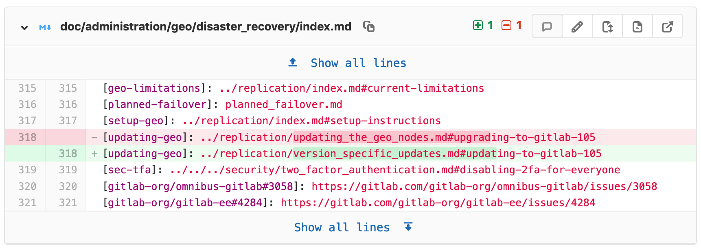
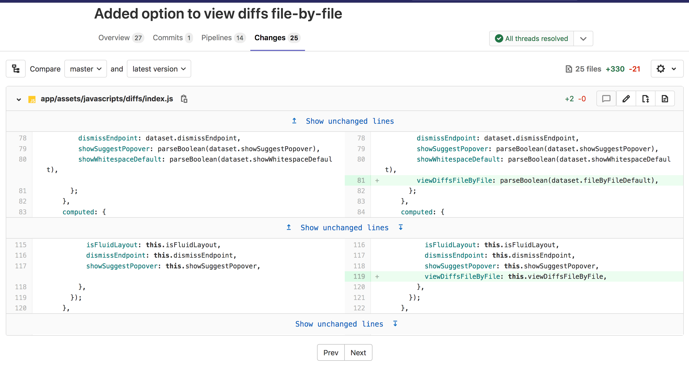
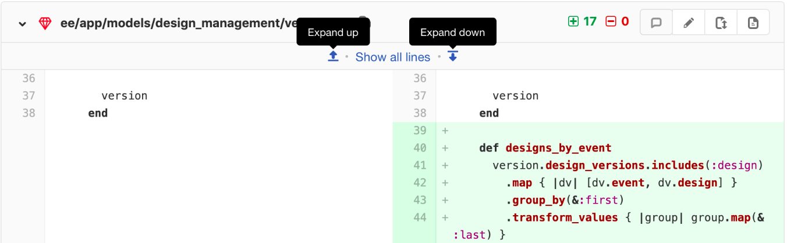
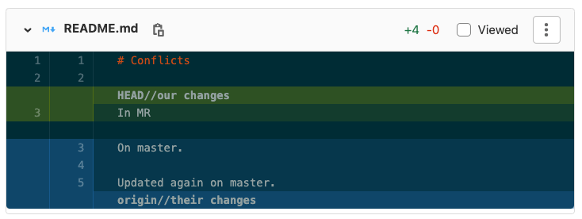

# Changes tab in merge requests **(FREE)**

The **Changes** tab on a [merge request](index.md), below the main merge request details and next to the discussion tab,
shows the changes to files between branches or commits. This view of changes to a
file is also known as a **diff**. By default, the diff view compares the file in the
merge request branch and the file in the target branch.

The diff view includes the following:

- The file's name and path.
- The number of lines added and deleted.
- Buttons for the following options:
  - Toggle comments for this file; useful for inline reviews.
  - Edit the file in the merge request's branch.
  - Show full file, in case you want to look at the changes in context with the rest of the file.
  - View file at the current commit.
  - Preview the changes with [Review Apps](../../../ci/review_apps/index.md).
- The changed lines, with the specific changes highlighted.



## Merge request diff file navigation

When reviewing changes in the **Changes** tab, the diff can be navigated using
the file tree or file list. As you scroll through large diffs with many
changes, you can quickly jump to any changed file using the file tree or file
list.


## Collapsed files in the Changes view

> [Introduced](https://gitlab.com/gitlab-org/gitlab/-/issues/232820) in GitLab 13.4.

When you review changes in the **Changes** tab, files with a large number of changes are collapsed
to improve performance. When files are collapsed, a warning appears at the top of the changes.
Select **Expand file** on any file to view the changes for that file.

## File-by-file diff navigation

> - [Introduced](https://gitlab.com/gitlab-org/gitlab/-/issues/222790) in GitLab 13.2.
> - [Feature flag removed](https://gitlab.com/gitlab-org/gitlab/-/issues/229848) in GitLab 13.7.

For larger merge requests, consider reviewing one file at a time. To enable this feature:

1. In the top-right corner, select your avatar.
1. Select **Preferences**.
1. Scroll to the **Behavior** section and select **Show one file at a time on merge request's Changes tab**.
1. Select **Save changes**.

After you enable this setting, GitLab displays only one file at a time in the **Changes** tab when you review merge requests. You can select **Prev** and **Next** to view other changed files.



In [GitLab 13.7](https://gitlab.com/gitlab-org/gitlab/-/issues/233898) and later, if you want to change
this behavior, you can do so from your **User preferences** (as explained above) or directly in a
merge request:

1. Go to the merge request's **Changes** tab.
1. Select the cog icon (**{settings}**) to reveal the merge request's settings dropdown.
1. Select or clear the checkbox **Show one file at a time** to change the setting accordingly.

This change overrides the choice you made in your user preferences and persists until you clear your
browser's cookies or change this behavior again.

## Incrementally expand merge request diffs

By default, the diff shows only the parts of a file which are changed.
To view more unchanged lines above or below a change select the
**Expand up** or **Expand down** icons. You can also select **Show unchanged lines**
to expand the entire file.



In GitLab [versions 13.1 and later](https://gitlab.com/gitlab-org/gitlab/-/issues/205401), when viewing a
merge request's **Changes** tab, if a certain file was only renamed, you can expand it to see the
entire content by selecting **Show file contents**.

## Ignore whitespace changes in Merge Request diff view

If you select the **Hide whitespace changes** button, you can see the diff
without whitespace changes (if there are any). This is also working when on a
specific commit page.


## Mark files as viewed

> - [Introduced](https://gitlab.com/gitlab-org/gitlab/-/merge_requests/51513) in GitLab 13.9.
> - Deployed behind a feature flag, enabled by default.
> - Enabled on GitLab.com.
> - Recommended for production use.
> - For GitLab self-managed instances, GitLab administrators can opt to [disable it](#enable-or-disable-file-views). **(FREE SELF)**

When reviewing a merge request with many files multiple times, it may be useful to the reviewer
to focus on new changes and ignore the files that they have already reviewed and don't want to
see anymore unless they are changed again.

To mark a file as viewed:

1. Go to the merge request's **Diffs** tab.
1. On the right-top of the file, locate the **Viewed** checkbox.
1. Select it to mark the file as viewed.

Once checked, the file remains marked for that reviewer unless there are newly introduced
changes to its content or the checkbox is unchecked.

### Enable or disable file views **(FREE SELF)**

The file view feature is under development but ready for production use.
It is deployed behind a feature flag that is **enabled by default**.
[GitLab administrators with access to the GitLab Rails console](../../../administration/feature_flags.md)
can opt to enable it for your instance.

To enable it:

```ruby
Feature.enable(:local_file_reviews)
```

To disable it:

```ruby
Feature.disable(:local_file_reviews)
```

## Show merge request conflicts in diff

> - [Introduced](https://gitlab.com/gitlab-org/gitlab/-/issues/232484) in GitLab 13.5.
> - [Deployed behind a feature flag](../../feature_flags.md), disabled by default.
> - Disabled on GitLab.com.
> - Not recommended for production use.
> - To use in GitLab self-managed instances, ask a GitLab administrator to [enable it](#enable-or-disable-merge-request-conflicts-in-diff). **(FREE SELF)**

This in-development feature might not be available for your use. There can be
[risks when enabling features still in development](../../feature_flags.md#risks-when-enabling-features-still-in-development).
Refer to this feature's version history for more details.

To avoid displaying the changes that are already on target branch in the diff,
we compare the merge request's source branch with HEAD of the target branch.

When there are conflicts between the source and target branch, we show the
conflicts on the merge request diff as well:



### Enable or disable merge request conflicts in diff **(FREE SELF)**

Merge request conflicts in diff is under development and not ready for production use. It is
deployed behind a feature flag that is **disabled by default**.
[GitLab administrators with access to the GitLab Rails console](../../../administration/feature_flags.md)
can enable it.

To enable it:

```ruby
Feature.enable(:display_merge_conflicts_in_diff)
```

To disable it:

```ruby
Feature.disable(:display_merge_conflicts_in_diff)
```
