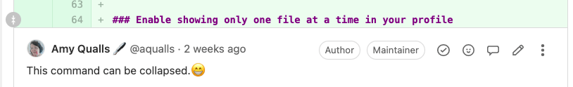

# Changes in merge requests

DETAILS:
**Tier:** Free, Premium, Ultimate
**Offering:** GitLab.com, Self-managed, GitLab Dedicated

A [merge request](index.md) proposes a set of changes to files in a branch in your repository. These
changes are shown as a _diff_ (difference) between the current state and the proposed
changes. By default, the diff compares your proposed changes (the source branch) with
the target branch. By default, only the changed portions of the files are shown.

This example shows changes to a text file. In the default syntax highlighting theme:

- The _current_ version is shown in red, with a minus (`-`) sign before the line.
- The _proposed_ version is shown in green with a plus (`+`) sign before the line.


The header for each file in the diff contains:

- **Hide file contents** (**{chevron-down}**) to hide all changes to this file.
- **Path**: The full path to this file. To copy this path, select
  **Copy file path** (**{copy-to-clipboard}**).
- **Lines changed**: The number of lines added and deleted in this file, in the format `+2 -2`.
- **Viewed**: Select this checkbox to [mark the file as viewed](#mark-files-as-viewed)
  until more changes are added to it.
- **Comment on this file** (**{comment}**) to leave a general comment on the file, without
  pinning the comment to a specific line.
- **Options**: Select (**{ellipsis_v}**) to display more file viewing options.

The diff also includes navigation and comment aids to the left of the file, in the gutter:

- **Show more context**: Select **Previous 20 lines** (**{expand-up}**) to display
  the previous 20 unchanged lines, or **Next 20 lines** (**{expand-down}**) to
  display the next 20 unchanged lines.
- **Line numbers** are shown in two columns. Previous line numbers are shown on
  the left, and proposed line numbers on the right. To interact with a line:
  - To display [comment options](#add-a-comment-to-a-merge-request-file), hover over a line number.
  - To copy a link to the line, press <kbd>Command</kbd> and select (or right-click)
    a line number, then select **Copy link address**.
  - To highlight a line, select the line number.

## Show all changes in a merge request

To view the diff of changes included in a merge request:

1. On the left sidebar, select **Search or go to** and find your project.
1. Select **Code > Merge requests** and find your merge request.
1. Below the merge request title, select **Changes**.
1. If the merge request changes many files, you can jump directly to a specific file:
   1. Select **Show file browser** (**{file-tree}**) or press <kbd>F</kbd> to display the file tree.
   1. Select the file you want to view.
   1. To hide the file browser, select **Show file browser** or press <kbd>F</kbd> again.

Files with many changes are collapsed to improve performance. GitLab displays the message:
**Some changes are not shown**. To view the changes for that file, select **Expand file**.

### Collapse generated files

DETAILS:
**Tier:** Free, Premium, Ultimate
**Offering:** GitLab.com, Self-managed, GitLab Dedicated

> - [Introduced](https://gitlab.com/gitlab-org/gitlab/-/merge_requests/140180) in GitLab 16.8 [with a flag](../../../administration/feature_flags.md) named `collapse_generated_diff_files`. Disabled by default.
> - [Enabled on GitLab.com and self-managed](https://gitlab.com/gitlab-org/gitlab/-/merge_requests/145100) in GitLab 16.10.
> - `generated_file` [generally available](https://gitlab.com/gitlab-org/gitlab/-/merge_requests/148478) in GitLab 16.11. Feature flag `collapse_generated_diff_files` removed.

To help reviewers focus on the files needed to perform a code review, GitLab collapses
several common types of generated files. These files are collapsed by default, because
they are unlikely to require code reviews:

1. Files with `.nib`, `.xcworkspacedata`, or `.xcurserstate` extensions.
1. Package lock files such as `package-lock.json` or `Gopkg.lock`.
1. Files in the `node_modules` folder.
1. Minified `js` or `css` files.
1. Source map reference files.
1. Generated Go files, including the generated files by protocol buffer compiler.

To mark a file or path as generated, set the `gitlab-generated` attribute for it
in your [`.gitattributes` file](../git_attributes.md).

#### View a collapsed file

1. On the left sidebar, select **Search or go to** and find your project.
1. Select **Code > Merge requests** and find your merge request.
1. Below the merge request title, select **Changes**.
1. Find the file you want to view, and select **Expand file**.

#### Configure collapse behavior for a file type

To change the default collapse behavior for a file type:

1. If a `.gitattributes` file does not exist in the root directory of your project,
   create a blank file with this name.
1. For each file type you want to modify, add a line to the `.gitattributes` file
   declaring the file extension and your desired behavior:

   ```conf
   # Collapse all files with a .txt extension
   *.txt gitlab-generated

   # Collapse all files within the docs directory
   docs/** gitlab-generated

   # Do not collapse package-lock.json
   package-lock.json -gitlab-generated
   ```

1. Commit, push, and merge your changes into your default branch.

After the changes merge into your [default branch](../repository/branches/default.md),
all files of this type in your project use this behavior in merge requests.

For technical details about how generated files are detected, see the
[`go-enry`](https://github.com/go-enry/go-enry/blob/master/data/generated.go) repository.

## Show one file at a time

For larger merge requests, you can review one file at a time. You can change this setting
[temporarily in a merge request](#for-this-merge-request-only), or
so it [applies to all merge requests](#for-all-merge-requests).

### For this merge request only

To temporarily change your viewing preferences for a specific merge request:

1. On the left sidebar, select **Search or go to** and find your project.
1. Select **Code > Merge requests** and find your merge request.
1. Below the merge request title, select **Changes**.
1. Select **Preferences** (**{settings}**).
1. Select or clear the **Show one file at a time** checkbox.

This change overrides your choice in your user preferences. It persists until you
clear your browser's cookies or change this behavior again.

### For all merge requests

To view one file at a time for all of your merge requests:

1. On the left sidebar, select your avatar.
1. Select **Preferences**.
1. Scroll to the **Behavior** section and select the **Show one file at a time on merge request's Changes tab** checkbox.
1. Select **Save changes**.

After you enable this setting, GitLab displays only one file at a time when you review
merge requests. To view other changed files, either:

- Scroll to the end of the file and select either **Prev** or **Next**.
- Select **Show file browser** (**{file-tree}**) and select another file to view.

## Compare changes inline

You can view the changes inline:

1. On the left sidebar, select **Search or go to** and find your project.
1. Select **Code > Merge requests** and find your merge request.
1. Below the title, select **Changes**.
1. Select **Preferences** (**{settings}**).
1. In the **Compare changes** area, select **Inline**.

The changes are displayed after the original text.


## Compare changes side-by-side

Depending on the length of the changes in your merge request, you might find it
easier to view the changes inline, or side-by-side:

1. On the left sidebar, select **Search or go to** and find your project.
1. Select **Code > Merge requests** and find your merge request.
1. Below the title, select **Changes**.
1. Select **Preferences** (**{settings}**).
1. In the **Compare changes** area, select **Side-by-side**.

The changes are displayed across from one another.


## Expand or collapse comments

When reviewing code changes, you can hide inline comments:

1. On the left sidebar, select **Search or go to** and find your project.
1. Select **Code > Merge requests** and find your merge request.
1. Below the title, select **Changes**.
1. Scroll to the file that contains the comments you want to hide.
1. Scroll to the line the comment is attached to, and select **Collapse** (**{collapse}**):
   

To expand inline comments and show them again:

1. On the left sidebar, select **Search or go to** and find your project.
1. Select **Code > Merge requests** and find your merge request.
1. Below the title, select **Changes**.
1. Scroll to the file that contains the collapsed comments you want to show.
1. Scroll to the line the comment is attached to, and select the user avatar:
   

## Ignore whitespace changes

Whitespace changes can make it more difficult to see the substantive changes in
a merge request. You can choose to hide or show whitespace changes:

1. On the left sidebar, select **Search or go to** and find your project.
1. Select **Code > Merge requests** and find your merge request.
1. Below the title, select **Changes**.
1. Before the list of changed files, select **Preferences** (**{settings}**).
1. Select or clear the **Show whitespace changes** checkbox:

   

## Mark files as viewed

> - [Introduced](https://gitlab.com/gitlab-org/gitlab/-/merge_requests/51513) in GitLab 13.9 [with a flag](../../../administration/feature_flags.md) named `local_file_reviews`. Enabled by default.
> - [Feature flag removed](https://gitlab.com/gitlab-org/gitlab/-/issues/296674) in GitLab 14.3.

When reviewing a merge request with many files multiple times, you can ignore files
you've already reviewed. To hide files that haven't changed since your last review:

1. On the left sidebar, select **Search or go to** and find your project.
1. Select **Code > Merge requests** and find your merge request.
1. Below the title, select **Changes**.
1. In the file's header, select the **Viewed** checkbox.

Files marked as viewed are not shown to you again unless either:

- New changes are made to its content.
- You clear the **Viewed** checkbox.

## Show merge request conflicts in diff

> - [Introduced](https://gitlab.com/gitlab-org/gitlab/-/issues/232484) in GitLab 13.5 [with a flag](../../../administration/feature_flags.md) named `display_merge_conflicts_in_diff`. Disabled by default.
> - [Enabled on GitLab.com and self-managed](https://gitlab.com/gitlab-org/gitlab/-/issues/276918) in GitLab 15.7.
> - [Generally available](https://gitlab.com/gitlab-org/gitlab/-/issues/276918) in GitLab 15.8. Feature flag `display_merge_conflicts_in_diff` removed.

To avoid displaying the changes that are already on target branch in the diff,
we compare the merge request's source branch with HEAD of the target branch.

When there are conflicts between the source and target branch, we show an alert
per conflicted file on the merge request diff:


## Show scanner findings in diff

DETAILS:
**Tier:** Ultimate
**Offering:** GitLab.com, Self-managed, GitLab Dedicated

You can show scanner findings in the diff. For details, see:

- [Code Quality findings](../../../ci/testing/code_quality.md#merge-request-changes-view)
- [Static Analysis findings](../../application_security/sast/index.md#merge-request-changes-view)

## Add a comment to a merge request file

> - [Introduced](https://gitlab.com/gitlab-org/gitlab/-/merge_requests/123515) in GitLab 16.1 [with a flag](../../../administration/feature_flags.md) named `comment_on_files`. Enabled by default.
> - [Feature flag removed](https://gitlab.com/gitlab-org/gitlab/-/merge_requests/125130) in GitLab 16.2.

You can add comments to a merge request diff file. These comments persist across
rebases and file changes.

To add a comment to a merge request file:

1. On the left sidebar, select **Search or go to** and find your project.
1. Select **Code > Merge requests** and find your merge request.
1. Select **Changes**.
1. In the header for the file you want to comment on, select **Comment** (**{comment}**).

## Add a comment to an image

In merge requests and commit detail views, you can add a comment to an image.
This comment can also be a thread.

1. Hover your mouse over the image.
1. Select the location where you want to comment.

An icon is displayed on the image and a comment field is displayed.

## Resources

- For technical details on how GitLab calculates the diff between the two revisions,
  see [Working with diffs](../../../development/merge_request_concepts/diffs/index.md).
