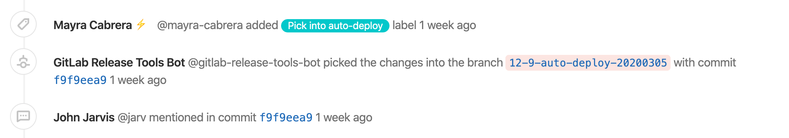
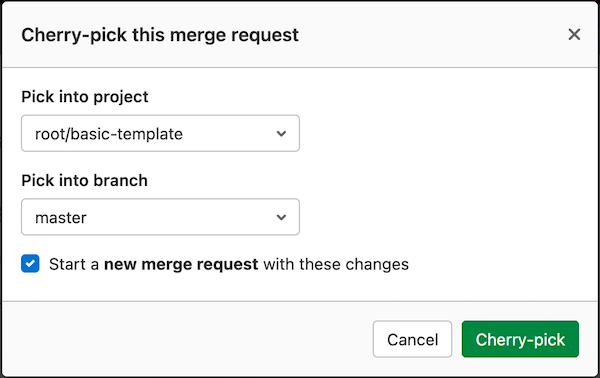

# Cherry-pick changes **(FREE)**

GitLab implements Git's powerful feature to
[cherry-pick any commit](https://git-scm.com/docs/git-cherry-pick "Git cherry-pick documentation")
with a **Cherry-pick** button in merge requests and commit details.

## Cherry-picking a merge request

After the merge request has been merged, a **Cherry-pick** button displays
to cherry-pick the changes introduced by that merge request.


After you click that button, a modal displays a
[branch filter search box](../repository/branches/index.md#branch-filter-search-box)
where you can choose to either:

- Cherry-pick the changes directly into the selected branch.
- Create a new merge request with the cherry-picked changes.

### Cherry-pick tracking

> [Introduced](https://gitlab.com/groups/gitlab-org/-/epics/2675) in GitLab 12.9.

When you cherry-pick a merge commit, GitLab displays a system note to the related merge
request thread. It crosslinks the new commit and the existing merge request.



Each deployment's [list of associated merge requests](../../../api/deployments.md#list-of-merge-requests-associated-with-a-deployment) includes cherry-picked merge commits.

NOTE:
We only track cherry-pick executed from GitLab (both UI and API). Support for [tracking cherry-picked commits through the command line](https://gitlab.com/gitlab-org/gitlab/-/issues/202215) is planned for a future release.

## Cherry-picking a commit

You can cherry-pick a commit from the commit details page:


Similar to cherry-picking a merge request, you can cherry-pick the changes
directly into the target branch or create a new merge request to cherry-pick the
changes.

When cherry-picking merge commits, the mainline is always the
first parent. If you want to use a different mainline, you need to do that
from the command line.

Here's a quick example to cherry-pick a merge commit using the second parent as the
mainline:

```shell
git cherry-pick -m 2 7a39eb0
```

### Cherry-pick into a project

> - [Introduced](https://gitlab.com/gitlab-org/gitlab/-/issues/21268) in GitLab 13.11.
> - [Feature flag removed](https://gitlab.com/gitlab-org/gitlab/-/issues/324154) in GitLab 14.0

WARNING:
This feature might not be available to you. Check the **version history** note above for details.

You can use the GitLab UI to cherry-pick merge requests into a project, even if the
merge request is from a fork:

1. In the merge request's secondary menu, click **Commits** to display the commit details page.
1. Click on the **Options** dropdown and select **Cherry-pick** to show the cherry-pick modal.
1. In **Pick into project** and **Pick into branch**, select the destination project and branch:
   
1. (Optional) Select **Start a new merge request** if you're ready to create a merge request.
1. Click **Cherry-pick**.

## Related links

- The [Commits API](../../../api/commits.md) enables you to add custom messages
  to changes you cherry-pick through the API.

<!-- ## Troubleshooting

Include any troubleshooting steps that you can foresee. If you know beforehand what issues
one might have when setting this up, or when something is changed, or on upgrading, it's
important to describe those, too. Think of things that may go wrong and include them here.
This is important to minimize requests for support, and to avoid doc comments with
questions that you know someone might ask.

Each scenario can be a third-level heading, e.g. `### Getting error message X`.
If you have none to add when creating a doc, leave this section in place
but commented out to help encourage others to add to it in the future. -->
