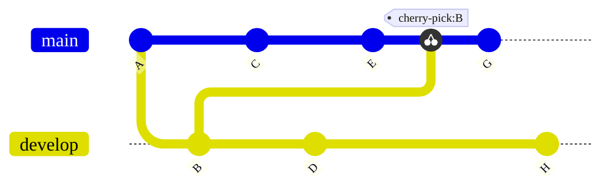



- Tier: Free, Premium, Ultimate
- Offering: GitLab.com, GitLab Self-Managed, GitLab Dedicated



In Git, *cherry-picking* is taking a single commit from one branch and adding it
as the latest commit on another branch. The rest of the commits in the source branch
are not added to the target. Cherry-pick a commit when you need the
contents in a single commit, but not the contents of the entire branch. For example,
when you:

- Backport bug fixes from the default branch to previous release branches.
- Copy changes from a fork to the upstream repository.

Use the GitLab UI to cherry-pick a single commit or the contents of an entire merge request
from a project or a project fork.

In this example, a Git repository has two branches: `develop` and `main`.
Commit `B` is cherry-picked from the `develop` branch after commit `E` in the `main` branch.
Commit `G` is added after the cherry-pick:

<!-- Diagram reused in doc/topics/git/cherry_pick.md -->

## View system notes for cherry-picked commits

When you cherry-pick a [merge commit](methods/_index.md#merge-commit) in the GitLab UI or API, GitLab adds a
[system note](../system_notes.md) to the related merge request thread.

System notes are only created when cherry-picking merge commits. System notes are not created when
using fast-forward merge. This applies to both cherry-picking individual commits and cherry-picking
all changes from a merge request.

Commits cherry-picked outside the GitLab UI or API also do not create system notes.

When a system note is created, the format is 
`[USER]` **picked the changes into the branch** `[BRANCHNAME]` with commit
`[SHA]` `[DATE]`:

The system note crosslinks the new commit and the existing merge request.
Each deployment's [list of associated merge requests](../../../api/deployments.md#list-of-merge-requests-associated-with-a-deployment)
includes cherry-picked merge commits.

## Cherry-pick all changes from a merge request

After a merge request is merged, you can cherry-pick all changes introduced
by the merge request. The merge request can be in the upstream project or in
a downstream fork.

Prerequisites:

- You must have a role for the project that allows you to edit merge requests, and add
  code to the repository.
- Your project must use the [merge commit](methods/_index.md#merge-commit) method.
  which is set in the project's **Settings** > **Merge requests**.

  [In GitLab 16.9 and later](https://gitlab.com/gitlab-org/gitlab/-/issues/142152), fast-forwarded
  commits can be cherry-picked from the GitLab UI only when they are squashed or when the
  merge request contains a single commit.
  You can always [cherry-pick individual commits](#cherry-pick-a-single-commit).

  

  [System notes](#view-system-notes-for-cherry-picked-commits) are not created when using the fast-forward
  merge method.

  

To do this:

1. On the left sidebar, select **Search or go to** and find your project.
1. Select **Code** > **Merge requests**, and find your merge request.
1. Scroll to the merge request reports section, and find the **Merged by** report.
1. In the upper-right corner of the report, select **Cherry-pick**:

   
1. On the dialog, select the project and branch to cherry-pick into.
1. Optional. Select **Start a new merge request with these changes**.
1. Select **Cherry-pick**.

## Cherry-pick a single commit

You can cherry-pick a single commit from multiple locations in your GitLab project.

If you cherry-pick a merge commit, GitLab creates a
[system note](#view-system-notes-for-cherry-picked-commits) in the related merge request to track
the operation.

### From a project's commit list

To cherry-pick a commit from the list of all commits for a project:

1. On the left sidebar, select **Search or go to** and find your project.
1. Select **Code** > **Commits**.
1. Select the [title](https://git-scm.com/docs/git-commit#_discussion) of the commit you want to cherry-pick.
1. In the upper-right corner, select **Options** > **Cherry-pick**.
1. On the cherry-pick dialog, select the project and branch to cherry-pick into.
1. Optional. Select **Start a new merge request with these changes**.
1. Select **Cherry-pick**.

### From the file view of a repository

You can cherry-pick from the list of previous commits affecting an individual file
when you view that file in your project's Git repository:

1. On the left sidebar, select **Search or go to** and find your project.
1. Select **Code** > **Repository**.
1. Go to the file changed by the commit. In the last commit block, select **History**.
1. Select the [title](https://git-scm.com/docs/git-commit#_discussion)
   of the commit you want to cherry-pick.
1. In the upper-right corner, select **Options** > **Cherry-pick**.
1. On the cherry-pick dialog, select the project and branch to cherry-pick into.
1. Optional. Select **Start a new merge request with these changes**.
1. Select **Cherry-pick**.

## Select a different parent commit

When you cherry-pick a merge commit in the GitLab UI, the mainline is always the
first parent. Use the command line to cherry-pick with a different mainline. For more information, see
[Copy the contents of an entire branch](../../../topics/git/cherry_pick.md#copy-the-contents-of-an-entire-branch).

## Related topics

- [Commits API](../../../api/commits.md#cherry-pick-a-commit)
- [Cherry-pick changes with Git](../../../topics/git/cherry_pick.md)
