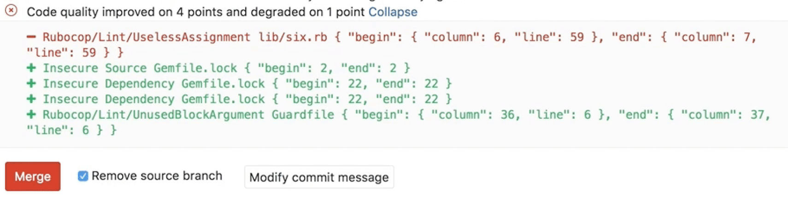

# Code Quality **(STARTER)**

> [Introduced](https://gitlab.com/gitlab-org/gitlab/merge_requests/1984) in [GitLab Starter](https://about.gitlab.com/pricing/) 9.3.

With the help of [GitLab CI/CD](../../../ci/README.md), you can analyze your
source code quality using GitLab Code Quality.

Code Quality:

- Uses [Code Climate Engines](https://codeclimate.com), which are
  free and open source. Code Quality doesn't require a Code Climate
  subscription.
- Runs in [pipelines](../../../ci/pipelines.md) using an Docker image built in
  [GitLab Code
  Quality](https://gitlab.com/gitlab-org/security-products/codequality) project.
- Can make use of a [template](#example-configuration).
- Is available with [Auto
  DevOps](../../../topics/autodevops/index.md#auto-code-quality-starter).

Going a step further, GitLab can show the Code Quality report right
in the merge request widget area:



## Use cases

For instance, consider the following workflow:

1. Your backend team member starts a new implementation for making a certain
   feature in your app faster.
1. With Code Quality reports, they analyze how their implementation is impacting
   the code quality.
1. The metrics show that their code degrade the quality in 10 points.
1. You ask a co-worker to help them with this modification.
1. They both work on the changes until Code Quality report displays no
   degradations, only improvements.
1. You approve the merge request and authorize its deployment to staging.
1. Once verified, their changes are deployed to production.

## Example configuration

CAUTION: **Caution:**
The job definition shown below is supported on GitLab 11.11 and later versions. It
also requires the GitLab Runner 11.5 or later. For earlier versions, use the
[previous job definitions](#previous-job-definitions).

This example shows how to run Code Quality on your code by using GitLab CI/CD and Docker.

First, you need GitLab Runner with
[docker-in-docker executor](../../../ci/docker/using_docker_build.md#use-docker-in-docker-workflow-with-docker-executor).

Once you set up the Runner, include the CodeQuality template in your CI config:

```yaml
include:
  - template: Code-Quality.gitlab-ci.yml
```

The above example will create a `code_quality` job in your CI/CD pipeline which
will scan your source code for code quality issues. The report will be saved as a
[Code Quality report artifact](../../../ci/yaml/README.md#artifactsreportscodequality-starter)
that you can later download and analyze. Due to implementation limitations we always
take the latest Code Quality artifact available.

It is also possible to override the URL to the Code Quality image by
setting the `CODE_QUALITY_IMAGE` variable. This is particularly useful if you want
to lock in a specific version of Code Quality, or use a fork of it:

```yaml
include:
  - template: Code-Quality.gitlab-ci.yml

code_quality:
  variables:
    CODE_QUALITY_IMAGE: "registry.example.com/codequality-fork:latest"
```

By default, report artifacts are not downloadable. If you need them downloadable on the
job details page, you can add `gl-code-quality-report.json` to the artifact paths like so:

```yaml
include:
  - template: Code-Quality.gitlab-ci.yml

code_quality:
  artifacts:
    paths: [gl-code-quality-report.json]
```

The included `code_quality` job is running in the `test` stage, so it needs to be included in your CI config, like so:

```yaml
stages:
  - test
```

TIP: **Tip:**
This information will be automatically extracted and shown right in the merge request widget.

CAUTION: **Caution:**
On self-managed instances, if a malicious actor compromises the Code Quality job
definition they will be able to execute privileged docker commands on the Runner
host. Having proper access control policies mitigates this attack vector by
allowing access only to trusted actors.

### Previous job definitions

CAUTION: **Caution:**
Before GitLab 11.5, Code Quality job and artifact had to be named specifically to
automatically extract report data and show it in the merge request widget. While these
old job definitions are still maintained they have been deprecated and may be removed
in the next major release, GitLab 12.0. You are advised to update your current `.gitlab-ci.yml`
configuration to reflect that change.

For GitLab 11.5 and later, the job should look like:

```yaml
code_quality:
  image: docker:stable
  variables:
    DOCKER_DRIVER: overlay2
  allow_failure: true
  services:
    - docker:stable-dind
  script:
    - export SP_VERSION=$(echo "$CI_SERVER_VERSION" | sed 's/^\([0-9]*\)\.\([0-9]*\).*/\1-\2-stable/')
    - docker run
        --env SOURCE_CODE="$PWD"
        --volume "$PWD":/code
        --volume /var/run/docker.sock:/var/run/docker.sock
        "registry.gitlab.com/gitlab-org/security-products/codequality:$SP_VERSION" /code
  artifacts:
    reports:
      codequality: gl-code-quality-report.json
```

In GitLab 12.6, Code Quality switched to the
[new versioning scheme](https://gitlab.com/gitlab-org/security-products/codequality/merge_requests/38).
It is highly recommended to include the Code Quality template as shown in the
[example configuration](#example-configuration), which uses the new versioning scheme.
If not using the template, the `SP_VERSION` variable can be hardcoded to use the
new image versions:

```yaml
code_quality:
  image: docker:stable
  variables:
    DOCKER_DRIVER: overlay2
    SP_VERSION: 0.85.6
  allow_failure: true
  services:
    - docker:stable-dind
  script:
    - docker run
        --env SOURCE_CODE="$PWD"
        --volume "$PWD":/code
        --volume /var/run/docker.sock:/var/run/docker.sock
        "registry.gitlab.com/gitlab-org/security-products/codequality:$SP_VERSION" /code
  artifacts:
    reports:
      codequality: gl-code-quality-report.json
```

For GitLab 11.4 and earlier, the job should look like:

```yaml
code_quality:
  image: docker:stable
  variables:
    DOCKER_DRIVER: overlay2
  allow_failure: true
  services:
    - docker:stable-dind
  script:
    - export SP_VERSION=$(echo "$CI_SERVER_VERSION" | sed 's/^\([0-9]*\)\.\([0-9]*\).*/\1-\2-stable/')
    - docker run
        --env SOURCE_CODE="$PWD"
        --volume "$PWD":/code
        --volume /var/run/docker.sock:/var/run/docker.sock
        "registry.gitlab.com/gitlab-org/security-products/codequality:$SP_VERSION" /code
  artifacts:
      paths: [gl-code-quality-report.json]
```

Alternatively the job name could be `codeclimate` or `codequality` and the artifact
name could be `codeclimate.json`. These names have been deprecated with GitLab 11.0
and may be removed in the next major release, GitLab 12.0.

For GitLab 10.3 and earlier, the job should look like:

```yaml
codequality:
  image: docker:latest
  variables:
    DOCKER_DRIVER: overlay
  services:
    - docker:dind
  script:
    - docker pull codeclimate/codeclimate:0.69.0
    - docker run --env CODECLIMATE_CODE="$PWD" --volume "$PWD":/code --volume /var/run/docker.sock:/var/run/docker.sock --volume /tmp/cc:/tmp/cc codeclimate/codeclimate:0.69.0 init
    - docker run --env CODECLIMATE_CODE="$PWD" --volume "$PWD":/code --volume /var/run/docker.sock:/var/run/docker.sock --volume /tmp/cc:/tmp/cc codeclimate/codeclimate:0.69.0 analyze -f json > codeclimate.json || true
  artifacts:
    paths: [codeclimate.json]
```

## Configuring jobs using variables

The Code Quality job supports environment variables that users can set to
configure job execution at runtime.

For a list of available environment variables, see
[Environment variables](https://gitlab.com/gitlab-org/security-products/codequality/blob/master/README.md#environment-variables).

## Implementing a custom tool

It's possible to have a custom tool provide Code Quality reports in GitLab. To
do this:

1. Define a job in your `.gitlab-ci.yml` file that generates the
   [Code Quality report
   artifact](../../../ci/yaml/README.md#artifactsreportscodequality-starter).
1. Configure your tool to generate the Code Quality report artifact as a JSON
   file that implements subset of the [Code Climate
   spec](https://github.com/codeclimate/spec/blob/master/SPEC.md#data-types).

The Code Quality report artifact JSON file must contain an array of objects
with the following properties:

| Name                   | Description                                                                            |
| ---------------------- | -------------------------------------------------------------------------------------- |
| `description`          | A description of the code quality violation.                                           |
| `fingerprint`          | A unique fingerprint to identify the code quality violation. For example, an MD5 hash. |
| `location.path`        | The relative path to the file containing the code quality violation.                   |
| `location.lines.begin` | The line on which the code quality violation occurred.                                 |

Example:

```json
[
  {
    "description": "'unused' is assigned a value but never used.",
    "fingerprint": "7815696ecbf1c96e6894b779456d330e",
    "location": {
      "path": "lib/index.js",
      "lines": {
        "begin": 42
      }
    }
  }
]
```

NOTE: **Note:**
Although the Code Climate spec supports more properties, those are ignored by
GitLab.

## Code Quality reports

Once the Code Quality job has completed, GitLab:

- Checks the generated report.
- Compares the metrics between the source and target branches.
- Shows the information right on the merge request.

If multiple jobs in a pipeline generate a code quality artifact, only the artifact from
the last created job (the job with the largest job ID) is used. To avoid confusion,
configure only one job to generate a code quality artifact.

If the Code Quality report doesn't have anything to compare to, no information
will be displayed in the merge request area. That is the case when you add the
Code Quality job in your `.gitlab-ci.yml` for the very first time.
Consecutive merge requests will have something to compare to and the Code Quality
report will be shown properly.

<!-- ## Troubleshooting

Include any troubleshooting steps that you can foresee. If you know beforehand what issues
one might have when setting this up, or when something is changed, or on upgrading, it's
important to describe those, too. Think of things that may go wrong and include them here.
This is important to minimize requests for support, and to avoid doc comments with
questions that you know someone might ask.

Each scenario can be a third-level heading, e.g. `### Getting error message X`.
If you have none to add when creating a doc, leave this section in place
but commented out to help encourage others to add to it in the future. -->
