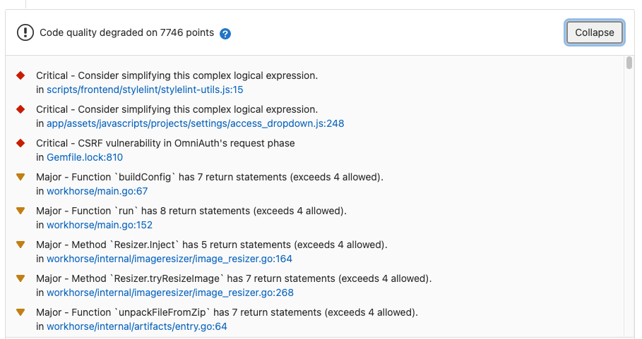
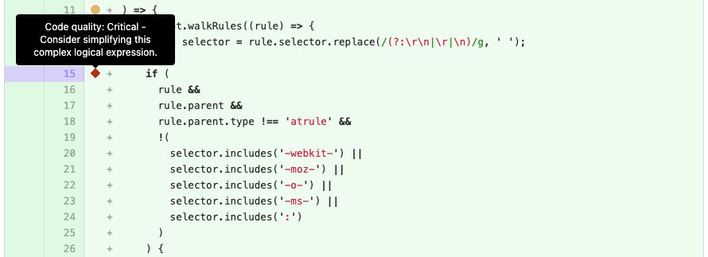
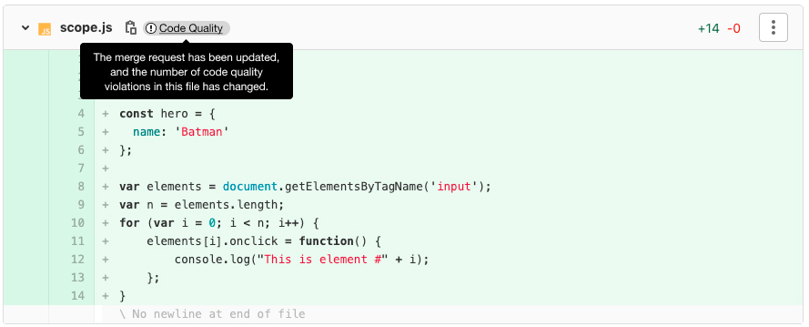
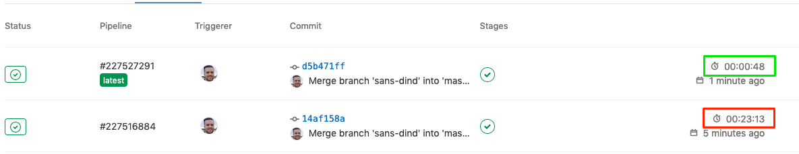

# Code Quality **(FREE)**

> - [Introduced](https://gitlab.com/gitlab-org/gitlab/-/merge_requests/1984) in GitLab 9.3.
> - Made [available in all tiers](https://gitlab.com/gitlab-org/gitlab/-/issues/212499) in 13.2.

To ensure your project's code stays simple, readable, and easy to contribute to,
you can use [GitLab CI/CD](../../../ci/index.md) to analyze your source code quality.

For example, while you're implementing a feature, you can run Code Quality reports
to analyze how your improvements are impacting your code's quality. You can
use this information to ensure that your changes are improving performance rather
than degrading it.

Code Quality:

- Uses [plugins](https://docs.codeclimate.com/docs/list-of-engines) supported by Code Climate, which are
  free and open source. Code Quality does not require a Code Climate
  subscription.
- Runs in [pipelines](../../../ci/pipelines/index.md) by using a Docker image built in the
  [GitLab Code Quality](https://gitlab.com/gitlab-org/ci-cd/codequality) project.
- Uses [default Code Climate configurations](https://gitlab.com/gitlab-org/ci-cd/codequality/-/tree/master/codeclimate_defaults).
- Can make use of a [template](#example-configuration).
- Is available by using [Auto Code Quality](../../../topics/autodevops/stages.md#auto-code-quality), provided by [Auto DevOps](../../../topics/autodevops/index.md).
- Can be extended through [Analysis Plugins](https://docs.codeclimate.com/docs/list-of-engines) or a [custom tool](#implementing-a-custom-tool).

## Code Quality Widget

> - [Introduced](https://gitlab.com/gitlab-org/gitlab/-/merge_requests/1984) in GitLab 9.3.
> - Made [available in all tiers](https://gitlab.com/gitlab-org/gitlab/-/issues/212499) in 13.2.

Going a step further, GitLab can show the Code Quality report right
in the merge request widget area if a report from the target branch is available to compare to:



Watch a quick walkthrough of Code Quality in action:

<div class="video-fallback">
  See the video: <a href="https://www.youtube.com/watch?v=B32LxtJKo9M">Code Quality: Speed Run</a>.
</div>
<figure class="video-container">
  <iframe src="https://www.youtube.com/embed/B32LxtJKo9M" frameborder="0" allowfullscreen="true"> </iframe>
</figure>

NOTE:
For one customer, the auditor found that having Code Quality, SAST, and Container Scanning all automated in GitLab CI/CD was almost better than a manual review! [Read more](https://about.gitlab.com/customers/bi_worldwide/).

See also the Code Climate list of [Supported Languages for Maintainability](https://docs.codeclimate.com/docs/supported-languages-for-maintainability).

## Code Quality in diff view **(ULTIMATE)**

> - [Introduced](https://gitlab.com/gitlab-org/gitlab/-/issues/267612) in [GitLab Ultimate](https://about.gitlab.com/pricing/) 13.11.
> - [Deployed behind a feature flag](../../../user/feature_flags.md), disabled by default.
> - [Enabled by default](https://gitlab.com/gitlab-org/gitlab/-/issues/284140) in GitLab 13.12.
> - [Feature flag removed](https://gitlab.com/gitlab-org/gitlab/-/issues/284140) in GitLab 14.1.
> - [Feature enhanced](https://gitlab.com/gitlab-org/gitlab/-/issues/2526) in GitLab 14.0.

Changes to files in merge requests can cause Code Quality to fall if merged. In these cases,
the merge request's diff view displays an indicator next to lines with new Code Quality violations. For example:



Previously, an indicator was displayed (**{information-o}** **Code Quality**) on the file in the merge request's diff view:



To switch to the previous version of this feature, a GitLab administrator can run the following in a
[Rails console](../../../administration/operations/rails_console.md):

```ruby
# For the instance
Feature.disable(:codequality_mr_diff_annotations)
# For a single project
Feature.disable(:codequality_mr_diff_annotations, Project.find(<project id>))
```

## Example configuration

This example shows how to run Code Quality on your code by using GitLab CI/CD and Docker.
It requires GitLab 11.11 or later, and GitLab Runner 11.5 or later. If you are using
GitLab 11.4 or earlier, you can view the deprecated job definitions in the
[documentation archive](https://docs.gitlab.com/12.10/ee/user/project/merge_requests/code_quality.html#previous-job-definitions).

- Using shared runners, the job should be configured For the [Docker-in-Docker workflow](../../../ci/docker/using_docker_build.md#use-the-docker-executor-with-the-docker-image-docker-in-docker).
- Using private runners, there is an [alternative configuration](#set-up-a-private-runner-for-code-quality-without-docker-in-docker) recommended for running Code Quality analysis more efficiently.

In either configuration, the runner must have enough disk space to handle generated Code Quality files. For example on the [GitLab project](https://gitlab.com/gitlab-org/gitlab) the files are approximately 7 GB.

Once you set up GitLab Runner, include the Code Quality template in your CI configuration:

```yaml
include:
  - template: Code-Quality.gitlab-ci.yml
```

The above example creates a `code_quality` job in your CI/CD pipeline which
scans your source code for code quality issues. The report is saved as a
[Code Quality report artifact](../../../ci/yaml/index.md#artifactsreportscodequality)
that you can later download and analyze.

It's also possible to override the URL to the Code Quality image by
setting the `CODE_QUALITY_IMAGE` CI/CD variable. This is particularly useful if you want
to lock in a specific version of Code Quality, or use a fork of it:

```yaml
include:
  - template: Code-Quality.gitlab-ci.yml

code_quality:
  variables:
    CODE_QUALITY_IMAGE: "registry.example.com/codequality-fork:latest"
```

In [GitLab 13.4 and later](https://gitlab.com/gitlab-org/gitlab/-/issues/11100), you can override the [Code Quality environment variables](https://gitlab.com/gitlab-org/ci-cd/codequality#environment-variables):

```yaml
variables:
  TIMEOUT_SECONDS: 1

include:
  - template: Code-Quality.gitlab-ci.yml
```

By default, report artifacts are not downloadable. If you need them downloadable on the
job details page, you can add `gl-code-quality-report.json` to the artifact paths like so:

```yaml
include:
  - template: Code-Quality.gitlab-ci.yml

code_quality:
  artifacts:
    paths: [gl-code-quality-report.json]
```

The included `code_quality` job is running in the `test` stage, so it needs to be included in your CI configuration, like so:

```yaml
stages:
  - test
```

NOTE:
This information is automatically extracted and shown right in the merge request widget.

WARNING:
On self-managed instances, if a malicious actor compromises the Code Quality job
definition they could execute privileged Docker commands on the runner
host. Having proper access control policies mitigates this attack vector by
allowing access only to trusted actors.

### Set up a private runner for code quality without Docker-in-Docker

It's possible to configure your own runners and avoid Docker-in-Docker. You can use a
configuration that may greatly speed up job execution without requiring your runners
to operate in privileged mode.

This alternative configuration uses socket binding to share the Runner's Docker daemon
with the job environment. Be aware that this configuration [has significant considerations](../../../ci/docker/using_docker_build.md#use-docker-socket-binding)
to be consider, but may be preferable depending on your use case.

1. Register a new runner:

   ```shell
   $ gitlab-runner register --executor "docker" \
     --docker-image="docker:stable" \
     --url "https://gitlab.com/" \
     --description "cq-sans-dind" \
     --tag-list "cq-sans-dind" \
     --locked="false" \
     --access-level="not_protected" \
     --docker-volumes "/cache"\
     --docker-volumes "/builds:/builds"\
     --docker-volumes "/var/run/docker.sock:/var/run/docker.sock" \
     --registration-token="<project_token>" \
     --non-interactive
   ```

1. **Optional, but recommended:** Set the builds directory to `/tmp/builds`,
  so job artifacts are periodically purged from the runner host. If you skip
  this step, you must clean up the default builds directory (`/builds`) yourself.
  You can do this by adding the following two flags to `gitlab-runner register`
  in the previous step.

   ```shell
   --builds-dir "/tmp/builds"
   --docker-volumes "/tmp/builds:/tmp/builds" # Use this instead of --docker-volumes "/builds:/builds"
   ```

   The resulting configuration:

   ```toml
   [[runners]]
     name = "cq-sans-dind"
     url = "https://gitlab.com/"
     token = "<project_token>"
     executor = "docker"
     builds_dir = "/tmp/builds"
     [runners.docker]
       tls_verify = false
       image = "docker:stable"
       privileged = false
       disable_entrypoint_overwrite = false
       oom_kill_disable = false
       disable_cache = false
       volumes = ["/cache", "/var/run/docker.sock:/var/run/docker.sock", "/tmp/builds:/tmp/builds"]
       shm_size = 0
     [runners.cache]
       [runners.cache.s3]
       [runners.cache.gcs]
   ```

1. Apply two overrides to the `code_quality` job created by the template:

   ```yaml
   include:
     - template: Code-Quality.gitlab-ci.yml

   code_quality:
     services:            # Shut off Docker-in-Docker
     tags:
       - cq-sans-dind     # Set this job to only run on our new specialized runner
   ```

The end result is that:

- Privileged mode is not used.
- Docker-in-Docker is not used.
- Docker images, including all CodeClimate images, are cached, and not re-fetched for subsequent jobs.

With this configuration, the run time for a second pipeline is much shorter. For example
this [small change](https://gitlab.com/drew/test-code-quality-template/-/merge_requests/4/diffs?commit_id=1e705607aef7236c1b20bb6f637965f3f3e53a46)
to an [open merge request](https://gitlab.com/drew/test-code-quality-template/-/merge_requests/4/pipelines)
running Code Quality analysis ran significantly faster the second time:



This configuration is not possible on `gitlab.com` shared runners. Shared runners
are configured with `privileged=true`, and they do not expose `docker.sock` into
the job container. As a result, socket binding cannot be used to make `docker` available
in the context of the job script.

[Docker-in-Docker](../../../ci/docker/using_docker_build.md#use-the-docker-executor-with-the-docker-image-docker-in-docker)
was chosen as an operational decision by the runner team, instead of exposing `docker.sock`.

### Disabling the code quality job

The `code_quality` job doesn't run if the `$CODE_QUALITY_DISABLED` CI/CD variable
is present. Please refer to the CI/CD variables [documentation](../../../ci/variables/index.md)
to learn more about how to define one.

To disable the `code_quality` job, add `CODE_QUALITY_DISABLED` as a custom CI/CD variable.
This can be done:

- For [the whole project](../../../ci/variables/index.md#custom-cicd-variables).
- For a single pipeline run:

  1. Go to **CI/CD > Pipelines**
  1. Click **Run pipeline**
  1. Add `CODE_QUALITY_DISABLED` as the variable key, with any value.

### Using with merge request pipelines

The configuration provided by the Code Quality template does not let the `code_quality` job
run on [pipelines for merge requests](../../../ci/pipelines/merge_request_pipelines.md).

If pipelines for merge requests is enabled, the `code_quality:rules` must be redefined.

The template has these [`rules`](../../../ci/yaml/index.md#rules) for the `code quality` job:

```yaml
code_quality:
  rules:
    - if: '$CODE_QUALITY_DISABLED'
      when: never
    - if: '$CI_COMMIT_TAG || $CI_COMMIT_BRANCH'
```

If you are using merge request pipelines, your `rules` (or [`workflow: rules`](../../../ci/yaml/index.md#workflow))
might look like this example:

```yaml
job1:
  rules:
    - if: '$CI_PIPELINE_SOURCE == "merge_request_event"' # Run job1 in merge request pipelines
    - if: '$CI_COMMIT_BRANCH == "master"'                # Run job1 in pipelines on the master branch (but not in other branch pipelines)
    - if: '$CI_COMMIT_TAG'                               # Run job1 in pipelines for tags
```

To make these work together, you need to overwrite the code quality `rules`
so that they match your current `rules`. From the example above, it could look like:

```yaml
include:
  - template: Code-Quality.gitlab-ci.yml

code_quality:
  rules:
    - if: '$CODE_QUALITY_DISABLED'
      when: never
    - if: '$CI_PIPELINE_SOURCE == "merge_request_event"' # Run code quality job in merge request pipelines
    - if: '$CI_COMMIT_BRANCH == $CI_DEFAULT_BRANCH'      # Run code quality job in pipelines on the master branch (but not in other branch pipelines)
    - if: '$CI_COMMIT_TAG'                               # Run code quality job in pipelines for tags
```

## Configuring jobs using variables

The Code Quality job supports environment variables that users can set to
configure job execution at runtime.

For a list of available environment variables, see
[Environment variables](https://gitlab.com/gitlab-org/ci-cd/codequality#environment-variables).

## Implementing a custom tool

It's possible to have a custom tool provide Code Quality reports in GitLab. To
do this:

1. Define a job in your `.gitlab-ci.yml` file that generates the
   [Code Quality report
   artifact](../../../ci/yaml/index.md#artifactsreportscodequality).
1. Configure your tool to generate the Code Quality report artifact as a JSON
   file that implements a subset of the [Code Climate
   spec](https://github.com/codeclimate/platform/blob/master/spec/analyzers/SPEC.md#data-types).

The Code Quality report artifact JSON file must contain an array of objects
with the following properties:

| Name                   | Description                                                                               |
| ---------------------- | ----------------------------------------------------------------------------------------- |
| `description`          | A description of the code quality violation.                                              |
| `fingerprint`          | A unique fingerprint to identify the code quality violation. For example, an MD5 hash.    |
| `severity`             | A severity string (can be `info`, `minor`, `major`, `critical`, or `blocker`).            |
| `location.path`        | The relative path to the file containing the code quality violation.                      |
| `location.lines.begin` or `location.positions.begin.line` | The line on which the code quality violation occurred. |

Example:

```json
[
  {
    "description": "'unused' is assigned a value but never used.",
    "fingerprint": "7815696ecbf1c96e6894b779456d330e",
    "severity": "minor",
    "location": {
      "path": "lib/index.js",
      "lines": {
        "begin": 42
      }
    }
  }
]
```

NOTE:
Although the Code Climate spec supports more properties, those are ignored by
GitLab.

## Code Quality reports **(PREMIUM)**

> [Introduced](https://gitlab.com/gitlab-org/gitlab/-/merge_requests/21527) in GitLab Premium 12.9.


After the Code Quality job completes:

- Potential changes to code quality are shown directly in the merge request.
  The Code Quality widget in the merge request compares the reports from the base and head of the branch,
  then lists any violations that are resolved or created when the branch is merged.
- The full JSON report is available as a
  [downloadable artifact](../../../ci/pipelines/job_artifacts.md#download-job-artifacts)
  for the `code_quality` job.
- The full list of code quality violations generated by a pipeline is shown in the
  Code Quality tab of the Pipeline Details page. **(PREMIUM)**

## Generate an HTML report

In [GitLab 13.6 and later](https://gitlab.com/gitlab-org/ci-cd/codequality/-/issues/10),
it is possible to generate an HTML report file by setting the `REPORT_FORMAT`
CI/CD variable to `html`. This is useful if you just want to view the report in a more
human-readable format or to publish this artifact on GitLab Pages for even
easier reviewing.

```yaml
include:
  - template: Code-Quality.gitlab-ci.yml

code_quality:
  variables:
    REPORT_FORMAT: html
  artifacts:
    paths: [gl-code-quality-report.html]
```

It's also possible to generate both JSON and HTML report files by defining
another job and using `extends: code_quality`:

```yaml
include:
  - template: Code-Quality.gitlab-ci.yml

code_quality_html:
  extends: code_quality
  variables:
    REPORT_FORMAT: html
  artifacts:
    paths: [gl-code-quality-report.html]
```

## Extending functionality

### Using Analysis Plugins

Should there be a need to extend the default functionality provided by Code Quality, as stated in [Code Quality](#code-quality), [Analysis Plugins](https://docs.codeclimate.com/docs/list-of-engines) are available.

For example, to use the [SonarJava analyzer](https://docs.codeclimate.com/docs/sonar-java),
add a file named `.codeclimate.yml` containing the [enablement code](https://docs.codeclimate.com/docs/sonar-java#enable-the-plugin)
for the plugin to the root of your repository:

```yaml
version: "2"
plugins:
  sonar-java:
    enabled: true
```

This adds SonarJava to the `plugins:` section of the [default `.codeclimate.yml`](https://gitlab.com/gitlab-org/ci-cd/codequality/-/blob/master/codeclimate_defaults/.codeclimate.yml.template)
included in your project.

Changes to the `plugins:` section do not affect the `exclude_patterns` section of the
default `.codeclimate.yml`. See the Code Climate documentation for
[excluding files and folders](https://docs.codeclimate.com/docs/excluding-files-and-folders)
for more details.

Here's [an example project](https://gitlab.com/jheimbuck_gl/jh_java_example_project) that uses Code Quality with a `.codeclimate.yml` file.

## Use a Code Quality image hosted in a registry with untrusted certificates

If you set the `CODE_QUALITY_IMAGE` to an image that is hosted in a
Docker registry which uses a TLS certificate that is not trusted, such as
a self-signed certificate, you can see errors like the one below:

```shell
$ docker pull --quiet "$CODE_QUALITY_IMAGE"
Error response from daemon: Get https://gitlab.example.com/v2/: x509: certificate signed by unknown authority
```

To fix this, configure the Docker daemon to [trust certificates](https://docs.docker.com/registry/insecure/#use-self-signed-certificates)
by putting the certificate inside of the `/etc/docker/certs.d`
directory.

This Docker daemon is exposed to the subsequent Code Quality Docker container in the
[GitLab Code Quality template](https://gitlab.com/gitlab-org/gitlab/-/blob/v13.8.3-ee/lib/gitlab/ci/templates/Jobs/Code-Quality.gitlab-ci.yml#L41)
and should be to exposed any other containers in which you want to have
your certificate configuration apply.

### Docker

If you have access to GitLab Runner configuration, add the directory as a
[volume mount](https://docs.gitlab.com/runner/configuration/advanced-configuration.html#volumes-in-the-runnersdocker-section). For example:

```toml
[[runners]]
  ...
  executor = "docker"
  [runners.docker]
    ...
    privileged = true
    volumes = ["/cache", "/etc/gitlab-runner/certs/gitlab.example.com.crt:/etc/docker/certs.d/gitlab.example.com/ca.crt:ro"]
```

Replace `gitlab.example.com` with the actual domain of the registry.

### Kubernetes

If you have access to GitLab Runner configuration and the Kubernetes cluster,
you can [mount a ConfigMap](https://docs.gitlab.com/runner/executors/kubernetes.html#configmap-volumes):

1. Create a ConfigMap with the certificate:

   ```shell
   kubectl create configmap registry-crt --namespace gitlab-runner --from-file /etc/gitlab-runner/certs/gitlab.example.com.crt
   ```

1. Update GitLab Runner `config.toml` to specify the ConfigMap:

   ```toml
   [[runners]]
     ...
     executor = "kubernetes"
     [runners.kubernetes]
       image = "alpine:3.12"
       privileged = true
       [[runners.kubernetes.volumes.config_map]]
         name = "registry-crt"
         mount_path = "/etc/docker/certs.d/gitlab.example.com/ca.crt"
         sub_path = "gitlab.example.com.crt"
   ```

Replace `gitlab.example.com` with the actual domain of the registry.

## Troubleshooting

### Changing the default configuration has no effect

A common issue is that the terms `Code Quality` (GitLab specific) and `Code Climate`
(Engine used by GitLab) are very similar. You must add a **`.codeclimate.yml`** file
to change the default configuration, **not** a `.codequality.yml` file. If you use
the wrong filename, the [default `.codeclimate.yml`](https://gitlab.com/gitlab-org/ci-cd/codequality/-/blob/master/codeclimate_defaults/.codeclimate.yml.template)
is still used.

### No Code Quality report is displayed in a merge request

This can be due to multiple reasons:

- You just added the Code Quality job in your `.gitlab-ci.yml`. The report does not
  have anything to compare to yet, so no information can be displayed. It only displays
  after future merge requests have something to compare to.
- Your pipeline is not set to run the code quality job on your target branch. If there is no report generated from the target branch, your MR branch reports have nothing to compare to.
- If no [degradation or error is detected](https://docs.codeclimate.com/docs/maintainability#section-checks),
  nothing is displayed.
- The [`artifacts:expire_in`](../../../ci/yaml/index.md#artifactsexpire_in) CI/CD
  setting can cause the Code Quality artifact(s) to expire faster than desired.
- The widgets use the pipeline of the latest commit to the target branch. If commits are made to the default branch that do not run the code quality job, this may cause the merge request widget to have no base report for comparison.
- If you use the [`REPORT_STDOUT` environment variable](https://gitlab.com/gitlab-org/ci-cd/codequality#environment-variables), no report file is generated and nothing displays in the merge request.
- Large `gl-code-quality-report.json` files (esp. >10 MB) are [known to prevent the report from being displayed](https://gitlab.com/gitlab-org/gitlab/-/issues/2737).
  As a work-around, try removing [properties](https://github.com/codeclimate/platform/blob/master/spec/analyzers/SPEC.md#data-types)
  that are [ignored by GitLab](#implementing-a-custom-tool). You can:
  - Configure the Code Quality tool to not output those types.
  - Use `sed`, `awk` or similar commands in the `.gitlab-ci.yml` script to
    edit the `gl-code-quality-report.json` before the job completes.

### Only a single Code Quality report is displayed, but more are defined

GitLab only uses the Code Quality artifact from the latest created job (with the largest job ID).
If multiple jobs in a pipeline generate a code quality artifact, those of earlier jobs are ignored.
To avoid confusion, configure only one job to generate a `gl-code-quality-report.json`.

### Rubocop errors

When using Code Quality jobs on a Ruby project, you can encounter problems running Rubocop.
For example, the following error can appear when using either a very recent or very old version
of Ruby:

```plaintext
/usr/local/bundle/gems/rubocop-0.52.1/lib/rubocop/config.rb:510:in `check_target_ruby':
Unknown Ruby version 2.7 found in `.ruby-version`. (RuboCop::ValidationError)
Supported versions: 2.1, 2.2, 2.3, 2.4, 2.5
```

This is caused by the default version of Rubocop used by the check engine not covering
support for the Ruby version in use.

To use a custom version of Rubocop that
[supports the version of Ruby used by the project](https://docs.rubocop.org/rubocop/compatibility.html#support-matrix),
you can [override the configuration through a `.codeclimate.yml` file](https://docs.codeclimate.com/docs/rubocop#using-rubocops-newer-versions)
created in the project repository.

For example, to specify using Rubocop release **0.67**:

```yaml
version: "2"
plugins:
  rubocop:
    enabled: true
    channel: rubocop-0-67
```

### No Code Quality appears on merge requests when using custom tool

If your merge requests do not show any code quality changes when using a custom tool,
ensure that the line property is an `integer`.
