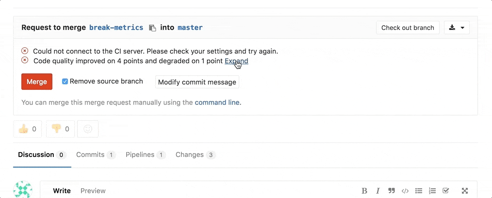

# Code Quality **[STARTER]**

> [Introduced](https://gitlab.com/gitlab-org/gitlab-ee/merge_requests/1984)
in [GitLab Starter](https://about.gitlab.com/pricing/) 9.3.

## Overview

If you are using [GitLab CI/CD](../../../ci/README.md), you can analyze your
source code quality using GitLab Code Quality.
Code Quality uses [Code Climate Engines](https://codeclimate.com), which are
free and open source. Code Quality doesn’t require a Code Climate subscription.

Going a step further, GitLab can show the Code Quality report right
in the merge request widget area:



## Use cases

For instance, consider the following workflow:

1. Your backend team member starts a new implementation for making a certain feature in your app faster
1. With Code Quality reports, they analyze how their implementation is impacting the code quality
1. The metrics show that their code degrade the quality in 10 points
1. You ask a co-worker to help them with this modification
1. They both work on the changes until Code Quality report displays no degradations, only improvements
1. You approve the merge request and authorize its deployment to staging
1. Once verified, their changes are deployed to production

## How it works

First of all, you need to define a job in your `.gitlab-ci.yml` file that generates the
[Code Quality report artifact](../../../ci/yaml/README.md#artifactsreportscodequality-starter).

The Code Quality report artifact is a subset of the
[Code Climate spec](https://github.com/codeclimate/spec/blob/master/SPEC.md#data-types).
It must be a JSON file containing an array of objects with the following properties:

| Name                   | Description                                                                            |
| ---------------------- | -------------------------------------------------------------------------------------- |
| `description`          | A description of the code quality violation.                                           |
| `fingerprint`          | A unique fingerprint to identify the code quality violation. For example, an MD5 hash. |
| `location.path`        | The relative path to the file containing the code quality violation.                   |
| `location.lines.begin` | The line on which the code quality violation occurred.                                 |

Example:

```json
[
  {
    "description": "'unused' is assigned a value but never used.",
    "fingerprint": "7815696ecbf1c96e6894b779456d330e",
    "location": {
      "path": "lib/index.js",
      "lines": {
        "begin": 42
      }
    }
  }
]
```

NOTE: **Note:**
Although the Code Climate spec supports more properties, those are ignored by GitLab.

For more information on what the Code Quality job should look like, check the
example on [analyzing a project's code quality](../../../ci/examples/code_quality.md).

GitLab then checks this report, compares the metrics between the source and target
branches, and shows the information right on the merge request.

CAUTION: **Caution:**
If multiple jobs in a pipeline generate a code quality artifact, only the artifact from
the last created job (the job with the largest job ID) is used. To avoid confusion,
configure only one job to generate a code quality artifact.

NOTE: **Note:**
If the Code Quality report doesn't have anything to compare to, no information
will be displayed in the merge request area. That is the case when you add the
Code Quality job in your `.gitlab-ci.yml` for the very first time.
Consecutive merge requests will have something to compare to and the Code Quality
report will be shown properly.
