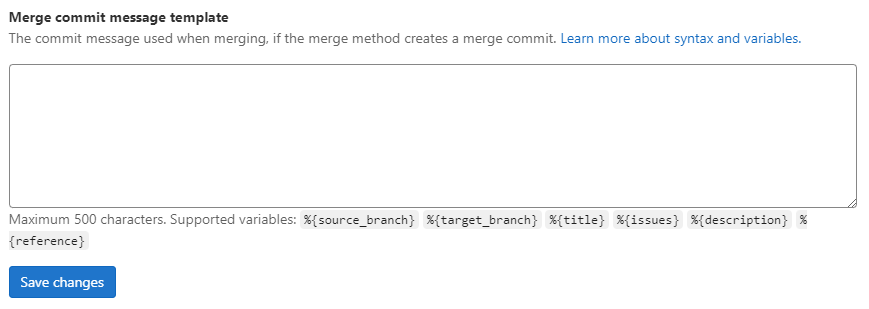

# Commit message templates **(FREE)**

> [Introduced](https://gitlab.com/gitlab-org/gitlab/-/issues/20263) in GitLab 14.5.

## Merge commit message template

As a project maintainer, you're able to configure merge commit message template. It will be used during merge to
create commit message. Template uses similar syntax to 
[review suggestions](reviews/suggestions.md#configure-the-commit-message-for-applied-suggestions).

Default merge commit message can be recreated using following template:

```plaintext
Merge branch '%{source_branch}' into '%{target_branch}'

%{title}

%{issues}

See merge request %{reference}
```

This commit message can be customized to follow any guidelines you might have.
To do so, expand the **Merge requests** tab within your project's **General**
settings and change the **Merge commit message template** text:



You can use static text and following variables:

| Variable           | Description                                                                                                                                                                                                                               | Output example                                  |
|--------------------|-------------------------------------------------------------------------------------------------------------------------------------------------------------------------------------------------------------------------------------------|-------------------------------------------------|
| `%{source_branch}` | The name of the branch that is being merged.                                                                                                                                                                                              | `my-feature-branch`                             |
| `%{target_branch}` | The name of the branch that the changes are applied to.                                                                                                                                                                                   | `master`                                        |
| `%{title}`         | Title of the merge request.                                                                                                                                                                                                               | Fix stuff                                       |
| `%{issues}`        | String with phrase "Closes <issue numbers>" with all issues mentioned in the MR description matching [issue closing patterns](../issues/managing_issues.md#closing-issues-automatically). It will be empty when no issues were mentioned. | `Closes #465, #190 and #400`                    |
| `%{description}`   | Description of the merge request.                                                                                                                                                                                                         | Merge request description.<br>Can be multiline. |
| `%{reference}`     | Reference to the merge request.                                                                                                                                                                                                           | group-name/project-name!72359                                          |

NOTE:
Empty variables that are the only word in a line will be removed along with all newline characters preceding it.

Merge commit template field has a limit of 500 characters. This limit only applies to the template
itself.
