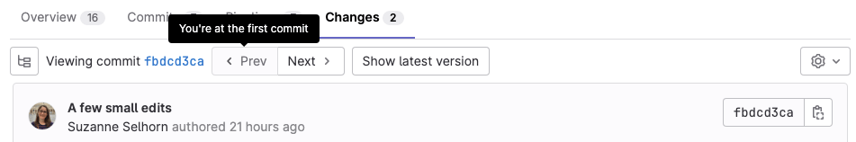

# Merge request commits **(FREE)**

Each merge request has a history of the commits made to the source branch
after the merge request was created.

These commits are displayed on the merge request's **Commits** tab.
From this tab, you can review commit messages and copy a commit's SHA when you need to
[cherry-pick changes](cherry_pick_changes.md).

## Navigate merge request commits

> [Introduced](https://gitlab.com/gitlab-org/gitlab/-/issues/18140) in GitLab 13.0.

To navigate commits in a merge request:

1. Select the **Commits** tab.
1. Select the commit link. The most recent commit is displayed.
1. Navigate through the commits by either:

   - Selecting **Prev** and **Next** buttons below the tab buttons.
   - Using the <kbd>X</kbd> and <kbd>C</kbd> keyboard shortcuts.

## View merge request commits in context

> - [Introduced](https://gitlab.com/gitlab-org/gitlab/-/issues/29274) in GitLab 13.12 [with a flag](../../../administration/feature_flags.md) named `context_commits`. Enabled by default.
> - [Enabled on GitLab.com](https://gitlab.com/gitlab-org/gitlab/-/issues/320757) in GitLab 14.8.
> - [Generally available](https://gitlab.com/gitlab-org/gitlab/-/issues/320757) in GitLab 14.9. [Feature flag `context_commits`](https://gitlab.com/gitlab-org/gitlab/-/issues/320757) removed.

When reviewing a merge request, it helps to have more context about the changes
made. That includes unchanged lines in unchanged files, and previous commits
that have already merged that the change is built on.

To add previously merged commits to a merge request for more context:

1. Go to your merge request.
1. Select the **Commits** tab.
1. Scroll to the end of the list of commits, and select **Add previously merged commits**:
1. Select the commits that you want to add.
1. Select **Save changes**.

## View diffs between commits

To view the changes between previously merged commits:

1. On your merge request, select the **Changes** tab.
1. By **Compare**, select the commit you want to view:

   

If you selected to add previously merged commits, they are displayed in the list.
